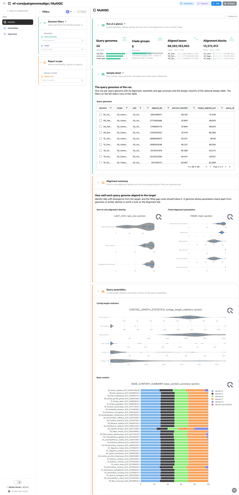
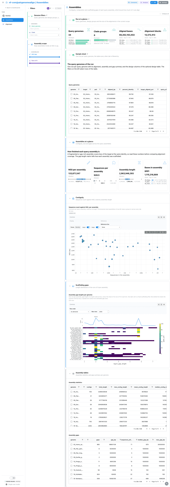
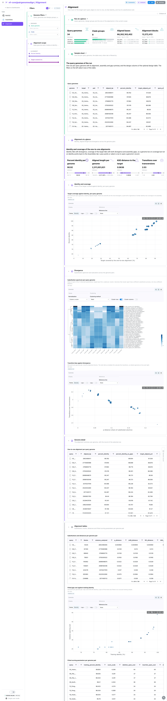

<div class="template-banner">
  <a class="template-banner-logo" href="https://nf-co.re/pairgenomealign" target="_blank" title="nf-core/pairgenomealign on nf-co.re">
    
    
  </a>
  <div class="template-banner-body">
    <h1 class="template-title">Pairwise genome alignment</h1>
    <p class="template-subtitle">Query genomes aligned to one target with LAST: how much of the target each query aligns to and at what identity, divergence and the substitution spectrum, contiguity and gaps of the query assemblies, and synteny with the target, next to the MultiQC report.</p>
    <p class="template-links">
      <a href="https://nf-co.re/pairgenomealign" target="_blank"><i class="mdi mdi-open-in-new"></i> nf-co.re</a>
      <a href="https://github.com/nf-core/pairgenomealign" target="_blank"><i class="mdi mdi-github"></i> GitHub</a>
    </p>
  </div>
  <span class="template-status-experimental template-banner-badge" data-tooltip="Experimental: shared as-is. Feedback and PRs welcome."><i class="mdi mdi-flask-outline"></i> Experimental</span>
</div>

<div class="tpl-version-pick" data-latest="3.0.4">
  <span class="tpl-version-icon"><i class="mdi mdi-source-branch"></i></span>
  <span class="tpl-version-label">Template version</span>
  <select id="tpl-version" class="tpl-version-select" aria-label="Template version">
    <option value="3.0.4" selected>3.0.4</option>
  </select>
  <span class="tpl-version-badge">latest</span>
</div>

The pairgenomealign template reads a run where every query genome of the
samplesheet was aligned to one target genome, and the unit is the query genome:
how finished its assembly is bounds how much of the target it can cover, and its
identity and substitutions tell how far it has diverged:

- :material-chart-box-outline: **MultiQC**: one-to-one identity and fitted scoring parameters per pair, contig statistics and base content per assembly
- :material-puzzle-outline: **Assemblies**: contiguity, size and the length profile of the scaffolding gaps of each query assembly
- :material-align-horizontal-left: **Alignment**: target coverage against identity, the substitution spectrum and saturation, with a record per genome
- :material-vector-link: **Synteny**: target and query sequences on one ring, one chord per long alignment (only with a PSL export)

A `Run at a glance` strip (query genomes, design groups, aligned bases,
alignment blocks), the collapsed `Sample sheet` and the `Genome filters` (query
genome, design group) are pinned to every tab.

!!! warning "The Synteny tab needs a PSL export"
    The MAF alignments (up to gigabytes per pair) are not read; the synteny
    ring reads the PSL export of the one-to-one alignment instead, which the
    pipeline writes only with `--export_aln_to psl`. A run without it skips
    that optional collection and the dashboard leaves the Synteny tab out. On a
    finished run, `-resume` with the work directory kept reuses the alignments.
    The validation megatest ran without the export, so this tab has only been
    checked on a PSL converted by hand.

---

## :material-rocket-launch-outline: Quick start

=== "Point at a finished run"

    ```bash
    depictio run \
      --template nf-core/pairgenomealign/latest \
      --data-root /path/to/pairgenomealign_results
    ```

    `--data-root` is the only thing you have to pass. The pipeline samplesheet
    carries only `sample` and `fasta`, so any grouping of the genomes comes from
    an optional design table:

    ```bash
    depictio run \
      --template nf-core/pairgenomealign/latest \
      --data-root /path/to/pairgenomealign_results \
      --var METADATA_FILE=/path/to/genome_design.tsv
    ```

    | Variable | Default | Role |
    |---|---|---|
    | `METADATA_FILE` | none | Design table (TSV): genome id in a column named `sample` (or in the first column), one column per factor. Enables the design filter and grouping |
    | `METADATA_ID_COL` | first column, or `sample` | Design table genome-id column |
    | `GROUP_COL` | first factor column | Design column the dashboards group and filter genomes by |
    | `SKIP_ASSEMBLY_QC` | unset | Set for a run with `--skip_assembly_qc`: drops the assembly statistics collection |

=== "From the pipeline itself (v1.10.0+)"

    ```bash
    depictio-cli config nextflow --install     # once per machine
    nextflow run nf-core/pairgenomealign -r 3.0.4 -profile docker --outdir results
    ```

    No `depictio run`, and no template named: the pipeline ingests its own
    output directory when it finishes and resolves this template from its own
    manifest. See [Nextflow trigger](../../depictio-cli/nextflow-trigger.md).

---

## :material-book-open-variant: Reference

The template reads the one-line identity summary, the substitution matrix with
its distance estimates and the fitted scoring parameters LAST writes next to
each alignment, the assembly-scan and `seqtk cutN` reports of each query
assembly, the optional PSL export, and the native MultiQC report. Every
per-pair output is named `<target>___<query>`; the recipes split the name on
the last triple underscore and join on the query.

!!! info "Self-adapting layout"
    The dashboard adapts to whatever the run actually produced: components bound
    to pruned or unparsed data collections are hidden, tabs left with no real
    visualizations are dropped entirely, and the remaining components are
    re-packed so there are no empty rows. A run without the PSL export drops
    the Synteny tab, and a gap-free assembly simply has no row in the gap
    collections.

<div class="tpl-version-block" data-version="3.0.4" markdown>

--8<-- "pipeline-templates/nf-core/_generated/pairgenomealign-latest.md"

</div>

---

## :material-view-dashboard-outline: Dashboard tabs

Four tabs, read as a funnel: the report, how finished each query assembly is,
how well it aligned, and where it lands on the target. Each tab below carries
the **same icon and colour the dashboard gives it**.

=== "{ width=18 }{ width=18 } MultiQC"

    *How well did each query genome align to the target?*

    [{ loading=lazy }](../../images/pipeline-templates/nf-core/pairgenomealign/multiqc_light.png){ .tpl-shot target="_blank" rel="noopener" }

    The run's native MultiQC report, no reprocess needed: one-to-one identity
    and the scoring parameters `last-train` fitted per genome pair, then contig
    length statistics and base content per query assembly. Identity falls with
    divergence from the target and the fitted gap costs should follow it, so a
    genome whose parameters stand apart from genomes of similar identity is
    worth a look on the Alignment tab.

    ??? abstract ":material-tune-variant: Filters and components"

        **Filters** · `Query genome` and the design group on the genome hub,
        persistent and pinned to the top of every tab, and a `Report row`
        picker in the tab-local *Report scope*.

        | Section | What it holds |
        |---|---|
        | Run at a glance | 4 cards, pinned to every tab |
        | Sample sheet | *Query genomes*, collapsed and pinned to every tab |
        | Alignment summary | *One-to-one alignment identity*, *Fitted alignment parameters* |
        | Query assemblies | *Contig length statistics*, *Base content* |

=== ":material-puzzle-outline:{ .mc-blue } Assemblies"

    *How finished is each query assembly, and how was it scaffolded?*

    [{ loading=lazy }](../../images/pipeline-templates/nf-core/pairgenomealign/assemblies_light.png){ .tpl-shot target="_blank" rel="noopener" }

    A fragmented or gap-rich assembly covers less of the target at the same
    identity, so these numbers come before any alignment: N50, sequence count,
    length and bases in gaps per assembly, then sequence count against N50
    sized by assembly length. The gap length matrix has one row per assembly
    and log-scaled length bins across, each bin coloured by its share of the
    assembly's runs of N, with the mean over the assemblies on top and a dotted
    line at the common 100 bp filler, so assemblies with a handful and with
    many thousands of gaps share one scale.

    ??? abstract ":material-tune-variant: Filters and components"

        **Filters** · `N50 (bp)` and `Runs of N` ranges, in the tab-local
        *Assembly scope*.

        | Section | What it holds |
        |---|---|
        | Assemblies at a glance | 4 cards |
        | Contiguity | *Sequence count against N50, per assembly* |
        | Scaffolding gaps | *Assembly gap lengths per genome* |
        | Assembly tables | *Assembly statistics*, *Assembly gaps*, collapsed |

=== ":material-align-horizontal-left:{ .mc-violet } Alignment"

    *How much of the target does each query cover one-to-one, and how far has it diverged?*

    [{ loading=lazy }](../../images/pipeline-templates/nf-core/pairgenomealign/alignment_light.png){ .tpl-shot target="_blank" rel="noopener" }

    Identity, aligned length, K80 distance and transition bias per pair, then
    the share of the target covered against identity. Coverage falls with both
    divergence and assembly gaps, so a genome low on coverage but not on
    identity points back to the Assemblies tab. The substitution spectrum
    heatmap scales each of the twelve directed substitutions across genomes,
    and the transition bias against divergence shows saturation. The alignment
    table drives a **Genome record** beside it; the substitution and parameter
    tables, with the fitted gap cost against training identity, are collapsed
    below.

    ??? abstract ":material-tune-variant: Filters and components"

        **Filters** · `Percent identity` and `Target covered (%)` ranges on the
        one-to-one summaries, in the tab-local *Alignment scope*.

        | Section | What it holds |
        |---|---|
        | Alignment at a glance | 4 cards |
        | Identity and coverage | *Target coverage against identity, per query genome* |
        | Divergence | *Substitution spectrum per query genome*, *Transition bias against divergence* |
        | Genome detail | *One-to-one alignment per query genome*, *Genome record* |
        | Alignment tables | *Substitutions and distances per genome pair*, *Fitted gap cost against training identity*, *Fitted scoring parameters per genome pair*, collapsed |

=== ":material-vector-link:{ .mc-grape } Synteny"

    *Where does each query genome land on the target?*

    This tab appears only for a run started with `--export_aln_to psl`, so the
    validation megatest has no screenshot of it. One ring holds the target
    sequences and the sequences of one query, with one chord per long
    alignment, weighted by matching bases and coloured by orientation. Query
    sequence names get a `q:` prefix, so a name shared with the target stays a
    separate arc. The query picker always holds one genome and opens on the
    first; a chord selects its alignment in the table below.

    ??? abstract ":material-tune-variant: Filters and components"

        **Filters** · a `Query genome` picker that always holds one value, and
        an `Orientation` picker, in the tab-local *Synteny scope*.

        | Section | What it holds |
        |---|---|
        | Synteny at a glance | 4 cards |
        | Synteny ring | *Synteny between the target and the selected query* |
        | Link tables | *Alignments behind the chords*, collapsed |

Tables and point views select on their entity column: the sample sheet and the
contiguity scatter on the genome, the coverage and saturation scatters and the
alignment table on the query, which narrows the genome hub and through it the
other tabs. The MultiQC alignment sections follow the pair id, the assembly
sections the genome id.

---

## :material-play-circle-outline: Running the pipeline

Depictio reads the **output** of nf-core/pairgenomealign, it does not run the
pipeline. Run the pipeline first, with the PSL export if you want the Synteny
tab:

```bash
nextflow run nf-core/pairgenomealign -r 3.0.4 \
  --target target.fa \
  --input samplesheet.csv \
  --export_aln_to psl \
  --outdir results -profile docker
```

Then point Depictio at the results. pairgenomealign 3.0.4 ships a MultiQC
parquet, so no reprocess step is needed:

```bash
depictio run --template nf-core/pairgenomealign/latest --data-root results/
```

See [nf-co.re/pairgenomealign/usage](https://nf-co.re/pairgenomealign/3.0.4/docs/usage) for full pipeline documentation.

---

## :material-folder-open-outline: Required data structure

Point `--data-root` at the directory holding the pipeline output. Depictio scans
recursively and matches on file name; each per-pair file is named
`<target>___<query>`.

```text
<DATA_ROOT>/
├── pipeline_info/
│   ├── params_*.json
│   └── *software*versions*.yml
├── multiqc/multiqc_data/multiqc.parquet       # native, no reprocess
├── alignment/
│   ├── *.o2o.tsv                              # one-to-one identity summary
│   ├── *.o2o.matrix.txt                       # substitutions and distances (optional)
│   ├── *.train.tsv                            # fitted scoring parameters (optional)
│   └── *.psl.gz                               # only with --export_aln_to psl (optional)
├── assemblyscan/*.json                        # contiguity and composition (optional)
└── cutn/*.bed                                 # runs of N per assembly (optional)
```

The MAF alignments, the merged CRAM and the `last-dotplot` PNGs are not read.

---

## :material-flask-outline: Validation runs

The template was validated against the AWS megatest of the 3.0.4 release,
`results-8ee09a1cdc920fc90cd62358952045e5019e1fe0`, on its `test_full`
profile: 34 query genomes aligned to one target assembly. The run is 42.8 GB,
almost all of it alignments; the tables-only subset the template needs is about
20 MB, and the screenshots above come from it. The run publishes no samplesheet
and no design table, so the template ships both, and the download script copies
them under `input/`. It ran with `--export_aln_to no_export`, so the Synteny tab
was not exercised.

```bash
DEST=/tmp/pairgenomealign_test
bash depictio/projects/nf-core/pairgenomealign/3.0.4/download_test_data.sh "$DEST"
depictio run --template nf-core/pairgenomealign/latest --data-root "$DEST" \
  --var METADATA_FILE="$DEST/input/genome_metadata.tsv"
```

Do not pass `--project-name` when ingesting: the dashboard is attached to the
project by name, so renaming it breaks a later `depictio dashboard import`.
Re-ingesting accumulates dashboards, so delete the project before repeating a run.

---

## :material-link-variant: Additional resources

- [nf-co.re/pairgenomealign](https://nf-co.re/pairgenomealign): official pipeline documentation
- [nf-co.re/pairgenomealign/3.0.4/results](https://nf-co.re/pairgenomealign/3.0.4/results): AWS test results
- [Template System Reference](../../usage/projects/templates.md): YAML format, variables, conditionals
- [Recipes](../../usage/projects/recipes.md): how to read, test, and write recipes

---

## :material-account-group-outline: Authorship

<div class="tpl-credits">
  <div class="tpl-credit">
    <span class="tpl-credit-role"><i class="mdi mdi-code-braces"></i> Developers</span>
    <span class="tpl-credit-note">Wrote the template, its recipes and its dashboards.</span>
    <a class="tpl-person" href="https://github.com/weber8thomas" target="_blank" rel="noopener">
       weber8thomas
    </a>
  </div>
  <div class="tpl-credit">
    <span class="tpl-credit-role"><i class="mdi mdi-eye-check-outline"></i> Reviewers</span>
    <span class="tpl-credit-note">Nobody has run it on their own data and signed it off yet, which is what keeps it Experimental.</span>
    <span class="tpl-person"><i class="mdi mdi-account-plus-outline"></i> Open</span>
  </div>
  <div class="tpl-credit">
    <span class="tpl-credit-role"><i class="mdi mdi-wrench-outline"></i> Maintainers</span>
    <span class="tpl-credit-note">Keep it working as nf-core/pairgenomealign releases.</span>
    <a class="tpl-person" href="https://github.com/weber8thomas" target="_blank" rel="noopener">
       weber8thomas
    </a>
  </div>
</div>

Reviewing a template on your own data, or taking over a role here, is a
contribution in itself: the [contributing guide](../../developer/contributing-templates.md)
says what each one involves.
