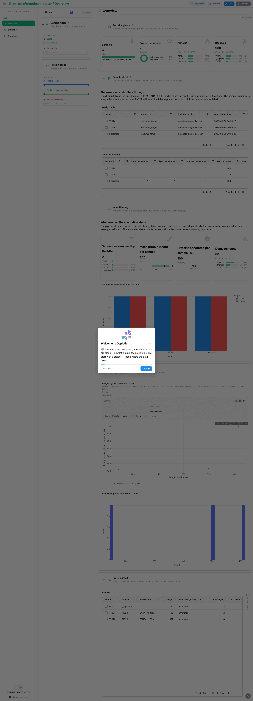
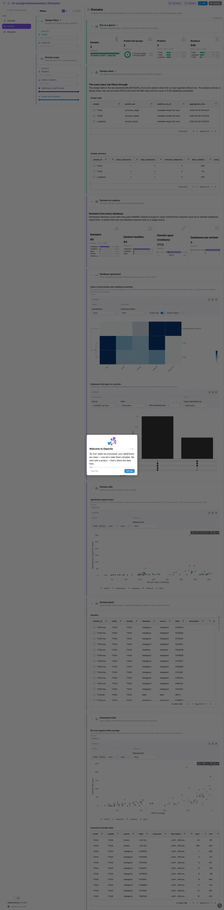
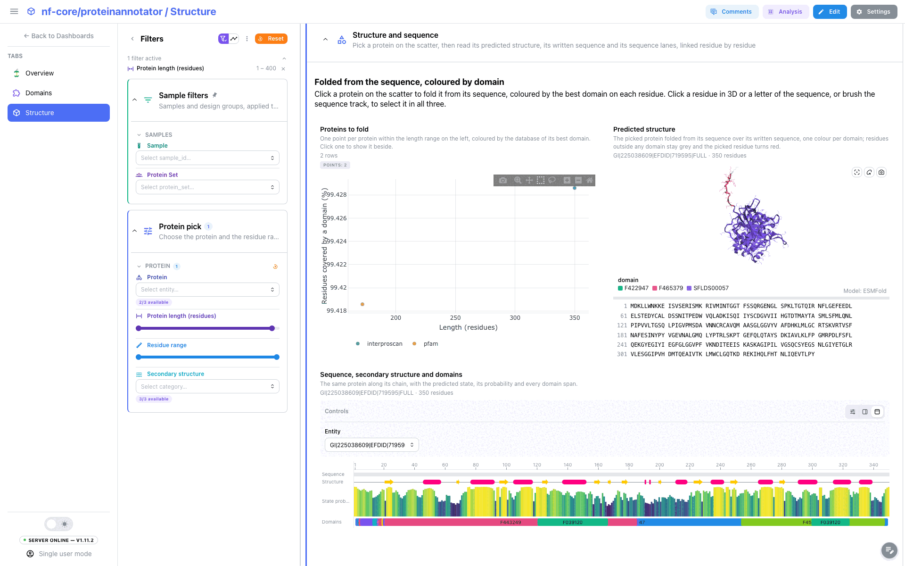

<div class="template-banner">
  <a class="template-banner-logo" href="https://nf-co.re/proteinannotator" target="_blank" title="nf-core/proteinannotator on nf-co.re">
    
    
  </a>
  <div class="template-banner-body">
    <h1 class="template-title">Protein Annotation</h1>
    <p class="template-subtitle">Protein domains from Pfam, FunFam, NMPFamsDB, MetagRoot and InterProScan in one table: how much of each protein the databases describe, which databases agree, and one protein at a time as a predicted 3D structure with its secondary structure and domains along the chain.</p>
    <p class="template-links">
      <a href="https://nf-co.re/proteinannotator" target="_blank"><i class="mdi mdi-open-in-new"></i> nf-co.re</a>
      <a href="https://github.com/nf-core/proteinannotator" target="_blank"><i class="mdi mdi-github"></i> GitHub</a>
    </p>
  </div>
  <span class="template-status-draft template-banner-badge" data-tooltip="Draft: generated and not yet reviewed. Expect it to need fixes before it is usable."><i class="mdi mdi-pencil-outline"></i> Draft</span>
</div>

<div class="tpl-version-pick" data-latest="1.1.0">
  <span class="tpl-version-icon"><i class="mdi mdi-source-branch"></i></span>
  <span class="tpl-version-label">Template version</span>
  <select id="tpl-version" class="tpl-version-select" aria-label="Template version">
    <option value="1.1.0" selected>1.1.0</option>
  </select>
  <span class="tpl-version-badge">latest</span>
</div>

The proteinannotator template reads each annotation tool's own files and joins
them per residue, per domain, per protein and per sample, so the unit of most
tiles is the protein rather than the sample:

- :material-view-dashboard-outline: **Overview**: what the length and duplicate filter kept, and how much of each protein any database annotates
- :material-puzzle-outline: **Domains**: domains from every database, their significance and span, and which databases agree on a protein
- :material-cube-outline: **Structure**: one protein at a time, folded from its sequence, with its secondary structure and domains along the chain

A `Run at a glance` strip (samples, design groups, proteins, residues), the
collapsed `Sample sheet` and the `Sample filters` (sample and design group) are
pinned to every tab.

!!! info "No MultiQC tab"
    The run's MultiQC report holds only SeqFu custom-content sections whose
    anchors are named after each sample, so no panel can be bound generically.
    The template reads the SeqFu tables directly instead, and opens on an
    Overview tab.

!!! warning "The Structure tab needs the structure resolver"
    nf-core/proteinannotator predicts no 3D structure. The structure tile folds
    the picked protein from its sequence through Depictio's [structure resolver](../../features/components.md#structure-resolver),
    which sends that amino-acid sequence to ESMFold (Meta's ESM Atlas). The
    resolver is **off by default** and a server operator turns it on with
    `DEPICTIO_STRUCTURE_RESOLVER_ENABLED=true`; until then the tile shows its
    empty state and every other tile works. Only signed-in users can resolve a
    structure, resolved models are cached in the deployment's bucket, and
    ESMFold folds sequences of up to 400 residues.

---

## :material-rocket-launch-outline: Quick start

=== "Point at a finished run"

    ```bash
    depictio run \
      --template nf-core/proteinannotator/latest \
      --data-root /path/to/proteinannotator_results
    ```

    `--data-root` is the only thing you have to pass. The pipeline's
    samplesheet (`id`, `fasta`) carries no design, so a design is always an
    extra table: name it with `METADATA_FILE` to get the design filter and the
    design card.

    ```bash
    depictio run \
      --template nf-core/proteinannotator/latest \
      --data-root /path/to/proteinannotator_results \
      --var METADATA_FILE=/path/to/design.tsv
    ```

    | Variable | Default | Role |
    |---|---|---|
    | `METADATA_FILE` | unset | Design table (TSV or CSV): sample id in the first column or a `sample` column, one column per factor |
    | `METADATA_ID_COL` | first column | Design table sample-id column the links join on |
    | `GROUP_COL` | first factor column | Design column the dashboards group and filter by |
    | `SKIP_INTERPROSCAN` | unset | Set for a run with `--skip_interproscan`: the InterProScan collections are pruned |
    | `SKIP_S4PRED` | unset | Set for a run with `--skip_s4pred`: the secondary-structure collections are pruned |

=== "From the pipeline itself (v1.10.0+)"

    ```bash
    depictio-cli config nextflow --install     # once per machine
    nextflow run nf-core/proteinannotator -r 1.1.0 -profile docker --outdir results
    ```

    No `depictio run`, and no template named: the pipeline ingests its own
    output directory when it finishes and resolves this template from its own
    manifest. See [Nextflow trigger](../../depictio-cli/nextflow-trigger.md).

---

## :material-book-open-variant: Reference

The template reads the SeqFu statistics and the filtered FASTA under `qc/`, the
hmmsearch domain tables of each HMM library, the InterProScan TSVs and the
S4PRED `ss2` files. Catalog recipes join them into one domain table, one residue
table, a protein summary, the protein by database matrices and the per-sample
hub. An hmmsearch domain is kept when its independent E-value is at most 0.01,
HMMER's own domain inclusion threshold; InterProScan matches are kept as
reported. A protein's annotated share counts each residue covered by at least
one domain once, and the domain with the lowest E-value names the protein and
colours its structure.

!!! info "Self-adapting layout"
    The dashboard adapts to whatever the run actually produced: components bound
    to pruned or unparsed data collections are hidden, tabs left with no real
    visualizations are dropped entirely, and the remaining components are
    re-packed so there are no empty rows. Empty files are normal here:
    InterProScan writes an empty TSV for a sample with no match and hmmsearch a
    header-only table, and both read as no rows.

<div class="tpl-version-block" data-version="1.1.0" markdown>

--8<-- "pipeline-templates/nf-core/_generated/proteinannotator-latest.md"

</div>

---

## :material-view-dashboard-outline: Dashboard tabs

Three tabs, read as a funnel: what reached the annotation steps and how much of
it is annotated, which domains each database found and where they agree, then
one protein in 3D. Each tab below carries the **same icon and colour the
dashboard gives it**.

=== ":material-view-dashboard-outline:{ .mc-teal } Overview"

    *How much of each protein do the databases describe?*

    [{ loading=lazy }](../../images/pipeline-templates/nf-core/proteinannotator/overview_light.png){ .tpl-shot target="_blank" rel="noopener" }

    Input filtering comes first: the sequences the length and duplicate filter
    removed, the mean protein length and the share of proteins annotated per
    sample, and sequence counts before and after the filter. Protein length
    against the share of residues covered by a domain finds the proteins mostly
    outside any known family, and a length histogram splits them by annotation
    status. Picking a point or a row of the protein table opens a linked
    **Protein record** beside the table.

    ??? abstract ":material-tune-variant: Filters and components"

        **Filters** · `Sample` and the design group (`GROUP_COL`) on the sample
        hub, persistent and pinned to the top of every tab, plus `Protein
        length`, `Residues annotated (%)` and `Annotation status` in the
        tab-local *Protein scope*.

        | Section | What it holds |
        |---|---|
        | Run at a glance | 4 cards, pinned to every tab |
        | Sample sheet | *Design table*, *Sample summary*, collapsed and pinned to every tab |
        | Input filtering | 4 cards, *Sequences before and after the filter* |
        | Proteins | *Length against annotated share*, *Protein length by annotation status* |
        | Protein detail | *Proteins*, *Protein record* |

=== ":material-puzzle-outline:{ .mc-violet } Domains"

    *Which domains did each database find, and do the databases agree?*

    [{ loading=lazy }](../../images/pipeline-templates/nf-core/proteinannotator/domains_light.png){ .tpl-shot target="_blank" rel="noopener" }

    Domain counts, distinct families, domain spans and databases per protein.
    A clustered protein by database heatmap shows how much of each protein each
    database covers, and an UpSet plot which databases annotate the same
    proteins. Significance against span separates whole families from motifs and
    borderline calls; a pick there or in the domain table opens a **Domain
    record** that links to the family's entry. The raw hmmsearch hits, weak
    extra domains included, are collapsed at the end.

    ??? abstract ":material-tune-variant: Filters and components"

        **Filters** · `Database`, `Family or signature`, a `Significance
        (-log10 E-value)` range and a `Domain span (residues)` range in the
        tab-local *Domain scope*.

        | Section | What it holds |
        |---|---|
        | Domains at a glance | 4 cards |
        | Database agreement | *Share of each protein each database annotates*, *Databases that agree on a protein* |
        | Domain calls | *Significance against span* |
        | Domain detail | *Domains*, *Domain record* |
        | hmmsearch hits | *Bit score against HMM coverage*, *hmmsearch domain table*, collapsed |

=== ":material-cube-outline:{ .mc-indigo } Structure"

    *What does one protein look like, residue by residue?*

    [{ loading=lazy }](../../images/pipeline-templates/nf-core/proteinannotator/structure_light.png){ .tpl-shot target="_blank" rel="noopener" }

    A scatter of the proteins in scope (length against the share of residues a
    domain covers, coloured by the database of the best domain) sits on one
    half of the section and the
    [3D structure tile](../../features/components.md#3d-structure)
    on the other: clicking a point loads that protein, folded from its sequence
    and coloured by the best domain on each residue, with its sequence written
    under the structure. Clicking a residue in 3D or a letter of the written
    sequence selects it, drawn in red ball and stick, and brushing the sequence
    track below selects a stretch; hovering either view highlights the same
    residues in the other. The track, full width under the pair, draws the
    S4PRED state, its probability and every domain span. The length slider
    opens capped at the ESMFold limit; widen it to annotate longer proteins,
    whose structure tile then says why it is empty.

    ??? abstract ":material-tune-variant: Filters and components"

        **Filters** · `Protein`, a `Protein length (residues)` range, a
        `Residue range` and `Secondary structure` in the tab-local *Protein
        pick*.

        | Section | What it holds |
        |---|---|
        | Structure at a glance | 4 cards |
        | Structure and sequence | *Proteins to fold*, *Predicted structure*, *Sequence, secondary structure and domains* |
        | Residue tables | *Residues*, collapsed |

Tables and point views select on their entity column: the sample sheet on the
sample id, the protein scatter and protein table on the protein, and the domain
scatter and domain table on the domain. On the Structure tab, the 3D tile, the
written sequence and the sequence track share the residue selection, so a pick
in one moves the others. A pick narrows every tile on the tab that reads the
same collection or one linked from it.

---

## :material-play-circle-outline: Running the pipeline

Depictio reads the **output** of nf-core/proteinannotator, it does not run the
pipeline. Run the pipeline first with InterProScan and S4PRED left on, since
the Domains and Structure tabs read them:

```bash
nextflow run nf-core/proteinannotator -r 1.1.0 \
  --input samplesheet.csv \
  --outdir results -profile docker
```

Add `--remove_duplicates_on_sequence` to drop duplicate sequences before the
annotation, and keep `--s4pred_outfmt` at its default `ss2`, the only format the
template reads. Then point Depictio at the results:

```bash
depictio run --template nf-core/proteinannotator/latest --data-root results/
```

See [nf-co.re/proteinannotator/usage](https://nf-co.re/proteinannotator/1.1.0/docs/usage) for full pipeline documentation.

---

## :material-folder-open-outline: Required data structure

Point `--data-root` at the directory holding the pipeline output. Depictio scans
recursively and matches on file name; the sample and the HMM library are read
off the directory path.

```text
<DATA_ROOT>/
├── pipeline_info/
│   ├── params_*.json
│   └── *software*versions*.yml
├── qc/<sample>/
│   ├── <sample>.fasta                            # the filtered FASTA every later step ran on
│   └── <sample>_{before,after}.tsv               # SeqFu statistics around the filter
├── domain_annotation/<database>/<sample>.domtbl.gz   # pfam, funfam, nmpfams, metagroot
├── functional_annotation/interproscan/<sample>/<sample>.tsv   # optional
├── s4pred/<sample>/ss2/*.ss2                     # optional
└── input/sample_metadata.tsv                     # optional design table (METADATA_FILE)
```

The MultiQC report, the downloaded databases and the InterProScan JSON and XML
twins are not read.

---

## :material-flask-outline: Validation runs

The template was validated on the AWS megatest
`results-cbf78d471f62d91af666e8c77bcd580b4743c6be`, which is a **development
run** of the pipeline (`v1.2.0dev-gb8fac19`, published under `results-dev`), not
the 1.1.0 release: the template directory stays at 1.1.0, the latest release. It
is the `test_full` profile: three samples of one protein each, test-sized HMM
libraries and InterProScan with three member databases. The whole run is 36
files, 84 KB. The pipeline publishes neither its samplesheet nor a design, so
the template ships both under `input/` and the download script copies them in.
The screenshots above come from that run.

```bash
DEST=/tmp/proteinannotator_test
bash depictio/projects/nf-core/proteinannotator/1.1.0/download_test_data.sh "$DEST"
depictio run --template nf-core/proteinannotator/latest --data-root "$DEST" \
  --var METADATA_FILE="$DEST/input/sample_metadata.tsv"
```

The Structure tab needs the resolver enabled on the server you ingest into.

Do not pass `--project-name` when ingesting: the dashboard is attached to the
project by name, so renaming it breaks a later `depictio dashboard import`.
Re-ingesting accumulates dashboards, so delete the project before repeating a run.

---

## :material-link-variant: Additional resources

- [nf-co.re/proteinannotator](https://nf-co.re/proteinannotator): official pipeline documentation
- [nf-co.re/proteinannotator/1.1.0/docs/output](https://nf-co.re/proteinannotator/1.1.0/docs/output): output layout
- [Template System Reference](../../usage/projects/templates.md): YAML format, variables, conditionals
- [Recipes](../../usage/projects/recipes.md): how to read, test, and write recipes

---

## :material-account-group-outline: Authorship

<div class="tpl-credits">
  <div class="tpl-credit">
    <span class="tpl-credit-role"><i class="mdi mdi-code-braces"></i> Developers</span>
    <span class="tpl-credit-note">Wrote the template, its recipes and its dashboards.</span>
    <a class="tpl-person" href="https://github.com/weber8thomas" target="_blank" rel="noopener">
       weber8thomas
    </a>
  </div>
  <div class="tpl-credit">
    <span class="tpl-credit-role"><i class="mdi mdi-eye-check-outline"></i> Reviewers</span>
    <span class="tpl-credit-note">Nobody has run it on their own data and signed it off yet, which is what keeps it a Draft.</span>
    <span class="tpl-person"><i class="mdi mdi-account-plus-outline"></i> Open</span>
  </div>
  <div class="tpl-credit">
    <span class="tpl-credit-role"><i class="mdi mdi-wrench-outline"></i> Maintainers</span>
    <span class="tpl-credit-note">Keep it working as nf-core/proteinannotator releases.</span>
    <a class="tpl-person" href="https://github.com/weber8thomas" target="_blank" rel="noopener">
       weber8thomas
    </a>
  </div>
</div>

Reviewing a template on your own data, or taking over a role here, is a
contribution in itself: the [contributing guide](../../developer/contributing-templates.md)
says what each one involves.
