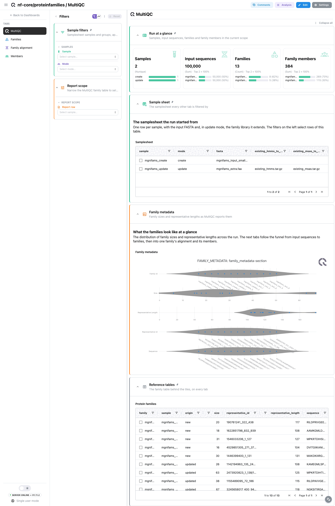
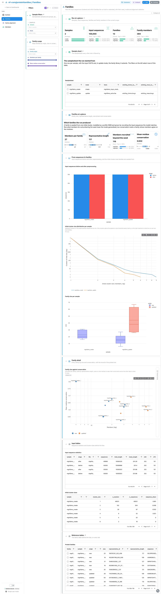
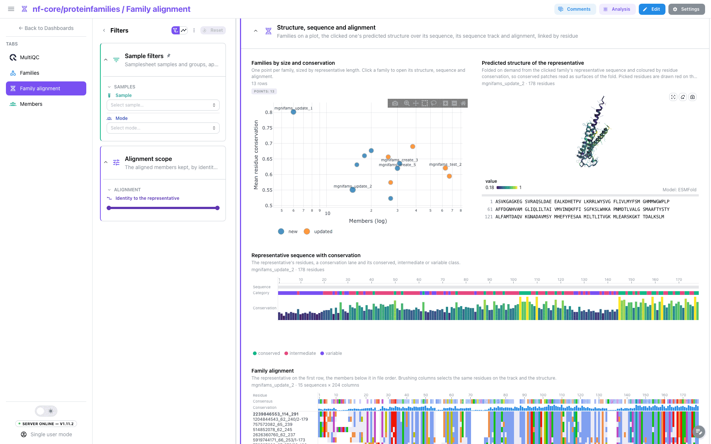
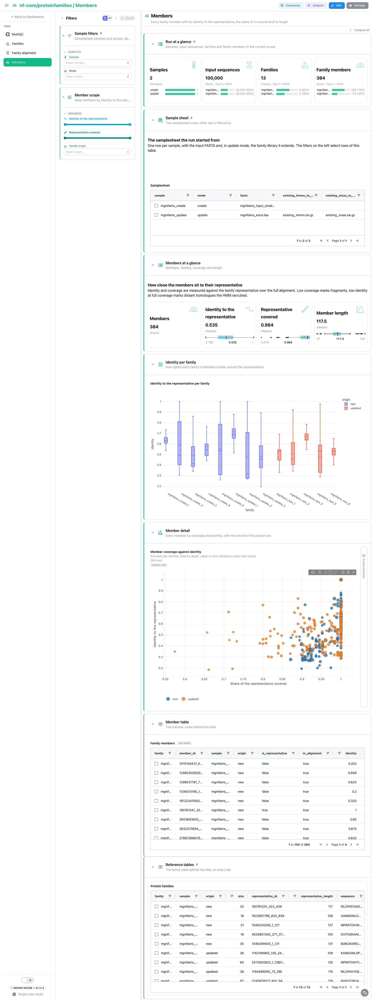

<div class="template-banner">
  <a class="template-banner-logo" href="https://nf-co.re/proteinfamilies" target="_blank" title="nf-core/proteinfamilies on nf-co.re">
    
    
  </a>
  <div class="template-banner-body">
    <h1 class="template-title">Protein Families</h1>
    <p class="template-subtitle">Protein family generation from clustering to families: the families built or extended with their seed, model and alignment statistics, one family's alignment, residue conservation, predicted structure and tree, and the members with their identity to the representative, next to the MultiQC report.</p>
    <p class="template-links">
      <a href="https://nf-co.re/proteinfamilies" target="_blank"><i class="mdi mdi-open-in-new"></i> nf-co.re</a>
      <a href="https://github.com/nf-core/proteinfamilies" target="_blank"><i class="mdi mdi-github"></i> GitHub</a>
    </p>
  </div>
  <span class="template-status-draft template-banner-badge" data-tooltip="Draft: generated and not yet reviewed. Expect it to need fixes before it is usable."><i class="mdi mdi-pencil-outline"></i> Draft</span>
</div>

<div class="tpl-version-pick" data-latest="2.5.0">
  <span class="tpl-version-icon"><i class="mdi mdi-source-branch"></i></span>
  <span class="tpl-version-label">Template version</span>
  <select id="tpl-version" class="tpl-version-select" aria-label="Template version">
    <option value="2.5.0" selected>2.5.0</option>
  </select>
  <span class="tpl-version-badge">latest</span>
</div>

The proteinfamilies template follows a family generation run as a funnel from
input sequences to families, then into one family at a time and its members:

- :material-chart-box-outline: **MultiQC**: the family metadata table of the pipeline's report
- :material-shape-outline: **Families**: how the input clustered, and every family by size against conservation
- :material-dna: **Family alignment**: one family's conservation, predicted structure, alignment and member tree
- :material-account-group-outline: **Members**: every member by identity to the representative and coverage of it

A `Run at a glance` strip (samples by mode, input sequences, families, family
members), the collapsed `Sample sheet` and the `Sample filters` (sample, mode)
are pinned to every tab, with the collapsed family table pinned to the bottom.

!!! info "New and updated families"
    Every file is keyed by its path, `<step>/<sample>/<family>.<ext>`: the
    sample is the directory and the family the file name. A family under
    `update_families/` is an existing family the run extended with the
    sequences its model matched (`origin: updated`); every other family was
    built by the run (`origin: new`). The `mode` grouping column says whether a
    sample extends a family library (`update`) or builds from scratch
    (`create`).

!!! warning "The structure tile needs the structure resolver"
    The Family alignment tab folds the representative sequence on demand
    through the server's [structure resolver](../../features/components.md#structure-resolver), which is off by default
    (`DEPICTIO_STRUCTURE_RESOLVER_ENABLED`). With it on, the representative's
    amino-acid sequence is sent to the public ESMFold service; with it off the
    3D tile shows its empty state and every other tile works.

---

## :material-rocket-launch-outline: Quick start

=== "Point at a finished run"

    ```bash
    depictio run \
      --template nf-core/proteinfamilies/latest \
      --data-root /path/to/proteinfamilies_results \
      --var METADATA_FILE=/path/to/samplesheet.csv \
      --var GROUP_COL=mode
    ```

    proteinfamilies reads its samplesheet from `--input` and does not publish
    it, so the sample hub reads it from `METADATA_FILE`. Without the variable
    the template looks for it under `input/samplesheet.csv` in the results.
    When `METADATA_FILE` is passed, the metadata auto-detection picks the first
    sheet column after the id as the group, so pass `GROUP_COL` with it. A run
    started with `--skip_phylogenetic_inference` also needs
    `--var SKIP_PHYLOGENETIC_INFERENCE=true`.

    | Variable | Default | Role |
    |---|---|---|
    | `METADATA_FILE` | `{DATA_ROOT}/input/samplesheet.csv` | The samplesheet the run was started with (`--input`) |
    | `METADATA_ID_COL` | `sample` | Samplesheet id column |
    | `GROUP_COL` | `mode` | Column samples are grouped and filtered by; `mode` (create or update) is derived from the sheet |
    | `GROUP_COL_DISPLAY` | `Mode` | Reader-facing label of `GROUP_COL` in filter and card titles |
    | `SKIP_PHYLOGENETIC_INFERENCE` | unset | Set for a run without `phylogeny/`: removes the tree collections |

=== "From the pipeline itself (v1.10.0+)"

    ```bash
    depictio-cli config nextflow --install     # once per machine
    nextflow run nf-core/proteinfamilies -r 2.5.0 -profile docker --outdir results
    ```

    No `depictio run`, and no template named: the pipeline ingests its own
    output directory when it finishes and resolves this template from its own
    manifest. See [Nextflow trigger](../../depictio-cli/nextflow-trigger.md).

---

## :material-book-open-variant: Reference

The template reads the SeqFu statistics, the initial cluster size distribution,
the family metadata and rosters, the family HMMs, the full family alignments
(FAMSA or MAFFT) and the CMAPLE trees. The per-family files are read as text,
one line per row, and recipes rebuild each file: aligned FASTA for the
alignments, the HMMER3 header for the models, Newick for the trees. Residue
conservation is computed per alignment column where the representative has a
residue, as one minus the normalised Shannon entropy, weighted by the share of
members with a residue there. A phylogeny collection serves one Newick file and
the pipeline writes one per family, so each tree is laid out as a segment table
and drawn by a code figure.

!!! info "Self-adapting layout"
    The dashboard adapts to whatever the run actually produced: components bound
    to pruned or unparsed data collections are hidden, tabs left with no real
    visualizations are dropped entirely, and the remaining components are
    re-packed so there are no empty rows.

<div class="tpl-version-block" data-version="2.5.0" markdown>

--8<-- "pipeline-templates/nf-core/_generated/proteinfamilies-latest.md"

</div>

---

## :material-view-dashboard-outline: Dashboard tabs

Four tabs, read as a funnel: the report, how the input clustered into families,
one family in depth, and the members the families recruited. Each tab below
carries the **same icon and colour the dashboard gives it**. The protein tiles
are described in
[Advanced Visualizations](../../features/components.md#advanced-visualizations).

=== "{ width=18 }{ width=18 } MultiQC"

    *How large are the families, and how long are their representatives?*

    [{ loading=lazy }](../../images/pipeline-templates/nf-core/proteinfamilies/multiqc_light.png){ .tpl-shot target="_blank" rel="noopener" }

    The family metadata table of the pipeline's MultiQC report, member count and
    representative length per family. The report's sequence statistics and
    cluster size sections are named after each sample, so no template can bind
    them; the next tab reads their source files instead.

    ??? abstract ":material-tune-variant: Filters and components"

        **Filters** · `Sample` and the group (`GROUP_COL`) on the samplesheet,
        persistent and pinned to the top of every tab, and a `Report row` picker
        in the tab-local *Report scope*.

        | Section | What it holds |
        |---|---|
        | Run at a glance | 4 cards, pinned to every tab |
        | Sample sheet | *Samplesheet*, collapsed and pinned to every tab |
        | Family metadata | *Family metadata* |
        | Reference tables | *Protein families*, collapsed and pinned to the bottom of every tab |

=== ":material-shape-outline:{ .mc-blue } Families"

    *Which families did the run build or extend, and how well do their members agree?*

    [{ loading=lazy }](../../images/pipeline-templates/nf-core/proteinfamilies/families_light.png){ .tpl-shot target="_blank" rel="noopener" }

    A family is seeded from one initial cluster, modelled as a profile HMM and
    grown by recruiting the input sequences the model matches. The cards give
    family size, representative length, members recruited beyond the seed and
    mean conservation. Input sequences before and after preprocessing and the
    initial cluster size distribution, on log axes, show where the families come
    from. Every family by size against conservation drives a linked **Picked
    family** record beside it.

    ??? abstract ":material-tune-variant: Filters and components"

        **Filters** · `Family origin` and ranges on `Members per family` and
        `Mean residue conservation`, in the tab-local *Family scope*.

        | Section | What it holds |
        |---|---|
        | Families at a glance | 4 cards |
        | From sequences to families | *Input sequences before and after preprocessing*, *Initial cluster size distribution per sample*, *Family size per sample* |
        | Family detail | *Family size against conservation*, *Picked family* |
        | Input tables | *Input sequence statistics*, *Initial cluster sizes*, collapsed |

=== ":material-dna:{ .mc-violet } Family alignment"

    *Which residues does one family conserve, and where do they sit on its fold?*

    [{ loading=lazy }](../../images/pipeline-templates/nf-core/proteinfamilies/family_alignment_light.png){ .tpl-shot target="_blank" rel="noopener" }

    One family at a time, numbered along its representative. The cards and the
    conservation profile read how much the families in scope agree. A scatter
    of the families by size against conservation takes half of the next
    section, and clicking a point opens that family's representative in the 3D
    tile on the other half, folded from its sequence, coloured by conservation
    and written as text under it; the pick follows the links to the alignment,
    residue and tree collections, so every tile moves to the same family. The
    sequence track and the family alignment run the full width below. Clicking
    a residue in 3D or a letter of the written sequence, brushing the track or
    brushing alignment columns selects the same residues in all of them, drawn
    as red ball and stick on the fold. The member tree and the residue table
    close the tab.

    ??? abstract ":material-tune-variant: Filters and components"

        **Filters** · an `Identity to the representative` range on the
        alignment, in the tab-local *Alignment scope*; the family comes from the
        scatter.

        | Section | What it holds |
        |---|---|
        | Alignment at a glance | 4 cards |
        | Conservation along the representative | *Conservation per residue of the representative* |
        | Structure, sequence and alignment | *Families by size and conservation*, *Predicted structure of the representative*, *Representative sequence with conservation*, *Family alignment* |
        | Family tree | *Member tree of the family* |
        | Residue table | *Residue conservation*, collapsed |

=== ":material-account-group-outline:{ .mc-teal } Members"

    *How closely do the members sit to their representative?*

    [{ loading=lazy }](../../images/pipeline-templates/nf-core/proteinfamilies/members_light.png){ .tpl-shot target="_blank" rel="noopener" }

    Identity and coverage are measured against the family representative over
    the full alignment: low coverage marks fragments, low identity at full
    coverage marks distant homologues the model recruited. A box plot shows how
    tightly each family's members cluster, and every member by coverage against
    identity drives a linked **Picked member** record beside it.

    ??? abstract ":material-tune-variant: Filters and components"

        **Filters** · ranges on `Identity to the representative` and
        `Representative covered`, and `Family origin`, in the tab-local *Member
        scope*.

        | Section | What it holds |
        |---|---|
        | Members at a glance | 4 cards |
        | Identity per family | *Identity to the representative per family* |
        | Member detail | *Member coverage against identity*, *Picked member* |
        | Member table | *Family members*, collapsed |

Tables and point views select on their entity column: the sample sheet on the
sample, the family scatter and table on the family, the member scatter and
table on the member, and the structure tiles on the family's residues. A pick
narrows every tile on the tab that reads the same collection or one linked from
it.

---

## :material-play-circle-outline: Running the pipeline

Depictio reads the **output** of nf-core/proteinfamilies, it does not run the
pipeline. Run the pipeline first:

```bash
nextflow run nf-core/proteinfamilies -r 2.5.0 \
  --input samplesheet.csv \
  --alignment_tool famsa \
  --outdir results -profile docker
```

Then copy the samplesheet under `input/` and point Depictio at the results:

```bash
mkdir -p results/input && cp samplesheet.csv results/input/
depictio run --template nf-core/proteinfamilies/latest --data-root results/
```

See [nf-co.re/proteinfamilies/usage](https://nf-co.re/proteinfamilies/2.5.0/docs/usage) for full pipeline documentation.

---

## :material-folder-open-outline: Required data structure

Point `--data-root` at the directory holding the pipeline output. Depictio scans
recursively and matches on file name; the sample and the family are read off
the path.

```text
<DATA_ROOT>/
├── input/samplesheet.csv                          # the hub: copied in, not published
├── pipeline_info/*software*versions*.yml
├── multiqc/multiqc_data/multiqc.parquet           # family metadata table
├── qc/<sample>/<sample>_{before,after}.tsv        # SeqFu statistics
├── mmseqs/initial_clustering/<sample>_clustering_distribution_mqc.csv
├── family_reps/<sample>/
│   ├── <sample>_meta_mqc.csv                      # family metadata
│   └── <sample>.tsv                               # family rosters
├── hmm/filtered/<sample>/<family>.hmm.gz
├── full_msa/filtered/<aligner>/<sample>/<family>.{aln,fas}
├── update_families/                               # optional; update mode only
│   ├── family_reps/<sample>/...
│   ├── hmm/<sample>/<family>.hmm.gz
│   └── full_msa/<aligner>/<sample>/<family>.{aln,fas}
└── phylogeny/cmaple/<sample>/<family>.treefile    # optional
```

---

## :material-flask-outline: Validation runs

The template was validated against the AWS megatest of the 2.5.0 release,
`results-f8c0b183e59df3d87c38d0f7c4acc6918593f4f5`, on its `test_full` profile:
two samples of 50,000 protein sequences, one building families from scratch and
one extending an existing family library before building new families from the
rest. The screenshots above come from that run. It publishes no samplesheet, so
the template ships it and the download script copies it in; the fetched subset
is 49 files:

```bash
DEST=/tmp/proteinfamilies_test
bash depictio/projects/nf-core/proteinfamilies/2.5.0/download_test_data.sh "$DEST"
depictio run --template nf-core/proteinfamilies/latest --data-root "$DEST"
```

Do not pass `--project-name` when ingesting: the dashboard is attached to the
project by name, so renaming it breaks a later `depictio dashboard import`.
Re-ingesting accumulates dashboards, so delete the project before repeating a run.

---

## :material-link-variant: Additional resources

- [nf-co.re/proteinfamilies](https://nf-co.re/proteinfamilies): official pipeline documentation
- [nf-co.re/proteinfamilies/2.5.0/results](https://nf-co.re/proteinfamilies/2.5.0/results): AWS test results
- [Template System Reference](../../usage/projects/templates.md): YAML format, variables, conditionals
- [Recipes](../../usage/projects/recipes.md): how to read, test, and write recipes

---

## :material-account-group-outline: Authorship

<div class="tpl-credits">
  <div class="tpl-credit">
    <span class="tpl-credit-role"><i class="mdi mdi-code-braces"></i> Developers</span>
    <span class="tpl-credit-note">Wrote the template, its recipes and its dashboards.</span>
    <a class="tpl-person" href="https://github.com/weber8thomas" target="_blank" rel="noopener">
       weber8thomas
    </a>
  </div>
  <div class="tpl-credit">
    <span class="tpl-credit-role"><i class="mdi mdi-eye-check-outline"></i> Reviewers</span>
    <span class="tpl-credit-note">Nobody has run it on their own data and signed it off yet, which is what keeps it a Draft.</span>
    <span class="tpl-person"><i class="mdi mdi-account-plus-outline"></i> Open</span>
  </div>
  <div class="tpl-credit">
    <span class="tpl-credit-role"><i class="mdi mdi-wrench-outline"></i> Maintainers</span>
    <span class="tpl-credit-note">Keep it working as nf-core/proteinfamilies releases.</span>
    <a class="tpl-person" href="https://github.com/weber8thomas" target="_blank" rel="noopener">
       weber8thomas
    </a>
  </div>
</div>

Reviewing a template on your own data, or taking over a role here, is a
contribution in itself: the [contributing guide](../../developer/contributing-templates.md)
says what each one involves.
