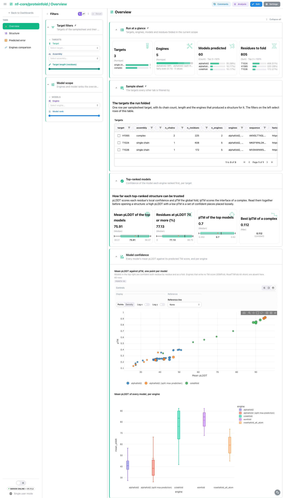
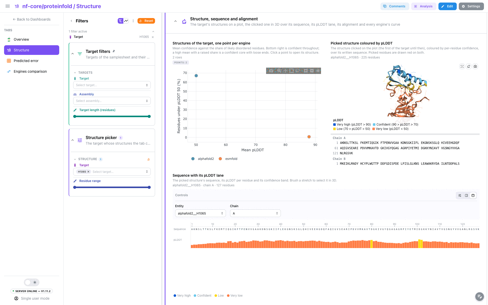
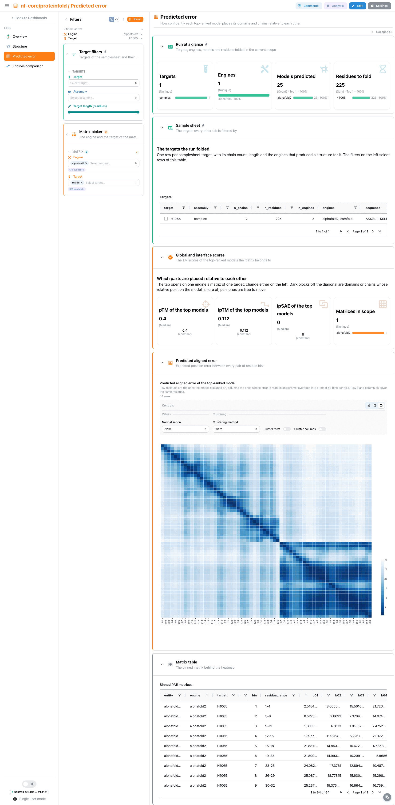
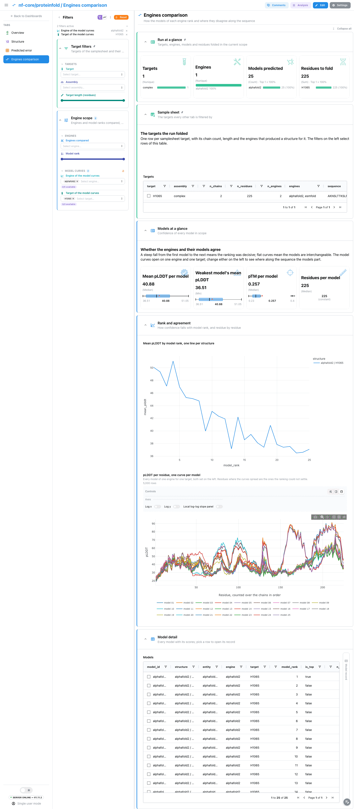

<div class="template-banner">
  <a class="template-banner-logo" href="https://nf-co.re/proteinfold" target="_blank" title="nf-core/proteinfold on nf-co.re">
    
    
  </a>
  <div class="template-banner-body">
    <h1 class="template-title">Protein Structure Prediction</h1>
    <p class="template-subtitle">Structure prediction compared engine by engine: the confidence of every model, each top-ranked structure in 3D with its per-residue confidence and the alignment it was folded from, the predicted aligned error, and where the engines and their models disagree.</p>
    <p class="template-links">
      <a href="https://nf-co.re/proteinfold" target="_blank"><i class="mdi mdi-open-in-new"></i> nf-co.re</a>
      <a href="https://github.com/nf-core/proteinfold" target="_blank"><i class="mdi mdi-github"></i> GitHub</a>
    </p>
  </div>
  <span class="template-status-draft template-banner-badge" data-tooltip="Draft: generated and not yet reviewed. Expect it to need fixes before it is usable."><i class="mdi mdi-pencil-outline"></i> Draft</span>
</div>

<div class="tpl-version-pick" data-latest="2.1.0">
  <span class="tpl-version-icon"><i class="mdi mdi-source-branch"></i></span>
  <span class="tpl-version-label">Template version</span>
  <select id="tpl-version" class="tpl-version-select" aria-label="Template version">
    <option value="2.1.0" selected>2.1.0</option>
  </select>
  <span class="tpl-version-badge">latest</span>
</div>

!!! warning "Built on a development run"
    No nf-core/proteinfold 2.1.0 release exists yet, and the AWS megatest of the
    2.0.0 release is empty. The template lives in a `2.1.0/` directory and was
    built and validated on a development run of the pipeline (`v2.1.0dev`),
    pinned by its commit under Validation runs below. Output names
    may still change before the release.

The proteinfold template reads a structure prediction run where the unit is one
engine's top-ranked structure of one target, so engines are compared model by
model and residue by residue rather than only by a summary score:

- :material-view-dashboard-outline: **Overview**: the confidence of the model each engine ranked first, and every model's mean pLDDT against its pTM
- :material-molecule: **Structure**: one structure in 3D coloured by pLDDT, its written sequence, its confidence lane and the alignment it was folded from
- :material-grid: **Predicted error**: the predicted aligned error matrix of one top-ranked model, with its global and interface scores
- :material-compare-horizontal: **Engines comparison**: how confidence falls with model rank, and where the engines and their models part along the sequence

A `Run at a glance` strip (targets by assembly, engines, models predicted,
residues to fold), the collapsed `Sample sheet` and the `Target filters`
(target, assembly, target length) are pinned to every tab.

!!! info "pLDDT bands"
    The confidence bands follow AlphaFold and carry its labels: Very high (90
    and above), Confident (70 to 90), Low (50 to 70) and Very low (below 50).
    Engines that write pLDDT as a 0 to 1 fraction are rescaled to 0 to 100 so
    every engine reads on one scale.

---

## :material-rocket-launch-outline: Quick start

=== "Point at a finished run"

    ```bash
    depictio run \
      --template nf-core/proteinfold/latest \
      --data-root /path/to/proteinfold_results \
      --var METADATA_FILE=/path/to/samplesheet.csv
    ```

    proteinfold does not publish the samplesheet it ran on, so the target hub
    reads it from `METADATA_FILE`. Without the variable the template looks for
    it under `input/samplesheet.csv` in the results. Sheet columns beyond `id`
    and `fasta` are kept, so any of them can become the grouping column.

    | Variable | Default | Role |
    |---|---|---|
    | `METADATA_FILE` | `{DATA_ROOT}/input/samplesheet.csv` | The samplesheet the run was started with (`--input`) |
    | `METADATA_ID_COL` | `id` | Samplesheet id column, the target name every output file carries |
    | `GROUP_COL` | `assembly` | Hub column targets are grouped and filtered by; `assembly` (single chain or complex) is derived from the structures |
    | `GROUP_COL_DISPLAY` | `Assembly` | Reader-facing label of `GROUP_COL` in filter and card titles |

=== "From the pipeline itself (v1.10.0+)"

    ```bash
    depictio-cli config nextflow --install     # once per machine
    nextflow run nf-core/proteinfold -r dev -profile docker --outdir results
    ```

    No `depictio run`, and no template named: the pipeline ingests its own
    output directory when it finishes and resolves this template from its own
    manifest. See [Nextflow trigger](../../depictio-cli/nextflow-trigger.md).

---

## :material-book-open-variant: Reference

The template reads the top-ranked PDB of every engine and target (pLDDT in the
B-factor column), the per-model pLDDT, pTM, ipTM and ipSAE tables, the
predicted aligned error matrices of the top model and, for the MSA-based
engines, the integer-coded alignment the structure was folded from. Each
structure gets one id, the `entity`, built from the engine, a non-default
AlphaFold2 mode and the target, so every per-structure table joins the 3D
object without a lookup. The MultiQC reports proteinfold writes per engine hold
one custom-content plot per target, named after it, so they are not read.

!!! info "Self-adapting layout"
    The dashboard adapts to whatever the run actually produced: components bound
    to pruned or unparsed data collections are hidden, tabs left with no real
    visualizations are dropped entirely, and the remaining components are
    re-packed so there are no empty rows. ESMFold writes no alignment, no PAE
    and no TM scores, so an ESMFold-only run skips those collections and their
    tiles.

<div class="tpl-version-block" data-version="2.1.0" markdown>

--8<-- "pipeline-templates/nf-core/_generated/proteinfold-latest.md"

</div>

---

## :material-view-dashboard-outline: Dashboard tabs

Four tabs, read as a funnel: how confident each engine's models are, one
structure in detail, how confidently it places its domains and chains, and
where the engines disagree on one target. Each tab below carries the **same
icon and colour the dashboard gives it**. The structure tiles are described in
[Advanced Visualizations](../../features/components.md#advanced-visualizations).

=== ":material-view-dashboard-outline:{ .mc-teal } Overview"

    *How confident is each engine's model, target by target?*

    [{ loading=lazy }](../../images/pipeline-templates/nf-core/proteinfold/overview_light.png){ .tpl-shot target="_blank" rel="noopener" }

    The top-ranked cards read the model each engine ranked first: mean pLDDT,
    the share of residues at pLDDT 70 or more, pTM and the best ipTM of a
    complex. A scatter puts every model's mean pLDDT against its pTM, so models
    confident both residue by residue and as a fold sit in the top right;
    engines that write no TM score drop out of it. A box plot then compares the
    engines over all their models.

    ??? abstract ":material-tune-variant: Filters and components"

        **Filters** · `Target`, the assembly (`GROUP_COL`) and a `Target
        length` range on the target hub, persistent and pinned to the top of
        every tab, plus `Engine` and a `Model rank` range in the tab-local
        *Model scope*.

        | Section | What it holds |
        |---|---|
        | Run at a glance | 4 cards, pinned to every tab |
        | Sample sheet | *Targets*, collapsed and pinned to every tab |
        | Top-ranked models | 4 cards |
        | Model confidence | *Mean pLDDT against pTM, one point per model*, *Mean pLDDT of every model, per engine* |

=== ":material-molecule:{ .mc-violet } Structure"

    *Which parts of the predicted structure can be trusted?*

    [{ loading=lazy }](../../images/pipeline-templates/nf-core/proteinfold/structure_light.png){ .tpl-shot target="_blank" rel="noopener" }

    The tab reads one target at a time: the target picker always holds a
    value. A scatter of every engine's top-ranked structure of that target
    (mean pLDDT against the share of very low confidence residues, coloured by
    engine) takes half the section, and clicking a point opens that structure
    in the 3D tile on the other half, coloured by pLDDT with its sequence
    written under it. The sequence track with its pLDDT lane and the alignment
    the engine folded from run the full width below. The tiles share their
    entity and residue columns, so clicking a residue in 3D or a letter of the
    written sequence, brushing the sequence track or brushing alignment columns
    selects the same residues in all of them, and the picked residues are drawn
    as red ball and stick. A last profile draws every engine's top-ranked curve
    for the target. A lone query row in the alignment means the engine found or
    used no homologs.

    ??? abstract ":material-tune-variant: Filters and components"

        **Filters** · `Target`, which always holds one value, and a `Residue
        range` in the tab-local *Structure picker*.

        | Section | What it holds |
        |---|---|
        | Structure confidence | 4 cards |
        | Structure, sequence and alignment | *Structures of the target, one point per engine*, *Picked structure coloured by pLDDT*, *Sequence with its pLDDT lane*, *Alignment the structure was folded from*, *pLDDT per residue of every engine's top-ranked structure* |
        | Residue table | *Residues of the structures in scope*, collapsed |

=== ":material-grid:{ .mc-orange } Predicted error"

    *How confidently does the model place its domains and chains relative to each other?*

    [{ loading=lazy }](../../images/pipeline-templates/nf-core/proteinfold/predicted_error_light.png){ .tpl-shot target="_blank" rel="noopener" }

    The predicted aligned error of the top-ranked model: rows are the residues
    the model is aligned on, columns the residues whose position error is
    read. Matrices are averaged into at most 64 bins per axis so any length fits
    one tile, and dark off-diagonal blocks are domains or chains placed
    confidently relative to each other. The engine and target pickers always
    hold a value, so the heatmap shows one matrix. The cards read pTM and ipTM
    of the top model and the mean error of the matrix. ESMFold writes no PAE.

    ??? abstract ":material-tune-variant: Filters and components"

        **Filters** · `Engine` and `Target`, which always hold one value, in the
        tab-local *Matrix picker*.

        | Section | What it holds |
        |---|---|
        | Global and interface scores | 4 cards |
        | Predicted aligned error | *Predicted aligned error of the top-ranked model* |
        | Matrix table | *Binned PAE matrices*, collapsed |

=== ":material-compare-horizontal:{ .mc-blue } Engines comparison"

    *Do the engines and their models agree on one target, and where do they part?*

    [{ loading=lazy }](../../images/pipeline-templates/nf-core/proteinfold/engines_comparison_light.png){ .tpl-shot target="_blank" rel="noopener" }

    The tab compares engines on one target: its target picker always holds a
    value, and since a filter narrows every collection that carries its column,
    the whole tab follows it. A line chart follows each engine's mean pLDDT from
    its first to its last model rank, where a steep fall means a decisive
    ranking. The profile draws one curve per engine, residue by residue: the
    line is the top-ranked model and the band runs from its lowest to its
    highest model, so a wide band marks residues the engine's models disagree
    on and curves that part mark residues the engines disagree on. The models
    table drives a linked **Model record** beside it.

    ??? abstract ":material-tune-variant: Filters and components"

        **Filters** · `Target compared`, which always holds one value, with
        `Engines compared` and a `Model rank` range in the tab-local *Engine
        scope*.

        | Section | What it holds |
        |---|---|
        | Models at a glance | 4 cards |
        | Rank and agreement | *Mean pLDDT by model rank, one line per engine*, *pLDDT per residue, one curve per engine, band over its models* |
        | Model detail | *Models*, *Model record* |

Tables and point views select on their entity column: the sample sheet on the
target, the model scatter and the models table on the model, and the structure
tiles on the structure and its residues. A pick narrows every tile on the tab
that reads the same collection or one linked from it.

---

## :material-play-circle-outline: Running the pipeline

Depictio reads the **output** of nf-core/proteinfold, it does not run the
pipeline. Run the pipeline first, with every engine you want to compare in
`--mode`:

```bash
nextflow run nf-core/proteinfold -r a414fd1368009500b66761e37e7cde80366a45e9 \
  --input samplesheet.csv \
  --mode alphafold2,colabfold,esmfold \
  --alphafold2_mode standard \
  --outdir results -profile docker
```

The commit is the development revision the template was validated on; `-r dev`
follows the development branch instead. Then copy the samplesheet under
`input/` and point Depictio at the results:

```bash
mkdir -p results/input && cp samplesheet.csv results/input/
depictio run --template nf-core/proteinfold/latest --data-root results/
```

See [nf-co.re/proteinfold/usage](https://nf-co.re/proteinfold/dev/docs/usage) for full pipeline documentation.

---

## :material-folder-open-outline: Required data structure

Point `--data-root` at the directory holding the pipeline output. Depictio scans
recursively and matches on file name; the engine, and for AlphaFold2 its mode,
are read off the directory path.

```text
<DATA_ROOT>/
├── input/samplesheet.csv                      # the hub: copied in, not published
├── pipeline_info/
│   ├── params_*.json
│   └── *software*versions*.yml
└── <engine>[/<mode>]/                         # alphafold2/standard, colabfold, esmfold, ...
    ├── top_ranked_structures/<target>.pdb     # pLDDT in the B-factor column
    └── <target>/
        ├── <target>_plddt.tsv                 # per model
        ├── <target>_{ptm,iptm,ipsae}.tsv      # optional; empty for one chain
        ├── <target>_<engine>_msa.tsv          # optional; MSA-based engines only
        └── paes/<target>_<k>_pae.tsv          # optional; the top model is read
```

The per-engine `multiqc/<engine>_data/` reports, the AlphaFold2 feature pickles
and the per-target HTML reports are not read.

---

## :material-flask-outline: Validation runs

The template was validated against the AWS megatest
`results-a414fd1368009500b66761e37e7cde80366a45e9`, a development run of the
pipeline (`v2.1.0dev`) and not a release tag: the 2.0.0 release run in the
bucket is empty. It gathers eleven `test_full` runs under one prefix:
AlphaFold2 in standard and split-MSA mode, ColabFold, ESMFold and RoseTTAFold
All-Atom on two monomer targets, and AlphaFold2 multimer and ESMFold on one
heterodimer. The screenshots above come from that run. The run publishes no
samplesheet, so the template ships the union of the `test_full` sheets and the
download script copies it in:

```bash
DEST=/tmp/proteinfold_test
bash depictio/projects/nf-core/proteinfold/2.1.0/download_test_data.sh "$DEST"
depictio run --template nf-core/proteinfold/latest --data-root "$DEST"
```

Do not pass `--project-name` when ingesting: the dashboard is attached to the
project by name, so renaming it breaks a later `depictio dashboard import`.
Re-ingesting accumulates dashboards, so delete the project before repeating a run.

---

## :material-link-variant: Additional resources

- [nf-co.re/proteinfold](https://nf-co.re/proteinfold): official pipeline documentation
- [nf-co.re/proteinfold/results](https://nf-co.re/proteinfold/results): AWS test results
- [Template System Reference](../../usage/projects/templates.md): YAML format, variables, conditionals
- [Recipes](../../usage/projects/recipes.md): how to read, test, and write recipes

---

## :material-account-group-outline: Authorship

<div class="tpl-credits">
  <div class="tpl-credit">
    <span class="tpl-credit-role"><i class="mdi mdi-code-braces"></i> Developers</span>
    <span class="tpl-credit-note">Wrote the template, its recipes and its dashboards.</span>
    <a class="tpl-person" href="https://github.com/weber8thomas" target="_blank" rel="noopener">
       weber8thomas
    </a>
  </div>
  <div class="tpl-credit">
    <span class="tpl-credit-role"><i class="mdi mdi-eye-check-outline"></i> Reviewers</span>
    <span class="tpl-credit-note">Nobody has run it on their own data and signed it off yet, which is what keeps it a Draft.</span>
    <span class="tpl-person"><i class="mdi mdi-account-plus-outline"></i> Open</span>
  </div>
  <div class="tpl-credit">
    <span class="tpl-credit-role"><i class="mdi mdi-wrench-outline"></i> Maintainers</span>
    <span class="tpl-credit-note">Keep it working as nf-core/proteinfold releases.</span>
    <a class="tpl-person" href="https://github.com/weber8thomas" target="_blank" rel="noopener">
       weber8thomas
    </a>
  </div>
</div>

Reviewing a template on your own data, or taking over a role here, is a
contribution in itself: the [contributing guide](../../developer/contributing-templates.md)
says what each one involves.
