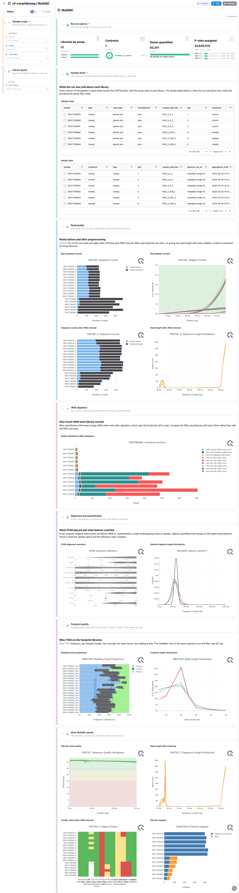
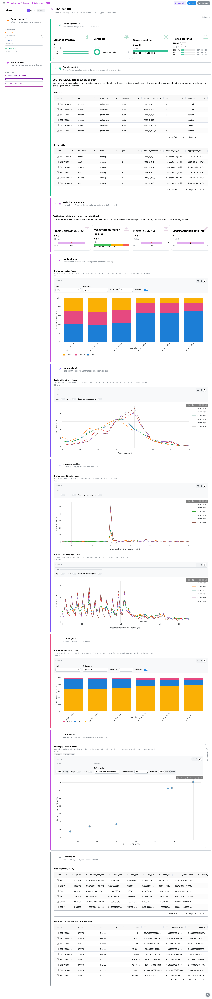
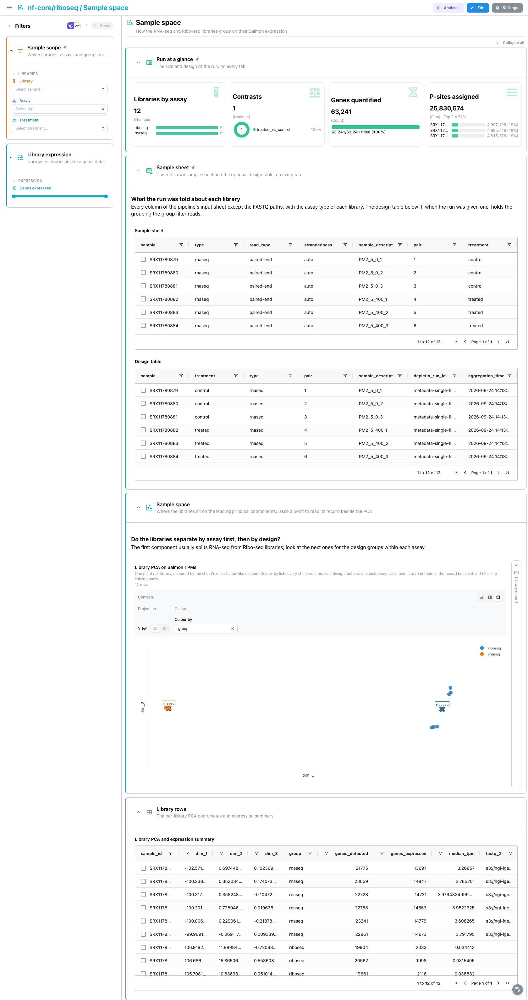
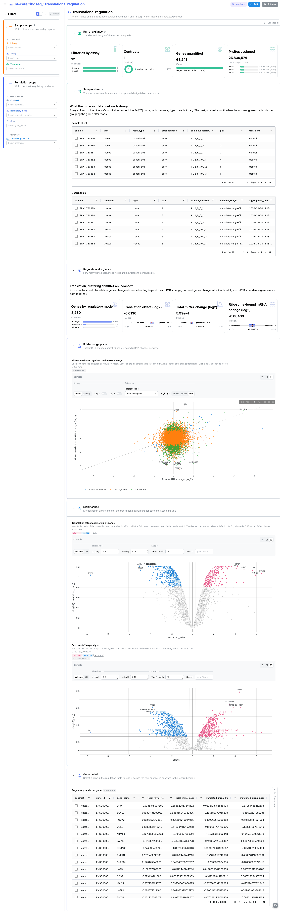
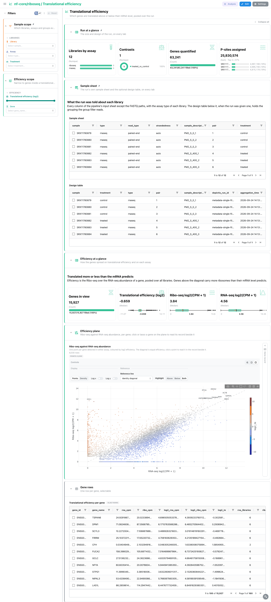
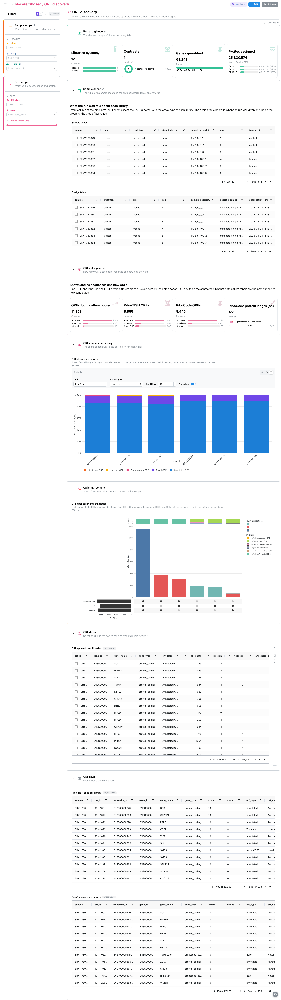

<div class="template-banner">
  <a class="template-banner-logo" href="https://nf-co.re/riboseq" target="_blank" title="nf-core/riboseq on nf-co.re">
    
    
  </a>
  <div class="template-banner-body">
    <h1 class="template-title">Ribosome profiling</h1>
    <p class="template-subtitle">riboWaltz periodicity QC, the Salmon sample space of both assays, anota2seq translational regulation, translational efficiency per gene and Ribo-TISH against RiboCode ORF calls, next to the pipeline's own MultiQC report.</p>
    <p class="template-links">
      <a href="https://nf-co.re/riboseq" target="_blank"><i class="mdi mdi-open-in-new"></i> nf-co.re</a>
      <a href="https://github.com/nf-core/riboseq" target="_blank"><i class="mdi mdi-github"></i> GitHub</a>
    </p>
  </div>
  <span class="template-status-experimental template-banner-badge" data-tooltip="Experimental: shared as-is. Feedback and PRs welcome."><i class="mdi mdi-flask-outline"></i> Experimental</span>
</div>

<div class="tpl-version-pick" data-latest="2.0.0">
  <span class="tpl-version-icon"><i class="mdi mdi-source-branch"></i></span>
  <span class="tpl-version-label">Template version</span>
  <select id="tpl-version" class="tpl-version-select" aria-label="Template version">
    <option value="2.0.0" selected>2.0.0</option>
  </select>
  <span class="tpl-version-badge">latest</span>
</div>

The riboseq template follows an nf-core/riboseq run from paired Ribo-seq and
RNA-seq libraries to translated ORFs, one tab per question:

- :material-waves: **Ribo-seq QC**: whether the footprints step one codon at a time, sit on coding sequence and have the expected length
- :material-chart-scatter-plot: **Sample space**: whether the libraries separate by assay first, then by design, on their Salmon expression
- :material-scale-balance: **Translational regulation**: which genes change through translation, buffering or mRNA abundance, per anota2seq contrast
- :material-chart-line: **Translational efficiency**: which genes are translated more or less than their mRNA predicts
- :material-set-merge: **ORF discovery**: ORF classes per library, and where Ribo-TISH and RiboCode agree

A `Run at a glance` strip and the collapsed `Sample sheet` are pinned to the top
of every tab, and the `Sample scope` filters (library, assay and, with a design
table, the design group) apply everywhere.

!!! info "Two assays in one sample sheet"
    A riboseq run mixes total mRNA libraries (`type: rnaseq`) and ribosome
    footprint libraries (`type: riboseq`). The MultiQC and Sample space tabs read
    both; the riboWaltz, Ribo-TISH and RiboCode panels read the footprint
    libraries only, and anota2seq pairs the two per contrast. The `Assay` filter
    splits them on every tab.

---

## :material-rocket-launch-outline: Quick start

=== "Point at a finished run"

    ```bash
    depictio run \
      --template nf-core/riboseq/latest \
      --data-root /path/to/riboseq_results \
      --var METADATA_FILE=/path/to/design.tsv
    ```

    The hub of the dashboard is the sample sheet the run was started with. It is
    not part of the published output, so copy it under `input/` in the data root,
    where `SAMPLESHEET_FILE` is auto-detected, or pass `--var
    SAMPLESHEET_FILE=...`. `METADATA_FILE` is optional: a design table whose first
    column is the sample id and whose first annotation column becomes the group
    filter. Without it the design table and the group filter are dropped and every
    other panel renders from the sample sheet.

=== "From the pipeline itself (v1.10.0+)"

    ```bash
    depictio-cli config nextflow --install     # once per machine
    nextflow run nf-core/riboseq -r 2.0.0 -profile docker --outdir results
    ```

    No `depictio run`, and no template named: the pipeline ingests its own
    output directory when it finishes and resolves this template from its own
    manifest. See [Nextflow trigger](../../depictio-cli/nextflow-trigger.md).

---

## :material-book-open-variant: Reference

The template reads the sample sheet, the MultiQC report, the Salmon merged gene
matrices, the riboWaltz QC tables, the anota2seq results per contrast, the
in-frame P-site counts and the Ribo-TISH and RiboCode ORF calls. Every
collection past the sample sheet, MultiQC and Salmon is optional, so a run that
skipped riboWaltz, the contrasts or an ORF caller still imports. 47 of its 77
components carry a `use:` catalog reference, so a tile says where its panel
comes from.

!!! info "Self-adapting layout"
    The dashboard adapts to whatever the run actually produced: components bound
    to pruned or unparsed data collections are hidden, tabs left with no real
    visualizations are dropped entirely, and the remaining components are
    re-packed so there are no empty rows.

<div class="tpl-version-block" data-version="2.0.0" markdown>

--8<-- "pipeline-templates/nf-core/_generated/riboseq-latest.md"

</div>

---

## :material-view-dashboard-outline: Dashboard tabs

Six tabs, read as a funnel: are the libraries usable, do the footprints come
from translating ribosomes, do the libraries group by assay and design, which
genes change translation between conditions, which are translated above or
below their mRNA level, and which ORFs the callers find. Each tab below carries
the **same icon and colour the dashboard gives it**. Screenshots come from the
run described under Validation runs.

=== "{ width=18 }{ width=18 } MultiQC"

    *Did the reads survive trimming, rRNA removal and alignment?*

    [{ loading=lazy }](../../images/pipeline-templates/nf-core/riboseq/multiqc_light.png){ .tpl-shot target="_blank" rel="noopener" }

    The tab is the MultiQC report as the run published it. FastQC is read at three
    stages (raw, trimmed and rRNA-filtered), SortMeRNA says how much of each
    library was ribosomal RNA, STAR and Salmon what was placed and quantified, and
    Ribo-TISH gives the reading-frame proportions and footprint lengths. The
    remaining FastQC and samtools panels sit in a collapsed section.

    ??? abstract ":material-tune-variant: Filters and components"

        **Filters** · `Library`, `Assay` and the design group (`GROUP_COL`) on the
        sample sheet and design table, persistent and pinned to the top of every
        tab, plus `Read layout` in a *Library layout* group.

        | Section | What it holds |
        |---|---|
        | Run at a glance | 4 cards: libraries by assay, contrasts, genes quantified, P-sites assigned (pinned) |
        | Sample sheet | *Sample sheet*, *Design table* (collapsed, pinned) |
        | Read quality | *Raw sequence counts*, *Raw adapter content*, *Sequence counts after rRNA removal*, *Read length after rRNA removal* |
        | rRNA depletion | *Reads matched to rRNA databases* |
        | Alignment and quantification | *STAR alignment summary*, *Salmon fragment length distribution* |
        | Footprint quality | *Reading frame proportions*, *Footprint length distribution* |
        | More MultiQC panels | 4 FastQC and samtools panels (collapsed) |

=== ":material-waves:{ .mc-grape } Ribo-seq QC"

    *Do the footprints step one codon at a time and sit on coding sequence?*

    [{ loading=lazy }](../../images/pipeline-templates/nf-core/riboseq/ribo_seq_qc_light.png){ .tpl-shot target="_blank" rel="noopener" }

    riboWaltz tables drive the tab: P-sites per reading frame in each transcript
    region, the footprint length profile, the metagene signal around the start and
    stop codons and the P-site share per region. The frame 0 share is taken on
    frame 0 itself, not on the dominant frame, so a mis-set P-site offset shows as
    a low value. The phasing plane puts the frame 0 share against the CDS share,
    with a linked library record beside it that folds to a slim rail until a point
    is picked.

    ??? abstract ":material-tune-variant: Filters and components"

        **Filters** · `Frame 0 share in CDS (%)` and `P-sites in CDS (%)` ranges
        in a *Library quality* group, which reach every riboWaltz view.

        | Section | What it holds |
        |---|---|
        | Periodicity at a glance | 4 cards |
        | Reading frame | *P-sites per reading frame* |
        | Footprint length | *Footprint length per library* |
        | Metagene profiles | *P-sites around the start codon*, *P-sites around the stop codon* |
        | P-site regions | *P-sites per transcript region* |
        | Library detail | *Phasing against CDS share*, *Library record* |
        | Library rows | *Ribo-seq library quality*, *P-site regions against the length expectation* (collapsed) |

=== ":material-chart-scatter-plot:{ .mc-cyan } Sample space"

    *Do the libraries separate by assay first, then by design?*

    [{ loading=lazy }](../../images/pipeline-templates/nf-core/riboseq/sample_space_light.png){ .tpl-shot target="_blank" rel="noopener" }

    A PCA on the Salmon TPMs of every library, Ribo-seq and RNA-seq together.
    The two assays are expected to split first and the design groups within each,
    so a library that sits with the wrong assay or away from its group stands
    out. Lasso a point to read that library in the record beside the PCA, which
    stays a slim rail until then.

    ??? abstract ":material-tune-variant: Filters and components"

        **Filters** · a `Genes expressed` range in a *Library expression* group.

        | Section | What it holds |
        |---|---|
        | Sample space | *Library PCA on Salmon TPMs*, *Library record* |
        | Library rows | *Library PCA and expression summary* (collapsed) |

=== ":material-scale-balance:{ .mc-indigo } Translational regulation"

    *Which genes change through translation, buffering or mRNA abundance?*

    [{ loading=lazy }](../../images/pipeline-templates/nf-core/riboseq/translational_regulation_light.png){ .tpl-shot target="_blank" rel="noopener" }

    The fold-change plane puts ribosome-bound against total mRNA change per gene,
    coloured by the regulatory mode anota2seq assigns with its default selection
    thresholds. A translation volcano and one volcano per anota2seq analysis
    follow. Selecting a gene in the regulation table opens the gene record beside
    it across the four analyses, and a mode or contrast pick narrows the other
    panels to the same genes.

    ??? abstract ":material-tune-variant: Filters and components"

        **Filters** · `Contrast`, `Regulatory mode` and `Gene` in a *Regulation*
        group, plus `anota2seq analysis` for the per-analysis volcano.

        | Section | What it holds |
        |---|---|
        | Regulation at a glance | 4 cards |
        | Fold-change plane | *Ribosome-bound against total mRNA change* |
        | Significance | *Translation effect against significance*, *Each anota2seq analysis* |
        | Gene detail | *Regulatory mode per gene*, *Gene record* |

    !!! tip "Only with contrasts"
        anota2seq runs only when the pipeline got `--contrasts`. Without it the
        regulation collections are not written and the tab is dropped.

=== ":material-chart-line:{ .mc-teal } Translational efficiency"

    *Which genes are translated more or less than their mRNA predicts?*

    [{ loading=lazy }](../../images/pipeline-templates/nf-core/riboseq/translational_efficiency_light.png){ .tpl-shot target="_blank" rel="noopener" }

    Translational efficiency is log2 of Ribo-seq CPM over RNA-seq CPM, computed by
    a template recipe from the in-frame P-site count matrix and pooled over the
    run. The plane puts Ribo-seq against RNA-seq abundance per gene, so genes off
    the diagonal are translated above or below their mRNA level. Click or lasso a
    gene to read its record beside the plane.

    ??? abstract ":material-tune-variant: Filters and components"

        **Filters** · a `Translational efficiency (log2)` range and `Gene` in an
        *Efficiency* group.

        | Section | What it holds |
        |---|---|
        | Efficiency at a glance | 4 cards |
        | Efficiency plane | *Ribo-seq against RNA-seq abundance*, *Gene record* |
        | Gene rows | *Translational efficiency per gene* (collapsed) |

=== ":material-set-merge:{ .mc-pink } ORF discovery"

    *Which ORFs are found, of which class, and do both callers agree?*

    [{ loading=lazy }](../../images/pipeline-templates/nf-core/riboseq/orf_discovery_light.png){ .tpl-shot target="_blank" rel="noopener" }

    Stacked bars give the share of each ORF class per library, for each caller.
    The UpSet compares Ribo-TISH, RiboCode and the annotation on one key, the
    genomic stop codon (`chrom:strand:stop`), so alternative start sites of one ORF
    collapse onto one row. Selecting an ORF in the pooled table opens its record
    beside it; an ORF-class or overlap pick reaches the per-library calls.

    ??? abstract ":material-tune-variant: Filters and components"

        **Filters** · `ORF class`, `Gene` and a `Protein length (aa)` range in an
        *ORFs* group.

        | Section | What it holds |
        |---|---|
        | ORFs at a glance | 4 cards |
        | ORF classes per library | *ORF classes per library* |
        | Caller agreement | *ORFs per caller and annotation* |
        | ORF detail | *ORFs pooled over libraries*, *ORF record* |
        | ORF rows | *Ribo-TISH calls per library*, *RiboCode calls per library* (collapsed) |

---

## :material-play-circle-outline: Running the pipeline

Depictio reads the **output** of nf-core/riboseq, it does not run the pipeline.
Run the pipeline first, with a contrasts file if you want the Translational
regulation tab:

```bash
nextflow run nf-core/riboseq -r 2.0.0 \
  --input samplesheet.csv \
  --contrasts contrasts.csv \
  --fasta genome.fa.gz --gtf genes.gtf.gz \
  --outdir results -profile docker
```

Then copy the sample sheet under `input/` and point Depictio at the results:

```bash
mkdir -p results/input && cp samplesheet.csv results/input/
depictio run --template nf-core/riboseq/latest --data-root results/ \
  --var METADATA_FILE=design.tsv
```

See [nf-co.re/riboseq/usage](https://nf-co.re/riboseq/2.0.0/docs/usage) for full pipeline documentation.

---

## :material-folder-open-outline: Required data structure

Point `--data-root` at the directory holding the pipeline output. Depictio scans
recursively and matches on file name, so the aligner directory can differ from
the tree below.

```text
<DATA_ROOT>/
├── input/
│   └── samplesheet.csv                          # the hub: sample, strandedness, type, design columns
├── pipeline_info/
│   ├── params_*.json
│   └── *software*versions*.yml
├── multiqc/star/multiqc_report_data/
│   └── multiqc.parquet                          # or multiqc/multiqc_data/
├── quantification/
│   ├── salmon/salmon.merged.gene_{counts,tpm}.tsv
│   └── inframe_psite/gene_counts.tsv            # optional, translational efficiency
├── psites/ribowaltz/ribowaltz_qc/*.tsv          # optional, --skip_ribowaltz drops it
├── translational_efficiency/anota2seq/
│   └── *.anota2seq.results.tsv                  # optional, needs --contrasts
└── orf_predictions/
    ├── ribotish/*_pred.txt                      # optional, --skip_ribotish drops it
    └── ribocode/*_collapsed.txt                 # optional, --skip_ribocode drops it
```

`METADATA_FILE`, when given, is read from wherever it points; its id column is
`METADATA_ID_COL` (default: the first column) and the group filter reads
`GROUP_COL` (default: the first annotation column). BAM files, bigWigs and the
RiboCode P-site stores are not read.

---

## :material-flask-outline: Validation runs

The template was validated against the AWS megatest of the 2.0.0 release
(`results-11d66a3b8ae1f41f9c385af36bd431c35bf015ab`), paired Ribo-seq and RNA-seq
libraries from a two-condition design with one contrast, and the screenshots
above come from it. The sample sheet, contrasts and a design table are not part
of the published run: they are vendored with the template under `input/`.
`megatest.yaml` lists the tables-only subset the template needs:

```bash
bash depictio/projects/nf-core/riboseq/2.0.0/download_test_data.sh /tmp/riboseq_test
mkdir -p /tmp/riboseq_test/input
cp depictio/projects/nf-core/riboseq/2.0.0/input/*.*sv /tmp/riboseq_test/input/
depictio run --template nf-core/riboseq/latest --data-root /tmp/riboseq_test \
  --var METADATA_FILE=/tmp/riboseq_test/input/metadata.tsv
```

Do not pass `--project-name` when ingesting: the dashboard is attached to the
project by name, so renaming it breaks a later `depictio dashboard import`.
Re-ingesting accumulates dashboards, so delete the project before repeating a run.

---

## :material-link-variant: Additional resources

- [nf-co.re/riboseq](https://nf-co.re/riboseq): official pipeline documentation
- [nf-co.re/riboseq/2.0.0/results](https://nf-co.re/riboseq/2.0.0/results): AWS test results
- [Template System Reference](../../usage/projects/templates.md): YAML format, variables, conditionals
- [Recipes](../../usage/projects/recipes.md): how to read, test, and write recipes

---

## :material-account-group-outline: Authorship

<div class="tpl-credits">
  <div class="tpl-credit">
    <span class="tpl-credit-role"><i class="mdi mdi-code-braces"></i> Developers</span>
    <span class="tpl-credit-note">Wrote the template, its recipes and its dashboards.</span>
    <a class="tpl-person" href="https://github.com/weber8thomas" target="_blank" rel="noopener">
       weber8thomas
    </a>
  </div>
  <div class="tpl-credit">
    <span class="tpl-credit-role"><i class="mdi mdi-eye-check-outline"></i> Reviewers</span>
    <span class="tpl-credit-note">Nobody has run it on their own data and signed it off yet, which is what keeps it Experimental.</span>
    <span class="tpl-person"><i class="mdi mdi-account-plus-outline"></i> Open</span>
  </div>
  <div class="tpl-credit">
    <span class="tpl-credit-role"><i class="mdi mdi-wrench-outline"></i> Maintainers</span>
    <span class="tpl-credit-note">Keep it working as nf-core/riboseq releases.</span>
    <a class="tpl-person" href="https://github.com/weber8thomas" target="_blank" rel="noopener">
       weber8thomas
    </a>
  </div>
</div>

Reviewing a template on your own data, or taking over a role here, is a
contribution in itself: the [contributing guide](../../developer/contributing-templates.md)
says what each one involves.
