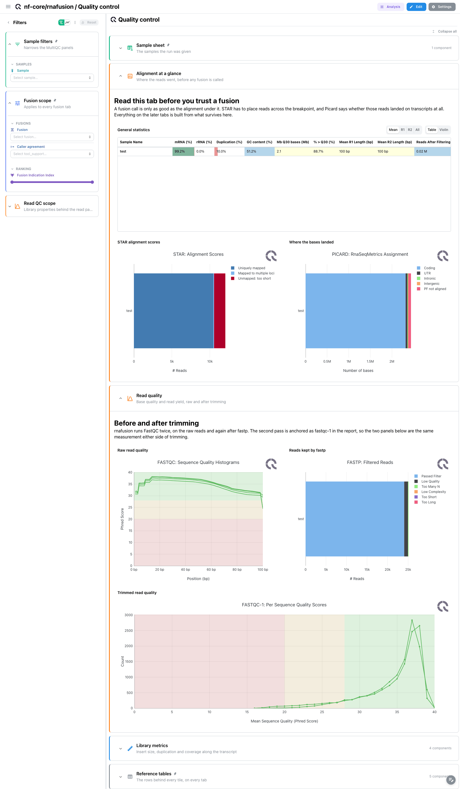
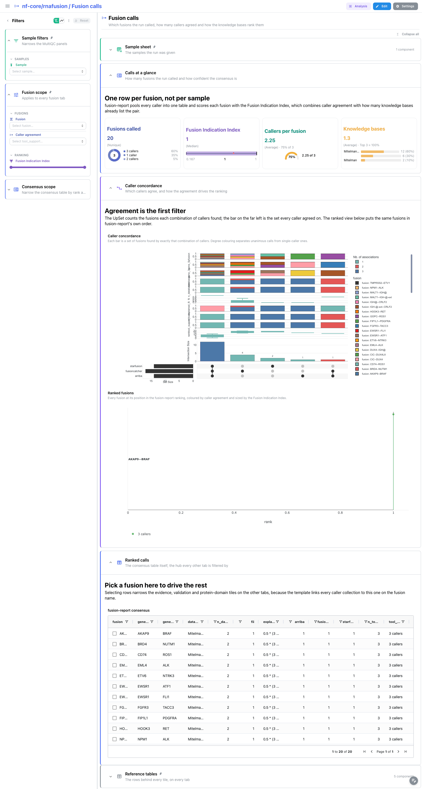
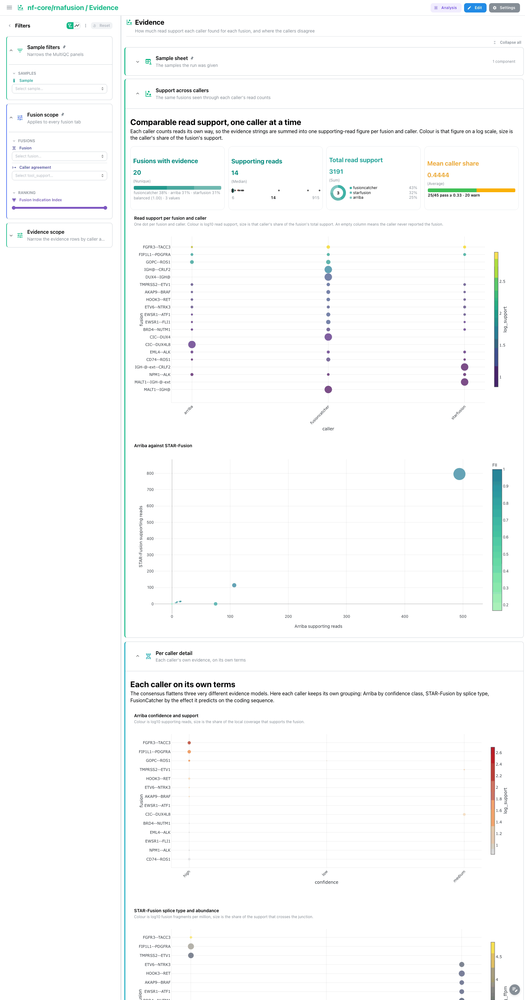
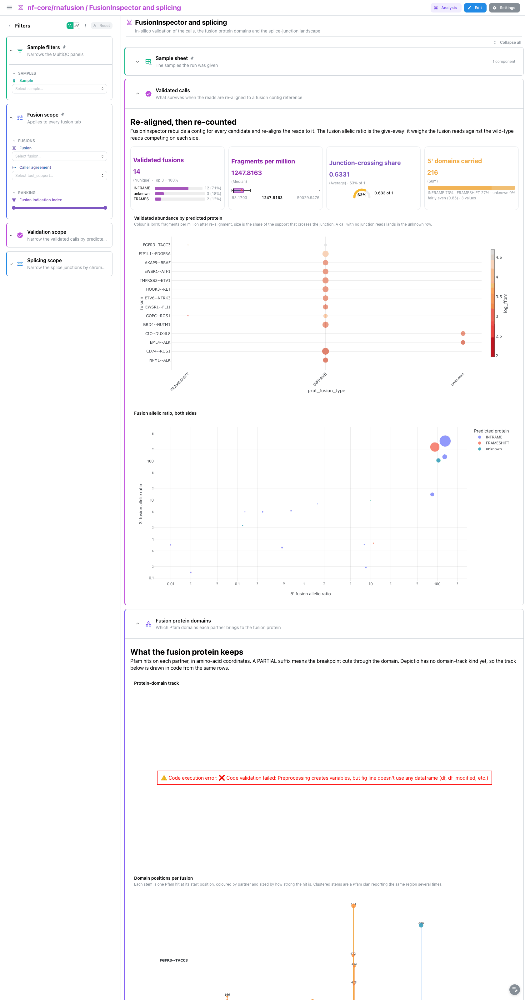

<div class="template-banner">
  <a class="template-banner-logo" href="https://nf-co.re/rnafusion" target="_blank" title="nf-core/rnafusion on nf-co.re">
    
    
  </a>
  <div class="template-banner-body">
    <h1 class="template-title">RNA Fusion Detection</h1>
    <p class="template-subtitle">Gene fusions called from RNA-seq reads: the fusion-report consensus of three callers, each caller's own evidence, FusionInspector validation and the CTAT-splicing junction landscape.</p>
    <p class="template-links">
      <a href="https://nf-co.re/rnafusion" target="_blank"><i class="mdi mdi-open-in-new"></i> nf-co.re</a>
      <a href="https://github.com/nf-core/rnafusion" target="_blank"><i class="mdi mdi-github"></i> GitHub</a>
    </p>
  </div>
  <span class="template-status-experimental template-banner-badge" data-tooltip="Experimental — shared as-is. Feedback and PRs welcome."><i class="mdi mdi-flask-outline"></i> Experimental</span>
</div>

<div class="tpl-version-pick" data-latest="4.1.3">
  <span class="tpl-version-icon"><i class="mdi mdi-source-branch"></i></span>
  <span class="tpl-version-label">Template version</span>
  <select id="tpl-version" class="tpl-version-select" aria-label="Template version">
    <option value="4.1.3" selected>4.1.3</option>
  </select>
  <span class="tpl-version-badge">latest</span>
</div>

The rnafusion template follows the pipeline's own funnel, from read quality
through to the protein a fusion would produce:

- :material-chart-box-outline: **Read and alignment QC**: FastQC either side of trimming, fastp, STAR and Picard, out of the MultiQC report
- :material-set-merge: **Caller consensus**: fusion-report's ranked calls, the UpSet of caller agreement and the Fusion Indication Index
- :material-chart-scatter-plot: **Per-caller evidence**: Arriba, STAR-Fusion and FusionCatcher read support, each on its own terms
- :material-dna: **In-silico validation**: FusionInspector re-quantification, fusion allelic ratios and the Pfam domains each partner brings
- :material-chart-timeline-variant: **Splice junctions**: CTAT-splicing support along the genome, and as arcs over the busiest loci
- :material-table: **Reference tables**: consensus, per-caller evidence, validation and junctions, pinned to the bottom of every tab

!!! info "The fusion is the unit of analysis, not the sample"
    rnafusion writes one file per tool per sample and none of those files carries
    a sample column, so the recipe harness cannot recover one. Every fusion
    collection is keyed on the fusion name instead, a fusion picked anywhere fans
    out across all six of them, and the samplesheet only reaches the MultiQC
    panels. On a cohort run the caller tables pool the samples: the counts are
    correct, but they are cohort-wide.

!!! note "Route flags are not auto-detected"
    rnafusion's `--tools` selection is not read back from `params.json`, so a run
    that skipped a step needs the matching variable: `SKIP_ARRIBA`,
    `SKIP_STARFUSION`, `SKIP_FUSIONCATCHER`, `SKIP_FUSIONINSPECTOR`,
    `SKIP_CTATSPLICING` or `SKIP_QC`. Each prunes the matching data collections
    and the tiles that read them.

---

## :material-rocket-launch-outline: Quick start

=== "Point at a finished run"

    ```bash
    depictio run \
      --template nf-core/rnafusion/latest \
      --data-root /path/to/rnafusion_results
    ```

    `--data-root` is the only thing you have to pass. The samplesheet is looked
    for at `{DATA_ROOT}/input/samplesheet.csv`; pass
    `--var SAMPLESHEET_FILE=...` to point somewhere else.

=== "From the pipeline itself (v1.10.0+)"

    ```bash
    depictio-cli config nextflow --install     # once per machine
    nextflow run nf-core/rnafusion -profile docker --outdir results
    ```

    No `depictio run`, and no template named: the pipeline ingests its own
    output directory when it finishes and resolves this template from its own
    manifest. See [Nextflow trigger](../../depictio-cli/nextflow-trigger.md).

---

## :material-book-open-variant: Reference

The template reads the fusion-report consensus, the three caller tables behind
it, the FusionInspector abridged table (both the validated calls and the Pfam
domains come from that one file) and the CTAT-splicing intron scores, through
six catalog tools: `fusionreport`, `arriba`, `starfusion`, `fusioncatcher`,
`fusioninspector` and `ctatsplicing`.

!!! info "Self-adapting layout"
    The dashboard adapts to whatever the run actually produced: components bound
    to pruned or unparsed data collections are hidden, tabs left with no real
    visualizations are dropped entirely, and the remaining components are
    re-packed so there are no empty rows.

<div class="tpl-version-block" data-version="4.1.3" markdown>

--8<-- "pipeline-templates/nf-core/_generated/rnafusion-latest.md"

</div>

---

## :material-view-dashboard-outline: Dashboard tabs

Four tabs, read as a funnel: can the reads support a call at all, what was
called, how strong is each caller's evidence, and does the call survive
re-alignment. Each tab below carries the **same icon and colour the dashboard
gives it**. Two filter groups are persistent and pinned to the top of every tab,
`Sample filters` and `Fusion scope`; `Reference tables` is pinned to the bottom.

=== "{ width=18 }{ width=18 } MultiQC"

    *Read and alignment QC before any fusion is trusted.*

    [{ loading=lazy }](../../images/pipeline-templates/nf-core/rnafusion/multiqc_light.png){ .tpl-shot target="_blank" rel="noopener" }

    A fusion call rests on reads that crossed a breakpoint, so a library that
    never aligned well cannot support one. STAR's alignment scores and Picard's
    transcript region assignment sit next to the MultiQC general statistics
    table, then the raw and post-trim FastQC panels either side of fastp.
    rnafusion runs FastQC twice, so the second pass is anchored as `fastqc-1` and
    carries a `_trimmed` suffix the samplesheet does not know: picking a sample
    in the persistent filter empties the trimmed panels.

    ??? abstract ":material-tune-variant: Filters and components"

        **Filters** · `Sample` on `samplesheet` plus `Fusion`, `Caller agreement`
        and a `Fusion Indication Index` range on `fusion_consensus`, all
        persistent and pinned to the top of every tab, plus `Strandedness` in a
        collapsed *Read QC scope* group.

        | Section | What it holds |
        |---|---|
        | Sample sheet | *Run samplesheet*, pinned to the top |
        | Alignment at a glance | *General statistics*, *STAR alignment scores*, *Where the bases landed* |
        | Read quality | *Raw read quality*, *Reads kept by fastp*, *Trimmed read quality* |
        | Library metrics | Insert size, gene body coverage, STAR gene-count assignment |
        | Reference tables | Consensus, per-caller evidence, validation and junction tables |

=== ":material-set-merge:{ .mc-indigo } Fusion calls"

    *What the run called, and how much agreement is behind each call.*

    [{ loading=lazy }](../../images/pipeline-templates/nf-core/rnafusion/fusion_calls_light.png){ .tpl-shot target="_blank" rel="noopener" }

    Four cards open the tab: fusions called split by caller agreement, the median
    Fusion Indication Index, mean callers per fusion, and mean knowledge-base
    hits. The UpSet below reads the three caller flag columns as sets, so each
    bar is the fusions found by exactly that combination of callers and unanimous
    calls separate from single-caller ones at a glance. The lollipop plots each
    fusion at its rank with the index as the stem height. The consensus table is
    the hub: a row picked here drives every other tab.

    ??? abstract ":material-tune-variant: Filters and components"

        **Filters** · `Rank` and `Knowledge bases` ranges on `fusion_consensus`,
        in a collapsed *Consensus scope* group, on top of the persistent fusion
        filter.

        | Section | What it holds |
        |---|---|
        | Calls at a glance | 4 cards |
        | Caller concordance | *Caller concordance* (UpSet), *Ranked fusions* (lollipop) |
        | Ranked calls | *fusion-report consensus* |

=== ":material-chart-scatter-plot:{ .mc-teal } Evidence"

    *The same fusions seen through each caller's own read counts.*

    [{ loading=lazy }](../../images/pipeline-templates/nf-core/rnafusion/evidence_light.png){ .tpl-shot target="_blank" rel="noopener" }

    The shared dot plot is one dot per fusion and caller, coloured by log10 read
    support and sized by that caller's share of the total, so an empty column
    means the caller never reported the fusion. The scatter beside it faces the
    two split-read callers: a fusion off the diagonal is one they disagree about.

    Below that, each caller gets its own dot plot rather than a shared one,
    because the callers report genuinely different evidence quantities and
    collapsing them would mean inventing a common scale: Arriba clusters by
    confidence class, STAR-Fusion by splice type, FusionCatcher by predicted
    effect.

    ??? abstract ":material-tune-variant: Filters and components"

        **Filters** · `Caller`, plus `Supporting reads` and `Caller share`
        ranges, all on `caller_evidence`, in a collapsed *Evidence scope* group.

        | Section | What it holds |
        |---|---|
        | Support across callers | 4 cards, *Read support per fusion and caller*, *Arriba against STAR-Fusion* |
        | Per caller detail | One dot plot each for Arriba, STAR-Fusion and FusionCatcher |
        | Caller tables | *Arriba calls*, *STAR-Fusion calls*, *FusionCatcher calls* |

=== ":material-dna:{ .mc-grape } FusionInspector and splicing"

    *What survives re-alignment, the fusion protein, and the junctions around it.*

    [{ loading=lazy }](../../images/pipeline-templates/nf-core/rnafusion/fusioninspector_and_splicing_light.png){ .tpl-shot target="_blank" rel="noopener" }

    FusionInspector re-quantifies the calls against a fusion contig reference.
    The allelic-ratio scatter plots the 5' side against the 3' side on log axes:
    a call supported on one side only falls off the diagonal, the classic
    signature of a mapping artefact rather than a real fusion transcript.

    The `fusion_structure` view draws a fusion as its two partners end to end
    with the breakpoint marked, one bar per Pfam domain along the partner that
    contributes it; a `PARTIAL` suffix means the breakpoint cuts through it. The
    `sashimi` view draws the CTAT-splicing junctions from donor to acceptor, each
    arc thickened by its read support.

    ??? abstract ":material-tune-variant: Filters and components"

        **Filters** · `Predicted protein` and a `Fragments per million` range on
        `fusioninspector_fusions` in a collapsed *Validation scope* group;
        `Chromosome` and `Unique read support` on `splice_junctions` in a
        collapsed *Splicing scope* group.

        | Section | What it holds |
        |---|---|
        | Validated calls | 4 cards, *Validated abundance by predicted protein*, *Fusion allelic ratio, both sides* |
        | Fusion protein domains | *Fusion protein structure*, *Domain positions per fusion*, *Pfam domains* |
        | Splice junctions | 4 cards, *Junction support along the genome*, *Junction arcs*, per-gene support bar |

!!! tip "Splice junctions are deliberately unlinked"
    CTAT-splicing scores the introns of a single gene, so a fusion name has
    nothing to match against. `splice_junctions` is left out of the fusion links
    on purpose: the junction cards keep their values when a fusion is picked, and
    only the *Splicing scope* group narrows them.

---

## :material-play-circle-outline: Running the pipeline

Depictio reads the **output** of nf-core/rnafusion, it does not run the
pipeline. Build the references once, then run the pipeline:

```bash
nextflow run nf-core/rnafusion \
  --input samplesheet.csv \
  --genomes_base /path/to/references \
  --tools arriba,starfusion,fusioncatcher,ctatsplicing \
  --outdir results \
  -profile docker
```

Then point Depictio at the results:

```bash
depictio run --template nf-core/rnafusion/latest \
  --data-root results/
```

See [nf-co.re/rnafusion/usage](https://nf-co.re/rnafusion/4.1.3/docs/usage)
for full pipeline documentation.

---

## :material-folder-open-outline: Required data structure

Point `--data-root` at the directory holding the pipeline output. Depictio scans
recursively and matches on file name. The samplesheet is the one file rnafusion
does not publish: put it under `input/`, or pass `--var SAMPLESHEET_FILE=...`.

```text
<DATA_ROOT>/
├── input/
│   └── samplesheet.csv                                     # --var SAMPLESHEET_FILE, not published by the run
├── pipeline_info/
│   ├── params_<timestamp>.json                             # run parameters and provenance
│   └── *software_versions.yml
├── multiqc/
│   └── multiqc_data/
│       └── multiqc.parquet                                 # FastQC, fastp, STAR, Picard
├── fusionreport/
│   └── <sample>/
│       └── <sample>.fusions.csv                            # the consensus, hub of the dashboard
├── arriba/
│   └── <sample>.arriba.fusions.tsv
├── starfusion/
│   └── <sample>.starfusion.abridged.tsv
├── fusioncatcher/
│   └── <sample>.fusion-genes.txt
├── fusioninspector/
│   └── <sample>/
│       └── <sample>.FusionInspector.fusions.abridged.tsv   # validated calls and Pfam domains
└── ctatsplicing/
    ├── <sample>.introns
    └── <sample>.cancer.introns                             # optional, header-only when nothing matched
```

---

## :material-flask-outline: Test data

The repository ships
[`download_test_data.sh`](https://github.com/depictio/depictio/blob/main/depictio/projects/nf-core/rnafusion/4.1.3/download_test_data.sh),
which fetches the subset of nf-core's AWS megatest run that the template needs,
20 files and about 3.9 MB. The run is
`s3://nf-core-awsmegatests/rnafusion/results-76ad76e7c39b2ba9edc35aa3602e3dc454d842ec/`:
the pipeline's own test profile, a single library spiked with twelve well known
cancer fusions. Its samplesheet is not part of the results, so fetch the one
`params.json` points at:

```bash
DEST=/tmp/rnafusion_test
bash depictio/projects/nf-core/rnafusion/4.1.3/download_test_data.sh "$DEST"
mkdir -p "$DEST/input" && curl -fsSL -o "$DEST/input/samplesheet.csv" \
  https://raw.githubusercontent.com/nf-core/test-datasets/rnafusion/testdata/human/samplesheet_valid.csv
depictio run --template nf-core/rnafusion/latest --data-root "$DEST"
```

!!! warning "One synthetic sample"
    The reference run is a single library, so every quality-control panel has one
    series and the sample filter can only select all or nothing. The fusions are
    synthetic: twelve calls score 1.0 and the rest 0.167, so the index reads as
    two plateaux rather than a ranking. The fusion tabs compare callers, not
    samples, so they read normally.

---

## :material-link-variant: Additional resources

- [nf-co.re/rnafusion](https://nf-co.re/rnafusion): official pipeline documentation
- [nf-co.re/rnafusion/4.1.3/results](https://nf-co.re/rnafusion/4.1.3/results): AWS test results
- [Template System Reference](../../usage/projects/templates.md): YAML format, variables, conditionals
- [Recipes](../../usage/projects/recipes.md): how to read, test, and write recipes

---

## :material-account-group-outline: Authorship

<div class="tpl-credits">
  <div class="tpl-credit">
    <span class="tpl-credit-role"><i class="mdi mdi-code-braces"></i> Developers</span>
    <span class="tpl-credit-note">Wrote the template, its recipes and its dashboards.</span>
    <a class="tpl-person" href="https://github.com/weber8thomas" target="_blank" rel="noopener">
       weber8thomas
    </a>
  </div>
  <div class="tpl-credit">
    <span class="tpl-credit-role"><i class="mdi mdi-eye-check-outline"></i> Reviewers</span>
    <span class="tpl-credit-note">Nobody has run it on their own data and signed it off yet, which is what keeps it Experimental.</span>
    <span class="tpl-person"><i class="mdi mdi-account-plus-outline"></i> Open</span>
  </div>
  <div class="tpl-credit">
    <span class="tpl-credit-role"><i class="mdi mdi-wrench-outline"></i> Maintainers</span>
    <span class="tpl-credit-note">Keep it working as nf-core/rnafusion releases.</span>
    <a class="tpl-person" href="https://github.com/weber8thomas" target="_blank" rel="noopener">
       weber8thomas
    </a>
  </div>
</div>

Reviewing a template on your own data, or taking over a role here, is a
contribution in itself: the [contributing guide](../../developer/contributing-templates.md)
says what each one involves.
