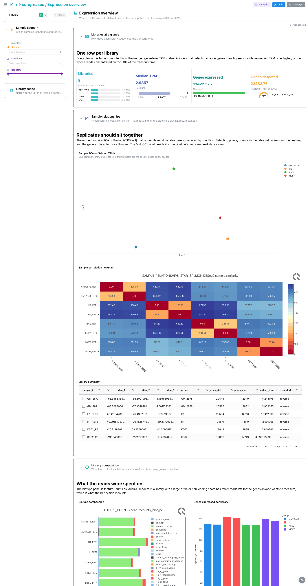
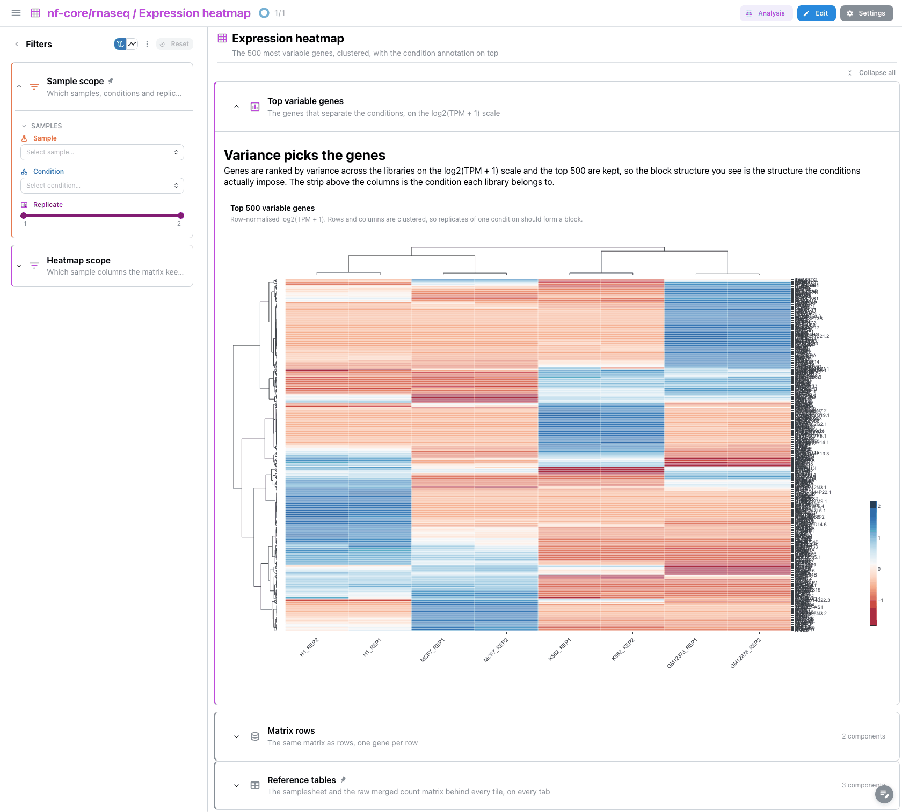
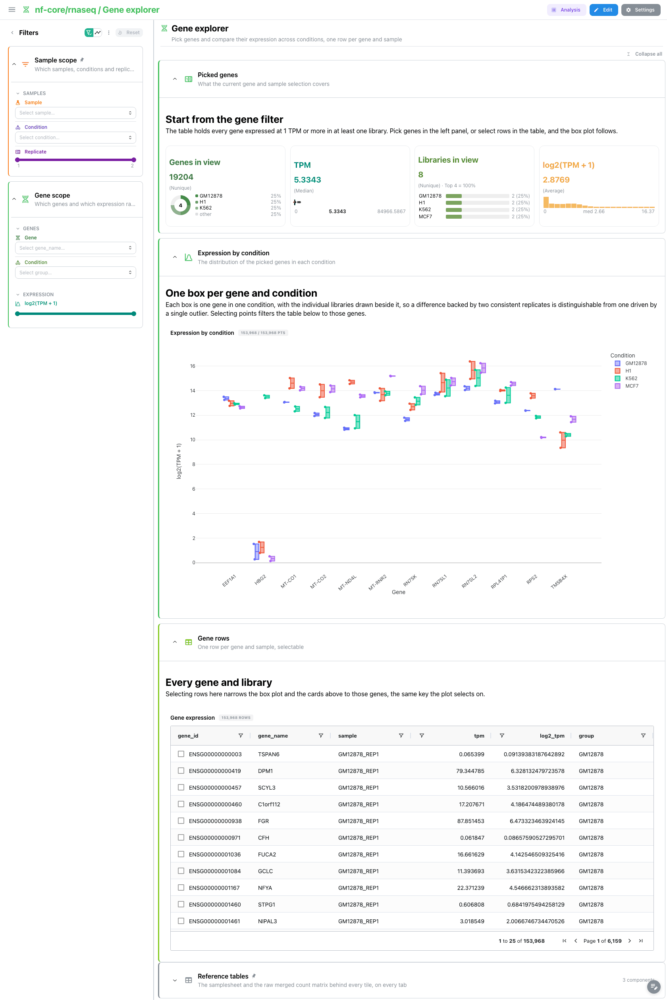

<div class="template-banner">
  <a class="template-banner-logo" href="https://nf-co.re/rnaseq" target="_blank" title="nf-core/rnaseq on nf-co.re">
    
    
  </a>
  <div class="template-banner-body">
    <h1 class="template-title">Bulk RNA-seq</h1>
    <p class="template-subtitle">The STAR + Salmon route of a bulk RNA-seq run: the pipeline's own MultiQC funnel, then the merged Salmon TPM matrix read three ways, from the sample space down to a single gene.</p>
    <p class="template-links">
      <a href="https://nf-co.re/rnaseq" target="_blank"><i class="mdi mdi-open-in-new"></i> nf-co.re</a>
      <a href="https://github.com/nf-core/rnaseq" target="_blank"><i class="mdi mdi-github"></i> GitHub</a>
    </p>
  </div>
  <span class="template-status-experimental template-banner-badge" data-tooltip="Experimental — shared as-is. Feedback and PRs welcome."><i class="mdi mdi-flask-outline"></i> Experimental</span>
</div>

The rnaseq template covers the default STAR + Salmon route of a standard
nf-core/rnaseq run:

- :material-chart-box-outline: **MultiQC funnel**: FastQC before and after trimming, STAR, samtools, Picard, then RSeQC and Qualimap
- :material-chart-scatter-plot: **Sample space**: a PCA of the merged Salmon TPMs, beside the pipeline's own DESeq2 sample distances
- :material-grid: **Expression heatmap**: the 500 most variable genes, clustered, with the condition annotation on top
- :material-dna: **Gene explorer**: pick genes and compare them across conditions, one row per gene and library
- :material-table: **Reference tables**: the samplesheet and the raw merged count matrix, pinned to the bottom of every tab

!!! info "The STAR + Salmon route"
    This template binds the pipeline default: STAR for alignment, Salmon for
    quantification, with the merged matrices read from `star_salmon/`. A
    `--skip_alignment` run writes the same file names under `salmon/`; pass
    `--var PSEUDOALIGNER_ONLY=true` and the expression collections are repointed
    there. Nothing else about the dashboard changes.

!!! note "The condition comes from the sample name"
    The nf-core/rnaseq samplesheet is `sample,fastq_1,fastq_2,strandedness` and
    has no condition column. A project-local recipe derives `condition` and
    `replicate` from the `<condition>_REP<n>` names the pipeline's own test data
    and docs use, because that is an nf-core/rnaseq convention rather than a
    Salmon one. Names that do not follow it give one condition per sample, which
    dulls the colouring but breaks nothing.

---

## Quick start

=== "Point at a finished run"

    ```bash
    depictio run \
      --template nf-core/rnaseq/latest \
      --data-root /path/to/rnaseq_results/aligner_star_salmon
    ```

    `--data-root` is the only thing you have to pass. The samplesheet is
    auto-detected from `{DATA_ROOT}/input/`; pass `--var SAMPLESHEET_FILE=...`
    to point somewhere else.

=== "From the pipeline itself (v1.10.0+)"

    ```bash
    depictio-cli config nextflow --install     # once per machine
    nextflow run nf-core/rnaseq -profile docker --outdir results
    ```

    No `depictio run`, and no template named: the pipeline ingests its own
    output directory when it finishes and resolves this template from its own
    manifest. See [Nextflow trigger](../../depictio-cli/nextflow-trigger.md).

!!! warning "`--data-root` is one aligner route, not the run root"
    A run that publishes more than one aligner (the nf-core megatest publishes
    `aligner_star_salmon/` and `aligner_star_rsem/` side by side) writes a
    complete output tree per route, each with its own `multiqc/`, `star_salmon/`
    and `salmon/`. Point `--data-root` at **one** of those directories: at the
    prefix root every scan becomes ambiguous between the routes, and the MultiQC
    scan attaches whichever report the walk reached first. A normal
    single-aligner run has no such split, so its `results/` is already right.

---

## :material-book-open-variant: Reference

The template reads one MultiQC report and one merged expression matrix. The
`salmon` catalog recipes reshape `star_salmon/salmon.merged.gene_tpm.tsv` three
ways: one row per library (PCA coordinates, detection counts, median TPM), the
500 most variable genes wide with a condition annotation strip, and one row per
gene and sample. The merged count matrix ships as rows only.

MultiQC 1.33 wrote this pipeline's report one directory deeper and with a
different suffix, `multiqc/star_salmon/multiqc_report_data/` rather than
`multiqc/multiqc_data/`. The template pins that literal path in its scan
pattern, because a bare basename would attach whichever nested report the walk
found first.

!!! info "Self-adapting layout"
    The dashboard adapts to whatever the run actually produced: components bound
    to pruned or unparsed data collections are hidden, tabs left with no real
    visualizations are dropped entirely, and the remaining components are
    re-packed so there are no empty rows. `SKIP_MULTIQC` and
    `SKIP_QUANTIFICATION_MERGE` prune the QC and the expression side.

=== ":material-tag-check-outline: 3.26.0 (latest)"

    --8<-- "pipeline-templates/nf-core/_generated/rnaseq-latest.md"

---

## :material-view-dashboard-outline: Dashboard tabs

Four tabs, read as a funnel: are the libraries usable, how do they relate to
each other, which genes drive that, and what does any one gene do. Each tab
below carries the **same icon and colour the dashboard gives it**, so the page
and the app read alike. The `Sample scope` filter group is persistent and pinned
to the top of every tab, and `Reference tables` is pinned to the bottom of every
tab.

=== ":material-chart-box-outline:{ .mc-orange } QC"

    *The pipeline in the order it ran, from raw reads to quantified libraries.*

    [](../../images/pipeline-templates/nf-core/rnaseq/qc_light.png){target="_blank" rel="noopener"}

    Four design cards open the tab, then FastQC on the raw reads beside Trim
    Galore's filtered counts and FastQC again after trimming. `Quantification and
    strandedness` is where the two most common failures show: a library whose
    inferred strandedness disagrees with the sheet was quantified against the
    wrong library type, and everything downstream of it is suspect. The collapsed
    `Transcript QC` section adds coverage and duplication, including dupRadar,
    which nf-core/rnaseq feeds to MultiQC as custom content rather than as a
    module of its own.

    ??? abstract ":material-tune-variant: Filters and components"

        **Filters** · `Sample`, `Condition` and a `Replicate` range on
        `samplesheet`, persistent and pinned to the top of every tab.

        | Section | What it holds |
        |---|---|
        | Run at a glance | 4 cards |
        | Read quality | 5 MultiQC panels |
        | Alignment | 3 MultiQC panels |
        | Quantification and strandedness | 4 MultiQC panels |
        | Transcript QC | 5 MultiQC panels |
        | Reference tables | *Samplesheet*, *Merged gene counts* |

=== ":material-chart-scatter-plot:{ .mc-cyan } Expression overview"

    *Where the libraries sit relative to each other, computed from the merged TPMs.*

    [](../../images/pipeline-templates/nf-core/rnaseq/expression_overview_light.png){target="_blank" rel="noopener"}

    The signature panel is a PCA of the log2(TPM + 1) matrix over its most
    variable genes, one point per library, coloured by condition, with lasso
    selection on `sample_id`. Replicates of one condition should sit together and
    away from the others; a library that lands with the wrong group is the one to
    take back to the QC tab. The pipeline's own DESeq2 sample-similarity heatmap
    beside it gives the same structure computed a different way, and the library
    summary table selects on the same column, so points and rows drive each
    other.

    ??? abstract ":material-tune-variant: Filters and components"

        **Filters** · `Condition`, plus `Genes expressed` and `Median TPM` ranges
        on `sample_overview`, in a collapsed *Library scope* group.

        | Section | What it holds |
        |---|---|
        | Libraries at a glance | 4 cards |
        | Sample relationships | *Sample PCA on Salmon TPMs*, *Sample correlation heatmap*, *Library summary* |
        | Library composition | *Biotype composition*, *Genes expressed per library* |

=== ":material-grid:{ .mc-grape } Expression heatmap"

    *The 500 most variable genes, clustered, with the condition annotation on top.*

    [](../../images/pipeline-templates/nf-core/rnaseq/expression_heatmap_light.png){target="_blank" rel="noopener"}

    One panel, doing one thing. Rows are z-normalised on the log2(TPM + 1) scale,
    which is what makes the heatmap about pattern rather than magnitude: without
    it the plot is a ranking of highly expressed genes, with it the replicates of
    one condition form a visible block. The collapsed `Matrix rows` section holds
    the same matrix as an ordinary table, one gene per row.

    ??? abstract ":material-tune-variant: Filters and components"

        **Filters** · `Sample` and `Condition` on `samplesheet`, in a collapsed
        *Heatmap scope* group. The matrix is wide, so the sample ids are column
        names rather than row values and these filters narrow it by column.

        | Section | What it holds |
        |---|---|
        | Top variable genes | *Top 500 variable genes* |
        | Matrix rows | *Top variable gene matrix* |

=== ":material-dna:{ .mc-green } Gene explorer"

    *One gene at a time, compared across conditions.*

    [](../../images/pipeline-templates/nf-core/rnaseq/gene_explorer_light.png){target="_blank" rel="noopener"}

    Start from the `Gene` filter. With no gene picked the panels describe every
    gene-sample row in the run, which is a distribution of the whole
    transcriptome rather than a comparison. Once genes are picked, the figure
    draws one box per gene and condition from the twelve highest-expressed genes
    left after filtering, and selecting boxes filters on `gene_name`, the same
    column the table below selects on.

    ??? abstract ":material-tune-variant: Filters and components"

        **Filters** · `Gene`, `Condition` and a `log2(TPM + 1)` range on
        `gene_expression`.

        | Section | What it holds |
        |---|---|
        | Picked genes | 4 cards |
        | Expression by condition | *Expression by condition* |
        | Gene rows | *Gene expression* |

---

## Running the pipeline

Depictio reads the **output** of nf-core/rnaseq, it does not run the pipeline.
Run the pipeline first:

```bash
nextflow run nf-core/rnaseq \
  --input samplesheet.csv \
  --genome GRCh38 \
  --outdir results \
  -profile docker
```

Then point Depictio at the results:

```bash
depictio run --template nf-core/rnaseq/latest \
  --data-root results/
```

Non-default routes need their flag by hand, since the CLI does not yet read
rnaseq's own `params.json` for them: `--var PSEUDOALIGNER_ONLY=true` for
`--skip_alignment`, `--var SKIP_MULTIQC=true` for `--skip_multiqc` or
`--skip_qc`, `--var SKIP_QUANTIFICATION_MERGE=true` for the merge.

See [nf-co.re/rnaseq/usage](https://nf-co.re/rnaseq/3.26.0/docs/usage) for full
pipeline documentation.

---

## Required data structure

Point `--data-root` at one aligner route directory. Depictio scans recursively
and matches on file name, except for the MultiQC report, whose path is pinned.

```text
<DATA_ROOT>/                                    # one aligner route, e.g. aligner_star_salmon/
├── input/
│   └── samplesheet.csv                         # --var SAMPLESHEET_FILE (auto-detected)
├── pipeline_info/
│   ├── params.json
│   └── software_versions.yml
├── multiqc/
│   └── star_salmon/
│       └── multiqc_report_data/
│           └── multiqc.parquet                 # pinned literal path
├── star_salmon/
│   ├── salmon.merged.gene_tpm.tsv              # every expression panel
│   ├── salmon.merged.gene_counts.tsv           # pinned reference table
│   ├── deseq2_qc/                              # PCA values, sample distances, size factors
│   └── featurecounts/                          # biotype tables MultiQC renders
├── salmon/                                     # read instead with PSEUDOALIGNER_ONLY=true
│   ├── salmon.merged.gene_tpm.tsv
│   └── salmon.merged.gene_counts.tsv
└── trimgalore/
    └── *_trimming_report.txt
```

---

## Test data

The repository ships
[`download_test_data.sh`](https://github.com/depictio/depictio/blob/main/depictio/projects/nf-core/rnaseq/3.26.0/download_test_data.sh),
which fetches the subset of nf-core's AWS megatest run that the template needs:

```bash
bash depictio/projects/nf-core/rnaseq/3.26.0/download_test_data.sh \
  /tmp/rnaseq_test
```

The run is
`s3://nf-core-awsmegatests/rnaseq/results-e7ca46272c8f9d5ceee3f71759f4ba551d3217a4/`:
eight libraries from four ENCODE cell lines, two replicates each, human GRCh37,
Trim Galore then STAR + Salmon. The manifest fetches only the
`aligner_star_salmon/` route and mirrors it below the destination, so the
directory the script writes is already the right `--data-root`. The samplesheet
is not part of the published run; `post_fetch_help` in `megatest.yaml` next to
the script gives the `curl` that puts it under `input/`.

Then run Depictio against it:

```bash
depictio run \
  --template nf-core/rnaseq/latest \
  --data-root /tmp/rnaseq_test
```

---

## Additional resources

- [nf-co.re/rnaseq](https://nf-co.re/rnaseq): official pipeline documentation
- [nf-co.re/rnaseq/3.26.0/results](https://nf-co.re/rnaseq/3.26.0/results): AWS test results
- [Template System Reference](../../usage/projects/templates.md): YAML format, variables, conditionals
- [Recipes](../../usage/projects/recipes.md): how to read, test, and write recipes
