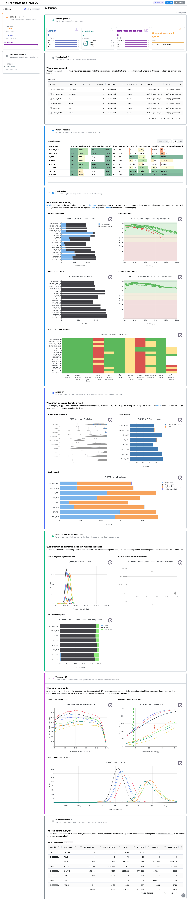
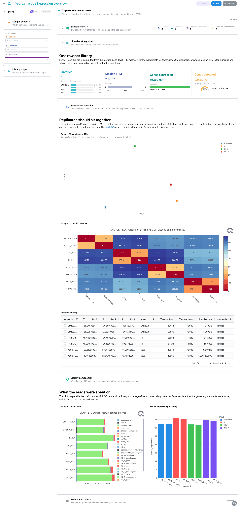
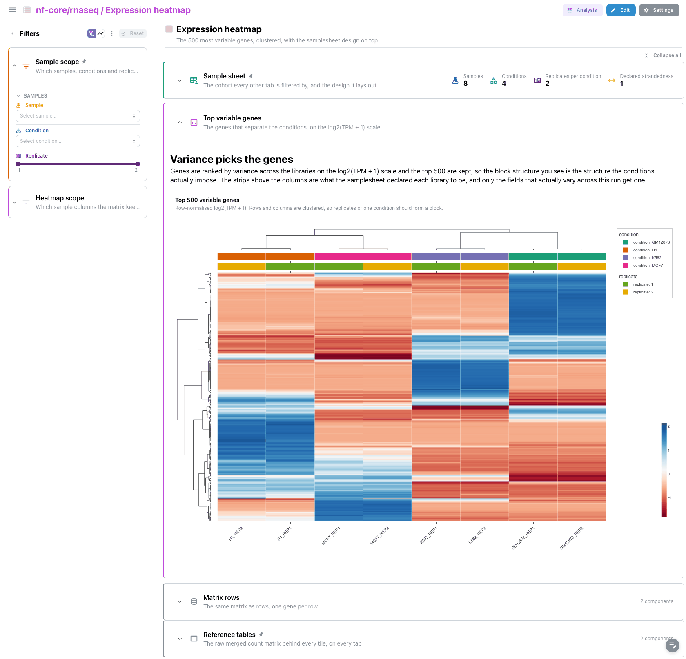
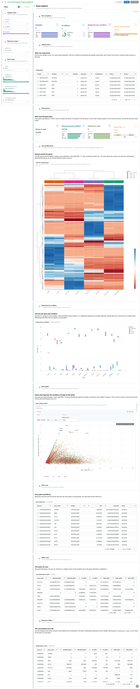

<div class="template-banner">
  <a class="template-banner-logo" href="https://nf-co.re/rnaseq" target="_blank" title="nf-core/rnaseq on nf-co.re">
    
    
  </a>
  <div class="template-banner-body">
    <h1 class="template-title">Bulk RNA-seq</h1>
    <p class="template-subtitle">The STAR + Salmon route of a bulk RNA-seq run: the pipeline's own MultiQC funnel, then the merged Salmon TPM matrix read three ways, from the sample space down to a single gene.</p>
    <p class="template-links">
      <a href="https://nf-co.re/rnaseq" target="_blank"><i class="mdi mdi-open-in-new"></i> nf-co.re</a>
      <a href="https://github.com/nf-core/rnaseq" target="_blank"><i class="mdi mdi-github"></i> GitHub</a>
    </p>
  </div>
  <span class="template-status-draft template-banner-badge" data-tooltip="Draft: generated and not yet reviewed. Expect it to need fixes before it is usable."><i class="mdi mdi-pencil-outline"></i> Draft</span>
</div>

<div class="tpl-version-pick" data-latest="3.26.0">
  <span class="tpl-version-icon"><i class="mdi mdi-source-branch"></i></span>
  <span class="tpl-version-label">Template version</span>
  <select id="tpl-version" class="tpl-version-select" aria-label="Template version">
    <option value="3.26.0" selected>3.26.0</option>
  </select>
  <span class="tpl-version-badge">latest</span>
</div>

The rnaseq template covers the default STAR + Salmon route of a standard
nf-core/rnaseq run:

- :material-compass-outline: **Overview**: the run in four key figures, live findings and four figures, each linked to the tab that explains it
- :material-chart-box-outline: **Data & QC**: the MultiQC report, a per-library QC profile with the RSeQC read distribution, and the pipeline's own DESeq2 QC PCA beside the sample distances
- :material-dna: **Expression**: the 500 most variable genes, clustered, the most variable ones per condition, and a mean-variance plane with a record card per gene

!!! info "The STAR + Salmon route"
    This template binds the pipeline default: STAR for alignment, Salmon for
    quantification, with the merged matrices read from `star_salmon/`. A
    `--skip_alignment` run writes the same file names under `salmon/`; pass
    `--var PSEUDOALIGNER_ONLY=true` and the expression collections are repointed
    there. The STAR, samtools, Picard, Qualimap and RSeQC tiles then have nothing
    to show, and the RSeQC figure drops.

!!! note "The condition comes from the sample name"
    The nf-core/rnaseq samplesheet is `sample,fastq_1,fastq_2,strandedness` and
    has no condition column. A project-local recipe derives `condition` and
    `replicate` from the `<condition>_REP<n>` names the pipeline's own test data
    and docs use, because that is an nf-core/rnaseq convention rather than a
    Salmon one. Names that do not follow it give one condition per sample, which
    dulls the colouring but breaks nothing.

---

## :material-rocket-launch-outline: Quick start

=== "Point at a finished run"

    ```bash
    depictio ingest /path/to/rnaseq_results/aligner_star_salmon \
      --template nf-core/rnaseq/latest
    ```

    The results directory is the only thing you have to pass. The samplesheet is
    auto-detected from `{DATA_ROOT}/input/`; pass `--var SAMPLESHEET_FILE=...`
    to point somewhere else.

=== "From the pipeline itself (v1.10.0+)"

    ```bash
    depictio config nextflow --install     # once per machine
    nextflow run nf-core/rnaseq -profile docker --outdir results
    ```

    No `depictio ingest`, and no template named: the pipeline ingests its own
    output directory when it finishes and resolves this template from its own
    manifest. See [Nextflow trigger](../../depictio-cli/nextflow-trigger.md).

!!! warning "The results directory is one aligner route, not the run root"
    A run that publishes more than one aligner (the nf-core megatest publishes
    `aligner_star_salmon/` and `aligner_star_rsem/` side by side) writes a
    complete output tree per route, each with its own `multiqc/`, `star_salmon/`
    and `salmon/`. Point `depictio ingest` at **one** of those directories: at the
    prefix root every scan becomes ambiguous between the routes, and the MultiQC
    scan attaches whichever report the walk reached first. A normal
    single-aligner run has no such split, so its `results/` is already right.

---

## :material-book-open-variant: Reference

The template reads one MultiQC report and one merged expression matrix. The
`salmon` catalog recipes reshape `star_salmon/salmon.merged.gene_tpm.tsv` three
ways: one row per library (PCA coordinates, detection counts, median TPM), the
500 most variable genes wide with a condition annotation strip, and one row per
gene and sample. The merged count matrix ships as rows only.

MultiQC 1.33 wrote this pipeline's report one directory deeper and with a
different suffix, `multiqc/star_salmon/multiqc_report_data/` rather than
`multiqc/multiqc_data/`. The template pins that literal path in its scan
pattern, because a bare basename would attach whichever nested report the walk
found first.

!!! info "Self-adapting layout"
    The dashboard adapts to whatever the run actually produced: components bound
    to pruned or unparsed data collections are hidden, tabs left with no real
    visualizations are dropped entirely, and the remaining components are
    re-packed so there are no empty rows. `SKIP_MULTIQC` and
    `SKIP_QUANTIFICATION_MERGE` prune the QC and the expression side.

<div class="tpl-version-block" data-version="3.26.0" markdown>

--8<-- "pipeline-templates/nf-core/_generated/rnaseq-latest.md"

</div>

---

## :material-view-dashboard-outline: Dashboard tabs

One dashboard: the **Overview**, then five child tabs in two groups, read as a
funnel from the run to the genes that vary between conditions. Each tab below
carries the **same icon and colour the dashboard gives it**, so the page and the
app read alike.

| Group | Tabs |
|---|---|
| Data & QC | MultiQC, Library QC, Sample Space |
| Expression | Variable Genes, Gene Explorer |

Each child tab opens with a short intro and a strip of four cards, then at most
three open sections; tables and details follow, collapsed. The persistent *Sample
filters* (condition, sample, replicate) sit in the left panel and narrow every tab
through the samplesheet links. The *Sample sheet* is pinned, collapsed, to the
bottom of every child tab. nf-core/rnaseq runs no differential test: the gene
numbers are rankings, by spread across the libraries or by the lead of one
condition, and every tile that shows one says so.

=== ":material-compass-outline: Overview"

    *Bulk RNA-seq, from reads to the genes that vary between conditions.*

    <!-- screenshot pending v2 -->

    A short hero links the run parameters. *About this dashboard* says how to move
    through the tabs, *The run* lists the samples, genome, aligner and trimmer, and
    *Pipeline* walks the six steps from trimming to annotation, each linked to its
    parameters and its tab. The findings are live values: they follow the filters,
    and a route that lacks their data drops them.

    ??? abstract ":material-tune-variant: Filters and components"

        **Filters** · the left panel starts collapsed. *Key figures* and
        *Findings* each have their own filter bar (condition and sample id): each
        narrows its own section only.

        | Section | What it holds |
        |---|---|
        | Top | Hero, *About this dashboard*, *The run*, *Pipeline* |
        | Key figures | 4 headline cards: samples, genes expressed, genes two-fold in one condition, uniquely mapped share |
        | Findings | Live result rows, then 4 figures: the most variable genes per condition, the clustered sample distances, the mean-variance plane and the RSeQC read distribution |
        | How to read this dashboard | The tabs by group, each with its question |

=== "{ width=18 }{ width=18 } MultiQC"

    **Data & QC** · *Did trimming, alignment and quantification work for every library?*

    [{ loading=lazy }](../../images/pipeline-templates/nf-core/rnaseq/multiqc_light.png){ .tpl-shot target="_blank" rel="noopener" }

    MultiQC panels only. Open: general statistics, the raw read counts beside the
    reads Trim Galore kept, STAR's summary beside samtools percent mapped, then the
    strandedness inference beside the biotype composition. A library whose inferred
    strandedness disagrees with the sheet was quantified against the wrong library
    type. Read quality, alignment details and transcript QC are collapsed.

    ??? abstract ":material-tune-variant: Filters and components"

        **Filters** · `Sample ID`, read from the MultiQC report.

        | Section | What it holds |
        |---|---|
        | QC overview | 5 MultiQC panels |
        | Quantification and strandedness | 2 MultiQC panels |
        | Read quality (collapsed) | 3 MultiQC panels |
        | Alignment details (collapsed) | 3 MultiQC panels |
        | Transcript QC (collapsed) | 3 MultiQC panels |

=== ":material-shield-check-outline:{ .mc-blue } Library QC"

    **Data & QC** · *Which library stands apart on mapping, duplication or read placement?*

    <!-- screenshot pending v2 -->

    Reads received by STAR, the uniquely mapped share on a gauge, the duplication
    share and the exonic share. Then eleven MultiQC general statistics as parallel
    coordinates, one line per library coloured by condition, and the RSeQC read
    distribution per library. A library that bends away from its replicates on
    several axes is the odd one out.

    ??? abstract ":material-tune-variant: Filters and components"

        **Filters** · `Uniquely mapped (%)` and `Duplication (%)` ranges on
        `general_stats`.

        | Section | What it holds |
        |---|---|
        | QC at a glance | 4 cards |
        | Library QC profile | 1 advanced visualization |
        | Read distribution | 1 advanced visualization |

=== ":material-chart-scatter-plot:{ .mc-cyan } Sample Space"

    **Data & QC** · *Do the replicates of each condition sit together?*

    [{ loading=lazy }](../../images/pipeline-templates/nf-core/rnaseq/expression_overview_light.png){ .tpl-shot target="_blank" rel="noopener" }

    Libraries by condition, genes expressed, genes detected and the median TPM,
    from the merged Salmon TPM matrix. Then the pipeline's own DESeq2 QC PCA beside
    the sample distances it clusters on. Replicates of one condition should sit
    together in both. The collapsed library summary has a record card for the row
    you pick.

    ??? abstract ":material-tune-variant: Filters and components"

        **Filters** · `Genes expressed` and `Median TPM` ranges on
        `sample_overview`.

        | Section | What it holds |
        |---|---|
        | Libraries at a glance | 4 cards |
        | Sample relationships | 2 advanced visualizations |
        | Library summary (collapsed) | *Library summary* + a library record card |

=== ":material-chart-box-outline:{ .mc-grape } Variable Genes"

    **Expression** · *Which genes vary most between the libraries and conditions?*

    [{ loading=lazy }](../../images/pipeline-templates/nf-core/rnaseq/expression_heatmap_light.png){ .tpl-shot target="_blank" rel="noopener" }

    The genes in view, their median log2(TPM + 1), the genes two-fold higher in
    one condition and the highest TPM. Then the 500 most variable genes as a
    clustered heatmap with the design on top, and the most variable genes in view
    as one box per condition. Variance ranks these genes, not significance.

    ??? abstract ":material-tune-variant: Filters and components"

        **Filters** · a `Top variable gene` picker on `expression_heatmap` and a
        `log2(TPM + 1)` range on `gene_expression`.

        | Section | What it holds |
        |---|---|
        | Genes at a glance | 4 cards |
        | Top variable genes | 1 advanced visualization |
        | Expression by condition | *Expression by condition* |
        | Matrix rows (collapsed) | *Top variable gene matrix* |

=== ":material-dna:{ .mc-green } Gene Explorer"

    **Expression** · *Where does a gene sit, and which condition does it peak in?*

    <!-- screenshot pending v2 -->

    [{ loading=lazy }](../../images/pipeline-templates/nf-core/rnaseq/gene_explorer_light.png){ .tpl-shot target="_blank" rel="noopener" }

    The expressed genes by the condition they peak in, their mean level, their
    spread and the lead of the top condition. Then the mean-variance plane, one
    point per expressed gene coloured by the condition it peaks in, beside the
    record card of the gene you click; its id links to Ensembl. The gene rows and
    the merged count matrix are collapsed below.

    ??? abstract ":material-tune-variant: Filters and components"

        **Filters** · a `Gene` picker and a `Mean log2(TPM + 1)` range on
        `gene_summary`.

        | Section | What it holds |
        |---|---|
        | Expression at a glance | 4 cards |
        | Mean-variance plane | 1 advanced visualization + a gene record card |
        | Gene rows (collapsed) | *Gene expression* |
        | Count matrix (collapsed) | *Merged gene counts* |

---

## :material-play-circle-outline: Running the pipeline

Depictio reads the **output** of nf-core/rnaseq, it does not run the pipeline.
Run the pipeline first:

```bash
nextflow run nf-core/rnaseq \
  --input samplesheet.csv \
  --genome GRCh38 \
  --outdir results \
  -profile docker
```

Then point Depictio at the results:

```bash
depictio ingest results/ \
  --template nf-core/rnaseq/latest
```

Non-default routes need their flag by hand, since the CLI does not yet read
rnaseq's own `params.json` for them: `--var PSEUDOALIGNER_ONLY=true` for
`--skip_alignment`, `--var SKIP_MULTIQC=true` for `--skip_multiqc` or
`--skip_qc`, `--var SKIP_QUANTIFICATION_MERGE=true` for the merge.

See [nf-co.re/rnaseq/usage](https://nf-co.re/rnaseq/3.26.0/docs/usage) for full
pipeline documentation.

---

## :material-folder-open-outline: Required data structure

Point `depictio ingest` at one aligner route directory. Depictio scans recursively
and matches on file name, except for the MultiQC report, whose path is pinned.

```text
<DATA_ROOT>/                                    # one aligner route, e.g. aligner_star_salmon/
├── input/
│   └── samplesheet.csv                         # --var SAMPLESHEET_FILE (auto-detected)
├── pipeline_info/
│   ├── params.json
│   └── software_versions.yml
├── multiqc/
│   └── star_salmon/
│       └── multiqc_report_data/
│           └── multiqc.parquet                 # pinned literal path
├── star_salmon/
│   ├── salmon.merged.gene_tpm.tsv              # every expression panel
│   ├── salmon.merged.gene_counts.tsv           # Gene Explorer count matrix
│   ├── deseq2_qc/                              # PCA values, sample distances, size factors
│   └── featurecounts/                          # biotype tables MultiQC renders
├── salmon/                                     # read instead with PSEUDOALIGNER_ONLY=true
│   ├── salmon.merged.gene_tpm.tsv
│   └── salmon.merged.gene_counts.tsv
└── trimgalore/
    └── *_trimming_report.txt
```

---

## :material-flask-outline: Test data

The repository ships
[`download_test_data.sh`](https://github.com/depictio/depictio/blob/main/depictio/projects/nf-core/rnaseq/3.26.0/download_test_data.sh),
which fetches the subset of nf-core's AWS megatest run that the template needs:

```bash
bash depictio/projects/nf-core/rnaseq/3.26.0/download_test_data.sh \
  /tmp/rnaseq_test
```

The run is
`s3://nf-core-awsmegatests/rnaseq/results-e7ca46272c8f9d5ceee3f71759f4ba551d3217a4/`:
eight libraries from four ENCODE cell lines, two replicates each, human GRCh37,
Trim Galore then STAR + Salmon. The manifest fetches only the
`aligner_star_salmon/` route and mirrors it below the destination, so the
directory the script writes is already the right results directory. The samplesheet
is not part of the published run; `post_fetch_help` in `megatest.yaml` next to
the script gives the `curl` that puts it under `input/`.

Then run Depictio against it:

```bash
depictio ingest /tmp/rnaseq_test \
  --template nf-core/rnaseq/latest
```

---

## :material-link-variant: Additional resources

- [nf-co.re/rnaseq](https://nf-co.re/rnaseq): official pipeline documentation
- [nf-co.re/rnaseq/3.26.0/results](https://nf-co.re/rnaseq/3.26.0/results): AWS test results
- [Template System Reference](../../usage/projects/templates.md): YAML format, variables, conditionals
- [Recipes](../../usage/projects/recipes.md): how to read, test, and write recipes

---

## :material-account-group-outline: Authorship

<div class="tpl-credits">
  <div class="tpl-credit">
    <span class="tpl-credit-role"><i class="mdi mdi-code-braces"></i> Developers</span>
    <span class="tpl-credit-note">Wrote the template, its recipes and its dashboards.</span>
    <a class="tpl-person" href="https://github.com/weber8thomas" target="_blank" rel="noopener">
       weber8thomas
    </a>
  </div>
  <div class="tpl-credit">
    <span class="tpl-credit-role"><i class="mdi mdi-eye-check-outline"></i> Reviewers</span>
    <span class="tpl-credit-note">Nobody has run it on their own data and signed it off yet, which is what keeps it a Draft.</span>
    <span class="tpl-person"><i class="mdi mdi-account-plus-outline"></i> Open</span>
  </div>
  <div class="tpl-credit">
    <span class="tpl-credit-role"><i class="mdi mdi-wrench-outline"></i> Maintainers</span>
    <span class="tpl-credit-note">Keep it working as nf-core/rnaseq releases.</span>
    <a class="tpl-person" href="https://github.com/weber8thomas" target="_blank" rel="noopener">
       weber8thomas
    </a>
  </div>
</div>

Reviewing a template on your own data, or taking over a role here, is a
contribution in itself: the [contributing guide](../../developer/contributing-templates.md)
says what each one involves.
