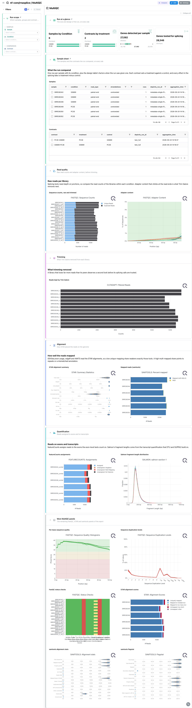
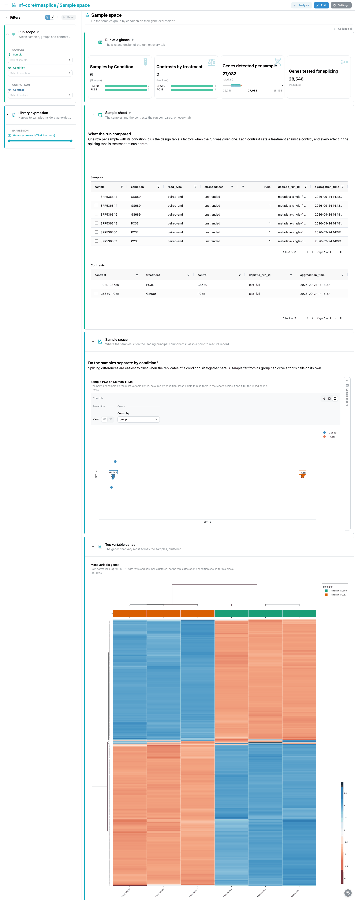
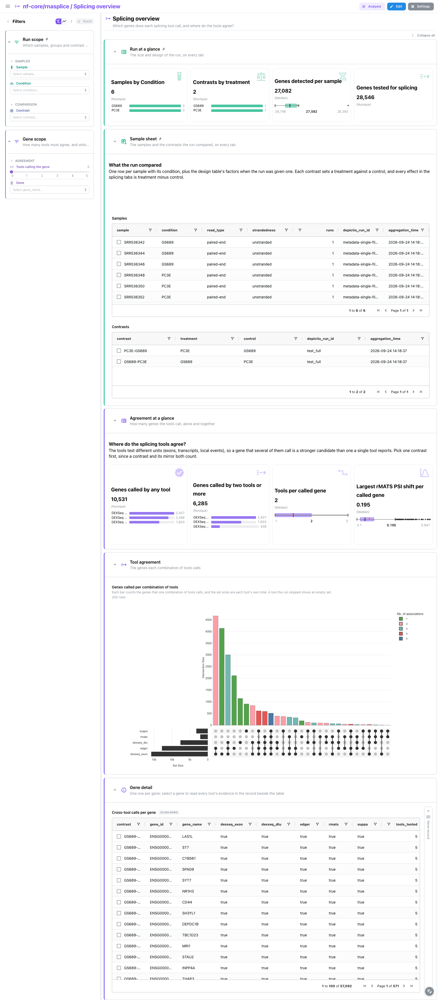
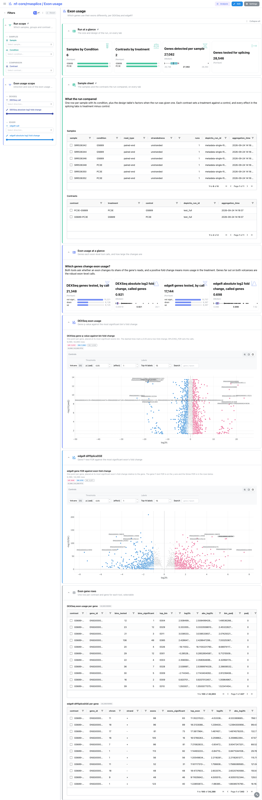
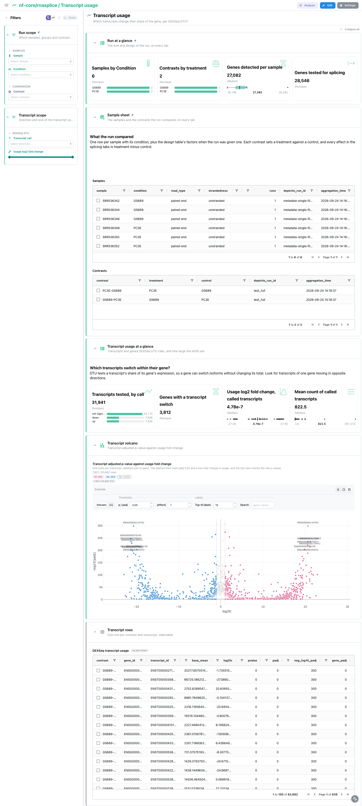
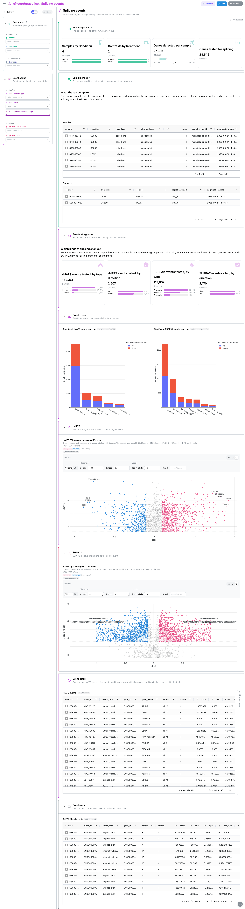

<div class="template-banner">
  <a class="template-banner-logo" href="https://nf-co.re/rnasplice" target="_blank" title="nf-core/rnasplice on nf-co.re">
    
    
  </a>
  <div class="template-banner-body">
    <h1 class="template-title">Alternative Splicing</h1>
    <p class="template-subtitle">RNA-seq QC and sample space, then differential splicing across DEXSeq, edgeR, rMATS and SUPPA2: where the tools agree, exon and transcript usage, and event types, next to the pipeline's own MultiQC report.</p>
    <p class="template-links">
      <a href="https://nf-co.re/rnasplice" target="_blank"><i class="mdi mdi-open-in-new"></i> nf-co.re</a>
      <a href="https://github.com/nf-core/rnasplice" target="_blank"><i class="mdi mdi-github"></i> GitHub</a>
    </p>
  </div>
  <span class="template-status-experimental template-banner-badge" data-tooltip="Experimental: shared as-is. Feedback and PRs welcome."><i class="mdi mdi-flask-outline"></i> Experimental</span>
</div>

<div class="tpl-version-pick" data-latest="1.0.4">
  <span class="tpl-version-icon"><i class="mdi mdi-source-branch"></i></span>
  <span class="tpl-version-label">Template version</span>
  <select id="tpl-version" class="tpl-version-select" aria-label="Template version">
    <option value="1.0.4" selected>1.0.4</option>
  </select>
  <span class="tpl-version-badge">latest</span>
</div>

The rnasplice template follows an nf-core/rnasplice run from the reads to the
splicing calls of up to five tools, one tab per question:

- :material-chart-box-outline: **MultiQC**: FastQC, Trim Galore, STAR, samtools, featureCounts and Salmon, read from the report
- :material-chart-scatter-plot: **Sample space**: whether the samples group by condition on their Salmon expression
- :material-set-merge: **Splicing overview**: which genes each tool calls, and where the tools agree
- :material-chart-scatter-plot: **Exon usage**: DEXSeq and edgeR differential exon usage per gene
- :material-chart-timeline-variant: **Transcript usage**: DEXSeq DTU, transcripts that change their share of the gene
- :material-shape-outline: **Splicing events**: rMATS and SUPPA2 events by type, direction and inclusion change

The `Run scope` filters (sample, condition, contrast) apply to every tab, and
`Run at a glance` and the collapsed `Sample sheet` are pinned to the top. The
contrast sheet is linked to every splicing collection, so one contrast pick
scopes every tab.

!!! warning "MultiQC 1.18 writes no parquet"
    rnasplice 1.0.4 pins MultiQC 1.18, and Depictio reads only
    `multiqc.parquet` (MultiQC 1.31 and later). Rebuild it from the tool outputs
    before ingesting:

    ```bash
    python -m depictio.dev_scripts.multiqc_reprocess --src <outdir> --dest <outdir>/multiqc/multiqc_data
    ```

!!! info "One sign for every tool, every tool optional"
    Effects are oriented treatment minus control across all five tools, so a
    contrast and its mirror give mirrored effects; rnasplice often lists both, so
    pick one. A run that skips a tool drops its collection: its tiles stay empty
    and the agreement UpSet shows an empty set.

---

## :material-rocket-launch-outline: Quick start

=== "Point at a finished run"

    ```bash
    depictio run \
      --template nf-core/rnasplice/latest \
      --data-root /path/to/rnasplice_results
    ```

    `--data-root` is the only thing you have to pass: the validated sample sheet
    always carries `condition`, which `GROUP_COL` defaults to. Add a design table
    with more factors, name the assembly the event loci link to in UCSC, or read
    the pseudo-alignment route:

    ```bash
    depictio run --template nf-core/rnasplice/latest \
      --data-root /path/to/rnasplice_results \
      --var METADATA_FILE=/path/to/design.tsv \
      --var GENOME=hg38 \
      --var QUANT_ROUTE=star_salmon
    ```

=== "From the pipeline itself (v1.10.0+)"

    ```bash
    depictio-cli config nextflow --install     # once per machine
    nextflow run nf-core/rnasplice -r 1.0.4 -profile docker --outdir results
    ```

    No `depictio run`, and no template named: the pipeline ingests its own
    output directory when it finishes and resolves this template from its own
    manifest. See [Nextflow trigger](../../depictio-cli/nextflow-trigger.md).

The calls are thresholded by variables with generic defaults: `SPLICING_FDR`
(0.05) on every tool's adjusted p-value, SUPPA2's empirical p-value included,
`MIN_DPSI` (0.1) on the PSI change of rMATS and SUPPA2 events, and
`RMATS_MIN_READS` (10) mean junction reads per replicate an rMATS event needs in
both conditions.

---

## :material-book-open-variant: Reference

The template reads the MultiQC report, the validated sample and contrast sheets,
the merged Salmon gene TPMs and the result tables of the five splicing tools. A
pipeline-local `splicing_genes` recipe joins the tools into one row per gene,
linked on `gene_id` to every tool collection, so a gene or agreement filter on
the overview reaches the per-tool tabs. 39 of its 82 components carry a `use:`
catalog reference, so a tile says where its panel comes from.

!!! info "Self-adapting layout"
    The dashboard adapts to whatever the run actually produced: components bound
    to pruned or unparsed data collections are hidden, tabs left with no real
    visualizations are dropped entirely, and the remaining components are
    re-packed so there are no empty rows.

<div class="tpl-version-block" data-version="1.0.4" markdown>

--8<-- "pipeline-templates/nf-core/_generated/rnasplice-latest.md"

</div>

---

## :material-view-dashboard-outline: Dashboard tabs

Six tabs, read as a funnel: are the libraries usable, do the samples separate by
condition, which genes the tools call together, and then each level of evidence
in turn: exons, transcripts, events. Each tab below carries the **same icon and
colour the dashboard gives it**. The screenshots come from the run described
under Validation runs below.

=== "{ width=18 }{ width=18 } MultiQC"

    *Are the libraries usable for splicing tests?*

    [{ loading=lazy }](../../images/pipeline-templates/nf-core/rnasplice/multiqc_light.png){ .tpl-shot target="_blank" rel="noopener" }

    The report reads as a funnel of its own: raw read counts and adapters, what
    Trim Galore removed, how STAR and samtools placed the reads, then featureCounts
    assignments and the Salmon fragment length distribution. The remaining FastQC,
    STAR and samtools panels are collapsed at the bottom.

    ??? abstract ":material-tune-variant: Filters and components"

        **Filters** · `Sample`, the `GROUP_COL` group and `Contrast` in the
        persistent *Run scope* group.

        | Section | What it holds |
        |---|---|
        | Run at a glance | 4 cards: samples by group, contrasts by treatment, genes detected per sample, genes tested for splicing |
        | Sample sheet | *Samples*, *Contrasts* (collapsed, pinned) |
        | Read quality | *Sequence counts, raw and trimmed*, *Adapter content* |
        | Trimming | *Reads kept by Trim Galore* |
        | Alignment | *STAR alignment summary*, *Mapped reads (samtools)* |
        | Quantification | *featureCounts assignments*, *Salmon fragment length distribution* |
        | More MultiQC panels | 6 MultiQC panels (collapsed) |

=== ":material-chart-scatter-plot:{ .mc-cyan } Sample space"

    *Do the samples group by condition on their gene expression?*

    [{ loading=lazy }](../../images/pipeline-templates/nf-core/rnasplice/sample_space_light.png){ .tpl-shot target="_blank" rel="noopener" }

    A PCA on the Salmon TPMs places the samples on the leading components, beside a
    linked `Sample record` that folds to a slim rail until a point is lassoed. A
    clustered heatmap of the most variable genes follows. A sample that sits with
    the other condition here will blur every splicing test downstream.

    ??? abstract ":material-tune-variant: Filters and components"

        **Filters** · a `Genes expressed (TPM 1 or more)` range in a *Library
        expression* group.

        | Section | What it holds |
        |---|---|
        | Sample space | *Sample PCA on Salmon TPMs*, *Sample record* |
        | Top variable genes | *Most variable genes* |
        | Sample rows | *Sample PCA and expression summary* (collapsed) |

=== ":material-set-merge:{ .mc-violet } Splicing overview"

    *Which genes does each splicing tool call, and where do the tools agree?*

    [{ loading=lazy }](../../images/pipeline-templates/nf-core/rnasplice/splicing_overview_light.png){ .tpl-shot target="_blank" rel="noopener" }

    An UpSet counts the genes called by each combination of the five tools, and
    cards give the genes called by any tool, by two or more, and the largest rMATS
    PSI shift. The cross-tool table sits beside a linked `Gene record` that stays a
    slim rail until a gene is picked, then lays out every tool's evidence for it.
    The gene and agreement filters of this tab reach the per-tool tabs through the
    gene links.

    ??? abstract ":material-tune-variant: Filters and components"

        **Filters** · a `Tools calling the gene` slider and a `Gene` pick in a
        *Gene scope* group.

        | Section | What it holds |
        |---|---|
        | Agreement at a glance | 4 cards |
        | Tool agreement | *Genes called per combination of tools* |
        | Gene detail | *Cross-tool calls per gene*, *Gene record* |

=== ":material-chart-scatter-plot:{ .mc-indigo } Exon usage"

    *Which genes use their exons differently, per DEXSeq and edgeR?*

    [{ loading=lazy }](../../images/pipeline-templates/nf-core/rnasplice/exon_usage_light.png){ .tpl-shot target="_blank" rel="noopener" }

    One volcano per tool: the DEXSeq per-gene q-value against the fold change of
    the gene's most significant bin, and the edgeR `diffSpliceDGE` gene F-test FDR
    against the fold change of its most significant exon. Cards split the tested
    genes by call and give the absolute fold change of the called ones. The gene
    tables at the bottom select on `gene_id`.

    ??? abstract ":material-tune-variant: Filters and components"

        **Filters** · `DEXSeq call`, `edgeR call` and one absolute log2 fold
        change range per tool, in an *Exon usage scope* group.

        | Section | What it holds |
        |---|---|
        | Exon usage at a glance | 4 cards |
        | DEXSeq exon usage | *DEXSeq gene q-value against bin fold change* |
        | edgeR diffSpliceDGE | *edgeR gene FDR against exon fold change* |
        | Exon gene rows | *DEXSeq exon usage per gene*, *edgeR diffSpliceDGE per gene* (collapsed) |

=== ":material-chart-timeline-variant:{ .mc-teal } Transcript usage"

    *Which transcripts switch their share within their gene?*

    [{ loading=lazy }](../../images/pipeline-templates/nf-core/rnasplice/transcript_usage_light.png){ .tpl-shot target="_blank" rel="noopener" }

    DEXSeq DTU tests each transcript's share of its gene on the Salmon counts of the
    chosen `QUANT_ROUTE`. The volcano puts the transcript adjusted p-value against
    the usage fold change, and cards count the transcripts called and the genes with
    a switch. The transcript table selects on `gene_id`.

    ??? abstract ":material-tune-variant: Filters and components"

        **Filters** · `Transcript call` and a `Usage log2 fold change` range in a
        *Transcript scope* group.

        | Section | What it holds |
        |---|---|
        | Transcript usage at a glance | 4 cards |
        | Transcript volcano | *Transcript adjusted p-value against usage fold change* |
        | Transcript rows | *DEXSeq transcript usage* (collapsed) |

=== ":material-shape-outline:{ .mc-grape } Splicing events"

    *Which event types change, and by how much inclusion, per rMATS and SUPPA2?*

    [{ loading=lazy }](../../images/pipeline-templates/nf-core/rnasplice/splicing_events_light.png){ .tpl-shot target="_blank" rel="noopener" }

    Stacked bars count the significant events per type (skipped exon, retained
    intron, alternative 3' and 5' sites, mutually exclusive exons) and direction for
    each tool, and one volcano per tool plots significance against the PSI change.
    The rMATS event table sits beside a linked `Event record` that folds to a slim
    rail until an event is picked, then shows its junction coverage and inclusion
    per condition with a UCSC link to the locus in the `GENOME` assembly.

    ??? abstract ":material-tune-variant: Filters and components"

        **Filters** · event type, call and absolute PSI change for rMATS, event
        type and call for SUPPA2, in an *Event scope* group.

        | Section | What it holds |
        |---|---|
        | Events at a glance | 4 cards |
        | Event types | *Significant rMATS events per type*, *Significant SUPPA2 events per type* |
        | rMATS | *rMATS FDR against inclusion difference* |
        | SUPPA2 | *SUPPA2 p-value against delta PSI* |
        | Event detail | *rMATS events*, *Event record* |
        | Event rows | *SUPPA2 local events* (collapsed) |

---

## :material-play-circle-outline: Running the pipeline

Depictio reads the **output** of nf-core/rnasplice, it does not run the
pipeline. Run the pipeline first, with a contrast sheet and the splicing tools
you want (each has its own switch: `--dexseq_exon`, `--edger_exon`,
`--dexseq_dtu`, `--rmats`, `--suppa`):

```bash
nextflow run nf-core/rnasplice -r 1.0.4 \
  --input samplesheet.csv \
  --contrasts contrastsheet.csv \
  --genome GRCh38 \
  --outdir results -profile docker
```

Then rebuild the MultiQC parquet and point Depictio at the results:

```bash
python -m depictio.dev_scripts.multiqc_reprocess --src results/ --dest results/multiqc/multiqc_data
depictio run --template nf-core/rnasplice/latest --data-root results/ --var GENOME=hg38
```

See [nf-co.re/rnasplice/usage](https://nf-co.re/rnasplice/1.0.4/docs/usage) for full pipeline documentation.

---

## :material-folder-open-outline: Required data structure

Point `--data-root` at the directory holding the pipeline output. Depictio scans
recursively and matches on file name. `<route>` is `star_salmon` or `salmon`, the
value of `QUANT_ROUTE`.

```text
<DATA_ROOT>/
├── pipeline_info/
│   ├── samplesheet.valid.csv                  # the hub: sample and condition
│   └── params_*.json
├── contrastsheet/contrastsheet.valid.csv      # contrast, treatment, control
├── multiqc/multiqc_data/
│   └── multiqc.parquet                        # rebuilt with multiqc_reprocess
├── <route>/
│   ├── tximport/salmon.merged.gene_tpm.tsv    # sample PCA and heatmap
│   ├── dexseq_dtu/results/dexseq/{DEXSeqResults,perGeneQValue}.*.tsv
│   └── suppa/diffsplice/per_local_event/*_local_diffsplice.dpsi
└── star_salmon/                               # alignment-based tools
    ├── dexseq_exon/results/{DEXSeqResults,perGeneQValue}.*.csv
    ├── edger/contrast_*.usage.*.csv
    └── rmats/*/rmats_post/*.MATS.JCEC.txt
```

`METADATA_FILE` is optional: a TSV or CSV with the sample id in the first column
and one column per design factor, whose first annotation column then becomes
`GROUP_COL`. The MultiQC reprocess also needs the FastQC zips, Trim Galore
reports, STAR logs, samtools stats, featureCounts summaries and Salmon folders
of the run.

---

## :material-flask-outline: Validation runs

The AWS megatest prefix for rnasplice is a truncated sync with no splicing
output, so the template was validated on an EMBL cluster run of the release's
`test_full` profile instead: six samples in two conditions, a contrast and its
mirror, both quantification routes and all five splicing tools enabled, aligned
to GRCh37 (hence `GENOME=hg19` for the UCSC links). The screenshots above come
from that run, with the design table vendored under `input/metadata.tsv`.
`megatest.yaml` has no pinned `results_sha` and lists the tables-only subset of
a run the template needs, so a usable S3 run can be pinned later without
rewriting it. Until then the download script resolves the latest published
prefix, which holds no splicing tables: to reproduce the full dashboard, run the
`test_full` profile yourself, then rebuild the parquet and ingest with the
vendored design table:

```bash
python -m depictio.dev_scripts.multiqc_reprocess --src <outdir> --dest <outdir>/multiqc/multiqc_data
depictio run --template nf-core/rnasplice/latest --data-root <outdir> \
  --var METADATA_FILE=depictio/projects/nf-core/rnasplice/1.0.4/input/metadata.tsv \
  --var GENOME=hg19
```

Do not pass `--project-name` when ingesting: the dashboard is attached to the
project by name, so renaming it breaks a later `depictio dashboard import`.
Re-ingesting accumulates dashboards, so delete the project before repeating a run.

---

## :material-link-variant: Additional resources

- [nf-co.re/rnasplice](https://nf-co.re/rnasplice): official pipeline documentation
- [nf-co.re/rnasplice/1.0.4/results](https://nf-co.re/rnasplice/1.0.4/results): AWS test results (truncated for this release)
- [Template System Reference](../../usage/projects/templates.md): YAML format, variables, conditionals
- [Recipes](../../usage/projects/recipes.md): how to read, test, and write recipes

---

## :material-account-group-outline: Authorship

<div class="tpl-credits">
  <div class="tpl-credit">
    <span class="tpl-credit-role"><i class="mdi mdi-code-braces"></i> Developers</span>
    <span class="tpl-credit-note">Wrote the template, its recipes and its dashboards.</span>
    <a class="tpl-person" href="https://github.com/weber8thomas" target="_blank" rel="noopener">
       weber8thomas
    </a>
  </div>
  <div class="tpl-credit">
    <span class="tpl-credit-role"><i class="mdi mdi-eye-check-outline"></i> Reviewers</span>
    <span class="tpl-credit-note">Nobody has run it on their own data and signed it off yet, which is what keeps it Experimental.</span>
    <span class="tpl-person"><i class="mdi mdi-account-plus-outline"></i> Open</span>
  </div>
  <div class="tpl-credit">
    <span class="tpl-credit-role"><i class="mdi mdi-wrench-outline"></i> Maintainers</span>
    <span class="tpl-credit-note">Keep it working as nf-core/rnasplice releases.</span>
    <a class="tpl-person" href="https://github.com/weber8thomas" target="_blank" rel="noopener">
       weber8thomas
    </a>
  </div>
</div>

Reviewing a template on your own data, or taking over a role here, is a
contribution in itself: the [contributing guide](../../developer/contributing-templates.md)
says what each one involves.
