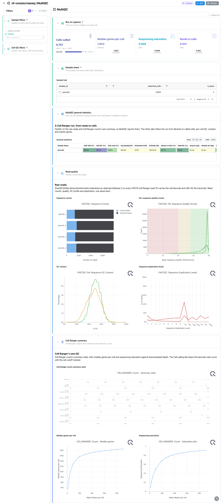
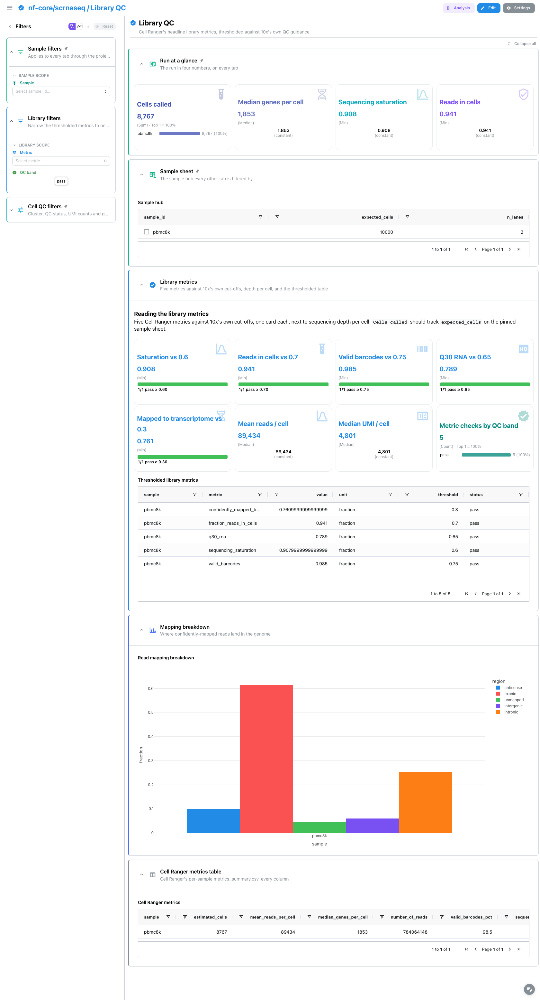
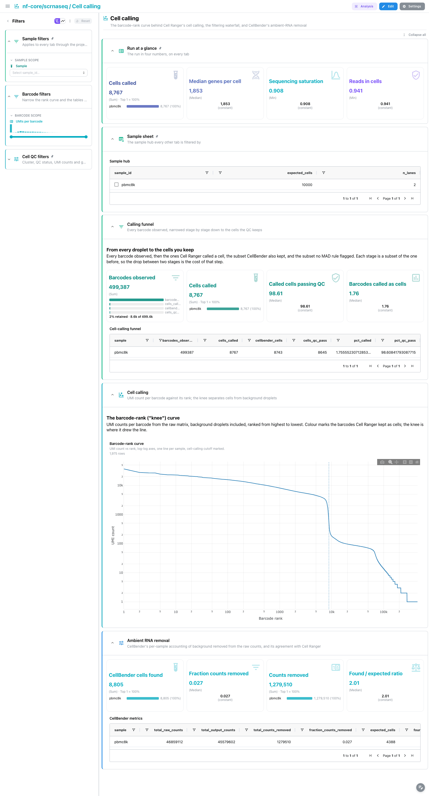
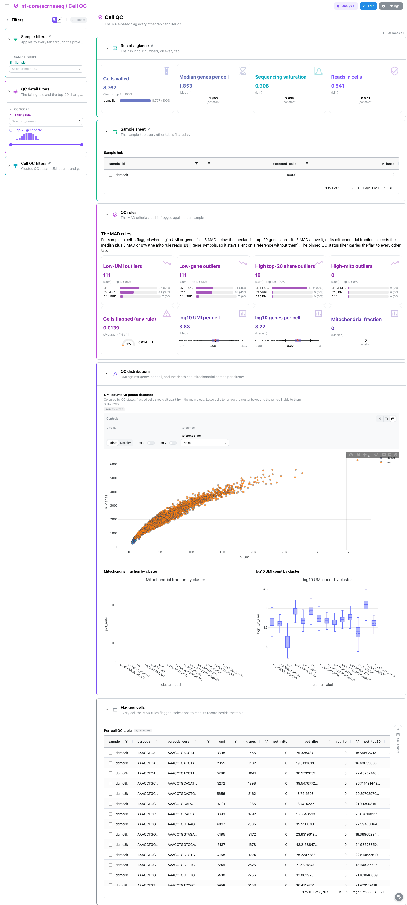
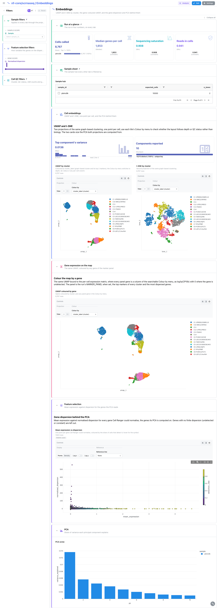
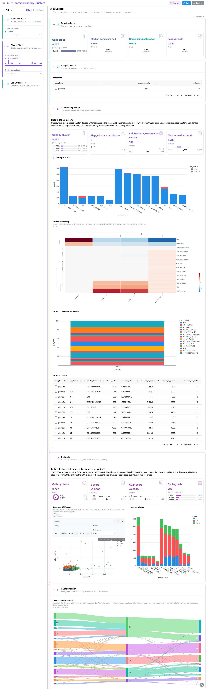
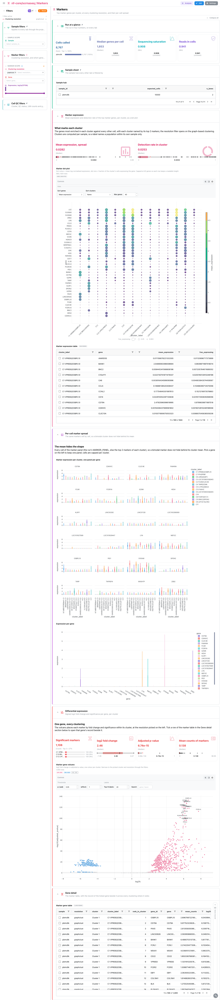
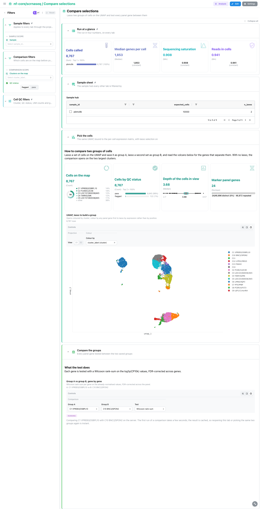
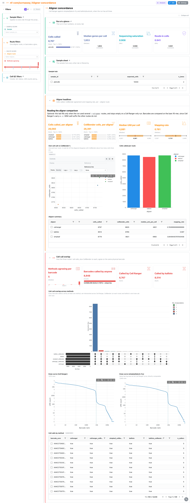

<div class="template-banner">
  <a class="template-banner-logo" href="https://nf-co.re/scrnaseq" target="_blank" title="nf-core/scrnaseq on nf-co.re">
    
    
  </a>
  <div class="template-banner-body">
    <h1 class="template-title">Single-cell RNA-seq</h1>
    <p class="template-subtitle">From reads to called cells on the Cell Ranger route: library metrics, the knee curve and CellBender, per-cell QC, embeddings, clusters and marker genes, with an optional comparison of the aligner routes.</p>
    <p class="template-links">
      <a href="https://nf-co.re/scrnaseq" target="_blank"><i class="mdi mdi-open-in-new"></i> nf-co.re</a>
      <a href="https://github.com/nf-core/scrnaseq" target="_blank"><i class="mdi mdi-github"></i> GitHub</a>
    </p>
  </div>
  <span class="template-status-experimental template-banner-badge" data-tooltip="Experimental: shared as-is. Feedback and PRs welcome."><i class="mdi mdi-flask-outline"></i> Experimental</span>
</div>

<div class="tpl-version-pick" data-latest="4.2.0">
  <span class="tpl-version-icon"><i class="mdi mdi-source-branch"></i></span>
  <span class="tpl-version-label">Template version</span>
  <select id="tpl-version" class="tpl-version-select" aria-label="Template version">
    <option value="4.2.0" selected>4.2.0</option>
  </select>
  <span class="tpl-version-badge">latest</span>
</div>

The scrnaseq template follows a 10x run from the raw reads to the genes that mark
each cluster, one tab per step:

- :material-chart-box-outline: **MultiQC**: FastQC on the raw reads and Cell Ranger's own summary
- :material-check-decagram: **Library QC** and :material-chart-scatter-plot: **Cell calling**: library metrics against 10x's cut-offs, the knee curve and CellBender's ambient-RNA removal
- :material-shield-check-outline: **Cell QC**: the MAD rules that flag a cell, which every later tab can filter on
- :material-relation-many-to-many: **Embeddings** and :material-chart-donut: **Clusters**: UMAP, t-SNE and PCA, cluster sizes, cell cycle and stability across resolutions
- :material-dna: **Markers** and :material-scale-balance: **Compare selections**: marker genes per cluster, and two lassoed groups of cells tested gene by gene
- :material-set-merge: **Aligner concordance**: Cell Ranger against simpleaf and kallisto, when the run used several routes

A `Run at a glance` strip (cells called, median genes per cell, sequencing
saturation, reads in cells), the collapsed `Sample sheet` and the `Sample`
filter are pinned to every tab. A collapsed `Cell QC filters` group (cluster, QC
status, UMI counts, genes detected) is pinned to the bottom and composes forward
through the `cluster_label` links, so a cluster picked on any tab narrows the
cluster, marker, per-cell expression and cell-cycle tables alike.

!!! info "The Cell Ranger route carries the dashboard"
    Only `--aligner cellranger` (the pipeline default) publishes the matrices,
    the secondary analysis and a MultiQC report the template reads, so it is
    required. The simpleaf and kallisto routes are optional and feed the Aligner
    concordance tab only; a Cell Ranger-only run leaves that tab empty.

!!! warning "Two readings assume a human reference"
    The mitochondrial fraction and the MAD mito rule read gene symbols starting
    with `MT-`, and the cell-cycle scores read the human Tirosh gene sets. On
    another organism, or a reference without mitochondrial genes, the mito
    columns read 0 and the phase degrades to NA.

---

## :material-rocket-launch-outline: Quick start

=== "Point at a finished run"

    ```bash
    depictio run \
      --template nf-core/scrnaseq/latest \
      --data-root /path/to/scrnaseq_results
    ```

    `--data-root` is the results root. The sample hub reads the samplesheet the
    run was launched with, which the pipeline does not publish: copy it anywhere
    under the results root first (for example `input/samplesheet.csv`). To keep
    the lineage markers of your tissue on the per-cell marker tiles, name them:

    ```bash
    depictio run \
      --template nf-core/scrnaseq/latest \
      --data-root /path/to/scrnaseq_results \
      --var MARKER_PANEL=GENE1,GENE2,GENE3
    ```

    | Variable | Default | Role |
    |---|---|---|
    | `MARKER_PANEL` | none | Comma-separated gene symbols the Markers violin and the gene UMAP's Colour by menu always carry. Unset, or with none of its genes in the reference, the tiles use the top markers of every graph-based cluster |

=== "From the pipeline itself (v1.10.0+)"

    ```bash
    depictio-cli config nextflow --install     # once per machine
    nextflow run nf-core/scrnaseq -r 4.2.0 -profile docker --outdir results
    ```

    No `depictio run`, and no template named: the pipeline ingests its own
    output directory when it finishes and resolves this template from its own
    manifest. See [Nextflow trigger](../../depictio-cli/nextflow-trigger.md).

---

## :material-book-open-variant: Reference

The template reads the MultiQC report and Cell Ranger's `outs/` directory: the
per-sample `metrics_summary.csv`, the raw and filtered feature-barcode matrices
and the `analysis/` tables (every clustering, the UMAP, t-SNE and PCA
projections, the feature dispersion and the marker genes of every resolution).
Cell Ranger writes no sample column, so raw scans carry the file path and
recipes recover the sample from it. The knee curve is summed straight out of the
raw MatrixMarket file with a streaming scan, never a dense matrix.

!!! info "Self-adapting layout"
    The dashboard adapts to whatever the run actually produced: components bound
    to pruned or unparsed data collections are hidden, tabs left with no real
    visualizations are dropped entirely, and the remaining components are
    re-packed so there are no empty rows.

<div class="tpl-version-block" data-version="4.2.0" markdown>

--8<-- "pipeline-templates/nf-core/_generated/scrnaseq-latest.md"

</div>

---

## :material-view-dashboard-outline: Dashboard tabs

Nine tabs, read as a funnel: the report, the libraries, the cells called, the
cells kept, where they sit, how they group, what marks each group, a
comparison of your own, and how the aligner routes agree. Each tab below carries
the **same icon and colour the dashboard gives it**.

=== "{ width=18 }{ width=18 } MultiQC"

    *Are the raw reads sound, and what does Cell Ranger's own summary say?*

    [{ loading=lazy }](../../images/pipeline-templates/nf-core/scrnaseq/multiqc_light.png){ .tpl-shot target="_blank" rel="noopener" }

    MultiQC panels only: FastQC on the raw reads, then Cell Ranger count's
    summary stats and its median-genes and saturation curves. Cell Ranger's own
    barcode-rank panel is left out, because the Cell calling tab draws the same
    curve with cells and background coloured and the cutoff marked.

    ??? abstract ":material-tune-variant: Filters and components"

        **Filters** · `Sample` on the sample hub, persistent and pinned to the
        top of every tab, plus `Cluster`, `QC status` and ranges on `UMI counts
        per cell` and `Genes detected` in the collapsed *Cell QC filters*
        group pinned to the bottom.

        | Section | What it holds |
        |---|---|
        | Run at a glance | 4 cards, pinned to every tab |
        | Sample sheet | *Sample hub*, collapsed and pinned to every tab |
        | MultiQC general statistics | *General statistics* |
        | Read quality | 4 MultiQC panels |
        | Cell Ranger summary | 3 MultiQC panels |

=== ":material-check-decagram:{ .mc-blue } Library QC"

    *Does each library clear 10x's own quality cut-offs?*

    [{ loading=lazy }](../../images/pipeline-templates/nf-core/scrnaseq/library_qc_light.png){ .tpl-shot target="_blank" rel="noopener" }

    Five threshold cards (sequencing saturation, reads in cells, valid barcodes,
    Q30 RNA, confidently mapped to the transcriptome) each show the lowest
    library against 10x's cut-off, next to mean reads and median UMI per cell
    and a count of the checks per QC band. The mapping breakdown is grouped
    rather than stacked, because antisense overlaps exonic and intronic by Cell
    Ranger's own definition.

    ??? abstract ":material-tune-variant: Filters and components"

        **Filters** · a `Metric` picker and a `QC band` switch on the
        thresholded metrics, in the tab-local *Library filters*.

        | Section | What it holds |
        |---|---|
        | Library metrics | 8 cards, *Thresholded library metrics* |
        | Mapping breakdown | *Read mapping breakdown* |
        | Cell Ranger metrics table | *Cell Ranger metrics*, collapsed |

=== ":material-chart-scatter-plot:{ .mc-cyan } Cell calling"

    *Which droplets became cells, and how much ambient RNA came out?*

    [{ loading=lazy }](../../images/pipeline-templates/nf-core/scrnaseq/cell_calling_light.png){ .tpl-shot target="_blank" rel="noopener" }

    The funnel opens the tab: every barcode observed, called a cell, kept by
    CellBender, passing the per-cell QC, each a subset of the one before. The
    barcode-rank curve, computed off the raw matrix, shows where the knee
    separates cells from empty droplets. CellBender's accounting closes the tab;
    its found over expected ratio carries no verdict, since a ratio far above 1
    is as much a warning as one below it.

    ??? abstract ":material-tune-variant: Filters and components"

        **Filters** · a `UMIs per barcode` range on the rank curve, in the
        tab-local *Barcode filters*.

        | Section | What it holds |
        |---|---|
        | Calling funnel | 4 cards, *Cell-calling funnel* |
        | Cell calling | *Barcode-rank curve* |
        | Ambient RNA removal | 4 cards, *CellBender metrics* |

=== ":material-shield-check-outline:{ .mc-grape } Cell QC"

    *Which cells does the MAD flag remove, and by which rule?*

    [{ loading=lazy }](../../images/pipeline-templates/nf-core/scrnaseq/cell_qc_light.png){ .tpl-shot target="_blank" rel="noopener" }

    The rules follow sc-best-practices, per sample on log1p values: 5 MAD below
    the median for UMIs and genes, 5 MAD above for the top-20 gene share, and the
    median plus 3 MAD or 8% for the mitochondrial fraction. Rule cards come first,
    then the UMI against genes scatter and the mito and depth box plots by
    cluster. The per-cell table drives a linked **Cell record** beside it, which
    folds to a slim rail until a cell is picked.

    ??? abstract ":material-tune-variant: Filters and components"

        **Filters** · `Failing rule` and a `Top-20 gene share` range, in the
        tab-local *QC detail filters*, on top of the pinned cell filters.

        | Section | What it holds |
        |---|---|
        | QC rules | 8 cards |
        | QC distributions | *UMI counts vs genes detected*, *Mitochondrial fraction by cluster*, *log10 UMI count by cluster* |
        | Flagged cells | *Per-cell QC table*, *Cell record* |

=== ":material-relation-many-to-many:{ .mc-indigo } Embeddings"

    *Where do the cells sit, and which genes separate them?*

    [{ loading=lazy }](../../images/pipeline-templates/nf-core/scrnaseq/embeddings_light.png){ .tpl-shot target="_blank" rel="noopener" }

    The cluster UMAP and the t-SNE sit side by side, with depth and QC status
    one Colour by pick away on either. `Gene expression on the map` is the same
    UMAP bound to the per-cell expression matrix, where every panel gene is a
    column of the searchable Colour by menu. Mean expression against normalised
    dispersion and the PCA scree show what the embedding was built on.

    ??? abstract ":material-tune-variant: Filters and components"

        **Filters** · a `Normalised dispersion` range on the dispersion scatter,
        in the tab-local *Feature selection filters*.

        | Section | What it holds |
        |---|---|
        | Cell embeddings | *UMAP by cluster*, *t-SNE by cluster*, 2 cards |
        | Gene expression on the map | *UMAP coloured by gene* |
        | Feature selection | *Mean expression vs dispersion* |
        | PCA | *PCA scree* |

=== ":material-chart-donut:{ .mc-violet } Clusters"

    *Is a cluster a cell type, a QC artefact, or the same type cycling?*

    [{ loading=lazy }](../../images/pipeline-templates/nf-core/scrnaseq/clusters_light.png){ .tpl-shot target="_blank" rel="noopener" }

    Cluster sizes, the QC status per cluster and a column-z-scored QC heatmap
    say which clusters are driven by depth or flagged cells. The cell-cycle
    section plots the S against the G2/M score per cell and the phase per
    cluster, and a sankey shows how graph-based clusters split across the
    k-means resolutions Cell Ranger computes. Cell Ranger clusters each sample on
    its own, so on a multi-sample run a shared label is not the same population.

    ??? abstract ":material-tune-variant: Filters and components"

        **Filters** · a `Cells per cluster` range and a `Cell-cycle phase`
        picker, in the tab-local *Cluster filters*.

        | Section | What it holds |
        |---|---|
        | Cluster composition | 4 cards, *Cluster composition per sample*, *QC status per cluster*, *Cluster QC heatmap*, *Cluster summary* |
        | Cell cycle | 4 cards, *S score vs G2/M score*, *Phase per cluster* |
        | Cluster stability | *Cluster stability across k* |

=== ":material-dna:{ .mc-pink } Markers"

    *What marks each cluster, and does the mean hide a bimodal cluster?*

    [{ loading=lazy }](../../images/pipeline-templates/nf-core/scrnaseq/markers_light.png){ .tpl-shot target="_blank" rel="noopener" }

    A marker dot plot gives mean expression and detection rate per cluster, then
    a violin faceted by gene shows the same markers cell by cell. The volcano
    reads Cell Ranger's top-ranked markers at any clustering resolution; it keeps
    the volcano view only, since these are not a genome-wide test. The marker
    gene table closes the tab with a linked **Gene record** beside it, one row
    per clustering where the gene ranks, folded to a slim rail until a gene is
    ticked.

    ??? abstract ":material-tune-variant: Filters and components"

        **Filters** · `Clustering resolution` (opens on graph-based), `Gene`
        and an `Expression, log1p(CP10k)` range, in the tab-local *Marker
        filters*.

        | Section | What it holds |
        |---|---|
        | Marker expression | *Marker dot plot*, 2 cards, *Marker expression table* |
        | Per-cell marker spread | *Marker expression per cluster, one panel per gene*, *Expression per gene* |
        | Differential expression | *Marker gene volcano*, 4 cards |
        | Gene detail | *Marker gene table*, *Gene record* |

=== ":material-scale-balance:{ .mc-teal } Compare selections"

    *What differs between two groups of cells you pick yourself?*

    [{ loading=lazy }](../../images/pipeline-templates/nf-core/scrnaseq/compare_selections_light.png){ .tpl-shot target="_blank" rel="noopener" }

    Lasso a set of cells on the UMAP and save it as group A, lasso a second set
    as group B, and read the volcano. With no groups saved, the comparison opens
    on the two largest clusters. Each panel gene is tested with a Wilcoxon
    rank-sum on log1p(CP10k), FDR-corrected, and the guard cards say what the
    test runs over: narrow to passing cells first, and watch the depth, since two
    groups of very different depth differ on almost every gene.

    ??? abstract ":material-tune-variant: Filters and components"

        **Filters** · `Clusters on the map` and a `QC status` switch on the
        per-cell expression matrix, in the tab-local *Comparison filters*.

        | Section | What it holds |
        |---|---|
        | Pick the cells | *UMAP, lasso to build a group*, 4 cards |
        | Compare the groups | *Group A vs group B, gene by gene* |

=== ":material-set-merge:{ .mc-orange } Aligner concordance"

    *Do Cell Ranger, simpleaf and kallisto call the same cells?*

    [{ loading=lazy }](../../images/pipeline-templates/nf-core/scrnaseq/aligner_concordance_light.png){ .tpl-shot target="_blank" rel="noopener" }

    When simpleaf and kallisto also ran, the cards compare cells called,
    CellBender cells, median UMI per cell and mapping rate per route, and a
    scatter sets each route's own call against CellBender's. An UpSet plot shows
    how the routes' cell calls, plus CellBender on each, agree on the same
    physical barcode, normalised to the bare 16-mer. The two knee curves share
    log-log axes. Every collection here is optional.

    ??? abstract ":material-tune-variant: Filters and components"

        **Filters** · an `Aligner route` picker and a `Methods agreeing` range,
        in the tab-local *Route filters*.

        | Section | What it holds |
        |---|---|
        | Aligner headlines | 4 cards, *Own cell call vs CellBender's*, *Cells called per route*, *Aligner summary* |
        | Cell-call overlap | *Cell-call overlap across methods*, 4 cards, *Knee curve (Cell Ranger)*, *Knee curve (simpleaf/alevin-fry)*, *Cell calls by method* |

The cell scatters and embeddings select on the barcode (the UMAP coloured by gene
does not), and the tables select on their entity column (sample, cell, gene,
cluster, route), so a pick narrows the
other tiles on the same collection or one linked to it.

---

## :material-play-circle-outline: Running the pipeline

Depictio reads the **output** of nf-core/scrnaseq, it does not run the pipeline.
Run the pipeline first, on the Cell Ranger route:

```bash
nextflow run nf-core/scrnaseq -r 4.2.0 \
  --input samplesheet.csv \
  --fasta genome.fa --gtf genes.gtf \
  --aligner cellranger --protocol 10XV3 \
  --outdir results -profile docker
```

Then copy the samplesheet next to the results and point Depictio at them:

```bash
mkdir -p results/input && cp samplesheet.csv results/input/
depictio run --template nf-core/scrnaseq/latest --data-root results/
```

To fill the Aligner concordance tab, run the pipeline once more per extra
`--aligner` route and gather the route directories under one results root. See
[nf-co.re/scrnaseq/usage](https://nf-co.re/scrnaseq/4.2.0/docs/usage) for full
pipeline documentation.

---

## :material-folder-open-outline: Required data structure

Point `--data-root` at the results root. Every scan is anchored on the tool
directory name (`cellranger/`, `simpleaf/`, `kallisto/`), so a single-route
output directory and a root holding several routes scan the same way.

```text
<DATA_ROOT>/
├── input/samplesheet.csv                      # the hub: copy it in, anywhere under the root
├── [aligner_cellranger/]
│   ├── pipeline_info/{params,software_versions}*
│   ├── multiqc/multiqc_data/multiqc.parquet   # native, no reprocess
│   └── cellranger/
│       ├── count/<sample>/outs/
│       │   ├── metrics_summary.csv
│       │   ├── raw_feature_bc_matrix/{matrix.mtx.gz,barcodes.tsv.gz,features.tsv.gz}
│       │   ├── filtered_feature_bc_matrix/{matrix.mtx.gz,barcodes.tsv.gz,features.tsv.gz}
│       │   └── analysis/{clustering,umap,tsne,pca,diffexp}/*/*.csv
│       └── <sample>/cellbender_removebackground/*_{metrics,cell_barcodes}.csv   # optional
├── [aligner_simpleaf/]simpleaf/<sample>/      # optional: af_quant, af_map, qcatch, CellBender
└── [aligner_kallisto/]kallisto/<sample>.count/ # optional: run_info.json, inspect.json, barcodes
```

The BAM, BUS, `.h5`, `.h5ad`, `.cloupe` and `.rds` binaries are not read.

---

## :material-flask-outline: Validation runs

The template was validated against the AWS megatest of the 4.2.0 release,
`results-3fc17b4f971a89e47c88337de71d0e777ffad8cc`: the pbmc8k sample (10x v2
chemistry, GRCh38) on the Cell Ranger, simpleaf and kallisto routes, so the
Aligner concordance tab is filled. The screenshots above come from that run.
`megatest.yaml` lists the tables-only subset the template needs; the samplesheet
the run names in `params.json` is fetched into `input/` separately:

```bash
bash depictio/projects/nf-core/scrnaseq/4.2.0/download_test_data.sh /tmp/scrnaseq_test
depictio run --template nf-core/scrnaseq/latest --data-root /tmp/scrnaseq_test
```

Do not pass `--project-name` when ingesting: the dashboard is attached to the
project by name, so renaming it breaks a later `depictio dashboard import`.
Re-ingesting accumulates dashboards, so delete the project before repeating a run.

---

## :material-link-variant: Additional resources

- [nf-co.re/scrnaseq](https://nf-co.re/scrnaseq): official pipeline documentation
- [nf-co.re/scrnaseq/4.2.0/results](https://nf-co.re/scrnaseq/4.2.0/results): AWS test results
- [Template System Reference](../../usage/projects/templates.md): YAML format, variables, conditionals
- [Recipes](../../usage/projects/recipes.md): how to read, test, and write recipes

---

## :material-account-group-outline: Authorship

<div class="tpl-credits">
  <div class="tpl-credit">
    <span class="tpl-credit-role"><i class="mdi mdi-code-braces"></i> Developers</span>
    <span class="tpl-credit-note">Wrote the template, its recipes and its dashboards.</span>
    <a class="tpl-person" href="https://github.com/weber8thomas" target="_blank" rel="noopener">
       weber8thomas
    </a>
  </div>
  <div class="tpl-credit">
    <span class="tpl-credit-role"><i class="mdi mdi-eye-check-outline"></i> Reviewers</span>
    <span class="tpl-credit-note">Nobody has run it on their own data and signed it off yet, which is what keeps it Experimental.</span>
    <span class="tpl-person"><i class="mdi mdi-account-plus-outline"></i> Open</span>
  </div>
  <div class="tpl-credit">
    <span class="tpl-credit-role"><i class="mdi mdi-wrench-outline"></i> Maintainers</span>
    <span class="tpl-credit-note">Keep it working as nf-core/scrnaseq releases.</span>
    <a class="tpl-person" href="https://github.com/weber8thomas" target="_blank" rel="noopener">
       weber8thomas
    </a>
  </div>
</div>

Reviewing a template on your own data, or taking over a role here, is a
contribution in itself: the [contributing guide](../../developer/contributing-templates.md)
says what each one involves.
