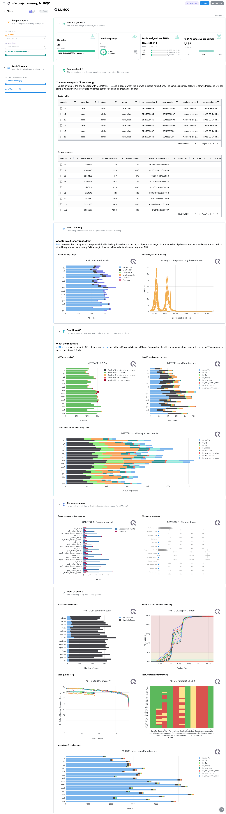
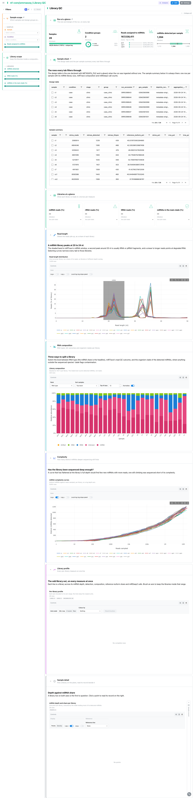
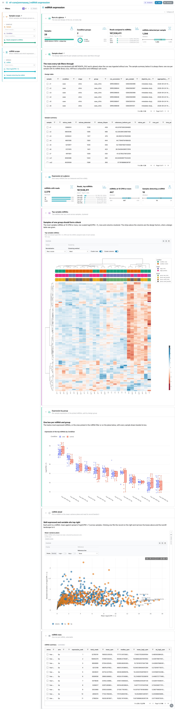
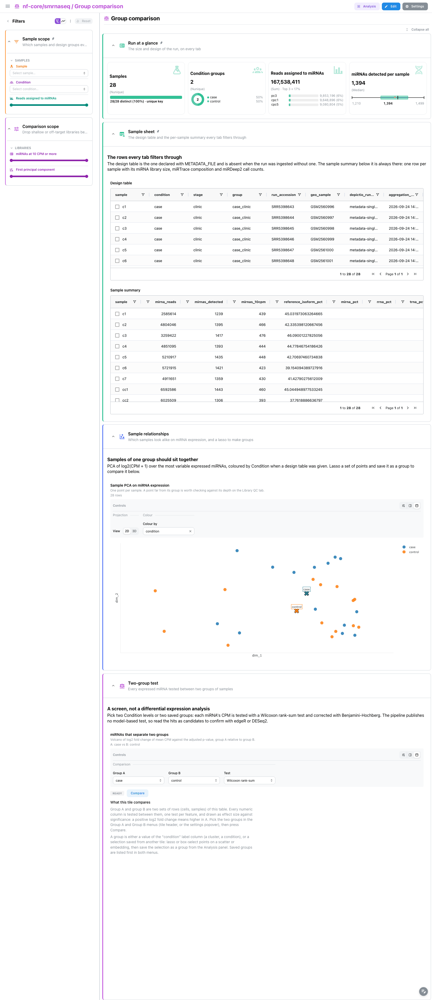
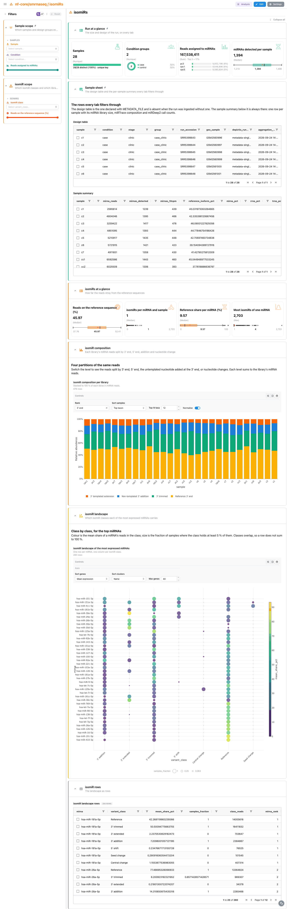
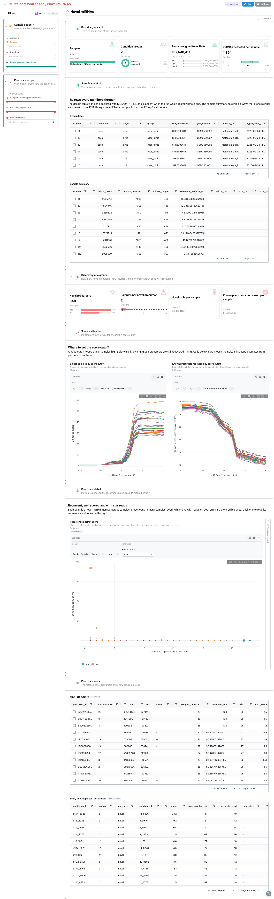

<div class="template-banner">
  <a class="template-banner-logo" href="https://nf-co.re/smrnaseq" target="_blank" title="nf-core/smrnaseq on nf-co.re">
    
    
  </a>
  <div class="template-banner-body">
    <h1 class="template-title">Small RNA-seq</h1>
    <p class="template-subtitle">miRTrace library composition, mirtop miRNA expression and isomiRs, a two-group screen on the design, and miRDeep2 novel precursors, next to the pipeline's own MultiQC report.</p>
    <p class="template-links">
      <a href="https://nf-co.re/smrnaseq" target="_blank"><i class="mdi mdi-open-in-new"></i> nf-co.re</a>
      <a href="https://github.com/nf-core/smrnaseq" target="_blank"><i class="mdi mdi-github"></i> GitHub</a>
    </p>
  </div>
  <span class="template-status-experimental template-banner-badge" data-tooltip="Experimental: shared as-is. Feedback and PRs welcome."><i class="mdi mdi-flask-outline"></i> Experimental</span>
</div>

<div class="tpl-version-pick" data-latest="2.4.1">
  <span class="tpl-version-icon"><i class="mdi mdi-source-branch"></i></span>
  <span class="tpl-version-label">Template version</span>
  <select id="tpl-version" class="tpl-version-select" aria-label="Template version">
    <option value="2.4.1" selected>2.4.1</option>
  </select>
  <span class="tpl-version-badge">latest</span>
</div>

The smrnaseq template follows an nf-core/smrnaseq run from trimmed small RNA
libraries to novel miRNA candidates, one tab per question:

- :material-test-tube: **Library QC**: what each library is made of, how long its reads are and whether it was sequenced deep enough
- :material-chart-box-outline: **miRNA expression**: which miRNAs each sample carries, which vary most and how they split by design group
- :material-scale-balance: **Group comparison**: how the samples relate on miRNA expression, and which miRNAs separate two groups
- :material-shape-outline: **isomiRs**: how far the reads stray from the reference miRNA sequences, by isomiR class
- :material-star-outline: **Novel miRNAs**: the precursors miRDeep2 proposes beyond miRBase, and where to set its score cutoff

A `Run at a glance` strip and the collapsed `Sample sheet` are pinned to the top
of every tab, and the `Sample scope` filters (sample, design group, miRNA depth)
apply everywhere.

!!! info "Expression is aggregated from the mirtop isomiR table"
    The template reads miRNA expression from mirtop's joined isomiR table, one
    row per isomiR with a count column per sample, and aggregates it per miRNA.
    CPM is therefore over miRNA-assigned reads. miRTrace publishes no statistics
    table of its own, so its composition, length and complexity views are read
    back from the plot data MultiQC keeps in its parquet.

---

## :material-rocket-launch-outline: Quick start

=== "Point at a finished run"

    ```bash
    depictio run \
      --template nf-core/smrnaseq/latest \
      --data-root /path/to/smrnaseq_results \
      --var METADATA_FILE=/path/to/design.tsv \
      --var GENOME=hg38
    ```

    The pipeline samplesheet carries no design column, so the design comes from
    an optional table: `METADATA_FILE`, sample id in the first column (or in a
    column named `sample`), one column per factor, and `GROUP_COL` defaulting to
    the first factor. Without it the design filter and card are dropped and the
    figures fall back to one colour. `GENOME` (default `hg38`) is the UCSC
    assembly the novel precursors link out to. A run with `--skip_mirdeep` takes
    `--var SKIP_MIRDEEP=true`, one with `--skip_multiqc` takes
    `--var SKIP_MULTIQC=true`.

=== "From the pipeline itself (v1.10.0+)"

    ```bash
    depictio-cli config nextflow --install     # once per machine
    nextflow run nf-core/smrnaseq -r 2.4.1 -profile docker --outdir results
    ```

    No `depictio run`, and no template named: the pipeline ingests its own
    output directory when it finishes and resolves this template from its own
    manifest. See [Nextflow trigger](../../depictio-cli/nextflow-trigger.md).

---

## :material-book-open-variant: Reference

The template reads the MultiQC report, the mirtop joined isomiR table, the
miRDeep2 per-sample results and the optional design table. The sample hub, the
per-miRNA summary, the PCA, the heatmap matrix, the isomiR composition and the
miRDeep2 precursors are recipes over those files. 24 of its 74 components carry
a `use:` catalog reference, so a tile says where its panel comes from.

!!! info "Self-adapting layout"
    The dashboard adapts to whatever the run actually produced: components bound
    to pruned or unparsed data collections are hidden, tabs left with no real
    visualizations are dropped entirely, and the remaining components are
    re-packed so there are no empty rows.

<div class="tpl-version-block" data-version="2.4.1" markdown>

--8<-- "pipeline-templates/nf-core/_generated/smrnaseq-latest.md"

</div>

---

## :material-view-dashboard-outline: Dashboard tabs

Six tabs, read as a funnel: are the libraries small RNA libraries, what is each
one made of, which miRNAs they carry, which miRNAs separate the design groups,
how the reads differ from the reference sequences, and what miRDeep2 proposes
beyond miRBase. Each tab below carries the **same icon and colour the dashboard
gives it**. Screenshots come from the run described under Validation runs.

=== "{ width=18 }{ width=18 } MultiQC"

    *Did trimming, the miRTrace verdict and the genome mapping go well?*

    [{ loading=lazy }](../../images/pipeline-templates/nf-core/smrnaseq/multiqc_light.png){ .tpl-shot target="_blank" rel="noopener" }

    The tab is the MultiQC report as the run published it: what fastp kept and the
    read length after trimming, miRTrace's read QC, the isomiR counts mirtop
    assigned, and how much of each library Bowtie placed on the genome for
    miRDeep2. The miRTrace composition, length and complexity panels are not
    repeated here, Library QC draws them as tiles. The remaining fastp and FastQC
    panels sit in a collapsed section.

    ??? abstract ":material-tune-variant: Filters and components"

        **Filters** · `Sample`, the design group (`GROUP_COL`) and a `Reads
        assigned to miRNAs` range, persistent and pinned to the top of every tab,
        plus `miRNA reads (%)` and `rRNA reads (%)` ranges in a *Read QC scope*
        group.

        | Section | What it holds |
        |---|---|
        | Run at a glance | 4 cards: samples, design groups, reads assigned to miRNAs, miRNAs detected per sample (pinned) |
        | Sample sheet | *Design table*, *Sample summary* (collapsed, pinned) |
        | Read trimming | *Reads kept by fastp*, *Read length after trimming* |
        | Small RNA QC | *miRTrace read QC*, *isomiR read counts by type*, *Distinct isomiR sequences by type* |
        | Genome mapping | *Reads mapped to the genome*, *Alignment statistics* |
        | More QC panels | 5 fastp, FastQC and mirtop panels (collapsed) |

=== ":material-test-tube:{ .mc-teal } Library QC"

    *Is each library a small RNA library, and was it sequenced deep enough?*

    [{ loading=lazy }](../../images/pipeline-templates/nf-core/smrnaseq/library_qc_light.png){ .tpl-shot target="_blank" rel="noopener" }

    Cards give the miRNA, rRNA and tRNA shares and the share in the main clade. The
    read length profile shades the miRNA window, the composition bars split each
    library three ways (RNA type, QC outcome, clade), and the complexity curves
    show how many distinct miRNAs deeper sequencing still finds. A parallel
    coordinates profile puts every per-library measure on one line, and the
    depth-against-share plane carries a linked sample record that stays a slim
    rail until a library is picked.

    ??? abstract ":material-tune-variant: Filters and components"

        **Filters** · `miRNAs detected`, `tRNA reads (%)` and `miRNAs in the main
        clade (%)` ranges in a *Library scope* group.

        | Section | What it holds |
        |---|---|
        | Libraries at a glance | 4 cards |
        | Read length | *Read length distribution* |
        | RNA composition | *Library composition* |
        | Complexity | *miRNA complexity curves* |
        | Library profile | *Per-library profile* |
        | Sample detail | *miRNA depth and share per library*, *Sample record* |

=== ":material-chart-box-outline:{ .mc-cyan } miRNA expression"

    *Which miRNAs do the samples carry, and which vary most?*

    [{ loading=lazy }](../../images/pipeline-templates/nf-core/smrnaseq/mirna_expression_light.png){ .tpl-shot target="_blank" rel="noopener" }

    A clustered heatmap of the most variable miRNAs with design strips, where
    samples of one group should form a block, then boxes of the top miRNAs split
    by design group. The mean-variance plane puts well expressed and variable
    miRNAs top right; picking one opens the miRNA record beside it, linked to
    miRBase, and the rows below are selectable too.

    ??? abstract ":material-tune-variant: Filters and components"

        **Filters** · `miRNA`, and `Mean log2(CPM + 1)` and `Samples detecting the
        miRNA` ranges in a *miRNA scope* group.

        | Section | What it holds |
        |---|---|
        | Expression at a glance | 4 cards |
        | Top variable miRNAs | *Top variable miRNAs* |
        | Expression by group | *Expression of the top miRNAs by `GROUP_COL`* |
        | miRNA detail | *Mean-variance plane*, *miRNA record* |
        | miRNA rows | *miRNA summary* (collapsed) |

=== ":material-scale-balance:{ .mc-grape } Group comparison"

    *Which miRNAs separate two groups of samples?*

    [{ loading=lazy }](../../images/pipeline-templates/nf-core/smrnaseq/group_comparison_light.png){ .tpl-shot target="_blank" rel="noopener" }

    The sample PCA on miRNA expression is coloured by the design group and takes
    a lasso, so groups can also be drawn by hand. The two-group test runs a
    Wilcoxon test on CPM with Benjamini-Hochberg correction and draws it as a
    volcano. It is a screen, not a model-based differential expression analysis:
    the pipeline publishes no edgeR or DESeq2 table to read instead.

    ??? abstract ":material-tune-variant: Filters and components"

        **Filters** · `miRNAs at 10 CPM or more` and `First principal component`
        ranges in a *Comparison scope* group, to drop shallow or off-target
        libraries before comparing.

        | Section | What it holds |
        |---|---|
        | Sample relationships | *Sample PCA on miRNA expression* |
        | Two-group test | *miRNAs that separate two groups* |

=== ":material-shape-outline:{ .mc-orange } isomiRs"

    *How far do the reads stray from the reference miRNA sequences?*

    [{ loading=lazy }](../../images/pipeline-templates/nf-core/smrnaseq/isomirs_light.png){ .tpl-shot target="_blank" rel="noopener" }

    Cards give the share of reads on the reference sequence, per library and per
    miRNA, and how many isomiRs a miRNA carries. The composition bars split each
    library's miRNA reads four ways (3' end, 5' end, non-templated addition,
    nucleotide change), and a dot plot shows which isomiR classes each of the most
    expressed miRNAs carries.

    ??? abstract ":material-tune-variant: Filters and components"

        **Filters** · `isomiR class` and a `Reads on the reference sequence (%)`
        range in an *isomiR scope* group.

        | Section | What it holds |
        |---|---|
        | isomiRs at a glance | 4 cards |
        | isomiR composition | *isomiR composition per library* |
        | isomiR landscape | *isomiR landscape of the most expressed miRNAs* |
        | isomiR rows | *isomiR landscape rows* (collapsed) |

=== ":material-star-outline:{ .mc-red } Novel miRNAs"

    *Which novel precursors are worth following up?*

    [{ loading=lazy }](../../images/pipeline-templates/nf-core/smrnaseq/novel_mirnas_light.png){ .tpl-shot target="_blank" rel="noopener" }

    miRDeep2's own signal-to-noise and known-recovery curves, by score cutoff,
    say where to set the threshold. The recurrence plane puts the number of
    samples reporting a novel precursor against its best score; picking one opens
    the precursor record beside it, linked to the UCSC browser on `GENOME`.
    Recurrent, well scored precursors with star-arm reads are the ones to trust.

    ??? abstract ":material-tune-variant: Filters and components"

        **Filters** · `Samples reporting the precursor` and `Best miRDeep2 score`
        ranges and `Star-arm reads` in a *Precursor scope* group.

        | Section | What it holds |
        |---|---|
        | Discovery at a glance | 4 cards |
        | Score calibration | *Signal-to-noise by score cutoff*, *Known precursors recovered by score cutoff* |
        | Precursor detail | *Recurrence against score*, *Precursor record* |
        | Precursor rows | *Novel precursors*, *Every miRDeep2 call, per sample* (collapsed) |

    !!! tip "Dropped with `--skip_mirdeep`"
        A run without miRDeep2 writes no `result_*.csv`. Pass
        `--var SKIP_MIRDEEP=true` and the four miRDeep2 collections are pruned,
        which drops this tab.

---

## :material-play-circle-outline: Running the pipeline

Depictio reads the **output** of nf-core/smrnaseq, it does not run the pipeline.
Run the pipeline first:

```bash
nextflow run nf-core/smrnaseq -r 2.4.1 \
  --input samplesheet.csv \
  --genome GRCh38 --mirtrace_species hsa \
  --three_prime_adapter <adapter> \
  --outdir results -profile docker
```

Then point Depictio at the results, with a design table if you have one:

```bash
depictio run --template nf-core/smrnaseq/latest --data-root results/ \
  --var METADATA_FILE=design.tsv --var GENOME=hg38
```

See [nf-co.re/smrnaseq/usage](https://nf-co.re/smrnaseq/2.4.1/docs/usage) for full pipeline documentation.

---

## :material-folder-open-outline: Required data structure

Point `--data-root` at the directory holding the pipeline output. Depictio scans
recursively and matches on file name.

```text
<DATA_ROOT>/
├── multiqc/multiqc_data/
│   └── multiqc.parquet                          # fastp, FastQC, miRTrace, mirtop, samtools
├── mirna_quant/mirtop/
│   └── joined_samples_mirtop.tsv                # the source of expression and isomiRs
├── result_*.csv                                 # miRDeep2 per sample (optional, --skip_mirdeep)
└── pipeline_info/
    ├── params_*.json
    └── *software*versions*.yml
```

The design table named by `METADATA_FILE` is read from wherever it points; its
id column is `METADATA_ID_COL` (default: the first column) and `GROUP_COL` picks
the factor the figures group on. The mature and hairpin count matrices and the
edgeR QC tables are not read.

---

## :material-flask-outline: Validation runs

The template was validated against the AWS megatest of the 2.4.1 release
(`results-cb0af579b24cb8d5a3accd87b2f14ea93fe04832`, the pipeline's full test
profile, a two-factor design), and the screenshots above come from it. That run
published the miRDeep2 results at the output root, and no mature or hairpin
matrices, which is why the template reads the mirtop joined table. The design
table is not part of the published run: it is vendored with the template under
`input/`. `megatest.yaml` lists the tables-only subset the template needs:

```bash
bash depictio/projects/nf-core/smrnaseq/2.4.1/download_test_data.sh /tmp/smrnaseq_test
mkdir -p /tmp/smrnaseq_test/input
cp depictio/projects/nf-core/smrnaseq/2.4.1/input/sample_metadata.tsv /tmp/smrnaseq_test/input/
depictio run --template nf-core/smrnaseq/latest --data-root /tmp/smrnaseq_test \
  --var METADATA_FILE=/tmp/smrnaseq_test/input/sample_metadata.tsv --var GENOME=hg19
```

Do not pass `--project-name` when ingesting: the dashboard is attached to the
project by name, so renaming it breaks a later `depictio dashboard import`.
Re-ingesting accumulates dashboards, so delete the project before repeating a run.

---

## :material-link-variant: Additional resources

- [nf-co.re/smrnaseq](https://nf-co.re/smrnaseq): official pipeline documentation
- [nf-co.re/smrnaseq/2.4.1/results](https://nf-co.re/smrnaseq/2.4.1/results): AWS test results
- [Template System Reference](../../usage/projects/templates.md): YAML format, variables, conditionals
- [Recipes](../../usage/projects/recipes.md): how to read, test, and write recipes

---

## :material-account-group-outline: Authorship

<div class="tpl-credits">
  <div class="tpl-credit">
    <span class="tpl-credit-role"><i class="mdi mdi-code-braces"></i> Developers</span>
    <span class="tpl-credit-note">Wrote the template, its recipes and its dashboards.</span>
    <a class="tpl-person" href="https://github.com/weber8thomas" target="_blank" rel="noopener">
       weber8thomas
    </a>
  </div>
  <div class="tpl-credit">
    <span class="tpl-credit-role"><i class="mdi mdi-eye-check-outline"></i> Reviewers</span>
    <span class="tpl-credit-note">Nobody has run it on their own data and signed it off yet, which is what keeps it Experimental.</span>
    <span class="tpl-person"><i class="mdi mdi-account-plus-outline"></i> Open</span>
  </div>
  <div class="tpl-credit">
    <span class="tpl-credit-role"><i class="mdi mdi-wrench-outline"></i> Maintainers</span>
    <span class="tpl-credit-note">Keep it working as nf-core/smrnaseq releases.</span>
    <a class="tpl-person" href="https://github.com/weber8thomas" target="_blank" rel="noopener">
       weber8thomas
    </a>
  </div>
</div>

Reviewing a template on your own data, or taking over a role here, is a
contribution in itself: the [contributing guide](../../developer/contributing-templates.md)
says what each one involves.
