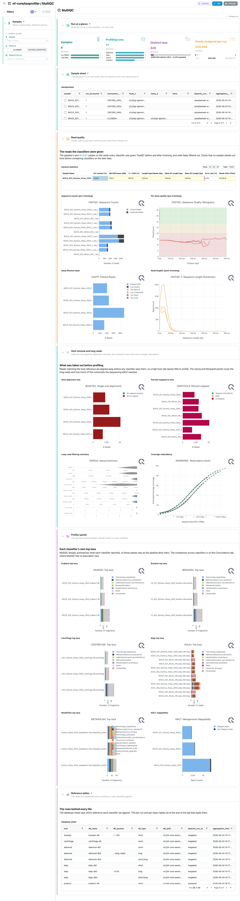
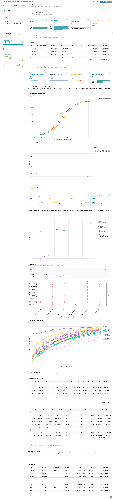

<div class="template-banner">
  <a class="template-banner-logo" href="https://nf-co.re/taxprofiler" target="_blank" title="nf-core/taxprofiler on nf-co.re">
    
    
  </a>
  <div class="template-banner-body">
    <h1 class="template-title">Taxonomic Profiling</h1>
    <p class="template-subtitle">Many classifiers over one set of reads: per-profiler composition, cross-profiler concordance and containment confidence, standardised by taxpasta.</p>
    <p class="template-links">
      <a href="https://nf-co.re/taxprofiler" target="_blank"><i class="mdi mdi-open-in-new"></i> nf-co.re</a>
      <a href="https://github.com/nf-core/taxprofiler" target="_blank"><i class="mdi mdi-github"></i> GitHub</a>
    </p>
  </div>
  <span class="template-status-experimental template-banner-badge" data-tooltip="Experimental: shared as-is. Feedback and PRs welcome."><i class="mdi mdi-flask-outline"></i> Experimental</span>
</div>

<div class="tpl-version-pick" data-latest="2.0.1">
  <span class="tpl-version-icon"><i class="mdi mdi-source-branch"></i></span>
  <span class="tpl-version-label">Template version</span>
  <select id="tpl-version" class="tpl-version-select" aria-label="Template version">
    <option value="2.0.1" selected>2.0.1</option>
  </select>
  <span class="tpl-version-badge">latest</span>
</div>

The taxprofiler template covers the standardised outputs of an nf-core/taxprofiler
run, whichever classifiers it used:

- :material-chart-box-outline: **MultiQC**: FastQC and fastp, host removal, nanopore read stats and coverage redundancy, straight from the pipeline's MultiQC report
- :material-chart-line: **Depth and diversity**: nonpareil coverage against sequencing effort, and how diverse and how even each classifier says the community is
- :material-bacteria-outline: **Profiles**: stacked taxonomy per profiling run and rank, Krona rings per classifier, beside sylph containment and melon genome copies
- :material-graph-outline: **Concordance**: a Bray-Curtis ordination over every profiling run, the classifier overlap as an UpSet, a root-to-species flow and a taxon-by-run heatmap
- :material-target: **Confidence**: containment identity against abundance, with a record card for the genome picked on the scatter

`Run at a glance` and a collapsed `Sample sheet` are pinned to the top of every
tab, and `Reference tables`, holding the database sheet, to the bottom.

!!! info "Whatever profilers your run used"
    taxprofiler runs an arbitrary subset of its profilers, chosen by the database
    sheet and the `run_*` flags. The template deliberately does not gate each
    profiler behind a variable: every profiler-specific data collection is
    optional, and the self-adapting layout drops whatever a run did not produce.
    One template covers a two-profiler run and a fifteen-profiler run alike.

!!! note "taxpasta is the hub"
    One data collection per profiler would make the template's shape depend on
    the run's flags, so instead every `taxpasta/*.tsv` is melted into one long
    profiler, database, sample and taxon frame, and the presence matrix, the
    Bray-Curtis PCoA ordination, the concordance matrix and the per-sample
    summary all read it back. Two tools sit beside it because taxpasta has no
    parser for either: `sylph` (containment ANI) and `melon` (genome copies from
    nanopore marker genes). MetaPhlAn reuses an existing catalog entry.

---

## :material-rocket-launch-outline: Quick start

=== "Point at a finished run"

    ```bash
    depictio run \
      --template nf-core/taxprofiler/latest \
      --data-root /path/to/taxprofiler_results
    ```

    `--data-root` is the only thing you have to pass. The samplesheet is
    auto-detected from `{DATA_ROOT}/input/`; pass `--var SAMPLESHEET_FILE=...`
    to point elsewhere. The `run_*` flags come from `pipeline_info/params.json`.

=== "From the pipeline itself (v1.10.0+)"

    ```bash
    depictio-cli config nextflow --install     # once per machine
    nextflow run nf-core/taxprofiler -r 2.0.1 -profile docker --outdir results
    ```

    No `depictio run`, and no template named: the pipeline ingests its own
    output directory when it finishes and resolves this template from its own
    manifest. See [Nextflow trigger](../../depictio-cli/nextflow-trigger.md).

---

## :material-book-open-variant: Reference

The template reads the taxpasta standardised tables, the profilers' own report
files, sylph's containment tables, melon's genome-copy tables and the pipeline's
MultiQC parquet. Profiler and database ids are recovered from the taxpasta file
names, so no profiler variable is needed. A project-local recipe repairs the
taxon names that taxprofiler's `--add-name false` taxpasta invocation drops,
joining them back from the kraken2, krakenuniq and centrifuge reports.

!!! info "Self-adapting layout"
    The dashboard adapts to whatever the run actually produced: components bound
    to pruned or unparsed data collections are hidden, tabs left with no real
    visualizations are dropped entirely, and the remaining components are
    re-packed so there are no empty rows. A profiler that ran but assigned
    nothing drops out the same way.

<div class="tpl-version-block" data-version="2.0.1" markdown>

--8<-- "pipeline-templates/nf-core/_generated/taxprofiler-latest.md"

</div>

---

## :material-view-dashboard-outline: Dashboard tabs

Five tabs, read as a funnel: are the reads worth classifying, did the sequencing
go deep enough and how diverse is what it found, what does each classifier say
the community is, where do the classifiers disagree, and how much should a given
call be trusted. Each tab below carries the **same icon and colour the dashboard
gives it**, so the page and the app read alike. The `Samples` filter group and
the `Run at a glance` cards are persistent and pinned to the top of every tab,
with the collapsed `Sample sheet` under them, and `Reference tables` is pinned
to the bottom of every tab.

=== "{ width=18 }{ width=18 } MultiQC"

    *Are the reads worth classifying, and what did preprocessing take out?*

    [{ loading=lazy }](../../images/pipeline-templates/nf-core/taxprofiler/multiqc_light.png){ .tpl-shot target="_blank" rel="noopener" }

    Four run-level cards, then the panels MultiQC already built: the general
    statistics table, FastQC before and after trimming, fastp's filtered reads,
    the bowtie2 and samtools views of host removal, nanoq's nanopore summary and
    nonpareil's redundancy curves. The collapsed *Profiler panels* section holds
    each classifier's own top-taxa panel; MultiQC ships no bracken or centrifuge
    module, so nf-core/taxprofiler runs the kraken module three times behind
    `path_filters`, one anchor each.

    ??? abstract ":material-tune-variant: Filters and components"

        **Filters** · `Sample`, `Platform` and `Sequencing run` on `samplesheet`,
        in the *Samples* group, persistent and pinned to the top of every tab.

        | Section | What it holds |
        |---|---|
        | Run at a glance | 4 cards, pinned to every tab |
        | Sample sheet | *Samplesheet*, collapsed and pinned to every tab |
        | Read quality | *General statistics* + 4 MultiQC panels (fastqc, fastp) |
        | Host removal and long reads | 4 MultiQC panels (bowtie2, samtools, nanoq, nonpareil) |
        | Profiler panels | 6 MultiQC panels (Kraken2, Bracken, Centrifuge, Kaiju and MetaPhlAn top taxa, MALT mappability) |
        | Reference tables | *Database sheet*, pinned to every tab |

=== ":material-chart-line:{ .mc-cyan } Depth and diversity"

    *Did the sequencing go deep enough, and how diverse is what it found?*

    [{ loading=lazy }](../../images/pipeline-templates/nf-core/taxprofiler/depth_and_diversity_light.png){ .tpl-shot target="_blank" rel="noopener" }

    Nonpareil turns read redundancy into the share of the metagenome each library
    covers. One curve per library against sequencing effort: a curve still
    climbing at the effort sequenced means every classifier on the later tabs is
    working from an incomplete view. The scatter beside it puts coverage against
    diversity, sized by how much deeper the run would have to go, and a box or
    lasso selection there carries the libraries to the nonpareil table. *Alpha
    diversity* treats each profile as a distribution rather than a list: richness
    against Shannon diversity per profiling run (selectable, carrying
    `profiler_db` to the per-run table), a dot plot of diversity and top-taxon
    share, and a rank-abundance curve that saturates early when few taxa carry
    the profile.

    ??? abstract ":material-tune-variant: Filters and components"

        **Filters** · `Metagenome coverage` and `Nonpareil diversity` ranges on
        `nonpareil_summary`, plus `Taxa observed` and `Evenness` ranges on
        `taxpasta_sample_summary`, in a *Depth scope* group.

        | Section | What it holds |
        |---|---|
        | Coverage redundancy | 4 cards, *Coverage against sequencing effort*, *Coverage against diversity* |
        | Alpha diversity | 4 cards, *Richness against diversity*, *Diversity by run*, *Rank-abundance accumulation* |
        | Depth tables | *Nonpareil per-library statistics*, *Per-run profile statistics* |

    !!! tip "The coverage section needs nonpareil"
        The two nonpareil collections are optional and only written by a
        short-read run with `--run_nonpareil`. Without them the coverage section
        disappears and the tab opens on the diversity tiles.

=== ":material-bacteria-outline:{ .mc-grape } Profiles"

    *What each classifier says the community is made of.*

    [{ loading=lazy }](../../images/pipeline-templates/nf-core/taxprofiler/profiles_light.png){ .tpl-shot target="_blank" rel="noopener" }

    One stacked bar per profiling run, a classifier and database pair, switchable
    by rank in the tile header, with a strip above the bars naming the
    classifier. Narrow the sample filter to one sample to read its runs side by
    side. *Lineage rings* draws the same profiles as Krona rings, one wedge per
    classifier from the domain out to the species. *Containment composition*
    shows the samples as sylph reconstructs them, which disagrees in a way that
    says something about the reference database rather than about the sample.
    The collapsed *Genome copies* section carries melon, whose sample id lives
    only in its output path, so its rows are pooled across the long-read samples.

    ??? abstract ":material-tune-variant: Filters and components"

        **Filters** · `Classifier`, `Database` and a `Relative abundance` range on
        `taxpasta_profiles`, `Domain` on `taxpasta_lineage` and `Melon phylum` on
        `melon_ranks`, in a *Profile scope* group.

        | Section | What it holds |
        |---|---|
        | Composition | 4 cards, *Community composition per profiling run* |
        | Lineage rings | *Krona rings per classifier* |
        | Containment composition | *sylph composition* |
        | Genome copies | *Melon genome-copy hierarchy*, *Estimated copies per species*, *Melon lineages* |
        | Profile tables | *Cross-profiler abundances*, *Cross-profiler lineages*, *sylph clade abundances* |

=== ":material-graph-outline:{ .mc-indigo } Concordance"

    *Where the classifiers agree, and where each one is on its own.*

    [{ loading=lazy }](../../images/pipeline-templates/nf-core/taxprofiler/concordance_light.png){ .tpl-shot target="_blank" rel="noopener" }

    The Bray-Curtis PCoA puts one point per sample and profiling run, so the
    spread reads as classifier disagreement rather than as biological distance:
    runs of the same sample should cluster whatever classifier produced them.
    The ordination is the tab's selection source: box or lasso points and their
    `profiler_db` narrows the root-to-species flow below. The UpSet plot shows the
    intersections a pairwise view cannot, how many taxa were found by exactly one
    set of classifiers, and the Sankey follows the reads from the root down the
    taxonomy, unclassified branch included. The collapsed heatmap clusters the
    top taxa across every profiling run.

    ??? abstract ":material-tune-variant: Filters and components"

        **Filters** · `Classifier` and `Platform` on `taxpasta_embedding`, a
        `Classifiers per taxon` range on `taxpasta_presence`, and `Domain` and
        `Flow classifier` on `taxpasta_lineage`, in an *Ordination scope* group.

        | Section | What it holds |
        |---|---|
        | Ordination | 4 cards, *Bray-Curtis ordination* |
        | Shared taxa | *Classifier detection overlap* |
        | Taxonomic flow | *Root to species flow* |
        | Taxon by run matrix | *Taxon by run heatmap* |

=== ":material-target:{ .mc-cyan } Confidence"

    *How much to trust a call, from how close the reads are to the reference.*

    [{ loading=lazy }](../../images/pipeline-templates/nf-core/taxprofiler/confidence_light.png){ .tpl-shot target="_blank" rel="noopener" }

    sylph reports the adjusted ANI of every containment match beside its
    abundance, so the two can be read together: a high-abundance, low-ANI genome
    is a confident-looking call that is really a divergent relative of the
    reference. The dot plot and the scatter show those axes at different
    resolutions. Picking a point on the scatter fills the linked *Picked genome*
    record card beside it, one card per sample the genome was detected in, which
    folds to a slim rail until a point is picked. The containment table below has
    row selection on the sample.

    ??? abstract ":material-tune-variant: Filters and components"

        **Filters** · `Adjusted ANI` and `Taxonomic abundance` ranges on
        `sylph_ani`, in a *Confidence ranges* group.

        | Section | What it holds |
        |---|---|
        | Containment identity | 4 cards, *ANI by genome and sample*, *ANI against abundance*, *Picked genome*, *sylph containment table* |

!!! tip "Which panels the sample filter reaches"
    The persistent `Samples` filter narrows every taxpasta and sylph tile, plus
    the fastp and post-trimming FastQC panels. It does not reach the
    per-classifier top-taxa panels: MultiQC keys those on a sample id carrying
    the database as a suffix, which no samplesheet value reduces to. The
    cross-classifier views of the same data, on the later tabs, do filter.

---

## :material-play-circle-outline: Running the pipeline

Depictio reads the **output** of nf-core/taxprofiler, it does not run the
pipeline. Run the pipeline first:

```bash
nextflow run nf-core/taxprofiler -r 2.0.1 \
  --input samplesheet.csv \
  --databases database.csv \
  --perform_shortread_qc --run_profile_standardisation \
  --run_kraken2 --run_bracken --run_sylph \
  --perform_shortread_redundancyestimation \
  --outdir results -profile docker
```

Then point Depictio at the results:

```bash
depictio run --template nf-core/taxprofiler/latest \
  --data-root results/
```

See [nf-co.re/taxprofiler/usage](https://nf-co.re/taxprofiler/2.0.1/docs/usage)
for full pipeline documentation.

---

## :material-folder-open-outline: Required data structure

Point `--data-root` at the directory holding the pipeline output. Depictio scans
recursively, so only the parts a run actually wrote have to be present.
`--run_profile_standardisation` is the one real requirement: the five taxpasta
collections are what every cross-profiler tile is built from.

```text
<DATA_ROOT>/
├── input/                                     # not written by the pipeline, see Test data
│   ├── samplesheet.csv                        # --var SAMPLESHEET_FILE (auto-detected)
│   └── database.csv                           # matched as input/database*.csv
├── pipeline_info/
│   ├── params.json                            # the run_* flags the layout adapts to
│   └── software_versions.yml
├── multiqc/multiqc_data/
│   └── multiqc.parquet
├── taxpasta/
│   └── <profiler>_<database>.tsv              # the hub, one table per combination
├── kraken2/, krakenuniq/, centrifuge/
│   └── <sample>/*.report.txt                  # where the taxon names come back from
├── sylph/                                     # ⚠ Requires --run_sylph
│   ├── sylph_<db>_combined_reports.tsv
│   └── <sample>/*.sylph.tsv, *.sylphmpa
├── melon/                                     # ⚠ Requires --run_melon and long reads
│   └── <database>/<sample>_<database>/*.tsv
├── nanoq/*.stats
└── nonpareil/nonpareil_all_samples.tsv       # ⚠ Requires --run_nonpareil (short reads)
```

---

## :material-flask-outline: Validation runs

The repository ships
[`download_test_data.sh`](https://github.com/depictio/depictio/blob/main/depictio/projects/nf-core/taxprofiler/2.0.1/download_test_data.sh),
which fetches the subset of nf-core's AWS megatest run that the template needs:

```bash
bash depictio/projects/nf-core/taxprofiler/2.0.1/download_test_data.sh \
  /tmp/taxprofiler_test
```

The run is
`s3://nf-core-awsmegatests/taxprofiler/results-70ecc15e49b4f1fcf79d876643b5d14b65c66178/`:
3 mock communities across 2 sequencing platforms and 12 profiler/database
combinations. Only the per-sample summary tables are fetched; the read-level
outputs are roughly 3 GB and the template never reads them. taxprofiler does not
copy its two input sheets into the results tree, so the script curls them from
the test-datasets URLs in `params.json` into `input/` after the S3 fetch.

Then run Depictio against it:

```bash
depictio run \
  --template nf-core/taxprofiler/latest \
  --data-root /tmp/taxprofiler_test
```

---

## :material-link-variant: Additional resources

- [nf-co.re/taxprofiler](https://nf-co.re/taxprofiler): official pipeline documentation
- [nf-co.re/taxprofiler/2.0.1/results](https://nf-co.re/taxprofiler/2.0.1/results): AWS test results
- [taxpasta](https://taxpasta.readthedocs.io): the standardisation step the hub collection is built on
- [Template System Reference](../../usage/projects/templates.md): YAML format, variables, conditionals
- [Recipes](../../usage/projects/recipes.md): how to read, test, and write recipes

---

## :material-account-group-outline: Authorship

<div class="tpl-credits">
  <div class="tpl-credit">
    <span class="tpl-credit-role"><i class="mdi mdi-code-braces"></i> Developers</span>
    <span class="tpl-credit-note">Wrote the template, its recipes and its dashboards.</span>
    <a class="tpl-person" href="https://github.com/weber8thomas" target="_blank" rel="noopener">
       weber8thomas
    </a>
  </div>
  <div class="tpl-credit">
    <span class="tpl-credit-role"><i class="mdi mdi-eye-check-outline"></i> Reviewers</span>
    <span class="tpl-credit-note">Nobody has run it on their own data and signed it off yet, which is what keeps it Experimental.</span>
    <span class="tpl-person"><i class="mdi mdi-account-plus-outline"></i> Open</span>
  </div>
  <div class="tpl-credit">
    <span class="tpl-credit-role"><i class="mdi mdi-wrench-outline"></i> Maintainers</span>
    <span class="tpl-credit-note">Keep it working as nf-core/taxprofiler releases.</span>
    <a class="tpl-person" href="https://github.com/weber8thomas" target="_blank" rel="noopener">
       weber8thomas
    </a>
  </div>
</div>

Reviewing a template on your own data, or taking over a role here, is a
contribution in itself: the [contributing guide](../../developer/contributing-templates.md)
says what each one involves.
