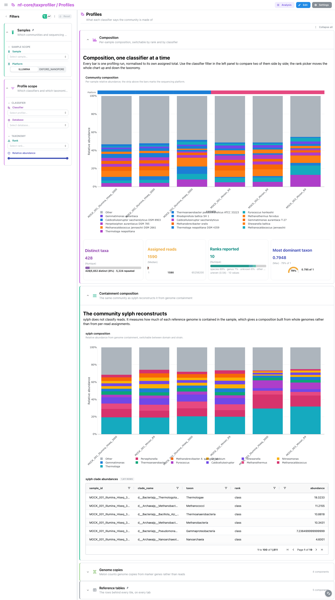
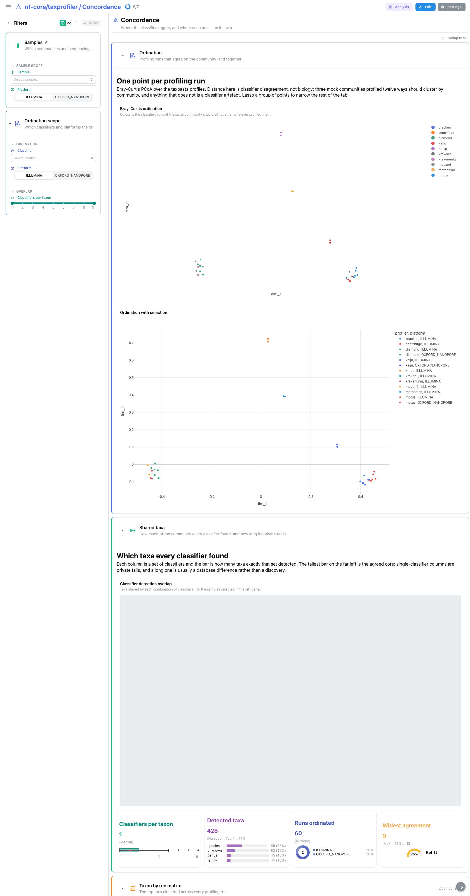
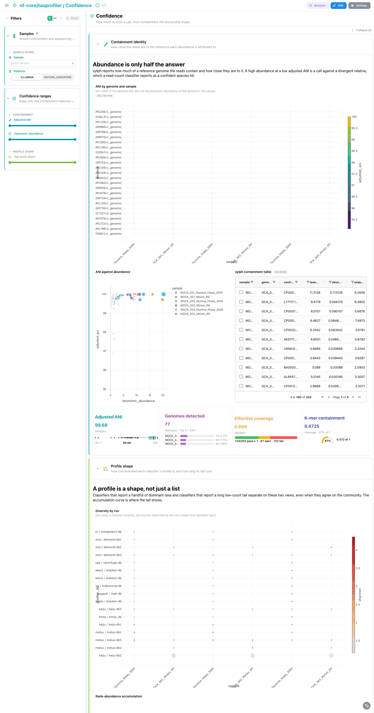

<div class="template-banner">
  <a class="template-banner-logo" href="https://nf-co.re/taxprofiler" target="_blank" title="nf-core/taxprofiler on nf-co.re">
    
    
  </a>
  <div class="template-banner-body">
    <h1 class="template-title">Taxonomic Profiling</h1>
    <p class="template-subtitle">Many classifiers over one set of reads: per-profiler composition, cross-profiler concordance and containment confidence, standardised by taxpasta.</p>
    <p class="template-links">
      <a href="https://nf-co.re/taxprofiler" target="_blank"><i class="mdi mdi-open-in-new"></i> nf-co.re</a>
      <a href="https://github.com/nf-core/taxprofiler" target="_blank"><i class="mdi mdi-github"></i> GitHub</a>
    </p>
  </div>
  <span class="template-status-experimental template-banner-badge" data-tooltip="Experimental — shared as-is. Feedback and PRs welcome."><i class="mdi mdi-flask-outline"></i> Experimental</span>
</div>

The taxprofiler template covers the standardised outputs of an nf-core/taxprofiler
run, whichever classifiers it used:

- :material-chart-box-outline: **Read QC**: FastQC and fastp, host removal, nanopore read stats and coverage redundancy, straight from the pipeline's MultiQC report
- :material-bacteria-outline: **Composition**: stacked taxonomy per classifier and rank, beside sylph containment and melon genome copies
- :material-graph-outline: **Concordance**: a Bray-Curtis ordination over every profiling run, the classifier overlap as an UpSet, and a taxon-by-run heatmap
- :material-target: **Confidence**: containment identity against abundance, and profile shape as diversity against top-taxon share
- :material-table: **Reference tables**: the long profiles frame, the per-run statistics, the samplesheet and the database sheet, pinned to the bottom of every tab

!!! info "Whatever profilers your run used"
    taxprofiler runs an arbitrary subset of its profilers, chosen by the database
    sheet and the `run_*` flags. The template deliberately does not gate each
    profiler behind a variable: every profiler-specific data collection is
    optional, and the self-adapting layout drops whatever a run did not produce.
    One template covers a two-profiler run and a fifteen-profiler run alike.

!!! note "taxpasta is the hub"
    One data collection per profiler would make the template's shape depend on
    the run's flags, so instead every `taxpasta/*.tsv` is melted into one long
    profiler, database, sample and taxon frame, and the presence matrix, the
    Bray-Curtis PCoA ordination, the concordance matrix and the per-sample
    summary all read it back. Two tools sit beside it because taxpasta has no
    parser for either: `sylph` (containment ANI) and `melon` (genome copies from
    nanopore marker genes). MetaPhlAn reuses an existing catalog entry.

---

## Quick start

=== "Point at a finished run"

    ```bash
    depictio run \
      --template nf-core/taxprofiler/latest \
      --data-root /path/to/taxprofiler_results
    ```

    `--data-root` is the only thing you have to pass. The samplesheet is
    auto-detected from `{DATA_ROOT}/input/`; pass `--var SAMPLESHEET_FILE=...`
    to point elsewhere. The `run_*` flags come from `pipeline_info/params.json`.

=== "From the pipeline itself (v1.10.0+)"

    ```bash
    depictio-cli config nextflow --install     # once per machine
    nextflow run nf-core/taxprofiler -profile docker --outdir results
    ```

    No `depictio run`, and no template named: the pipeline ingests its own
    output directory when it finishes and resolves this template from its own
    manifest. See [Nextflow trigger](../../depictio-cli/nextflow-trigger.md).

---

## :material-book-open-variant: Reference

The template reads the taxpasta standardised tables, the profilers' own report
files, sylph's containment tables, melon's genome-copy tables and the pipeline's
MultiQC parquet. Profiler and database ids are recovered from the taxpasta file
names, so no profiler variable is needed. A project-local recipe repairs the
taxon names that taxprofiler's `--add-name false` taxpasta invocation drops,
joining them back from the kraken2, krakenuniq and centrifuge reports.

!!! info "Self-adapting layout"
    The dashboard adapts to whatever the run actually produced: components bound
    to pruned or unparsed data collections are hidden, tabs left with no real
    visualizations are dropped entirely, and the remaining components are
    re-packed so there are no empty rows. A profiler that ran but assigned
    nothing drops out the same way.

=== ":material-tag-check-outline: 2.0.1 (latest)"

    --8<-- "pipeline-templates/nf-core/_generated/taxprofiler-latest.md"

---

## :material-view-dashboard-outline: Dashboard tabs

Four tabs, read as a funnel: are the reads worth classifying, what does each
classifier say the community is, where do the classifiers disagree, and how much
should a given call be trusted. Each tab below carries the **same icon and colour
the dashboard gives it**, so the page and the app read alike. The `Samples`
filter group is persistent and pinned to the top of every tab, and
`Reference tables` is pinned to the bottom of every tab.

=== ":material-chart-box-outline:{ .mc-orange } Read QC"

    *Are the reads worth classifying, and what did preprocessing take out?*

    [](../../images/pipeline-templates/nf-core/taxprofiler/read_qc_light.png){target="_blank" rel="noopener"}

    Four run-level cards, then the panels MultiQC already built: FastQC before
    and after trimming, fastp's filtered reads, the bowtie2 and samtools views of
    host removal, nanoq's nanopore summary and nonpareil's redundancy curves.
    Nonpareil answers what no classifier can, how much of the community the
    sequencing depth reached, which is the ceiling on everything downstream. The
    collapsed *Profiler panels* section holds each classifier's own top-taxa
    panel; MultiQC ships no bracken or centrifuge module, so nf-core/taxprofiler
    runs the kraken module three times behind `path_filters`, one anchor each.

    ??? abstract ":material-tune-variant: Filters and components"

        **Filters** · `Sample` and `Platform` on `samplesheet`, persistent and
        pinned to the top of every tab, plus `Taxa observed` and
        `Shannon diversity` ranges in a collapsed *Read stats* group.

        | Section | What it holds |
        |---|---|
        | Run at a glance | 4 cards |
        | Read quality | 4 MultiQC panels (fastqc, fastp) |
        | Host removal and long reads | 4 MultiQC panels (bowtie2, samtools, nanoq, nonpareil) |
        | Profiler panels | 6 MultiQC top-taxa panels |
        | Reference tables | *Cross-profiler abundances*, *Per-run profile statistics*, *Samplesheet*, *Database sheet* |

=== ":material-bacteria-outline:{ .mc-grape } Profiles"

    *What each classifier says the community is made of.*

    [](../../images/pipeline-templates/nf-core/taxprofiler/profiles_light.png){target="_blank" rel="noopener"}

    One stacked taxonomy panel over the whole hub, switchable by rank and
    narrowed by the *Profile scope* filter, so the same tile shows one classifier
    at a time or all of them. The gauge beside it reports the share held by the
    single most dominant taxon: past half, the profile is either a very simple
    community or a classifier collapsed onto one reference. *Containment
    composition* shows the same samples as sylph reconstructs them, which
    disagrees in a way that says something about the reference database rather
    than about the sample. *Genome copies* carries melon, whose sample id lives
    only in its output path, so its rows are pooled across the long-read samples.

    ??? abstract ":material-tune-variant: Filters and components"

        **Filters** · `Classifier`, `Database` and `Rank` on
        `taxpasta_profiles`, plus a relative-abundance range, in a
        *Profile scope* group.

        | Section | What it holds |
        |---|---|
        | Composition | *Community composition* + 4 cards |
        | Containment composition | *sylph composition*, *sylph clade abundances* |
        | Genome copies | *Melon genome-copy hierarchy*, *Estimated copies per species*, *Melon lineages* |

=== ":material-graph-outline:{ .mc-indigo } Concordance"

    *Where the classifiers agree, and where each one is on its own.*

    [](../../images/pipeline-templates/nf-core/taxprofiler/concordance_light.png){target="_blank" rel="noopener"}

    The Bray-Curtis PCoA puts one point per sample, profiler and database, so the
    spread reads as classifier disagreement rather than as biological distance,
    and the clusters usually form by profiler family. Selecting a point carries
    its `profiler_db` to the pinned per-run table, and picking a row highlights
    its point. The UpSet plot shows the intersections a pairwise view cannot: how
    many taxa were found by exactly one set of classifiers. A long tail of taxa
    found by a single classifier is the normal shape, and its length is the
    interesting number.

    ??? abstract ":material-tune-variant: Filters and components"

        **Filters** · `Classifier` and `Platform` on `taxpasta_embedding`, plus a
        `Classifiers per taxon` range on `taxpasta_presence`, in an
        *Ordination scope* group.

        | Section | What it holds |
        |---|---|
        | Ordination | *Bray-Curtis ordination*, *Ordination with selection* |
        | Shared taxa | *Classifier detection overlap* + 4 cards |
        | Taxon by run matrix | *Taxon by run heatmap* |

=== ":material-target:{ .mc-cyan } Confidence"

    *How much to trust a call, from containment identity and profile shape.*

    [](../../images/pipeline-templates/nf-core/taxprofiler/confidence_light.png){target="_blank" rel="noopener"}

    sylph reports the adjusted ANI of every containment match beside its
    abundance, so the two can be read together: a high-abundance, low-ANI genome
    is a confident-looking call that is really a divergent relative of the
    reference. The dot plot and the scatter show those axes at different
    resolutions, and the containment table has row selection on the sample.
    *Profile shape* treats a profile as a distribution rather than a list:
    Shannon diversity against top-taxon share per run, and a rank-abundance
    curve that reaches one after a handful of taxa when few organisms carry it.

    ??? abstract ":material-tune-variant: Filters and components"

        **Filters** · `Adjusted ANI` and `Taxonomic abundance` ranges on
        `sylph_ani`, plus a `Top-taxon share` range on
        `taxpasta_sample_summary`, in a *Confidence ranges* group.

        | Section | What it holds |
        |---|---|
        | Containment identity | *ANI by genome and sample*, *ANI against abundance*, *sylph containment table* + 4 cards |
        | Profile shape | *Diversity by run*, *Rank-abundance accumulation* |

!!! tip "Which panels the sample filter reaches"
    The persistent `Samples` filter narrows every taxpasta and sylph tile, plus
    the fastp and post-trimming FastQC panels. It does not reach the
    per-classifier top-taxa panels: MultiQC keys those on a sample id carrying
    the database as a suffix, which no samplesheet value reduces to. The
    cross-classifier view of the same data, two tabs along, does filter.

---

## Running the pipeline

Depictio reads the **output** of nf-core/taxprofiler, it does not run the
pipeline. Run the pipeline first:

```bash
nextflow run nf-core/taxprofiler \
  --input samplesheet.csv \
  --databases database.csv \
  --perform_shortread_qc --run_profile_standardisation \
  --run_kraken2 --run_bracken --run_sylph \
  -profile docker
```

Then point Depictio at the results:

```bash
depictio run --template nf-core/taxprofiler/latest \
  --data-root results/
```

See [nf-co.re/taxprofiler/usage](https://nf-co.re/taxprofiler/2.0.1/docs/usage)
for full pipeline documentation.

---

## Required data structure

Point `--data-root` at the directory holding the pipeline output. Depictio scans
recursively, so only the parts a run actually wrote have to be present.
`--run_profile_standardisation` is the one real requirement: the five taxpasta
collections are what every cross-profiler tile is built from.

```text
<DATA_ROOT>/
├── input/                                     # not written by the pipeline, see Test data
│   ├── samplesheet.csv                        # --var SAMPLESHEET_FILE (auto-detected)
│   └── database.csv                           # matched as input/database*.csv
├── pipeline_info/
│   ├── params.json                            # the run_* flags the layout adapts to
│   └── software_versions.yml
├── multiqc/multiqc_data/
│   └── multiqc.parquet
├── taxpasta/
│   └── <profiler>_<database>.tsv              # the hub, one table per combination
├── kraken2/, krakenuniq/, centrifuge/
│   └── <sample>/*.report.txt                  # where the taxon names come back from
├── sylph/                                     # ⚠ Requires --run_sylph
│   ├── sylph_<db>_combined_reports.tsv
│   └── <sample>/*.sylph.tsv, *.sylphmpa
├── melon/                                     # ⚠ Requires --run_melon and long reads
│   └── <database>/<sample>_<database>/*.tsv
├── nanoq/*.stats
└── nonpareil/nonpareil_all_samples.tsv
```

---

## Test data

The repository ships
[`download_test_data.sh`](https://github.com/depictio/depictio/blob/main/depictio/projects/nf-core/taxprofiler/2.0.1/download_test_data.sh),
which fetches the subset of nf-core's AWS megatest run that the template needs:

```bash
bash depictio/projects/nf-core/taxprofiler/2.0.1/download_test_data.sh \
  /tmp/taxprofiler_test
```

The run is
`s3://nf-core-awsmegatests/taxprofiler/results-70ecc15e49b4f1fcf79d876643b5d14b65c66178/`:
3 mock communities across 2 sequencing platforms and 12 profiler/database
combinations. Only the per-sample summary tables are fetched; the read-level
outputs are roughly 3 GB and the template never reads them. taxprofiler does not
copy its two input sheets into the results tree, so the script curls them from
the test-datasets URLs in `params.json` into `input/` after the S3 fetch.

Then run Depictio against it:

```bash
depictio run \
  --template nf-core/taxprofiler/latest \
  --data-root /tmp/taxprofiler_test
```

---

## Additional resources

- [nf-co.re/taxprofiler](https://nf-co.re/taxprofiler): official pipeline documentation
- [nf-co.re/taxprofiler/2.0.1/results](https://nf-co.re/taxprofiler/2.0.1/results): AWS test results
- [taxpasta](https://taxpasta.readthedocs.io): the standardisation step the hub collection is built on
- [Template System Reference](../../usage/projects/templates.md): YAML format, variables, conditionals
- [Recipes](../../usage/projects/recipes.md): how to read, test, and write recipes
