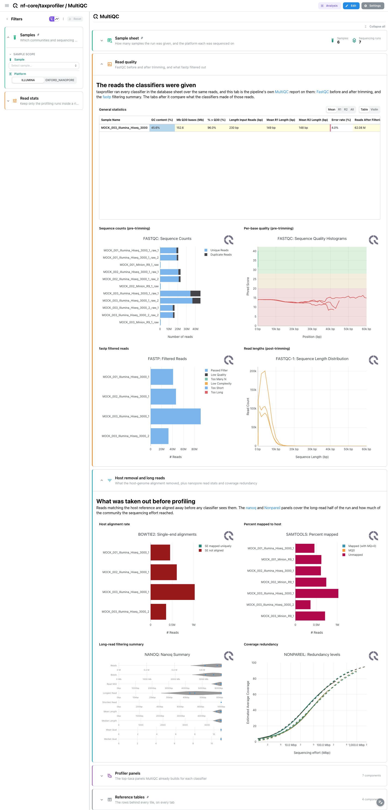
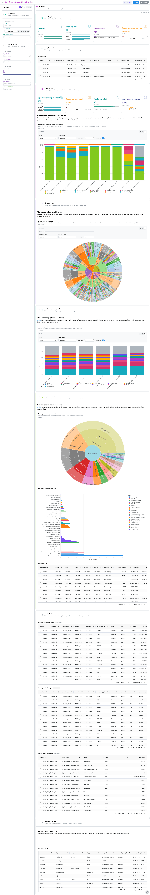
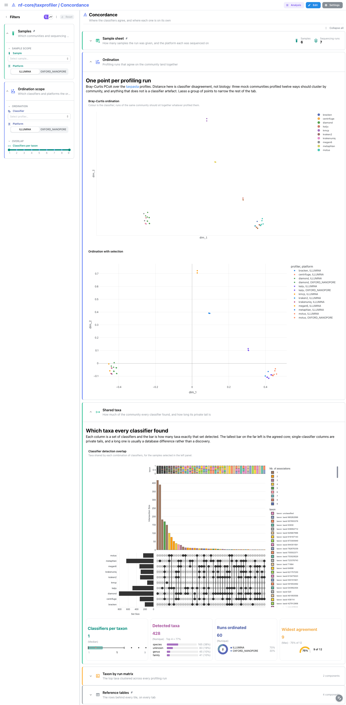
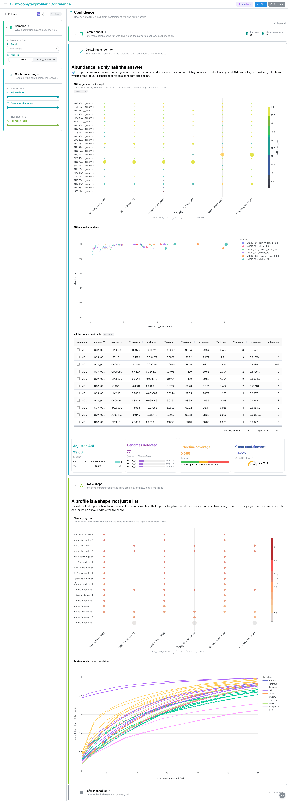

<div class="template-banner">
  <a class="template-banner-logo" href="https://nf-co.re/taxprofiler" target="_blank" title="nf-core/taxprofiler on nf-co.re">
    
    
  </a>
  <div class="template-banner-body">
    <h1 class="template-title">Taxonomic Profiling</h1>
    <p class="template-subtitle">Many classifiers over one set of reads: per-profiler composition, cross-profiler concordance and containment confidence, standardised by taxpasta.</p>
    <p class="template-links">
      <a href="https://nf-co.re/taxprofiler" target="_blank"><i class="mdi mdi-open-in-new"></i> nf-co.re</a>
      <a href="https://github.com/nf-core/taxprofiler" target="_blank"><i class="mdi mdi-github"></i> GitHub</a>
    </p>
  </div>
  <span class="template-status-experimental template-banner-badge" data-tooltip="Experimental: shared as-is. Feedback and PRs welcome."><i class="mdi mdi-flask-outline"></i> Experimental</span>
</div>

<div class="tpl-version-pick" data-latest="2.0.1">
  <span class="tpl-version-icon"><i class="mdi mdi-source-branch"></i></span>
  <span class="tpl-version-label">Template version</span>
  <select id="tpl-version" class="tpl-version-select" aria-label="Template version">
    <option value="2.0.1" selected>2.0.1</option>
  </select>
  <span class="tpl-version-badge">latest</span>
</div>

The taxprofiler template covers the standardised outputs of an nf-core/taxprofiler
run, whichever classifiers it used:

- :material-compass-outline: **Overview**: the run in four key figures, live findings and four figures, each linked to the tab that explains it
- :material-chart-box-outline: **Data & QC**: FastQC and fastp, host removal, nanopore read stats and coverage redundancy from the MultiQC report, and the sequencing depth Nonpareil models
- :material-bacteria-outline: **Communities**: the composition per profiling run beside sylph containment and melon genome copies, and the diversity of each profile
- :material-graph-outline: **Classifiers**: a Bray-Curtis ordination over every profiling run, the classifier overlap as an UpSet, the taxonomic flow, and sylph containment identity

!!! info "Whatever profilers your run used"
    taxprofiler runs an arbitrary subset of its profilers, chosen by the database
    sheet and the `run_*` flags. The template deliberately does not gate each
    profiler behind a variable: every profiler-specific data collection is
    optional, and the self-adapting layout drops whatever a run did not produce.
    One template covers a two-profiler run and a fifteen-profiler run alike.

!!! note "taxpasta is the hub"
    One data collection per profiler would make the template's shape depend on
    the run's flags, so instead every `taxpasta/*.tsv` is melted into one long
    profiler, database, sample and taxon frame, and the presence matrix, the
    Bray-Curtis PCoA ordination, the concordance matrix and the per-sample
    summary all read it back. Two tools sit beside it because taxpasta has no
    parser for either: `sylph` (containment ANI) and `melon` (genome copies from
    nanopore marker genes). MetaPhlAn reuses an existing catalog entry.

---

## :material-rocket-launch-outline: Quick start

=== "Point at a finished run"

    ```bash
    depictio ingest /path/to/taxprofiler_results \
      --template nf-core/taxprofiler/latest
    ```

    The results directory is the only thing you have to pass. The samplesheet is
    auto-detected from `{DATA_ROOT}/input/`; pass `--var SAMPLESHEET_FILE=...`
    to point elsewhere. The `run_*` flags come from `pipeline_info/params.json`.

=== "From the pipeline itself (v1.10.0+)"

    ```bash
    depictio config nextflow --install     # once per machine
    nextflow run nf-core/taxprofiler -r 2.0.1 -profile docker --outdir results
    ```

    No `depictio ingest`, and no template named: the pipeline ingests its own
    output directory when it finishes and resolves this template from its own
    manifest. See [Nextflow trigger](../../depictio-cli/nextflow-trigger.md).

---

## :material-book-open-variant: Reference

The template reads the taxpasta standardised tables, the profilers' own report
files, sylph's containment tables, melon's genome-copy tables and the pipeline's
MultiQC parquet. Profiler and database ids are recovered from the taxpasta file
names, so no profiler variable is needed. A project-local recipe repairs the
taxon names that taxprofiler's `--add-name false` taxpasta invocation drops,
joining them back from the kraken2, krakenuniq and centrifuge reports.

!!! info "Self-adapting layout"
    The dashboard adapts to whatever the run actually produced: components bound
    to pruned or unparsed data collections are hidden, tabs left with no real
    visualizations are dropped entirely, and the remaining components are
    re-packed so there are no empty rows. A profiler that ran but assigned
    nothing drops out the same way.

<div class="tpl-version-block" data-version="2.0.1" markdown>

--8<-- "pipeline-templates/nf-core/_generated/taxprofiler-latest.md"

</div>

---

## :material-view-dashboard-outline: Dashboard tabs

One dashboard: the **Overview**, then six child tabs in three groups, read as a
funnel from the reads to the taxa the classifiers agree on. Each tab below carries
the **same icon and colour the dashboard gives it**, so the page and the app read
alike.

| Group | Tabs |
|---|---|
| Data & QC | MultiQC, Sequencing depth |
| Communities | Profiles, Diversity |
| Classifiers | Concordance, Confidence |

A profiling run is a sample, a classifier and a database, so most tiles show one
value per run, and the classifier and the sequencing platform take the place of a
design column. Each child tab opens with a short intro and a strip of four cards,
then at most three open sections; tables and details follow, collapsed. The
persistent *Sample filters* (platform, sample, sequencing run) sit in the left panel
and narrow every tab. The *Sample sheet* and *Database sheet* sections are pinned,
collapsed, to the bottom of every child tab.

=== ":material-compass-outline: Overview"

    *Many classifiers, one community, from reads to the taxa they agree on.*

    <!-- screenshot pending v2 -->

    A short hero links the run parameters. *About this dashboard* says how to move
    through the tabs, *The run* lists the samples, classifiers, databases and read
    QC tools, and *Pipeline* walks the six steps from cleaning the reads to
    confirming the calls, each linked to its parameters and its tab. The key
    figures read the taxpasta collections every run writes, so no classifier subset
    leaves a gap.

    ??? abstract ":material-tune-variant: Filters and components"

        **Filters** · the left panel starts collapsed. *Key figures* has its own
        filter bar (the classifier and the sample), and so does *Findings* (the
        platform and the sample): each narrows its own section only.

        | Section | What it holds |
        |---|---|
        | Top | Hero, *About this dashboard*, *The run*, *Pipeline* |
        | Key figures | 4 headline cards: profiling runs, reads assigned, Shannon diversity, classifiers per taxon |
        | Findings | Live result rows, then 4 figures: the composition per profiling run, richness against diversity, the PCoA of the profiles and sylph identity against abundance |
        | How to read this dashboard | The tabs by group, each with its question |

=== "{ width=18 }{ width=18 } MultiQC"

    **Data & QC** · *Were the reads clean, and how much host was removed?*

    [{ loading=lazy }](../../images/pipeline-templates/nf-core/taxprofiler/multiqc_light.png){ .tpl-shot target="_blank" rel="noopener" }

    MultiQC panels only: general statistics, fastp filtered reads, FastQC quality
    before trimming, then the host alignment and the share mapped to the host. The
    read counts and lengths, nanoq's long-read summary and Nonpareil's redundancy
    are collapsed, and so is each classifier's own top-taxa panel. MultiQC has no
    Bracken or Centrifuge module, so nf-core/taxprofiler runs the kraken module
    three times behind `path_filters`.

    ??? abstract ":material-tune-variant: Filters and components"

        **Filters** · `Sample`, read from the MultiQC report.

        | Section | What it holds |
        |---|---|
        | QC overview | 5 MultiQC panels |
        | QC details (collapsed) | 4 MultiQC panels |
        | Profiler panels (collapsed) | 6 MultiQC panels |

=== ":material-waves:{ .mc-cyan } Sequencing depth"

    **Data & QC** · *Did the sequencing reach enough of each metagenome?*

    <!-- screenshot pending v2 -->

    Nonpareil turns read redundancy into the share of the metagenome each library
    covers. The cards give the median coverage against Nonpareil's 0.95 target,
    the diversity, the effort sequenced and how much deeper the median library
    would have to go. Then the coverage curve of each library, rebuilt from the
    fitted model, and coverage against diversity. Nonpareil runs on the short reads
    only.

    ??? abstract ":material-tune-variant: Filters and components"

        **Filters** · `Metagenome coverage` and `Nonpareil diversity` ranges on
        `nonpareil_summary`, plus the sample filters.

        | Section | What it holds |
        |---|---|
        | Depth at a glance | 4 cards |
        | Coverage curves | 1 advanced visualization |
        | Coverage against diversity | *Coverage against diversity* |
        | Tables (collapsed) | *Nonpareil per library* |

    !!! tip "The Sequencing depth tab needs nonpareil"
        The two nonpareil collections are optional and only written by a
        short-read run with `--perform_shortread_redundancyestimation`. Without
        them the Sequencing depth tab is dropped.

=== ":material-bacteria-outline:{ .mc-grape } Profiles"

    **Communities** · *What does each classifier say the community is made of?*

    [{ loading=lazy }](../../images/pipeline-templates/nf-core/taxprofiler/profiles_light.png){ .tpl-shot target="_blank" rel="noopener" }

    taxpasta standardises every classifier's profile into one table. The
    composition draws one bar per profiling run, so a bar never mixes two naming
    vocabularies: species by default, the eight largest taxa and Other, the rank in
    the tile's settings. Then the Krona rings, one wedge per classifier, and the
    community as sylph rebuilds it from genome containment. melon's genome copies,
    pooled over the long-read samples, and the profile tables are collapsed.

    ??? abstract ":material-tune-variant: Filters and components"

        **Filters** · `Classifier`, `Database` and a relative-abundance range on
        `taxpasta_profiles`, `Domain` on `taxpasta_lineage`, and `Melon phylum`,
        the only filter that reaches melon's pooled table.

        | Section | What it holds |
        |---|---|
        | Profiles at a glance | 4 cards |
        | Composition | 1 advanced visualization |
        | Lineage rings | 1 advanced visualization |
        | Containment composition | 1 advanced visualization |
        | Genome copies (collapsed) | 1 advanced visualization, *Estimated copies per species*, *Melon lineages* |
        | Profile tables (collapsed) | *Cross-classifier abundances*, *Cross-classifier lineages*, *sylph clade abundances* |

=== ":material-chart-bell-curve:{ .mc-lime } Diversity"

    **Communities** · *How diverse is each profile, by each classifier?*

    <!-- screenshot pending v2 -->

    Diversity is computed per profiling run, so one sample has one value per
    classifier, and the spread between them is classifier disagreement. Richness
    against Shannon diversity comes first, then each run's diversity and top-taxon
    share, and the rank-abundance accumulation: a curve that reaches one after a
    handful of taxa is a profile carried by a few organisms.

    ??? abstract ":material-tune-variant: Filters and components"

        **Filters** · `Classifier`, plus `Taxa observed` and `Evenness` ranges, on
        `taxpasta_sample_summary`.

        | Section | What it holds |
        |---|---|
        | Diversity at a glance | 4 cards |
        | Richness and diversity | *Richness against diversity* |
        | Diversity by run | 1 advanced visualization |
        | Profile concentration | *Rank-abundance accumulation* |
        | Tables (collapsed) | *Per-run profile statistics* |

=== ":material-graph-outline:{ .mc-indigo } Concordance"

    **Classifiers** · *Where do the classifiers agree, and where does each stand alone?*

    [{ loading=lazy }](../../images/pipeline-templates/nf-core/taxprofiler/concordance_light.png){ .tpl-shot target="_blank" rel="noopener" }

    The Bray-Curtis PCoA puts one point per profiling run, so runs of one sample
    land together when their classifiers agree; a lasso narrows the flow below to
    the runs it picks. The UpSet counts the taxa each set of classifiers found, and
    the taxonomic flow follows the reads from the root down to the phylum,
    unclassified reads included. The taxon by run heatmap is collapsed.

    ??? abstract ":material-tune-variant: Filters and components"

        **Filters** · `Classifier` and `Platform` on `taxpasta_embedding`, a
        `Classifiers per taxon` range on `taxpasta_presence`, and `Domain` and
        `Flow classifier` on `taxpasta_lineage`.

        | Section | What it holds |
        |---|---|
        | Concordance at a glance | 4 cards |
        | Ordination | 1 advanced visualization |
        | Shared taxa | 1 advanced visualization |
        | Taxonomic flow | 1 advanced visualization |
        | Taxon by run matrix (collapsed) | 1 advanced visualization |

=== ":material-target:{ .mc-teal } Confidence"

    **Classifiers** · *How close are the reads to the genomes sylph matched?*

    [{ loading=lazy }](../../images/pipeline-templates/nf-core/taxprofiler/confidence_light.png){ .tpl-shot target="_blank" rel="noopener" }

    sylph reports the adjusted ANI of every genome it detects beside its abundance,
    so a high-abundance, low-identity genome reads as the divergent relative it is.
    The cards give the median ANI against 95%, the species boundary, the genomes
    detected, the effective coverage and the detections. Then the ANI by genome and
    sample, and identity against abundance beside a record card for the genome you
    pick.

    ??? abstract ":material-tune-variant: Filters and components"

        **Filters** · `Adjusted ANI` and `Taxonomic abundance` ranges on
        `sylph_ani`.

        | Section | What it holds |
        |---|---|
        | Confidence at a glance | 4 cards |
        | Identity by genome | 1 advanced visualization |
        | Identity against abundance | *ANI against abundance* + a genome record card |
        | Tables (collapsed) | *sylph containment table* |

!!! tip "Which panels the sample filter reaches"
    The persistent *Sample filters* narrow every taxpasta and sylph tile, the
    Nonpareil tiles and the MultiQC panels keyed on the sample id. They do not
    reach the per-classifier top-taxa panels: MultiQC keys those on a sample id
    carrying the database as a suffix, which no samplesheet value reduces to. The
    cross-classifier view of the same data, on the Profiles tab, does filter.

Tables and point views select on their entity column: the sample sheet on
`sample`; the Nonpareil scatter and table on `library`; the richness scatter, the
per-run table and the Bray-Curtis ordination on `profiler_db`; the
cross-classifier tables on the taxon `name`, the melon table on `species` and the
sylph clade table on `clade_name`; the ANI scatter and the sylph containment
table on `genome`. A pick narrows the other tiles of its collection and follows
the project links to the collections they reach.

---

## :material-play-circle-outline: Running the pipeline

Depictio reads the **output** of nf-core/taxprofiler, it does not run the
pipeline. Run the pipeline first:

```bash
nextflow run nf-core/taxprofiler -r 2.0.1 \
  --input samplesheet.csv \
  --databases database.csv \
  --perform_shortread_qc --run_profile_standardisation \
  --run_kraken2 --run_bracken --run_sylph \
  --perform_shortread_redundancyestimation \
  --outdir results -profile docker
```

Then point Depictio at the results:

```bash
depictio ingest results/ \
  --template nf-core/taxprofiler/latest
```

See [nf-co.re/taxprofiler/usage](https://nf-co.re/taxprofiler/2.0.1/docs/usage)
for full pipeline documentation.

---

## :material-folder-open-outline: Required data structure

Point `depictio ingest` at the directory holding the pipeline output. Depictio scans
recursively, so only the parts a run actually wrote have to be present.
`--run_profile_standardisation` is the one real requirement: the five taxpasta
collections are what every cross-profiler tile is built from.

```text
<DATA_ROOT>/
├── input/                                     # not written by the pipeline, see Test data
│   ├── samplesheet.csv                        # --var SAMPLESHEET_FILE (auto-detected)
│   └── database.csv                           # matched as input/database*.csv
├── pipeline_info/
│   ├── params.json                            # the run_* flags the layout adapts to
│   └── software_versions.yml
├── multiqc/multiqc_data/
│   └── multiqc.parquet
├── taxpasta/
│   └── <profiler>_<database>.tsv              # the hub, one table per combination
├── kraken2/, krakenuniq/, centrifuge/
│   └── <sample>/*.report.txt                  # where the taxon names come back from
├── sylph/                                     # ⚠ Requires --run_sylph
│   ├── sylph_<db>_combined_reports.tsv
│   └── <sample>/*.sylph.tsv, *.sylphmpa
├── melon/                                     # ⚠ Requires --run_melon and long reads
│   └── <database>/<sample>_<database>/*.tsv
├── nanoq/*.stats
└── nonpareil/nonpareil_all_samples.tsv       # ⚠ Requires --perform_shortread_redundancyestimation (short reads)
```

---

## :material-flask-outline: Validation runs

The repository ships
[`download_test_data.sh`](https://github.com/depictio/depictio/blob/main/depictio/projects/nf-core/taxprofiler/2.0.1/download_test_data.sh),
which fetches the subset of nf-core's AWS megatest run that the template needs:

```bash
bash depictio/projects/nf-core/taxprofiler/2.0.1/download_test_data.sh \
  /tmp/taxprofiler_test
```

The run is
`s3://nf-core-awsmegatests/taxprofiler/results-70ecc15e49b4f1fcf79d876643b5d14b65c66178/`:
3 mock communities across 2 sequencing platforms and 12 profiler/database
combinations. Only the per-sample summary tables are fetched; the read-level
outputs are roughly 3 GB and the template never reads them. taxprofiler does not
copy its two input sheets into the results tree, so the script curls them from
the test-datasets URLs in `params.json` into `input/` after the S3 fetch.

Then run Depictio against it:

```bash
depictio ingest /tmp/taxprofiler_test \
  --template nf-core/taxprofiler/latest
```

---

## :material-link-variant: Additional resources

- [nf-co.re/taxprofiler](https://nf-co.re/taxprofiler): official pipeline documentation
- [nf-co.re/taxprofiler/2.0.1/results](https://nf-co.re/taxprofiler/2.0.1/results): AWS test results
- [taxpasta](https://taxpasta.readthedocs.io): the standardisation step the hub collection is built on
- [Template System Reference](../../usage/projects/templates.md): YAML format, variables, conditionals
- [Recipes](../../usage/projects/recipes.md): how to read, test, and write recipes

---

## :material-account-group-outline: Authorship

<div class="tpl-credits">
  <div class="tpl-credit">
    <span class="tpl-credit-role"><i class="mdi mdi-code-braces"></i> Developers</span>
    <span class="tpl-credit-note">Wrote the template, its recipes and its dashboards.</span>
    <a class="tpl-person" href="https://github.com/weber8thomas" target="_blank" rel="noopener">
       weber8thomas
    </a>
  </div>
  <div class="tpl-credit">
    <span class="tpl-credit-role"><i class="mdi mdi-eye-check-outline"></i> Reviewers</span>
    <span class="tpl-credit-note">Nobody has run it on their own data and signed it off yet, which is what keeps it Experimental.</span>
    <span class="tpl-person"><i class="mdi mdi-account-plus-outline"></i> Open</span>
  </div>
  <div class="tpl-credit">
    <span class="tpl-credit-role"><i class="mdi mdi-wrench-outline"></i> Maintainers</span>
    <span class="tpl-credit-note">Keep it working as nf-core/taxprofiler releases.</span>
    <a class="tpl-person" href="https://github.com/weber8thomas" target="_blank" rel="noopener">
       weber8thomas
    </a>
  </div>
</div>

Reviewing a template on your own data, or taking over a role here, is a
contribution in itself: the [contributing guide](../../developer/contributing-templates.md)
says what each one involves.
