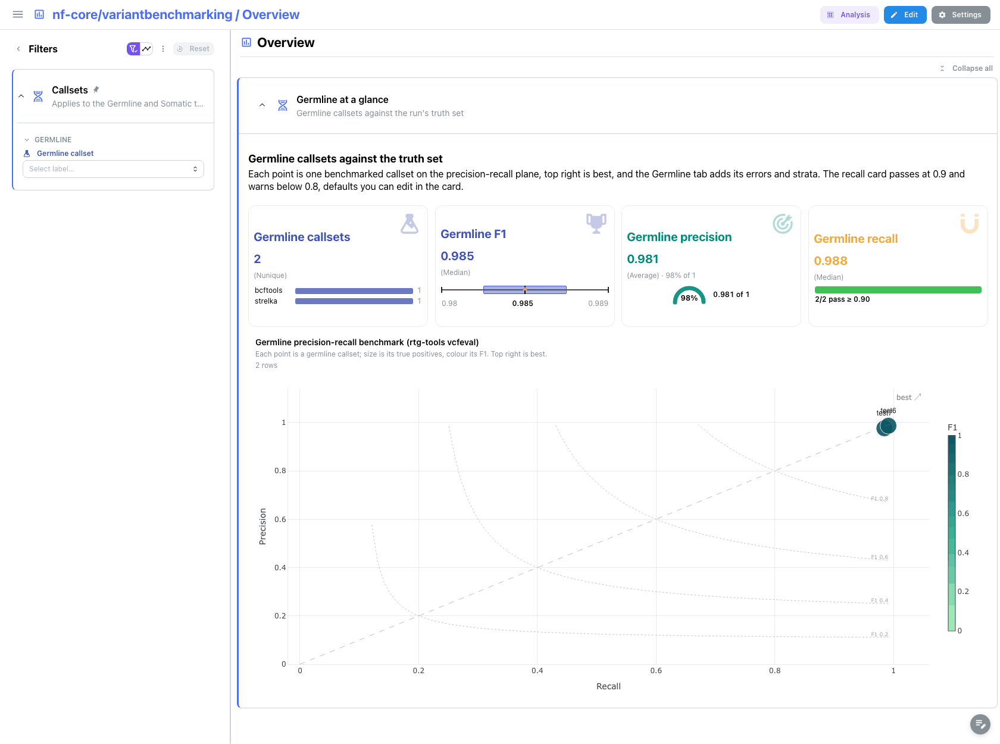
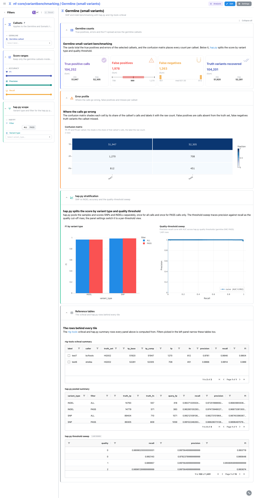

<div class="template-banner">
  <a class="template-banner-logo" href="https://nf-co.re/variantbenchmarking" target="_blank" title="nf-core/variantbenchmarking on nf-co.re">
    
    
  </a>
  <div class="template-banner-body">
    <h1 class="template-title">Variant Benchmarking</h1>
    <p class="template-subtitle">Benchmark variant callers against truth sets: precision, recall and F1 per tool, sample and stratum, for germline small variants, somatic indels and structural variants.</p>
    <p class="template-links">
      <a href="https://nf-co.re/variantbenchmarking" target="_blank"><i class="mdi mdi-open-in-new"></i> nf-co.re</a>
      <a href="https://github.com/nf-core/variantbenchmarking" target="_blank"><i class="mdi mdi-github"></i> GitHub</a>
    </p>
  </div>
  <span class="template-status-experimental template-banner-badge" data-tooltip="Experimental: shared as-is. Feedback and PRs welcome."><i class="mdi mdi-flask-outline"></i> Experimental</span>
</div>

The variantbenchmarking template turns a benchmarking run into a precision/recall funnel:

- :material-target: **Accuracy per callset**: precision, recall and F1 from rtg-tools vcfeval, hap.py and som.py
- :material-chart-scatter-plot: **Precision vs recall**: every caller on one plot, with equal-F1 contours
- :material-grid: **Error profile**: TP / FP / FN confusion matrix, plus ranked false-positive and false-negative bars
- :material-chart-bell-curve: **Confidence intervals**: binomial 95 % CI forest plots on the somatic metrics
- :material-chart-line: **Threshold sweeps**: hap.py quality-score ROC and PR curves with per-curve AUC
- :material-chart-box-outline: **Overview**: germline and somatic callsets side by side, plus Truvari, SVanalyzer and Wittyer for structural variants and CNVs, when one root holds several runs
- :material-poll: **MultiQC**: the benchmark report for the run, per variant type

---

## :material-arrow-decision-outline: Choosing a template

nf-core/variantbenchmarking benchmarks one variant type per run: its own documentation
states that "only one type of variant analysis is possible for each run". Depictio
therefore ships **one template per variant type**, plus an umbrella template for a data
root that already holds several.

There is no variable and no selector for this choice. It is made entirely by the id you
pass to `--template`. Pick the row matching the run you want to explore.

| `--template` id | Produced by a run with | Benchmark tools | Expected under `--data-root` |
| --- | --- | --- | --- |
| `nf-core/variantbenchmarking/1.4.0/categories/small` | `--analysis germline --variant_type small` | hap.py, rtg-tools vcfeval | `small/` and `multiqc/multiqc_data/multiqc.parquet` |
| `nf-core/variantbenchmarking/1.4.0/categories/indel` | `--analysis somatic --variant_type indel` | som.py, rtg-tools vcfeval | `indel/` and `multiqc/multiqc_data/multiqc.parquet` |
| `nf-core/variantbenchmarking/1.4.0/categories/structural` | `--variant_type structural` | truvari, SURVIVOR, through MultiQC only | `multiqc/multiqc_data/multiqc.parquet` |
| `nf-core/variantbenchmarking/1.4.0` | several runs, collected under one root | all of the above | `small/` **and** `indel/`; `sv/` and `cnv/` optional |

Each category is a self-contained project with its own dashboard, so three pipeline runs
give you three projects. The umbrella template covers the case where one data root
already holds both `small/` and `indel/`, which is how nf-core's own megatest is laid
out.

!!! warning "Category ids must pin the version"
    `latest` is resolved only in the **last** segment of a template id. So
    `nf-core/variantbenchmarking/latest` works and resolves to `1.4.0`, but
    `nf-core/variantbenchmarking/latest/categories/small` does **not**: the literal
    `latest` is never substituted mid-path, the directory it names does not exist, and
    the run fails with `Template ... not found`. Always spell category ids with the
    pinned version, `nf-core/variantbenchmarking/1.4.0/categories/small`.

    See `_resolve_template_id_in` in
    [`depictio/cli/cli/utils/templates.py`](https://github.com/depictio/depictio/blob/main/depictio/cli/cli/utils/templates.py).

!!! info "Self-adapting layout"
    Nearly every collection is optional, so each dashboard adapts to what the run
    actually produced: components bound to missing collections are hidden and tabs left
    with no visualizations are dropped. On the umbrella template the *Structural & CNV*
    tab binds the optional Truvari, SVanalyzer and Wittyer collections, so it disappears
    entirely on a run with no `sv/` or `cnv/` directory, which is the case for every
    published nf-core megatest.

---

## :material-rocket-launch-outline: Quick start

`DATA_ROOT` is the only template variable, so `--data-root` is the only thing you ever
have to pass. None of the four templates needs a `--var` flag.

=== "Germline small variants"

    ```bash
    depictio run \
      --template nf-core/variantbenchmarking/1.4.0/categories/small \
      --data-root /path/to/germline_results
    ```

    Two tabs: hap.py and rtg-tools benchmark metrics, plus the run's MultiQC report.

=== "Somatic indels"

    ```bash
    depictio run \
      --template nf-core/variantbenchmarking/1.4.0/categories/indel \
      --data-root /path/to/somatic_results
    ```

    Two tabs: som.py metrics with allele-fraction strata and confidence intervals, plus
    the run's MultiQC report.

=== "Structural variants"

    ```bash
    depictio run \
      --template nf-core/variantbenchmarking/1.4.0/categories/structural \
      --data-root /path/to/sv_results
    ```

    One MultiQC tab. The structural benchmark numbers are published only inside the
    MultiQC report, so this category ships no benchmark tables of its own.

=== "All variant types"

    ```bash
    depictio run \
      --template nf-core/variantbenchmarking/1.4.0 \
      --data-root /path/to/megatest_results
    ```

    One four-tab project over a data root holding both `small/` and `indel/`:
    *Overview*, *Germline (small variants)*, *Somatic (small variants)* and
    *Structural & CNV*. Reads no MultiQC report.

---

## :material-book-open-variant: Reference

The four templates are independent projects. Pick one and the reference below switches
to it, so the *Data collections* tables can be read one at a time rather than four deep.

Note the tag naming: the umbrella template prefixes its collections with `germline_` and
`somatic_` to keep both variant types apart inside one project, while each category
template uses the short unprefixed tag.

<div class="tpl-version-pick">
  <span class="tpl-version-icon"><i class="mdi mdi-source-branch"></i></span>
  <span class="tpl-version-label">Template</span>
  <select id="tpl-version" class="tpl-version-select" aria-label="Template">
    <option value="small" selected>1.4.0/categories/small</option>
    <option value="indel">1.4.0/categories/indel</option>
    <option value="structural">1.4.0/categories/structural</option>
    <option value="all">1.4.0 (all variant types)</option>
  </select>
</div>

<div class="tpl-version-block" data-version="small" markdown>

### Germline small variants

--8<-- "pipeline-templates/nf-core/_generated/variantbenchmarking-1.4.0-categories-small.md"

</div>

<div class="tpl-version-block" data-version="indel" markdown>

### Somatic indels

--8<-- "pipeline-templates/nf-core/_generated/variantbenchmarking-1.4.0-categories-indel.md"

</div>

<div class="tpl-version-block" data-version="structural" markdown>

### Structural variants

--8<-- "pipeline-templates/nf-core/_generated/variantbenchmarking-1.4.0-categories-structural.md"

</div>

<div class="tpl-version-block" data-version="all" markdown>

### All variant types in one project

--8<-- "pipeline-templates/nf-core/_generated/variantbenchmarking-latest.md"

</div>

---

## :material-view-dashboard-outline: Dashboard tabs

Every dashboard follows the same funnel: a card row that answers how good each callset
is, then precision vs recall, then the error profile, then the stratifications, with the
raw tables collapsed at the bottom. Filters sit in a left-hand panel and compose forward.
Each tab below carries the **same icon and colour the dashboard gives it**. The tabs are
grouped by template, since each template is its own project.

### Category templates

The three category templates each open on their own project: a *Benchmark* tab and a
*MultiQC* tab for germline small variants and somatic indels, and a single *MultiQC* tab
for structural variants.

=== ":material-bullseye-arrow:{ .mc-indigo } Germline · Benchmark"

    *Which callset recovers the germline truth set best, and where does it miss?*

    [{ loading=lazy }](../../images/pipeline-templates/nf-core/variantbenchmarking/germline_benchmark_light.png){ .tpl-shot target="_blank" rel="noopener" }

    rtg-tools vcfeval scores every callset, and the card row reads the median F1, the
    average precision and the median recall across them. The precision-recall panel
    puts each callset on one plane over equal-F1 contours, and the error profile splits
    its calls into TP, FP and FN. hap.py then breaks the score down by variant type and
    filter, and sweeps it across quality thresholds.

    ??? abstract ":material-tune-variant: Filters and components"

        **Filters** · `Sample` and `Truth set` on `vcfeval_summary` in *Callsets*,
        `F1`, `Precision` and `Recall` ranges in a collapsed *Score ranges* group, and
        `Filter` and `Variant type` on the hap.py summary in a collapsed *hap.py scope*
        group.

        | Section | What it holds |
        |---|---|
        | Benchmark at a glance | 4 cards: callsets, F1, precision, recall |
        | Precision vs recall | *Precision-recall benchmark*, *F1 by sample* |
        | Error profile | *Confusion matrix*, *False positives per callset*, *False negatives per callset* |
        | hap.py stratification | *F1 by variant type*, *Quality-threshold sweep* |
        | Reference tables | *rtg-tools vcfeval summary*, *hap.py pooled summary*, *hap.py threshold sweep* (collapsed, persistent) |

=== "{ width=18 }{ width=18 } Germline · MultiQC"

    *What does the run's own benchmark report say?*

    [{ loading=lazy }](../../images/pipeline-templates/nf-core/variantbenchmarking/germline_multiqc_light.png){ .tpl-shot target="_blank" rel="noopener" }

    The tab reads the MultiQC report the germline run published: the general
    statistics, the hap.py SNP and INDEL panels, and bcftools stats on the callsets.

    ??? abstract ":material-tune-variant: Filters and components"

        **Filters** · `Sample` on the MultiQC report, in *Report samples*.

        | Section | What it holds |
        |---|---|
        | Report at a glance | *General statistics* |
        | hap.py panels | *hap.py SNP*, *hap.py INDEL* |
        | Variant statistics | *Variant substitution types*, *Indel distribution* (collapsed) |

=== ":material-bullseye-arrow:{ .mc-pink } Somatic · Benchmark"

    *Which caller recovers the somatic truth set best, and how sure are we?*

    [{ loading=lazy }](../../images/pipeline-templates/nf-core/variantbenchmarking/somatic_benchmark_light.png){ .tpl-shot target="_blank" rel="noopener" }

    som.py scores every caller, and the tab follows the germline funnel with two extra
    steps: accuracy per allele-fraction bin, where low-frequency variants usually
    separate the callers, and binomial 95 % confidence intervals on precision and
    recall. A collapsed rtg-tools section scores the same callers a second way. The
    `Caller` filter reaches the allele-fraction strata through a cross-DC link on the
    `caller` column.

    ??? abstract ":material-tune-variant: Filters and components"

        **Filters** · `Caller` and `Variant type` on `sompy_summary` in *Callers*,
        `F1`, `Precision` and `Recall` ranges in a collapsed *Score ranges* group, and
        `Allele-fraction bin` on `sompy_regions` in a collapsed *Allele fraction*
        group.

        | Section | What it holds |
        |---|---|
        | Benchmark at a glance | 4 cards: callers, F1, recall, precision |
        | Precision vs recall | *Precision-recall benchmark*, *F1 by caller* |
        | Error profile | *Confusion matrix*, *False positives per caller (log scale)*, *False negatives per caller* |
        | Allele-fraction strata | *F1 across allele-fraction bins*, *Recall across allele-fraction bins* |
        | Confidence intervals | *Precision ± 95% CI*, *Recall ± 95% CI* |
        | rtg-tools cross-check | *Precision-recall benchmark (rtg-tools vcfeval)*, *rtg-tools vcfeval summary* (collapsed) |
        | Reference tables | *som.py summary*, *som.py allele-fraction strata* (collapsed, persistent) |

=== "{ width=18 }{ width=18 } Somatic · MultiQC"

    *What does the run's own benchmark report say?*

    [{ loading=lazy }](../../images/pipeline-templates/nf-core/variantbenchmarking/somatic_multiqc_light.png){ .tpl-shot target="_blank" rel="noopener" }

    The tab reads the MultiQC report the somatic run published: the general
    statistics, the three som.py panels, and bcftools stats on the callsets.

    ??? abstract ":material-tune-variant: Filters and components"

        **Filters** · `Sample` on the MultiQC report, in *Report samples*.

        | Section | What it holds |
        |---|---|
        | Report at a glance | *General statistics* |
        | som.py panels | *som.py combined*, *som.py indel*, *som.py SNV* |
        | Variant statistics | *Variant substitution types*, *Variant depths* (collapsed) |

=== "{ width=18 }{ width=18 } Structural · MultiQC"

    *How do the structural-variant callsets score, as the report tells it?*

    [{ loading=lazy }](../../images/pipeline-templates/nf-core/variantbenchmarking/structural_multiqc_light.png){ .tpl-shot target="_blank" rel="noopener" }

    Truvari and SURVIVOR results, read from the MultiQC report. The general statistics
    carry Truvari precision, recall, F1 and genotype concordance per callset, the
    Truvari panels give the precision-recall view and the TP / FP / FN
    classifications, and SURVIVOR summarises the merged callset.

    ??? abstract ":material-tune-variant: Filters and components"

        **Filters** · `Sample` on the MultiQC report, in *Report samples*.

        | Section | What it holds |
        |---|---|
        | Benchmark at a glance | *Benchmark statistics* (general statistics) |
        | truvari benchmark | *truvari precision vs recall*, *truvari classifications (TP / FP / FN)* |
        | SV callset | *SURVIVOR merged SV summary*, *Variant-calling summary* (collapsed) |

    !!! note "No benchmark tables for structural variants"
        The pipeline writes the structural benchmark numbers only into the MultiQC
        report, so this project reads nothing else. Metric cards and native benchmark
        panels would need a general-statistics recipe for Truvari, which the template
        does not ship yet.

### All variant types in one project

The umbrella template opens on an *Overview* that sets both variant types side by side,
then gives each its own tab. Its `Callsets` filters are persistent and pinned to the top
of every tab, and each picker sits on the Overview rather than on its own tab, so a data
root that lacks one variant type drops that tab and keeps the other picker. On the Somatic
and Structural & CNV tabs the reference tables accept row selection: picking rows in them
cross-filters the rest of the tab on that callset or caller. On Germline (small variants)
only the rtg-tools vcfeval table selects rows.

=== ":material-chart-box-outline:{ .mc-indigo } Overview"

    *Which callset wins, for each variant type the root holds?*

    [{ loading=lazy }](../../images/pipeline-templates/nf-core/variantbenchmarking/overview_light.png){ .tpl-shot target="_blank" rel="noopener" }

    One card row and one precision-recall panel per variant type: rtg-tools vcfeval for
    the germline callsets, som.py for the somatic callers. The two halves read
    different tables, so a run with only one of them shows only that half.

    ??? abstract ":material-tune-variant: Filters and components"

        **Filters** · `Germline callset` on `germline_vcfeval_summary` and `Somatic
        caller` on `somatic_sompy_summary`, in *Callsets*, persistent and pinned to
        the top of every tab.

        | Section | What it holds |
        |---|---|
        | Germline at a glance | 4 cards, *Germline precision-recall benchmark (rtg-tools vcfeval)* |
        | Somatic at a glance | 4 cards, *Somatic precision-recall benchmark (som.py)* |

=== ":material-dna:{ .mc-indigo } Germline (small variants)"

    *Where do the germline calls go wrong, and at which quality threshold?*

    [{ loading=lazy }](../../images/pipeline-templates/nf-core/variantbenchmarking/germline_small_variants_light.png){ .tpl-shot target="_blank" rel="noopener" }

    The card row counts calls rather than scoring them: true positives, false
    positives, false negatives and truth variants recovered, summed over the callsets
    in scope. The confusion matrix splits those counts per callset, and hap.py breaks
    the score down by variant type and filter before sweeping it across quality
    thresholds.

    ??? abstract ":material-tune-variant: Filters and components"

        **Filters** · the persistent `Callsets` group, plus `F1`, `Precision` and
        `Recall` ranges in *Score ranges* and `Filter` and `Variant type` on the hap.py
        summary in *hap.py scope*.

        | Section | What it holds |
        |---|---|
        | Germline counts | 4 cards |
        | Error profile | *Confusion matrix* |
        | hap.py stratification | *F1 by variant type*, *Quality-threshold sweep* |
        | Reference tables | *rtg-tools vcfeval summary*, *hap.py pooled summary*, *hap.py threshold sweep* (collapsed) |

=== ":material-target:{ .mc-pink } Somatic (small variants)"

    *Where do the somatic callers go wrong, across allele fractions?*

    The same counts funnel on som.py, followed by accuracy per allele-fraction bin and
    binomial 95 % confidence intervals on precision and recall. The caller picked on
    the Overview narrows the allele-fraction strata and the collapsed rtg-tools
    cross-check through cross-DC links on the `caller` column.

    ??? abstract ":material-tune-variant: Filters and components"

        **Filters** · the persistent `Callsets` group, plus `F1`, `Precision` and
        `Recall` ranges in *Score ranges* and `Allele-fraction bin` on
        `somatic_sompy_regions` in *Allele fraction*.

        | Section | What it holds |
        |---|---|
        | Somatic counts | 4 cards |
        | Error profile | *Confusion matrix*, *False positives per caller, log scale* |
        | Allele-fraction strata | *F1 across allele-fraction bins*, *Recall across allele-fraction bins* |
        | Confidence intervals | *Precision with its 95% interval*, *Recall with its 95% interval* |
        | rtg-tools cross-check | *Precision-recall benchmark (rtg-tools vcfeval)*, *rtg-tools vcfeval summary* (collapsed) |
        | Reference tables | *som.py summary*, *som.py allele-fraction strata* (collapsed) |

=== ":material-chart-scatter-plot:{ .mc-orange } Structural & CNV"

    *How do the structural-variant and CNV callsets score on native benchmark tables?*

    Truvari scores the SV callsets on the card row and the precision-recall panel,
    SVanalyzer gives a second F1 per callset, and Wittyer scores the CNV calls twice,
    per event and per base. The `Callset` picker reaches the SVanalyzer and Wittyer
    tables through cross-DC links on `label`. Every collection here is optional, so
    the tab disappears on a root with no `sv/` or `cnv/` directory.

    ??? abstract ":material-tune-variant: Filters and components"

        **Filters** · `Callset` on `sv_truvari_summary` in *SV callsets*, and
        `Wittyer level` on `cnv_wittyer_summary` in *Wittyer scope*.

        | Section | What it holds |
        |---|---|
        | SV benchmark | 4 cards, *SV precision-recall benchmark (Truvari)*, *F1 by callset, SVanalyzer svbenchmark* |
        | Wittyer, per event and per base | *Wittyer F1 per callset, per event and per base* |
        | Reference tables | *Truvari summary*, *SVanalyzer svbenchmark summary*, *Wittyer summary* (collapsed) |

---

## :material-chart-timeline-variant: Benchmarking visualizations

The template introduced four visualization kinds built for benchmarking. Each is bound
through a catalog module, so any project reading a comparable table can reuse them.

=== ":material-chart-scatter-plot:{ .mc-indigo } PR benchmark"

    [{ loading=lazy }](../../images/pipeline-templates/nf-core/variantbenchmarking/advviz_pr_benchmark_light.png){ .tpl-shot target="_blank" rel="noopener" }

    One point per caller at (recall, precision), over dotted equal-F1 contours and the
    recall = precision diagonal, so a caller's balance is readable at a glance.

=== ":material-chart-line:{ .mc-teal } ROC / PR curve"

    [{ loading=lazy }](../../images/pipeline-templates/nf-core/variantbenchmarking/advviz_roc_pr_curve_light.png){ .tpl-shot target="_blank" rel="noopener" }

    Threshold-sweep curves per caller with a per-curve AUC. An in-panel tab bar switches
    between **PR curve**, **ROC** and **vs threshold**.

=== ":material-grid:{ .mc-grape } Confusion matrix"

    [{ loading=lazy }](../../images/pipeline-templates/nf-core/variantbenchmarking/advviz_confusion_matrix_light.png){ .tpl-shot target="_blank" rel="noopener" }

    TP, FP and FN per caller. Shading is the per-caller normalised fraction while the
    label keeps the raw count, and the label colour follows cell luminance so it stays
    legible at both ends of the scale.

=== ":material-chart-bell-curve:{ .mc-cyan } Metric CI bars"

    [{ loading=lazy }](../../images/pipeline-templates/nf-core/variantbenchmarking/advviz_metric_ci_forest_light.png){ .tpl-shot target="_blank" rel="noopener" }

    A forest plot: point estimate plus 95 % confidence interval per caller, on an x-axis
    that auto-zooms to the spread so overlapping intervals stay distinguishable.

---

## :material-play-circle-outline: Running the pipeline

Depictio reads the **output** of nf-core/variantbenchmarking, it does not run the
pipeline. Run the pipeline first, once per variant type:

```bash
nextflow run nf-core/variantbenchmarking -r 1.4.0 \
  --input samplesheet.csv \
  --outdir results/ \
  --genome GRCh38 \
  --truth_id HG002 --truth_vcf truth.vcf.gz \
  --analysis germline \
  --variant_type small \
  -profile docker
```

Then point Depictio at the results, choosing the template id for the variant type that
run produced:

```bash
depictio run --template nf-core/variantbenchmarking/1.4.0/categories/small \
  --data-root results/
```

To benchmark somatic indels as well, run the pipeline again with
`--analysis somatic --variant_type indel` into a second output directory, and import it
with the `categories/indel` template. Point the umbrella template at a root holding both
result sets instead, if you would rather have one project than two.

See [nf-co.re/variantbenchmarking/usage](https://nf-co.re/variantbenchmarking/1.4.0/docs/usage)
for full pipeline documentation.

---

## :material-folder-open-outline: Required data structure

Point `--data-root` at the directory holding the pipeline output. Only the first table of
whichever template you choose is required; the rest is optional and the dashboard adapts
to what is present.

```text
<DATA_ROOT>/
├── small/                                                  # --variant_type small
│   ├── summary/tables/rtgtools/
│   │   └── rtgtools.summary.csv                            # required by small + umbrella
│   └── <sample>/benchmarks/happy/
│       ├── *.summary.csv                                   # optional
│       └── *.roc.Locations.SNP.PASS.csv.gz                 # optional
├── indel/                                                  # --variant_type indel
│   └── summary/tables/
│       ├── sompy/sompy.summary.csv                         # required by indel
│       ├── sompy/sompy.regions.csv                         # optional, AF strata
│       └── rtgtools/rtgtools.summary.csv                   # optional, cross-check
├── sv/summary/tables/                                      # optional, umbrella only
│   ├── truvari/truvari.summary.csv
│   └── svbenchmark/svbenchmark.summary.csv
├── cnv/summary/tables/wittyer/
│   └── wittyer.summary.csv                                 # optional, umbrella only
└── multiqc/multiqc_data/
    └── multiqc.parquet                                     # required by each category
```

Each category template requires the MultiQC report of its own run. The umbrella template
reads no MultiQC report at all, and expects a single root containing both `small/` and
`indel/`.

---

## :material-flask-outline: Validation runs

The repository ships
[`download_test_data.sh`](https://github.com/depictio/depictio/blob/main/depictio/projects/nf-core/variantbenchmarking/1.4.0/download_test_data.sh),
which pulls a real run from nf-core's public megatest bucket:

```bash
bash depictio/projects/nf-core/variantbenchmarking/1.4.0/download_test_data.sh \
  /tmp/variantbenchmarking_test
```

It fetches the `small/` and `indel/` summary tables plus the hap.py per-sample files from
`s3://nf-core-awsmegatests/variantbenchmarking/`, then prints the follow-up commands.

!!! note "The fixture suits the umbrella template"
    No published megatest contains a `multiqc/` directory, and the script does not fetch
    one, so this fixture will not satisfy the three category templates, which each
    require a MultiQC report. Use it with
    `--template nf-core/variantbenchmarking/1.4.0`, which reads no MultiQC report and
    covers both variant types the fixture provides.

---

## :material-link-variant: Additional resources

- [nf-co.re/variantbenchmarking](https://nf-co.re/variantbenchmarking): official pipeline documentation
- [nf-co.re/variantbenchmarking/1.4.0/results](https://nf-co.re/variantbenchmarking/1.4.0/results): AWS test results
- [Template System Reference](../../usage/projects/templates.md): YAML format, variables, conditionals
- [Recipes](../../usage/projects/recipes.md): how to read, test, and write recipes

---

## :material-account-group-outline: Authorship

<div class="tpl-credits">
  <div class="tpl-credit">
    <span class="tpl-credit-role"><i class="mdi mdi-code-braces"></i> Developers</span>
    <span class="tpl-credit-note">Wrote the four templates, their recipes and their dashboards.</span>
    <a class="tpl-person" href="https://github.com/weber8thomas" target="_blank" rel="noopener">
       weber8thomas
    </a>
  </div>
  <div class="tpl-credit">
    <span class="tpl-credit-role"><i class="mdi mdi-eye-check-outline"></i> Reviewers</span>
    <span class="tpl-credit-note">Nobody has run them on their own data and signed them off yet, which is what keeps the status Experimental.</span>
    <span class="tpl-person"><i class="mdi mdi-account-plus-outline"></i> Open</span>
  </div>
  <div class="tpl-credit">
    <span class="tpl-credit-role"><i class="mdi mdi-wrench-outline"></i> Maintainers</span>
    <span class="tpl-credit-note">Keep them working as nf-core/variantbenchmarking releases.</span>
    <a class="tpl-person" href="https://github.com/weber8thomas" target="_blank" rel="noopener">
       weber8thomas
    </a>
  </div>
</div>

Reviewing a template on your own data, or taking over a role here, is a
contribution in itself: the [contributing guide](../../developer/contributing-templates.md)
says what each one involves.
