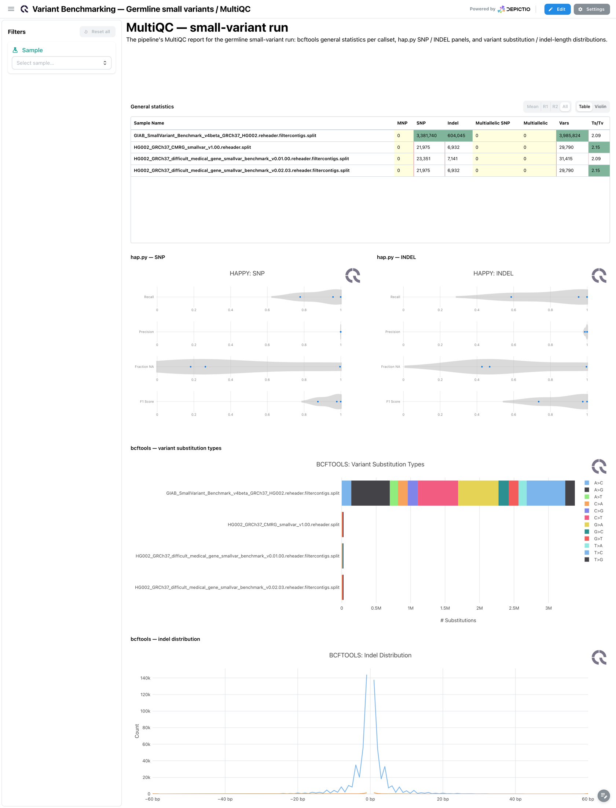
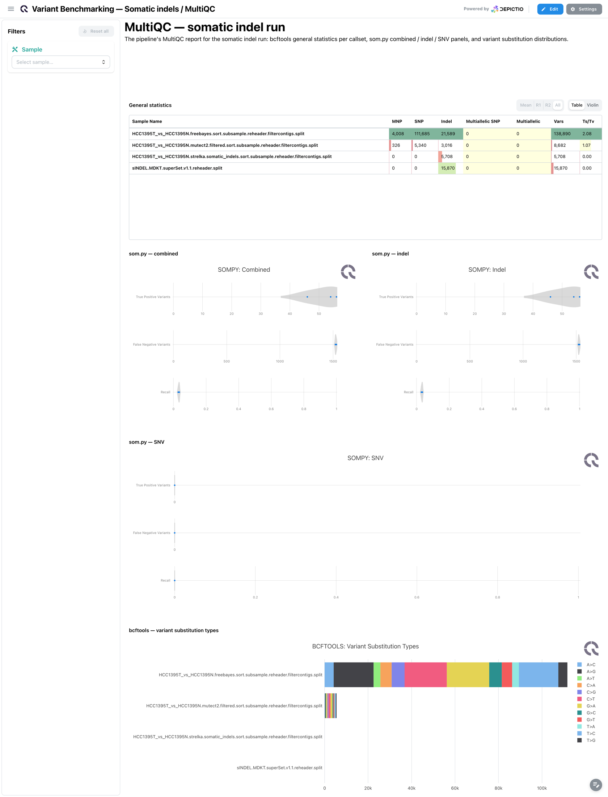
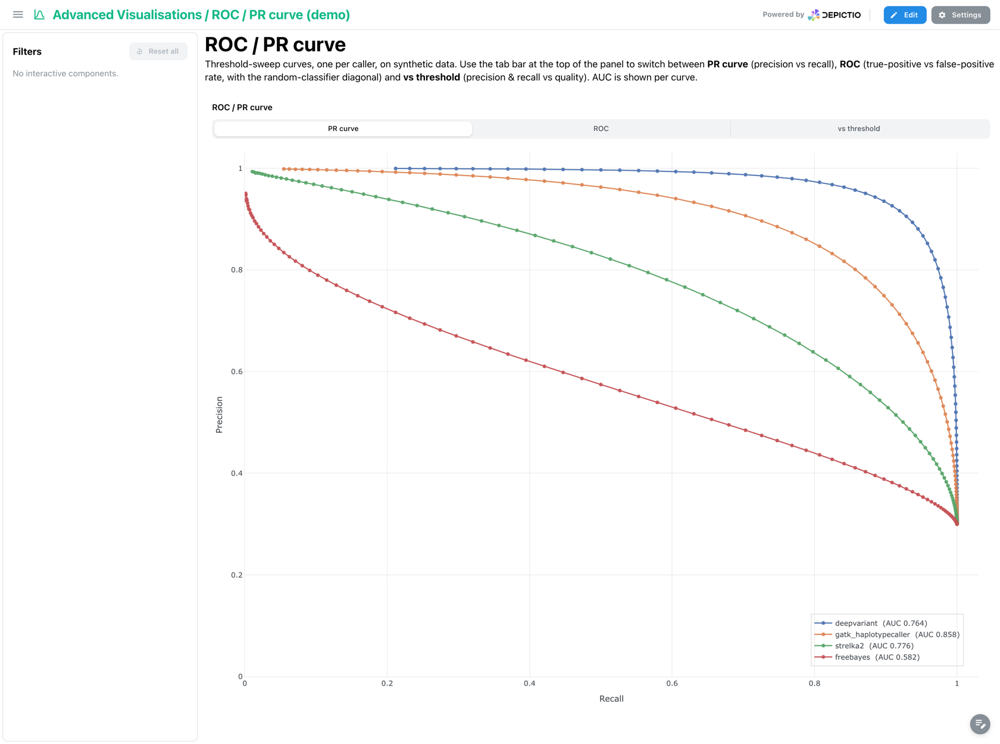
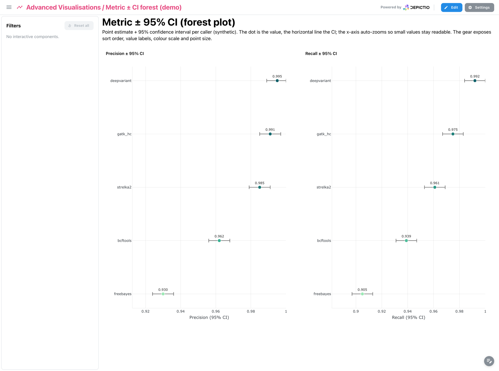

<div class="template-banner">
  <a class="template-banner-logo" href="https://nf-co.re/variantbenchmarking" target="_blank" title="nf-core/variantbenchmarking on nf-co.re">
    
    
  </a>
  <div class="template-banner-body">
    <h1 class="template-title">Variant Benchmarking</h1>
    <p class="template-subtitle">Benchmark variant callers against truth sets: precision, recall and F1 per tool, sample and stratum, for germline small variants, somatic indels and structural variants.</p>
    <p class="template-links">
      <a href="https://nf-co.re/variantbenchmarking" target="_blank"><i class="mdi mdi-open-in-new"></i> nf-co.re</a>
      <a href="https://github.com/nf-core/variantbenchmarking" target="_blank"><i class="mdi mdi-github"></i> GitHub</a>
    </p>
  </div>
  <span class="template-status-experimental template-banner-badge" data-tooltip="Experimental: shared as-is. Feedback and PRs welcome."><i class="mdi mdi-flask-outline"></i> Experimental</span>
</div>

The variantbenchmarking template turns a benchmarking run into a precision/recall funnel:

- :material-target: **Accuracy per callset**: precision, recall and F1 from rtg-tools vcfeval, hap.py and som.py
- :material-chart-scatter-plot: **Precision vs recall**: every caller on one plot, with equal-F1 contours
- :material-grid: **Error profile**: TP / FP / FN confusion matrix, plus ranked false-positive and false-negative bars
- :material-chart-bell-curve: **Confidence intervals**: binomial 95 % CI forest plots on the somatic metrics
- :material-chart-line: **Threshold sweeps**: hap.py quality-score ROC and PR curves with per-curve AUC
- :material-poll: **MultiQC**: the benchmark report for the run, per variant type

---

## Choosing a template

nf-core/variantbenchmarking benchmarks one variant type per run: its own documentation
states that "only one type of variant analysis is possible for each run". Depictio
therefore ships **one template per variant type**, plus an umbrella template for a data
root that already holds several.

There is no variable and no selector for this choice. It is made entirely by the id you
pass to `--template`. Pick the row matching the run you want to explore.

| `--template` id | Produced by a run with | Benchmark tools | Expected under `--data-root` |
| --- | --- | --- | --- |
| `nf-core/variantbenchmarking/1.4.0/categories/small` | `--analysis germline --variant_type small` | hap.py, rtg-tools vcfeval | `small/` and `multiqc/multiqc_data/multiqc.parquet` |
| `nf-core/variantbenchmarking/1.4.0/categories/indel` | `--analysis somatic --variant_type indel` | som.py, rtg-tools vcfeval | `indel/` and `multiqc/multiqc_data/multiqc.parquet` |
| `nf-core/variantbenchmarking/1.4.0/categories/structural` | `--variant_type structural` | truvari, SURVIVOR, through MultiQC only | `multiqc/multiqc_data/multiqc.parquet` |
| `nf-core/variantbenchmarking/1.4.0` | several runs, collected under one root | all of the above | `small/` **and** `indel/`; `sv/` and `cnv/` optional |

Each category is a self-contained project with its own dashboard, so three pipeline runs
give you three projects. The umbrella template covers the case where one data root
already holds both `small/` and `indel/`, which is how nf-core's own megatest is laid
out.

!!! warning "Category ids must pin the version"
    `latest` is resolved only in the **last** segment of a template id. So
    `nf-core/variantbenchmarking/latest` works and resolves to `1.4.0`, but
    `nf-core/variantbenchmarking/latest/categories/small` does **not**: the literal
    `latest` is never substituted mid-path, the directory it names does not exist, and
    the run fails with `Template ... not found`. Always spell category ids with the
    pinned version, `nf-core/variantbenchmarking/1.4.0/categories/small`.

    See `_resolve_template_id_in` in
    [`depictio/cli/cli/utils/templates.py`](https://github.com/depictio/depictio/blob/main/depictio/cli/cli/utils/templates.py).

!!! info "Self-adapting layout"
    Nearly every collection is optional, so each dashboard adapts to what the run
    actually produced: components bound to missing collections are hidden and tabs left
    with no visualizations are dropped. On the umbrella template the *Structural & CNV*
    tab binds the optional Truvari, SVanalyzer and Wittyer collections, so it disappears
    entirely on a run with no `sv/` or `cnv/` directory, which is the case for every
    published nf-core megatest.

---

## Quick start

`DATA_ROOT` is the only template variable, so `--data-root` is the only thing you ever
have to pass. None of the four templates needs a `--var` flag.

=== "Germline small variants"

    ```bash
    depictio run \
      --template nf-core/variantbenchmarking/1.4.0/categories/small \
      --data-root /path/to/germline_results
    ```

    Two tabs: hap.py and rtg-tools benchmark metrics, plus the run's MultiQC report.

=== "Somatic indels"

    ```bash
    depictio run \
      --template nf-core/variantbenchmarking/1.4.0/categories/indel \
      --data-root /path/to/somatic_results
    ```

    Two tabs: som.py metrics with allele-fraction strata and confidence intervals, plus
    the run's MultiQC report.

=== "Structural variants"

    ```bash
    depictio run \
      --template nf-core/variantbenchmarking/1.4.0/categories/structural \
      --data-root /path/to/sv_results
    ```

    One MultiQC tab. The structural benchmark numbers are published only inside the
    MultiQC report, so this category ships no benchmark tables of its own.

=== "All variant types"

    ```bash
    depictio run \
      --template nf-core/variantbenchmarking/1.4.0 \
      --data-root /path/to/megatest_results
    ```

    One four-tab project over a data root holding both `small/` and `indel/`. Reads no
    MultiQC report.

---

## Reference

The four templates are independent projects. Each section below lists what that template
binds, so compare the *Data collections* tables when deciding which one fits your run.

Note the tag naming: the umbrella template prefixes its collections with `germline_` and
`somatic_` to keep both variant types apart inside one project, while each category
template uses the short unprefixed tag.

### Germline small variants

--8<-- "pipeline-templates/nf-core/_generated/variantbenchmarking-1.4.0-categories-small.md"

### Somatic indels

--8<-- "pipeline-templates/nf-core/_generated/variantbenchmarking-1.4.0-categories-indel.md"

### Structural variants

--8<-- "pipeline-templates/nf-core/_generated/variantbenchmarking-1.4.0-categories-structural.md"

### All variant types in one project

--8<-- "pipeline-templates/nf-core/_generated/variantbenchmarking-latest.md"

---

## Dashboard tabs

Every dashboard follows the same funnel: a *Benchmark at a glance* card row, then
precision vs recall, then the error profile, then the stratifications, with the raw
tables collapsed at the bottom. Filters sit in a left-hand panel and compose forward.

=== "Germline · Benchmark"

    hap.py and rtg-tools accuracy for germline SNPs and INDELs.

    [](../../images/pipeline-templates/nf-core/variantbenchmarking/germline_benchmark_light.png){target="_blank" rel="noopener"}

    **Filters:** Callsets, Score ranges, hap.py scope.

    **Components:**

    - 4 metric cards: *callsets* (donut, broken down by caller), *F1* (median, with
      box-plot spread), *precision* (average, gauge), *recall* (median, against a 0.9
      threshold)
    - Precision vs recall scatter with equal-F1 contours
    - Confusion matrix: TP / FP / FN per callset
    - Ranked false-positive and false-negative bars
    - hap.py stratification: F1 by variant type and filter, plus the quality-score PR
      sweep with AUC
    - Reference tables, collapsed and pinned to the bottom

=== "Germline · MultiQC"

    The run's own benchmark report.

    [](../../images/pipeline-templates/nf-core/variantbenchmarking/germline_multiqc_light.png){target="_blank" rel="noopener"}

    **Filters:** Report samples.

    **Components:**

    - General statistics table
    - hap.py panels: SNP, INDEL
    - Variant statistics, collapsed: bcftools substitution types and indel-length
      distribution

=== "Somatic · Benchmark"

    som.py accuracy per caller, with allele-fraction strata and confidence intervals.

    [](../../images/pipeline-templates/nf-core/variantbenchmarking/somatic_benchmark_light.png){target="_blank" rel="noopener"}

    **Filters:** Callers, Score ranges, Allele fraction.

    **Components:**

    - 4 metric cards: *callers* (donut), *F1* (median, box-plot spread), *recall*
      (average, gauge), *precision* (median, warning under 0.5)
    - Precision vs recall scatter with equal-F1 contours
    - Confusion matrix, plus false positives on a log axis and false negatives
    - Allele-fraction strata: F1 and recall per AF bin, per caller
    - Confidence intervals: binomial 95 % CI forest plots for precision and recall
    - rtg-tools cross-check and reference tables, both collapsed

    Selecting a caller filters the AF strata and the rtg-tools cross-check, through
    cross-DC links on the `caller` column.

=== "Somatic · MultiQC"

    The run's own benchmark report.

    [](../../images/pipeline-templates/nf-core/variantbenchmarking/somatic_multiqc_light.png){target="_blank" rel="noopener"}

    **Filters:** Report samples.

    **Components:**

    - General statistics table
    - som.py panels: Combined, Indel, SNV
    - Variant statistics, collapsed: bcftools substitution types and variant depths

=== "Structural · MultiQC"

    Truvari and SURVIVOR results, read from the MultiQC report.

    [](../../images/pipeline-templates/nf-core/variantbenchmarking/structural_multiqc_light.png){target="_blank" rel="noopener"}

    **Filters:** Report samples.

    **Components:**

    - Benchmark at a glance: general statistics, carrying Truvari precision, recall, F1
      and genotype concordance
    - Truvari benchmark: precision vs recall, and classifications
    - SV callset, collapsed: SURVIVOR and the variant-calling summary

    !!! note "No benchmark tables for structural variants"
        The public nf-core megatest publishes no summary CSV for the structural
        category, so this project reads the MultiQC report only. Metric cards and native
        benchmark panels would need a general-statistics recipe for Truvari, which the
        template does not ship yet.

---

## Benchmarking visualizations

The template introduced four visualization kinds built for benchmarking. Each is bound
through a catalog module, so any project reading a comparable table can reuse them.

=== "PR benchmark"

    [](../../images/pipeline-templates/nf-core/variantbenchmarking/advviz_pr_benchmark_light.png){target="_blank" rel="noopener"}

    One point per caller at (recall, precision), over dotted equal-F1 contours and the
    recall = precision diagonal, so a caller's balance is readable at a glance.

=== "ROC / PR curve"

    [](../../images/pipeline-templates/nf-core/variantbenchmarking/advviz_roc_pr_curve_light.png){target="_blank" rel="noopener"}

    Threshold-sweep curves per caller with a per-curve AUC. An in-panel tab bar switches
    between **PR curve**, **ROC** and **vs threshold**.

=== "Confusion matrix"

    [](../../images/pipeline-templates/nf-core/variantbenchmarking/advviz_confusion_matrix_light.png){target="_blank" rel="noopener"}

    TP, FP and FN per caller. Shading is the per-caller normalised fraction while the
    label keeps the raw count, and the label colour follows cell luminance so it stays
    legible at both ends of the scale.

=== "Metric CI bars"

    [](../../images/pipeline-templates/nf-core/variantbenchmarking/advviz_metric_ci_forest_light.png){target="_blank" rel="noopener"}

    A forest plot: point estimate plus 95 % confidence interval per caller, on an x-axis
    that auto-zooms to the spread so overlapping intervals stay distinguishable.

---

## Running the pipeline

Depictio reads the **output** of nf-core/variantbenchmarking, it does not run the
pipeline. Run the pipeline first, once per variant type:

```bash
nextflow run nf-core/variantbenchmarking -r 1.4.0 \
  --input samplesheet.csv \
  --outdir results/ \
  --genome GRCh38 \
  --sample HG002 \
  --analysis germline \
  --variant_type small \
  -profile docker
```

Then point Depictio at the results, choosing the template id for the variant type that
run produced:

```bash
depictio run --template nf-core/variantbenchmarking/1.4.0/categories/small \
  --data-root results/
```

To benchmark somatic indels as well, run the pipeline again with
`--analysis somatic --variant_type indel` into a second output directory, and import it
with the `categories/indel` template. Point the umbrella template at a root holding both
result sets instead, if you would rather have one project than two.

See [nf-co.re/variantbenchmarking/usage](https://nf-co.re/variantbenchmarking/1.4.0/docs/usage)
for full pipeline documentation.

---

## Required data structure

Point `--data-root` at the directory holding the pipeline output. Only the first table of
whichever template you choose is required; the rest is optional and the dashboard adapts
to what is present.

```text
<DATA_ROOT>/
├── small/                                                  # --variant_type small
│   ├── summary/tables/rtgtools/
│   │   └── rtgtools.summary.csv                            # required by small + umbrella
│   └── <sample>/benchmarks/happy/
│       ├── *.summary.csv                                   # optional
│       └── *.roc.Locations.SNP.PASS.csv.gz                 # optional
├── indel/                                                  # --variant_type indel
│   └── summary/tables/
│       ├── sompy/sompy.summary.csv                         # required by indel
│       ├── sompy/sompy.regions.csv                         # optional, AF strata
│       └── rtgtools/rtgtools.summary.csv                   # optional, cross-check
├── sv/summary/tables/                                      # optional, umbrella only
│   ├── truvari/truvari.summary.csv
│   └── svbenchmark/svbenchmark.summary.csv
├── cnv/summary/tables/wittyer/
│   └── wittyer.summary.csv                                 # optional, umbrella only
└── multiqc/multiqc_data/
    └── multiqc.parquet                                     # required by each category
```

Each category template requires the MultiQC report of its own run. The umbrella template
reads no MultiQC report at all, and expects a single root containing both `small/` and
`indel/`.

---

## Test data

The repository ships
[`download_test_data.sh`](https://github.com/depictio/depictio/blob/main/depictio/projects/nf-core/variantbenchmarking/1.4.0/download_test_data.sh),
which pulls a real run from nf-core's public megatest bucket:

```bash
bash depictio/projects/nf-core/variantbenchmarking/1.4.0/download_test_data.sh \
  /tmp/variantbenchmarking_test
```

It fetches the `small/` and `indel/` summary tables plus the hap.py per-sample files from
`s3://nf-core-awsmegatests/variantbenchmarking/`, then prints the follow-up commands.

!!! note "The fixture suits the umbrella template"
    No published megatest contains a `multiqc/` directory, and the script does not fetch
    one, so this fixture will not satisfy the three category templates, which each
    require a MultiQC report. Use it with
    `--template nf-core/variantbenchmarking/1.4.0`, which reads no MultiQC report and
    covers both variant types the fixture provides.

---

## Additional resources

- [nf-co.re/variantbenchmarking](https://nf-co.re/variantbenchmarking): official pipeline documentation
- [nf-co.re/variantbenchmarking/1.4.0/results](https://nf-co.re/variantbenchmarking/1.4.0/results): AWS test results
- [Template System Reference](../../usage/projects/templates.md): YAML format, variables, conditionals
- [Recipes](../../usage/projects/recipes.md): how to read, test, and write recipes
