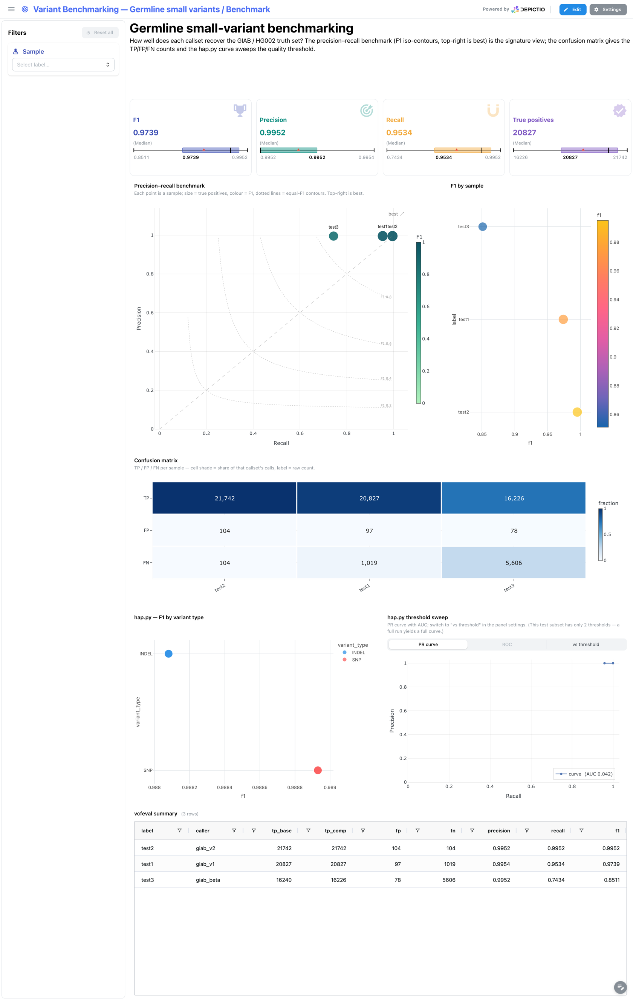
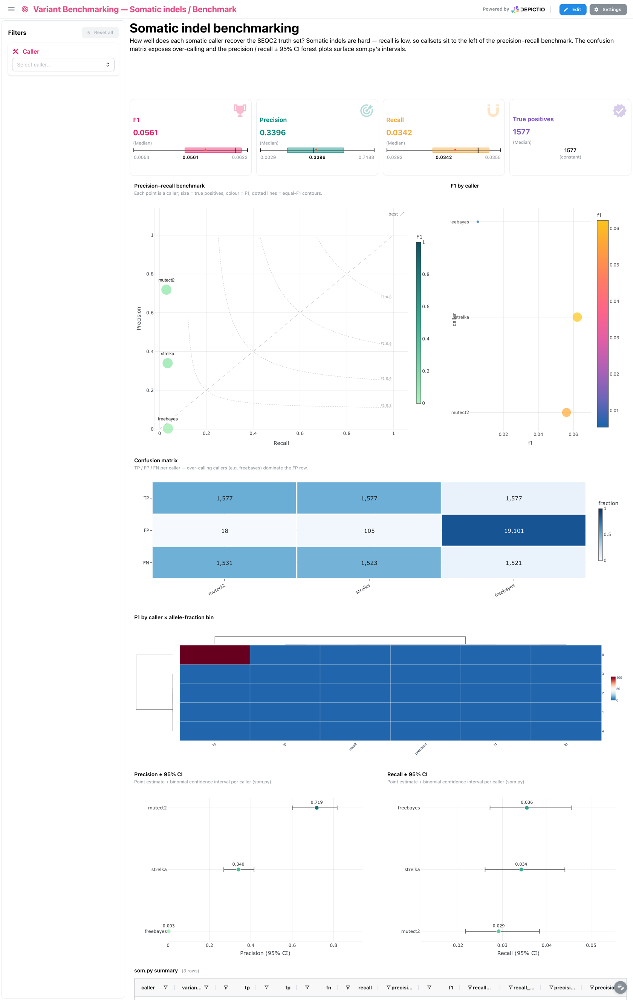
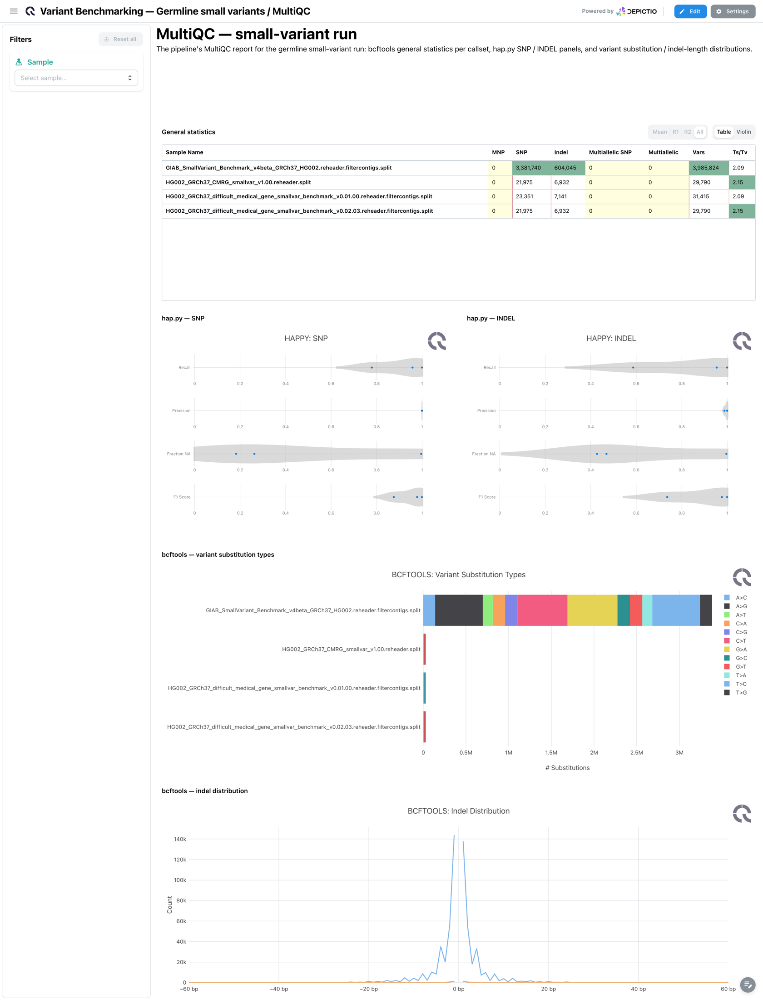
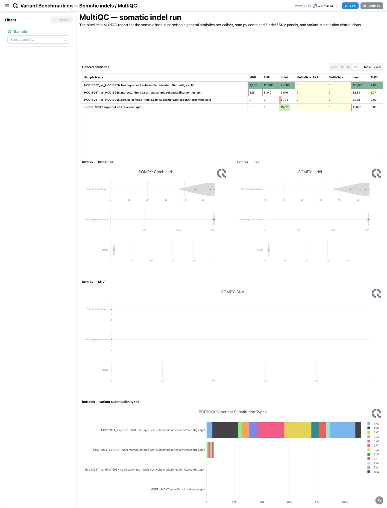
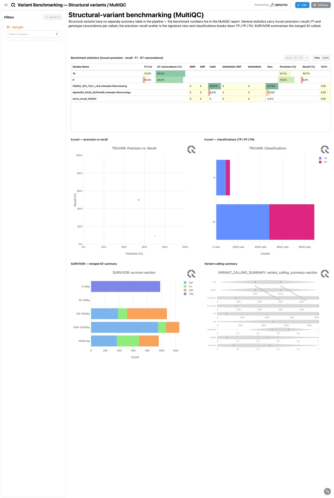
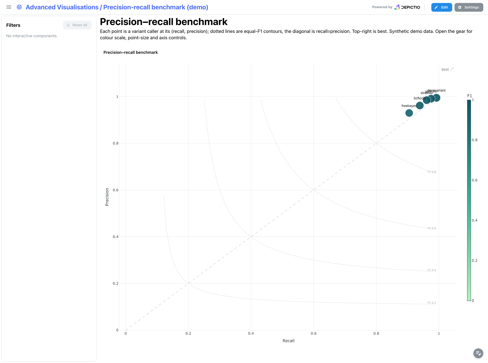
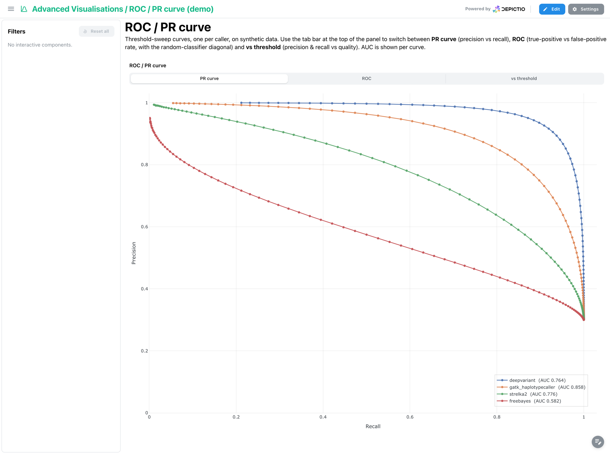
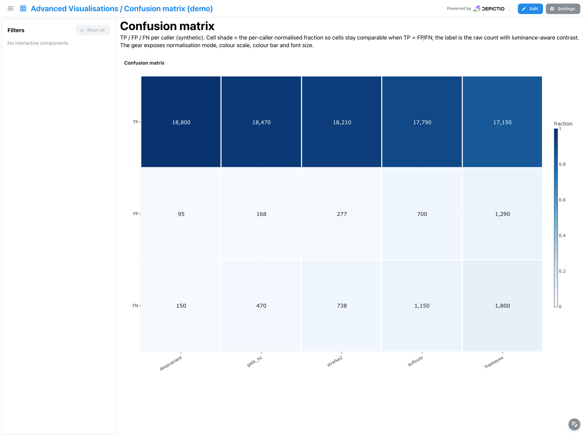
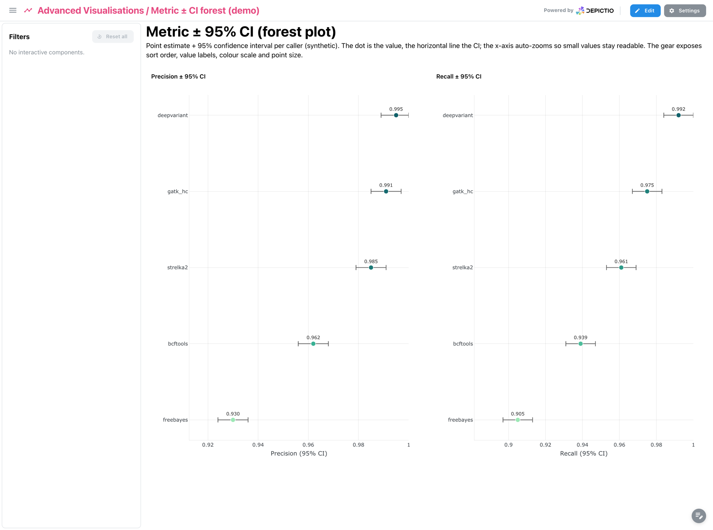

<div class="template-banner">
  <a class="template-banner-logo" href="https://nf-co.re/variantbenchmarking" target="_blank" title="nf-core/variantbenchmarking on nf-co.re">
    
    
  </a>
  <div class="template-banner-body">
    <h1 class="template-title">Variant Benchmarking</h1>
    <p class="template-subtitle">Benchmark variant callers against truth sets: precision, recall and F1 per tool, sample and stratum, for germline small variants, somatic indels and structural variants.</p>
    <p class="template-links">
      <a href="https://nf-co.re/variantbenchmarking" target="_blank"><i class="mdi mdi-open-in-new"></i> nf-co.re</a>
      <a href="https://github.com/nf-core/variantbenchmarking" target="_blank"><i class="mdi mdi-github"></i> GitHub</a>
    </p>
  </div>
  <span class="template-status-experimental template-banner-badge" data-tooltip="Experimental: shared as-is. Feedback and PRs welcome."><i class="mdi mdi-flask-outline"></i> Experimental</span>
</div>

The variantbenchmarking template turns a benchmarking run into a precision/recall funnel:

- :material-compass-outline: **Overview**: four key figures, live findings and four figures for the route the run took, each linked to its tab
- :material-dna: **Germline**: rtg-tools vcfeval and hap.py, on the precision-recall plane, by variant type and over the quality-threshold sweep
- :material-target: **Somatic**: som.py with binomial 95% intervals and allele-fraction strata, cross-checked by rtg-tools vcfeval
- :material-chart-scatter-plot: **Structural & CNV**: Truvari, SVanalyzer and Wittyer, per event and per base
- :material-poll: **MultiQC**: the run's own report, in the per-variant-type templates

---

## :material-arrow-decision-outline: Choosing a template

nf-core/variantbenchmarking benchmarks one variant type per run: its own documentation
states that "only one type of variant analysis is possible for each run". Depictio
therefore ships **one template per variant type**, plus an umbrella template that reads
any of them, one route or several under one root.

There is no variable and no selector for this choice. It is made entirely by the id you
pass to `--template`. Pick the row matching the run you want to explore.

| `--template` id | Produced by a run with | Benchmark tools | Expected in the results directory |
| --- | --- | --- | --- |
| `nf-core/variantbenchmarking/1.4.0/categories/small` | `--analysis germline --variant_type small` | hap.py, rtg-tools vcfeval | `small/` and `multiqc/multiqc_data/multiqc.parquet` |
| `nf-core/variantbenchmarking/1.4.0/categories/indel` | `--analysis somatic --variant_type indel` | som.py, rtg-tools vcfeval | `indel/` and `multiqc/multiqc_data/multiqc.parquet` |
| `nf-core/variantbenchmarking/1.4.0/categories/structural` | `--variant_type structural` | truvari, SURVIVOR, through MultiQC only | `multiqc/multiqc_data/multiqc.parquet` |
| `nf-core/variantbenchmarking/1.4.0` | any of the above, or several runs collected under one root | rtg-tools vcfeval, hap.py, som.py, Truvari, SVanalyzer, Wittyer | any of `small/`, `indel/`, `sv/`, `cnv/`; all optional |

Each category is a self-contained project with its own dashboard, so three pipeline runs
give you three projects. The umbrella template shows the tab of each route it finds, so
it also reads a data root holding several, which is how nf-core's own megatest is laid
out.

!!! warning "Category ids must pin the version"
    `latest` is resolved only in the **last** segment of a template id. So
    `nf-core/variantbenchmarking/latest` works and resolves to `1.4.0`, but
    `nf-core/variantbenchmarking/latest/categories/small` does **not**: the literal
    `latest` is never substituted mid-path, the directory it names does not exist, and
    the run fails with `Template ... not found`. Always spell category ids with the
    pinned version, `nf-core/variantbenchmarking/1.4.0/categories/small`.

    See `_resolve_template_id_in` in
    [`depictio/cli/cli/utils/templates.py`](https://github.com/depictio/depictio/blob/main/depictio/cli/cli/utils/templates.py).

!!! info "Self-adapting layout"
    Nearly every collection is optional, so each dashboard adapts to what the run
    actually produced: components bound to missing collections are hidden and tabs left
    with no visualizations are dropped. On the umbrella template the *Structural & CNV*
    tab binds the optional Truvari, SVanalyzer and Wittyer collections, so it disappears
    entirely on a run with no `sv/` or `cnv/` directory, which is the case for every
    published nf-core megatest.

---

## :material-rocket-launch-outline: Quick start

`DATA_ROOT` is the only template variable, so the results directory is the only thing you ever
have to pass. None of the four templates needs a `--var` flag.

=== "Germline small variants"

    ```bash
    depictio ingest /path/to/germline_results \
      --template nf-core/variantbenchmarking/1.4.0/categories/small
    ```

    Two tabs: hap.py and rtg-tools benchmark metrics, plus the run's MultiQC report.

=== "Somatic indels"

    ```bash
    depictio ingest /path/to/somatic_results \
      --template nf-core/variantbenchmarking/1.4.0/categories/indel
    ```

    Two tabs: som.py metrics with allele-fraction strata and confidence intervals, plus
    the run's MultiQC report.

=== "Structural variants"

    ```bash
    depictio ingest /path/to/sv_results \
      --template nf-core/variantbenchmarking/1.4.0/categories/structural
    ```

    One MultiQC tab. The structural benchmark numbers are published only inside the
    MultiQC report, so this category ships no benchmark tables of its own.

=== "All variant types"

    ```bash
    depictio ingest /path/to/megatest_results \
      --template nf-core/variantbenchmarking/1.4.0
    ```

    An Overview, then a tab for each variant type the data root holds: Germline,
    Somatic, Structural & CNV. Reads no MultiQC report.

---

## :material-book-open-variant: Reference

The four templates are independent projects. Pick one and the reference below switches
to it, so the *Data collections* tables can be read one at a time rather than four deep.

Note the tag naming: the umbrella template prefixes its collections with `germline_` and
`somatic_` to keep both variant types apart inside one project, while each category
template uses the short unprefixed tag.

<div class="tpl-version-pick">
  <span class="tpl-version-icon"><i class="mdi mdi-source-branch"></i></span>
  <span class="tpl-version-label">Template</span>
  <select id="tpl-version" class="tpl-version-select" aria-label="Template">
    <option value="small" selected>1.4.0/categories/small</option>
    <option value="indel">1.4.0/categories/indel</option>
    <option value="structural">1.4.0/categories/structural</option>
    <option value="all">1.4.0 (all variant types)</option>
  </select>
</div>

<div class="tpl-version-block" data-version="small" markdown>

### Germline small variants

--8<-- "pipeline-templates/nf-core/_generated/variantbenchmarking-1.4.0-categories-small.md"

</div>

<div class="tpl-version-block" data-version="indel" markdown>

### Somatic indels

--8<-- "pipeline-templates/nf-core/_generated/variantbenchmarking-1.4.0-categories-indel.md"

</div>

<div class="tpl-version-block" data-version="structural" markdown>

### Structural variants

--8<-- "pipeline-templates/nf-core/_generated/variantbenchmarking-1.4.0-categories-structural.md"

</div>

<div class="tpl-version-block" data-version="all" markdown>

### All variant types in one project

--8<-- "pipeline-templates/nf-core/_generated/variantbenchmarking-latest.md"

</div>

---

## :material-view-dashboard-outline: Dashboard tabs

The umbrella template, `nf-core/variantbenchmarking/1.4.0`, builds one dashboard: the
**Overview**, then one child tab per variant type, in two groups. A run benchmarks one
variant type, so it shows the Overview and the tab of its route; a data root holding
several routes shows the tab of each. Each tab below carries the **same icon and colour
the dashboard gives it**.

| Group | Tabs |
|---|---|
| Small variants | Germline, Somatic |
| Structural | Structural & CNV |

The pipeline writes no MultiQC report into the tables this template reads, and it has no
sample sheet: there is no MultiQC tab, no *Data & QC* group, no persistent sample filters
and no *Sample sheet* section. Each child tab opens with a short intro and a strip of four
cards, then at most three open sections; tables and the cross-check follow, collapsed.
Each caller keeps one colour on every tab, and the precision-recall scatters draw no point
labels.

=== ":material-compass-outline: Overview"

    *Which callset recovers its truth set best, on precision, recall and F1.*

    <!-- screenshot pending v2 -->

    A short hero links the run parameters. *The run* lists the analysis and variant type,
    the truth set, the benchmarking methods, the genome and the callsets, and *Pipeline*
    shows the steps of the route the run took: the steps of the other routes are dropped
    at import. *Key figures*, the findings and the four figures below them come from that
    route as well.

    ??? abstract ":material-tune-variant: Filters and components"

        **Filters** · the left panel starts collapsed. *Key figures* and *Findings* each
        have a filter bar (caller and callset) that narrows its own section only.

        | Section | What it holds |
        |---|---|
        | Top | Hero, *About this dashboard*, *The run*, *Pipeline* |
        | Key figures | 4 headline cards for the run's route: true positives, F1, recall, precision |
        | Findings | Three live result rows for the route, then 4 figures from its tab |
        | How to read this dashboard | The tabs by group, each with its question |

=== ":material-dna:{ .mc-indigo } Germline"

    **Small variants** · *How well does each germline callset recover the truth set?*

    [{ loading=lazy }](../../images/pipeline-templates/nf-core/variantbenchmarking/germline_benchmark_light.png){ .tpl-shot target="_blank" rel="noopener" }

    <!-- screenshot pending v2: this capture shows the categories/small Benchmark tab -->

    F1 with its spread, recall against a 0.9 floor, the callers with most false
    positives and the true positives by caller, all from rtg-tools vcfeval. Then the
    precision-recall scatter beside the errors per callset, and hap.py's F1 by variant
    type (all calls against PASS calls) beside the quality-threshold sweep.

    ??? abstract ":material-tune-variant: Filters and components"

        **Filters** · `Caller` and `Callset` on `germline_vcfeval_summary`, `hap.py
        variant type` and `hap.py calls` (ALL or PASS) on `germline_happy_summary`.

        | Section | What it holds |
        |---|---|
        | Germline at a glance | 4 cards |
        | Precision and recall | 2 advanced visualizations |
        | hap.py by variant type | 1 bar + 1 advanced visualization |
        | Germline tables (collapsed) | *rtg-tools vcfeval summary*, *hap.py pooled summary*, *hap.py threshold sweep* |

=== ":material-target:{ .mc-pink } Somatic"

    **Small variants** · *How well does each somatic caller recover the truth set?*

    [{ loading=lazy }](../../images/pipeline-templates/nf-core/variantbenchmarking/somatic_benchmark_light.png){ .tpl-shot target="_blank" rel="noopener" }

    <!-- screenshot pending v2: this capture shows the categories/indel Benchmark tab -->

    F1 with its spread, precision against a 0.5 floor, the callers with most false
    positives and the true positives by caller, all from som.py. Then the
    precision-recall scatter beside the errors per caller, precision and recall with
    their binomial 95% intervals, and F1 and recall per allele-fraction bin. The
    collapsed rtg-tools cross-check scores the same callers on haplotypes.

    ??? abstract ":material-tune-variant: Filters and components"

        **Filters** · `Caller` on `somatic_sompy_summary` and `Allele-fraction bin` on
        `somatic_sompy_regions`. The caller reaches the strata and the cross-check
        through cross-DC links on the `caller` column.

        | Section | What it holds |
        |---|---|
        | Somatic at a glance | 4 cards |
        | Precision and recall | 2 advanced visualizations |
        | Confidence intervals | 2 advanced visualizations |
        | Allele-fraction strata | 2 bars |
        | rtg-tools cross-check (collapsed) | 1 advanced visualization + *rtg-tools vcfeval summary* |
        | Somatic tables (collapsed) | *som.py summary*, *som.py allele-fraction strata* |

=== ":material-chart-scatter-plot:{ .mc-orange } Structural & CNV"

    **Structural** · *How well do the structural callsets match the truth set?*

    <!-- screenshot pending v2 -->

    The true positives by caller, F1 with its spread, recall against a 0.8 floor and the
    spread of precision, all from Truvari. Then the Truvari precision-recall scatter
    beside its errors per callset, and the SVanalyzer F1 per callset beside the Wittyer
    F1 per event and per base. A callset that finds events but misplaces their
    breakpoints scores well per event and poorly per base. A copy-number run keeps only
    the Wittyer tiles.

    ??? abstract ":material-tune-variant: Filters and components"

        **Filters** · `Callset` and `Caller` on `sv_truvari_summary`, `Wittyer level` on
        `cnv_wittyer_summary`. The callset reaches SVanalyzer and Wittyer through the
        links.

        | Section | What it holds |
        |---|---|
        | Structural at a glance | 4 cards |
        | Precision and recall | 2 advanced visualizations |
        | SVanalyzer and Wittyer | 2 bars |
        | Structural tables (collapsed) | *Truvari summary*, *SVanalyzer svbenchmark summary*, *Wittyer summary* |

The callset tables select rows on their identifier: `label` for the vcfeval,
Truvari, SVanalyzer and Wittyer tables, `caller` for the som.py tables and the
somatic vcfeval table. A pick narrows the tiles that read the same table; a som.py
pick also reaches its allele-fraction strata and the cross-check, and a Truvari
pick reaches the SVanalyzer and Wittyer tiles, through the links. The hap.py
pooled summary and threshold sweep have no callset column and do not select.

### Per-variant-type templates

The three `categories/` templates keep their own layout, one project per variant type:
a *Benchmark* tab over the benchmark tables, and the run's MultiQC report. The structural
category reads the MultiQC report only, since the public nf-core megatest publishes no
structural summary table.

=== "{ width=18 }{ width=18 } categories/small"

    [{ loading=lazy }](../../images/pipeline-templates/nf-core/variantbenchmarking/germline_multiqc_light.png){ .tpl-shot target="_blank" rel="noopener" }

    The MultiQC tab: general statistics, the hap.py SNP and INDEL panels, and the
    bcftools substitution types and indel lengths, collapsed.

=== "{ width=18 }{ width=18 } categories/indel"

    [{ loading=lazy }](../../images/pipeline-templates/nf-core/variantbenchmarking/somatic_multiqc_light.png){ .tpl-shot target="_blank" rel="noopener" }

    The MultiQC tab: general statistics, the som.py Combined, Indel and SNV panels, and
    the bcftools substitution types and variant depths, collapsed.

=== "{ width=18 }{ width=18 } categories/structural"

    [{ loading=lazy }](../../images/pipeline-templates/nf-core/variantbenchmarking/structural_multiqc_light.png){ .tpl-shot target="_blank" rel="noopener" }

    The only tab: general statistics with the Truvari precision, recall, F1 and genotype
    concordance, the Truvari precision-recall view and classifications, and the SURVIVOR
    summary, collapsed.

---

## :material-chart-timeline-variant: Benchmarking visualizations

The template introduced four visualization kinds built for benchmarking, used across
the Germline, Somatic and Structural & CNV tabs. Each is bound through a catalog module,
so any project reading a comparable table can reuse them.

=== ":material-chart-scatter-plot:{ .mc-indigo } PR benchmark"

    [{ loading=lazy }](../../images/pipeline-templates/nf-core/variantbenchmarking/advviz_pr_benchmark_light.png){ .tpl-shot target="_blank" rel="noopener" }

    One point per callset at (recall, precision), coloured by its caller, over dotted
    equal-F1 contours and the recall = precision diagonal, so a callset's balance is
    readable at a glance.

=== ":material-chart-line:{ .mc-teal } ROC / PR curve"

    [{ loading=lazy }](../../images/pipeline-templates/nf-core/variantbenchmarking/advviz_roc_pr_curve_light.png){ .tpl-shot target="_blank" rel="noopener" }

    Threshold-sweep curves with a per-curve AUC. Its View switch draws the **PR curve**,
    the **ROC**, or precision and recall **vs threshold**.

=== ":material-grid:{ .mc-grape } Confusion matrix"

    [{ loading=lazy }](../../images/pipeline-templates/nf-core/variantbenchmarking/advviz_confusion_matrix_light.png){ .tpl-shot target="_blank" rel="noopener" }

    TP, FP and FN per callset. Shading is the per-callset normalised fraction while the
    label keeps the raw count, and the label colour follows cell luminance so it stays
    legible at both ends of the scale.

=== ":material-chart-bell-curve:{ .mc-cyan } Metric CI bars"

    [{ loading=lazy }](../../images/pipeline-templates/nf-core/variantbenchmarking/advviz_metric_ci_forest_light.png){ .tpl-shot target="_blank" rel="noopener" }

    A forest plot: point estimate plus 95 % confidence interval per caller, on an x-axis
    that auto-zooms to the spread so overlapping intervals stay distinguishable.

---

## :material-play-circle-outline: Running the pipeline

Depictio reads the **output** of nf-core/variantbenchmarking, it does not run the
pipeline. Run the pipeline first, once per variant type:

```bash
nextflow run nf-core/variantbenchmarking -r 1.4.0 \
  --input samplesheet.csv \
  --outdir results/ \
  --genome GRCh38 \
  --truth_id HG002 --truth_vcf truth.vcf.gz \
  --analysis germline \
  --variant_type small \
  -profile docker
```

Then point Depictio at the results, choosing the template id for the variant type that
run produced:

```bash
depictio ingest results/ \
  --template nf-core/variantbenchmarking/1.4.0/categories/small
```

To benchmark somatic indels as well, run the pipeline again with
`--analysis somatic --variant_type indel` into a second output directory, and import it
with the `categories/indel` template. Point the umbrella template at a root holding both
result sets instead, if you would rather have one project than two.

See [nf-co.re/variantbenchmarking/usage](https://nf-co.re/variantbenchmarking/1.4.0/docs/usage)
for full pipeline documentation.

---

## :material-folder-open-outline: Required data structure

Point `depictio ingest` at the directory holding the pipeline output. A category template
requires its first table and its MultiQC report; on the umbrella template every table is
optional. The dashboard adapts to what is present.

```text
<DATA_ROOT>/
├── small/                                                  # --variant_type small
│   ├── summary/tables/rtgtools/
│   │   └── rtgtools.summary.csv                            # required by small
│   └── <sample>/benchmarks/happy/
│       ├── *.summary.csv                                   # optional
│       └── *.roc.Locations.SNP.PASS.csv.gz                 # optional
├── indel/                                                  # --variant_type indel
│   └── summary/tables/
│       ├── sompy/sompy.summary.csv                         # required by indel
│       ├── sompy/sompy.regions.csv                         # optional, AF strata
│       └── rtgtools/rtgtools.summary.csv                   # optional, cross-check
├── sv/summary/tables/                                      # optional, umbrella only
│   ├── truvari/truvari.summary.csv
│   └── svbenchmark/svbenchmark.summary.csv
├── cnv/summary/tables/wittyer/
│   └── wittyer.summary.csv                                 # optional, umbrella only
└── multiqc/multiqc_data/
    └── multiqc.parquet                                     # required by each category
```

Each category template requires the MultiQC report of its own run. The umbrella template
reads no MultiQC report, and shows the tab of each route it finds under the root.

---

## :material-flask-outline: Validation runs

The repository ships
[`download_test_data.sh`](https://github.com/depictio/depictio/blob/main/depictio/projects/nf-core/variantbenchmarking/1.4.0/download_test_data.sh),
which pulls a real run from nf-core's public megatest bucket:

```bash
bash depictio/projects/nf-core/variantbenchmarking/1.4.0/download_test_data.sh \
  /tmp/variantbenchmarking_test
```

It fetches the `small/` and `indel/` summary tables plus the hap.py per-sample files from
`s3://nf-core-awsmegatests/variantbenchmarking/`, then prints the follow-up commands.

!!! note "The fixture suits the umbrella template"
    No published megatest contains a `multiqc/` directory, and the script does not fetch
    one, so this fixture will not satisfy the three category templates, which each
    require a MultiQC report. Use it with
    `--template nf-core/variantbenchmarking/1.4.0`, which reads no MultiQC report and
    covers both variant types the fixture provides.

---

## :material-link-variant: Additional resources

- [nf-co.re/variantbenchmarking](https://nf-co.re/variantbenchmarking): official pipeline documentation
- [nf-co.re/variantbenchmarking/1.4.0/results](https://nf-co.re/variantbenchmarking/1.4.0/results): AWS test results
- [Template System Reference](../../usage/projects/templates.md): YAML format, variables, conditionals
- [Recipes](../../usage/projects/recipes.md): how to read, test, and write recipes

---

## :material-account-group-outline: Authorship

<div class="tpl-credits">
  <div class="tpl-credit">
    <span class="tpl-credit-role"><i class="mdi mdi-code-braces"></i> Developers</span>
    <span class="tpl-credit-note">Wrote the four templates, their recipes and their dashboards.</span>
    <a class="tpl-person" href="https://github.com/weber8thomas" target="_blank" rel="noopener">
       weber8thomas
    </a>
  </div>
  <div class="tpl-credit">
    <span class="tpl-credit-role"><i class="mdi mdi-eye-check-outline"></i> Reviewers</span>
    <span class="tpl-credit-note">Nobody has run them on their own data and signed them off yet, which is what keeps the status Experimental.</span>
    <span class="tpl-person"><i class="mdi mdi-account-plus-outline"></i> Open</span>
  </div>
  <div class="tpl-credit">
    <span class="tpl-credit-role"><i class="mdi mdi-wrench-outline"></i> Maintainers</span>
    <span class="tpl-credit-note">Keep them working as nf-core/variantbenchmarking releases.</span>
    <a class="tpl-person" href="https://github.com/weber8thomas" target="_blank" rel="noopener">
       weber8thomas
    </a>
  </div>
</div>

Reviewing a template on your own data, or taking over a role here, is a
contribution in itself: the [contributing guide](../../developer/contributing-templates.md)
says what each one involves.
