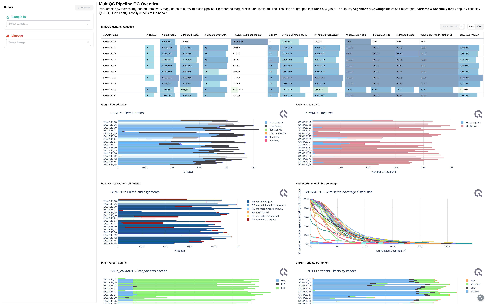
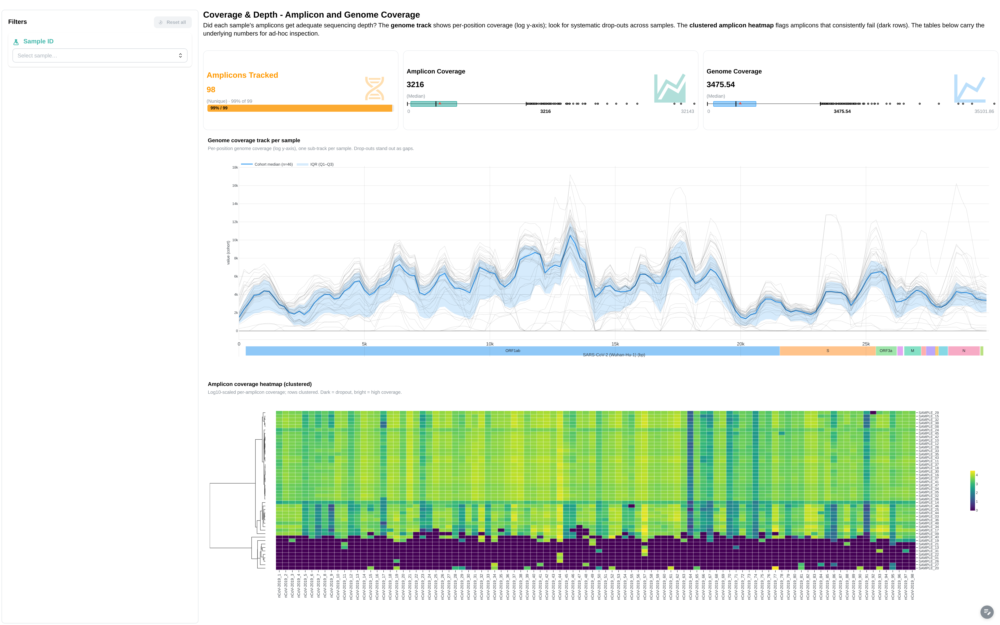
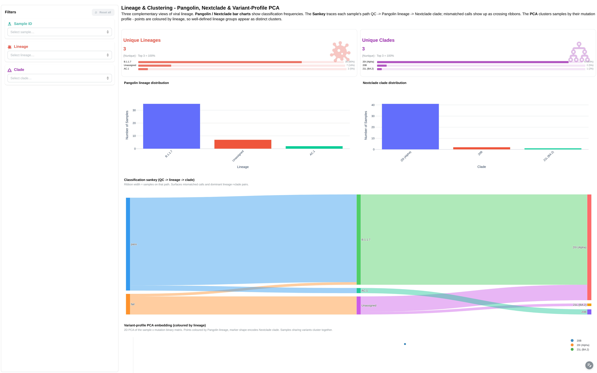
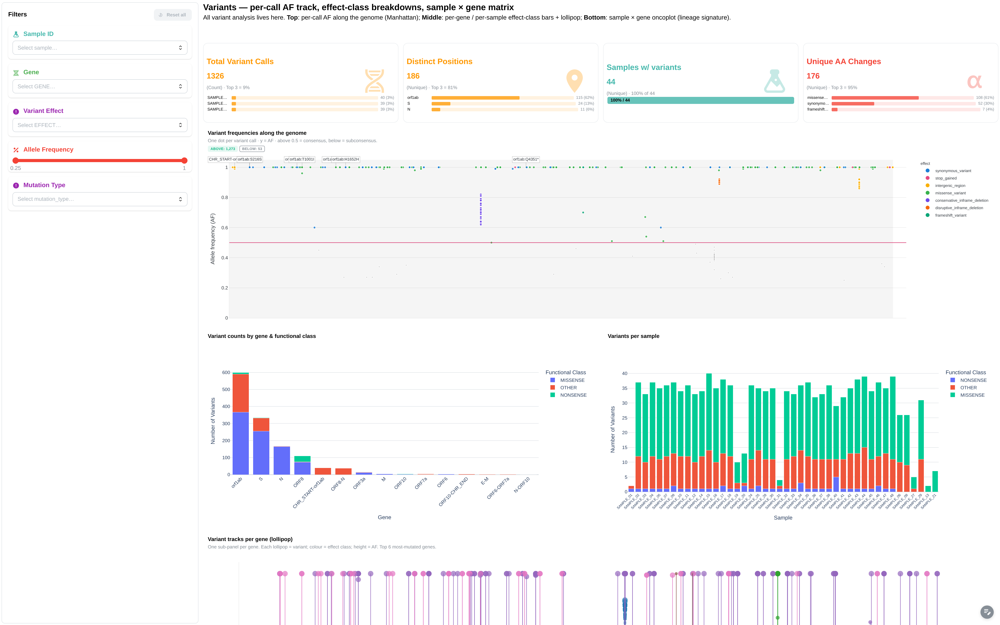
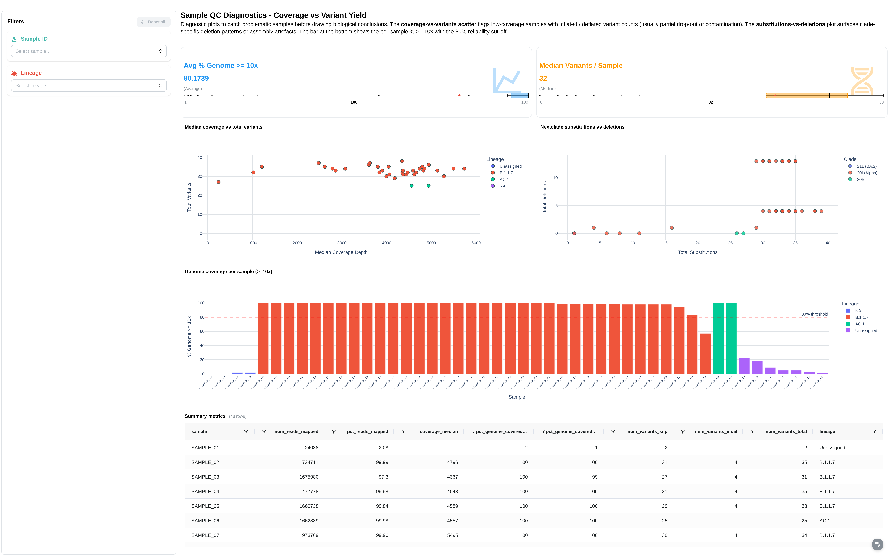

---
hide:
  - navigation
---

# nf-core/viralrecon

<div style="display:flex;align-items:center;gap:16px;margin-bottom:16px;">
  
  <div style="flex:1;">
    <strong style="font-size:1.1em;">Assembly and intrahost/low-frequency variant calling for viral samples — SARS-CoV-2 + other viral genomes via the reference-genomes config.</strong><br>
    <span style="color:#666;font-size:0.9em;">nf-core pipeline · <a href="https://nf-co.re/viralrecon" target="_blank">nf-co.re/viralrecon</a></span>
  </div>
  <div style="background:#2196F3;color:#fff;padding:4px 12px;border-radius:12px;font-size:0.85em;font-weight:600;white-space:nowrap;"><svg xmlns="http://www.w3.org/2000/svg" width="14" height="14" viewBox="0 0 24 24" fill="none" stroke="white" stroke-width="2" stroke-linecap="round" stroke-linejoin="round" style="vertical-align:-2px;margin-right:4px;"><circle cx="12" cy="12" r="10"/><path d="m9 12 2 2 4-4"/></svg>Reviewed</div>
</div>

The viralrecon template covers the main outputs of a standard nf-core/viralrecon run:

- :material-chart-bar: **MultiQC quality control** — FastQC, Cutadapt, samtools/picard alignment metrics
- :material-dna: **Variant calling** — iVar variants with gene, effect, and allele-frequency annotations (illumina only)
- :material-virus: **Lineage assignment** — Pangolin lineages with conflict and QC scores
- :material-medical-bag: **Clade assignment** — Nextclade clades with substitution counts
- :material-chart-line: **Coverage analysis** — Mosdepth amplicon coverage, genome coverage, and amplicon heatmap
- :material-chart-scatter-plot: **Cross-sample landscape** — variant landscape and lineage analysis dashboards

!!! info "Works beyond SARS-CoV-2"
    The pipeline supports any viral genome in nf-core's reference-genomes
    config. This template was validated on SARS-CoV-2 / ARTIC amplicon data,
    but the recipe / dashboard structure carries over to other viruses with
    the same iVar variant-calling + Pangolin / Nextclade lineage layout.

---

## Quick start

viralrecon needs no extra template variables — the **same command** works for
both sequencing platforms, which Depictio auto-detects from the run's
`params.json`:

=== "Illumina"

    ```bash
    depictio run \
      --template nf-core/viralrecon/3.0.0 \
      --data-root /path/to/viralrecon_results
    ```

    Full dashboard: MultiQC, coverage & depth, lineage & clustering, variants, sample QC.

=== "Nanopore (ARTIC minion)"

    ```bash
    depictio run \
      --template nf-core/viralrecon/3.0.0 \
      --data-root /path/to/viralrecon_results
    ```

    `IS_NANOPORE` is auto-detected: the coverage and lineage collections are
    repointed at the `artic_minion/` layout and the illumina-only variant
    collections are dropped — see *Conditional routes* in the [Reference](#reference).

!!! warning "`--variant_caller ivar` is required"
    The viralrecon template's recipes hardcode paths under `variants/ivar/`
    (see `variants_long.py`, `pangolin_lineages.py`, `nextclade_results.py`).
    Running nf-core/viralrecon with the alternative `--variant_caller bcftools`
    produces a different output layout that the template won't match.

!!! tip "Aggregated data collections"
    The viralrecon DCs use `metatype: "Aggregated"`. They are built
    by recipes that fan multiple per-sample files into a single delta
    table via `glob_pattern`. See [Recipes](../../usage/projects/recipes.md#glob_pattern-per-sample-inputs)
    for the underlying mechanism.

---

## Reference

Recipe DCs fan per-sample files into one delta table via `glob_pattern`; the
`IS_NANOPORE` route (auto-detected from `params.json`) repoints
coverage/lineage DCs at the `artic_minion/` layout and drops the
illumina-only variant DCs.

!!! info "Self-adapting layout"
    The dashboard adapts to whatever the run actually produced: components bound to
    pruned or unparsed data collections are hidden, tabs left with no real
    visualizations are dropped, and the rest are re-packed with no empty rows. One
    template therefore covers both the Illumina and nanopore/ARTIC routes without edits.

---

## Dashboard tabs

The viralrecon template ships a five-tab dashboard (MultiQC parent +
four child tabs). Each tab targets a different analytical question;
filters propagate across tabs via cross-DC links on the
`summary_metrics.sample` column.

=== "MultiQC"

    Pipeline-level quality control powered by MultiQC.

    [](../../images/pipeline-templates/nf-core/viralrecon/multiqc_light.png){target="_blank" rel="noopener"}

    **Filters:** Sample ID, Lineage.

    **Components:**

    - General stats table
    - Raw read counts and trimming statistics (FastQC, Cutadapt)
    - Alignment rate and duplication rate
    - samtools / picard alignment metrics
    - Per-sample variant counts

=== "Coverage & Depth"

    Per-sample and per-amplicon coverage view.

    [](../../images/pipeline-templates/nf-core/viralrecon/coverage_depth_light.png){target="_blank" rel="noopener"}

    **Filters:** Sample ID.

    **Components:**

    - 4 summary cards: *Total Samples*, *Amplicons Tracked*, *Amplicon Coverage*, *Genome Coverage*
    - *Genome Coverage per Sample* (line chart)
    - *Amplicon Coverage Heatmap*
    - *Amplicon Coverage Data* table
    - *Genome Coverage Data* table

=== "Lineage & Clustering"

    Pangolin lineage and Nextclade clade assignment, plus a Sankey
    funnel from QC status → lineage → clade.

    [](../../images/pipeline-templates/nf-core/viralrecon/lineage_clustering_light.png){target="_blank" rel="noopener"}

    **Filters:** Sample ID, Lineage, Clade, QC Status.

    **Components:**

    - 4 summary cards: *Total Samples*, *Unique Lineages*, *Unique Clades*, *Avg Genome Coverage (10x)*
    - 6 figures: *Pangolin Lineage Distribution*, *Nextclade QC Status Overview*, *Nextclade Clade Distribution*, *Coverage vs Total Variants by Lineage*, *Genome Coverage per Sample (>= 10x Depth)*, *Nextclade — Substitutions vs Deletions by Clade*
    - Sankey funnel: qc_status → lineage → clade (canonical sankey)
    - 3 tables: *Pangolin Lineage Assignments*, *Nextclade Clade Assignments*, *Summary Metrics*

=== "Variants"

    Variant calls and functional effects, with manhattan-style genome
    landscape and oncoplot of high-impact mutations.

    [](../../images/pipeline-templates/nf-core/viralrecon/variants_light.png){target="_blank" rel="noopener"}

    **Filters:** Sample ID, Gene, Variant Effect, Functional Class, Allele Frequency (range), Read Depth (range).

    **Components:**

    - 4 summary cards: *Total Variants*, *Unique Genes*, *Mean Allele Freq*, *Unique AA Changes*
    - Manhattan plot: chr × pos × score (canonical manhattan)
    - Lollipop: per-gene variants (canonical lollipop)
    - Oncoplot: sample × gene × mutation_type (canonical oncoplot)
    - 5 figures: *Allele Frequency vs Genome Position*, *Variant Count by Gene and Functional Class*, *Variant Effect Distribution*, *Variant Functional Class Distribution*, *Variant Count per Sample*
    - 1 table: *Variants Long Table*

=== "Sample QC"

    Per-sample QC scorecard combining alignment, coverage, variant counts
    and lineage / clade assignment in one place.

    [](../../images/pipeline-templates/nf-core/viralrecon/sample_qc_light.png){target="_blank" rel="noopener"}

    **Filters:** Sample ID, Lineage, QC Status.

    **Components:**

    - Summary cards: total samples, samples passing QC, mean coverage,
      mean variants per sample
    - Sample × metric heatmap (canonical complex heatmap)
    - Summary metrics table

---

## Running the pipeline

Depictio reads the **output** of nf-core/viralrecon — it does not run the pipeline. Run the pipeline first, using the iVar variant caller the template targets:

```bash
nextflow run nf-core/viralrecon -r 3.0.0 \
  --input samplesheet.csv \
  --platform illumina \
  --protocol amplicon \
  --variant_caller ivar \
  -profile docker
```

Then point Depictio at the results:

```bash
depictio run --template nf-core/viralrecon/3.0.0 \
  --data-root results/
```

See [nf-co.re/viralrecon/usage](https://nf-co.re/viralrecon/3.0.0/docs/usage) for full pipeline documentation.

---

## Required data structure

Point `--data-root` to the directory containing your viralrecon outputs. This can be a single run's `results/` folder or a parent directory containing multiple runs — Depictio scans recursively. Not all files are required; the template adapts to what's present and to the sequencing platform (`IS_NANOPORE` is auto-detected from the run's `params.json`).

```text
<DATA_ROOT>/
├── multiqc/
│   ├── multiqc_data/
│   │   └── multiqc.parquet
│   └── summary_variants_metrics_mqc.csv
└── variants/
    └── ivar/                                   # illumina layout (⚠ artic_minion/ on nanopore)
        ├── consensus/
        │   └── bcftools/
        │       ├── pangolin/*.pangolin.csv     # Pangolin lineage, one file per sample
        │       └── nextclade/*.csv             # Nextclade clade, one file per sample
        ├── variants_long_table.csv             # ⚠ illumina only (dropped on nanopore)
        └── *.mosdepth.{coverage,heatmap}.tsv   # amplicon / genome coverage
```

---

## Test data

A small test fixture is available for local development without re-running
the full pipeline. The repository ships
[`download_test_data.sh`](https://github.com/depictio/depictio/blob/main/depictio/projects/nf-core/viralrecon/3.0.0/download_test_data.sh)
which fetches a real viralrecon run from nf-core's AWS megatest bucket:

```bash
bash depictio/projects/nf-core/viralrecon/3.0.0/download_test_data.sh \
  --target /tmp/viralrecon_test
```

This pulls a published run from
`s3://nf-core-awsmegatests/viralrecon/results-395079f1d24dce731ac22e03d7a5e71f110103fc/`
and validates that all expected file patterns are present.

Once the download finishes, run depictio against it:

```bash
depictio run \
  --template nf-core/viralrecon/3.0.0 \
  --data-root /tmp/viralrecon_test/run_1
```

!!! note "Alternative: run nf-core/viralrecon locally"
    The script can also re-run nf-core/viralrecon end-to-end if you'd
    rather regenerate the fixture from scratch:

    ```bash
    nextflow run nf-core/viralrecon -r 3.0.0 \
      -profile test_illumina,docker \
      --variant_caller ivar \
      --outdir /tmp/viralrecon_test/run_1
    ```

---

## Additional resources

- [nf-co.re/viralrecon](https://nf-co.re/viralrecon) — official pipeline documentation
- [nf-co.re/viralrecon/3.0.0/results](https://nf-co.re/viralrecon/3.0.0/results) — AWS test results
- [Template System Reference](../../usage/projects/templates.md) — YAML format, variables, conditionals
- [Recipes](../../usage/projects/recipes.md) — how to read, test, and write recipes
