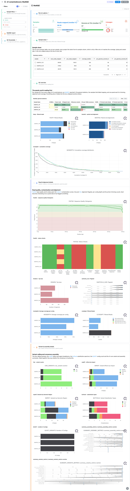
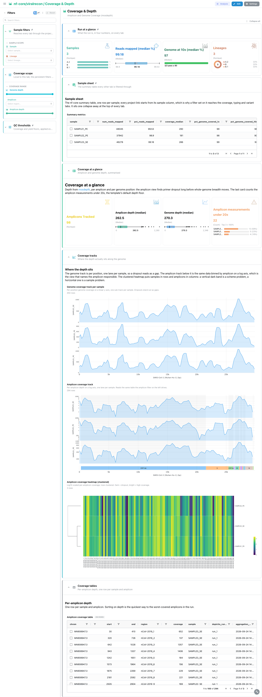
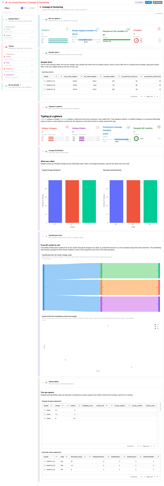
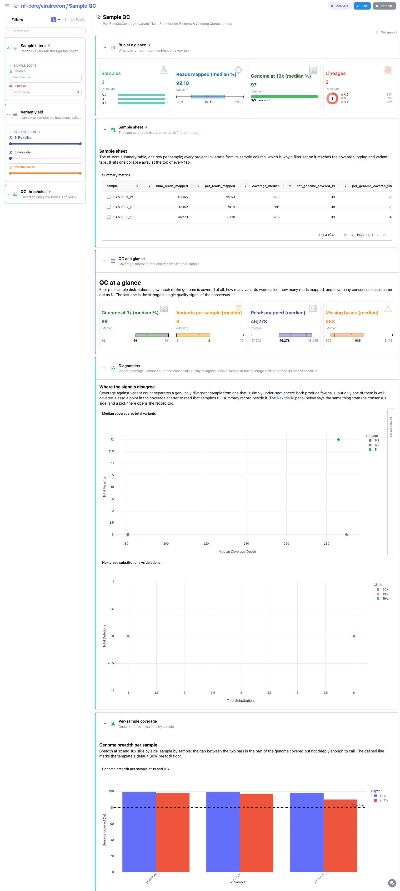
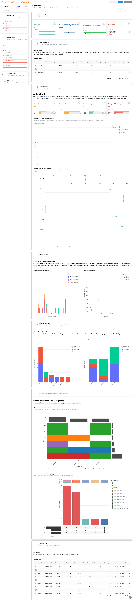

<div class="template-banner">
  <a class="template-banner-logo" href="https://nf-co.re/viralrecon" target="_blank" title="nf-core/viralrecon on nf-co.re">
    
    
  </a>
  <div class="template-banner-body">
    <h1 class="template-title">Viral Genome Reconstruction</h1>
    <p class="template-subtitle">Assembly and intrahost/low-frequency variant calling for viral samples — SARS-CoV-2 + other viral genomes via the reference-genomes config.</p>
    <p class="template-links">
      <a href="https://nf-co.re/viralrecon" target="_blank"><i class="mdi mdi-open-in-new"></i> nf-co.re</a>
      <a href="https://github.com/nf-core/viralrecon" target="_blank"><i class="mdi mdi-github"></i> GitHub</a>
    </p>
  </div>
  <span class="template-status-reviewed template-banner-badge" data-tooltip="Reviewed — tested, CI passes, and reviewed by the Depictio team or community."><i class="mdi mdi-check-circle-outline"></i> Reviewed</span>
</div>

The viralrecon template covers the main outputs of a standard nf-core/viralrecon run:

- :material-chart-bar: **MultiQC quality control** — FastQC, Cutadapt, samtools/picard alignment metrics
- :material-dna: **Variant calling** — gene, effect, and allele-frequency annotations from iVar (Illumina) or ARTIC/clair3 (nanopore)
- :material-virus: **Lineage assignment** — Pangolin lineages with conflict and QC scores
- :material-medical-bag: **Clade assignment** — Nextclade clades with substitution counts
- :material-chart-line: **Coverage analysis** — Mosdepth amplicon coverage, genome coverage, and amplicon heatmap
- :material-chart-scatter-plot: **Cross-sample landscape** — variant landscape and lineage analysis dashboards

!!! info "Works beyond SARS-CoV-2"
    The pipeline supports any viral genome in nf-core's reference-genomes
    config. This template was validated on SARS-CoV-2 / ARTIC amplicon data,
    but the recipe / dashboard structure carries over to other viruses with
    the same iVar variant-calling + Pangolin / Nextclade lineage layout.

---

## Quick start

`--data-root` is the only thing you have to pass. The template's routing variables
(`PLATFORM`, `PROTOCOL`, `VARIANT_CALLER`, and the `SKIP_*` flags) mirror nf-core's own
parameters and are **auto-derived from the run's `params.json`** — so the *same command*
works for an Illumina or a nanopore run:

```bash
depictio run \
  --template nf-core/viralrecon/3.0.0 \
  --data-root /path/to/viralrecon_results
```

A nanopore run (whose `params.json` records `platform: nanopore`) is detected
automatically: the coverage and lineage collections are repointed at the
`artic_minion/` layout and the variant calls are **re-sourced** from the ARTIC
`*.pass.vcf.gz` files — so the variant views (oncoplot, lollipop, manhattan) keep
working. Only `summary_metrics` is dropped (no nanopore equivalent yet).

!!! tip "Override the auto-derived values"
    The derivation reads `pipeline_info/params*.json`. Pass `--var NAME=value` to
    override any of it — e.g. `--var PLATFORM=nanopore` when a `DATA_ROOT` aggregates
    mixed-platform runs, or `--var SKIP_PANGOLIN=true` to force-drop a collection. Each
    auto-derived value is logged at resolution time. See the full list and routes in the
    [Reference](#reference).

!!! tip "Or let the pipeline do it <small>(v1.10.0+)</small>"
    Run `depictio-cli config nextflow --install` once on the machine that runs
    `nextflow`, and a plain `nextflow run nf-core/viralrecon --outdir results`
    ingests itself when it finishes, resolving this template from its own
    manifest. See [Nextflow trigger](../../depictio-cli/nextflow-trigger.md).

!!! tip "Aggregated data collections"
    The viralrecon DCs use `metatype: "Aggregated"`. They are built
    by recipes that fan multiple per-sample files into a single delta
    table via `glob_pattern`. See [Recipes](../../usage/projects/recipes.md#glob_pattern-per-sample-inputs)
    for the underlying mechanism.

---

## Reference

Recipe DCs fan per-sample files into one delta table via `glob_pattern`. The
`PLATFORM=nanopore` route repoints the coverage/lineage DCs at the
`artic_minion/` layout and re-sources `variants_long` from the ARTIC VCFs;
only `summary_metrics` is dropped.

### Direct vs derived data collections

The template exposes two kinds of data collection, and the **Origin** column of the
reference table below flags each one explicitly — so you can tell real measurements
from views at a glance:

| Origin | What it is | Examples |
|---|---|---|
| <span class="gtd-badge gtd-direct">direct</span> | A real pipeline output — scanned straight off disk, or lightly cleaned by a recipe that reads the raw files. This *is* the data. | `variants_long`, `pangolin_lineages`, `nextclade_results`, `mosdepth_amplicon_coverage` |
| <span class="gtd-badge gtd-derived">derived</span> | A *reshape* of one or more direct collections into the exact column layout an advanced visualization needs — a view, not new measurement (its recipe reads another collection via `dc_ref`). | `variant_oncoplot`, `amplicon_coverage_matrix`, `genome_coverage_track`, `classification_sankey`, `mutation_upset`, `variant_pca_matrix` |

Derived collections used to carry a `_canonical` suffix; they were renamed to
say what they *produce* (e.g. `variant_feature_matrix_canonical` →
`variant_pca_matrix`). Each one names its source recipe in the reference table's
*Reads* column.

!!! info "Self-adapting layout"
    The dashboard adapts to whatever the run actually produced: components bound to
    pruned or unparsed data collections are hidden, tabs left with no real
    visualizations are dropped, and the rest are re-packed with no empty rows. One
    template therefore covers both the Illumina and nanopore/ARTIC routes without edits.

--8<-- "pipeline-templates/nf-core/_generated/viralrecon-3.0.0.md"

---

## :material-view-dashboard-outline: Dashboard tabs

Five tabs: the MultiQC parent, then four children. Each tab below carries the
**same icon and colour the dashboard gives it**, so the page and the app read
alike. Filters propagate across tabs through cross-DC links on
`summary_metrics.sample`.

=== ":material-chart-box-outline:{ .mc-orange } MultiQC"

    *Sequencing, alignment and variant-calling QC, straight from the report.*

    [](../../images/pipeline-templates/nf-core/viralrecon/multiqc_light.png){target="_blank" rel="noopener"}

    Four cards open the run: **Samples**, **Reads mapped (%)**, **Genome at 10x**
    and **Lineages**. Eighteen MultiQC panels follow, in three sections.

    ??? abstract ":material-tune-variant: Filters and components"

        **Filters** · `Sample` and `Lineage`, plus four thresholds on
        `summary_metrics`: genome covered at 10x, median depth, reads mapped and
        variants called. A selector picks which MultiQC report to read.

        | Section | What it holds |
        |---|---|
        | Run at a glance | 4 cards |
        | QC overview | 6 MultiQC panels |
        | Read & alignment details | 6 MultiQC panels |
        | Variant & assembly details | 6 MultiQC panels |

=== ":material-chart-areaspline:{ .mc-teal } Coverage & Depth"

    *Amplicon and genome coverage, from mosdepth.*

    [](../../images/pipeline-templates/nf-core/viralrecon/coverage_depth_light.png){target="_blank" rel="noopener"}

    Three coverage tracks sit under four cards: **Amplicons Tracked**,
    **Amplicon Coverage**, **Genome Coverage** and **Amplicons at 20x**.

    ??? abstract ":material-tune-variant: Filters and components"

        **Filters** · genome depth and amplicon depth as ranges, plus an amplicon
        picker on `mosdepth_amplicon_coverage`.

        | Section | What it holds |
        |---|---|
        | Coverage at a glance | 4 cards |
        | Coverage tracks | 3 advanced visualizations |
        | Coverage tables | *Amplicon coverage table* |

=== ":material-virus:{ .mc-red } Lineage & Clustering"

    *Pangolin and Nextclade typing, a classification funnel, and a variant-profile PCA.*

    [](../../images/pipeline-templates/nf-core/viralrecon/lineage_clustering_light.png){target="_blank" rel="noopener"}

    Cards count **Unique Lineages**, **Unique Clades**, **Consensus coverage** and
    **Pangolin QC verdicts**; the funnel and the PCA sit below the two
    distributions.

    ??? abstract ":material-tune-variant: Filters and components"

        **Filters** · `Lineage`, `Clade`, and the two QC verdicts, Pangolin and
        Nextclade.

        | Section | What it holds |
        |---|---|
        | Typing at a glance | 4 cards |
        | Lineage distribution | *Pangolin lineage distribution*, *Nextclade clade distribution* |
        | Classification flow | 2 advanced visualizations |
        | Typing tables | *Pangolin lineage assignments*, *Nextclade clade assignments* |

=== ":material-stethoscope:{ .mc-indigo } Sample QC"

    *Per-sample coverage, variant yield, substitution patterns and genome completeness.*

    [](../../images/pipeline-templates/nf-core/viralrecon/sample_qc_light.png){target="_blank" rel="noopener"}

    The scorecard tab: **Avg % Genome ≥ 10x**, **Median Variants / Sample**,
    **Reads mapped (%)** and **Missing bases**, then two diagnostic scatters.

    ??? abstract ":material-tune-variant: Filters and components"

        **Filters** · SNPs called, indels called and missing bases, all as ranges.

        | Section | What it holds |
        |---|---|
        | QC at a glance | 4 cards |
        | Diagnostics | *Median coverage vs total variants*, *Nextclade substitutions vs deletions* |
        | Per-sample coverage | *Genome coverage per sample (≥10x)* |
        | Sample metadata | 4 cards + *Summary metrics* table |

=== ":material-dna:{ .mc-orange } Variants"

    *Per-call allele frequency, per-gene and per-sample effect breakdowns, and a sample × gene oncoplot.*

    [](../../images/pipeline-templates/nf-core/viralrecon/variants_light.png){target="_blank" rel="noopener"}

    **Total Variant Calls**, **Distinct Positions**, **Samples w/ variants** and
    **Unique AA Changes** head the tab; the oncoplot closes it.

    ??? abstract ":material-tune-variant: Filters and components"

        **Filters** · `Gene`, `Variant Effect`, `Functional class`, allele frequency
        and read depth as ranges, and a mutation-type picker scoping the oncoplot.

        | Section | What it holds |
        |---|---|
        | Variant burden | 4 cards + 2 advanced visualizations |
        | Allele frequency | *Allele frequency distribution*, *Read support per call* |
        | Effect breakdown | *Variant counts by gene & functional class*, *Variants per sample* |
        | Co-occurrence | 2 cards + 2 advanced visualizations (oncoplot) |
        | Variant table | *Variants table* |

---

## Running the pipeline

Depictio reads the **output** of nf-core/viralrecon — it does not run the pipeline. Run the pipeline first, using the iVar variant caller the template targets:

```bash
nextflow run nf-core/viralrecon -r 3.0.0 \
  --input samplesheet.csv \
  --platform illumina \
  --protocol amplicon \
  --variant_caller ivar \
  -profile docker
```

Then point Depictio at the results:

```bash
depictio run --template nf-core/viralrecon/3.0.0 \
  --data-root results/
```

A nanopore/ARTIC run (`nextflow … --platform nanopore`) needs no extra flags —
Depictio reads `platform: nanopore` from the run's `params.json` and switches to the
`artic_minion/` layout automatically.

See [nf-co.re/viralrecon/usage](https://nf-co.re/viralrecon/3.0.0/docs/usage) for full pipeline documentation.

---

## Required data structure

Point `--data-root` to the directory containing your viralrecon outputs. This can be a single run's `results/` folder or a parent directory containing multiple runs — Depictio scans recursively. Not all files are required; the template adapts to what's present and to the sequencing platform / caller / skip flags it reads from the run's `params.json` (override any with `--var`).

The tree below shows the **Illumina** layout. On `PLATFORM=nanopore` the same
collections are read from `artic_minion/` instead (coverage, lineage, and the
ARTIC `*.pass.vcf.gz` variant calls).

```text
<DATA_ROOT>/
├── multiqc/
│   ├── multiqc_data/
│   │   └── multiqc.parquet
│   └── summary_variants_metrics_mqc.csv
└── variants/
    └── ivar/                                   # Illumina layout (artic_minion/ on PLATFORM=nanopore)
        ├── consensus/
        │   └── bcftools/
        │       ├── pangolin/*.pangolin.csv     # Pangolin lineage, one file per sample
        │       └── nextclade/*.csv             # Nextclade clade, one file per sample
        ├── variants_long_table.csv             # Illumina variant calls (ARTIC *.pass.vcf.gz on nanopore)
        └── *.mosdepth.{coverage,heatmap}.tsv   # amplicon / genome coverage
```

---

## Test data

A small test fixture is available for local development without re-running
the full pipeline. The repository ships
[`download_test_data.sh`](https://github.com/depictio/depictio/blob/main/depictio/projects/nf-core/viralrecon/3.0.0/download_test_data.sh)
which fetches a real viralrecon run from nf-core's AWS megatest bucket:

```bash
bash depictio/projects/nf-core/viralrecon/3.0.0/download_test_data.sh \
  --target /tmp/viralrecon_test
```

This pulls a published run from
`s3://nf-core-awsmegatests/viralrecon/results-395079f1d24dce731ac22e03d7a5e71f110103fc/`
and validates that all expected file patterns are present.

Once the download finishes, run depictio against it:

```bash
depictio run \
  --template nf-core/viralrecon/3.0.0 \
  --data-root /tmp/viralrecon_test/run_1
```

!!! note "Alternative: run nf-core/viralrecon locally"
    The script can also re-run nf-core/viralrecon end-to-end if you'd
    rather regenerate the fixture from scratch:

    ```bash
    nextflow run nf-core/viralrecon -r 3.0.0 \
      -profile test_illumina,docker \
      --variant_caller ivar \
      --outdir /tmp/viralrecon_test/run_1
    ```

---

## Additional resources

- [nf-co.re/viralrecon](https://nf-co.re/viralrecon) — official pipeline documentation
- [nf-co.re/viralrecon/3.0.0/results](https://nf-co.re/viralrecon/3.0.0/results) — AWS test results
- [Template System Reference](../../usage/projects/templates.md) — YAML format, variables, conditionals
- [Recipes](../../usage/projects/recipes.md) — how to read, test, and write recipes
