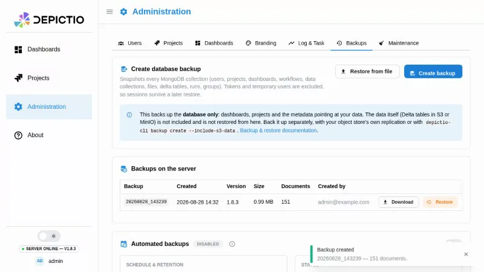
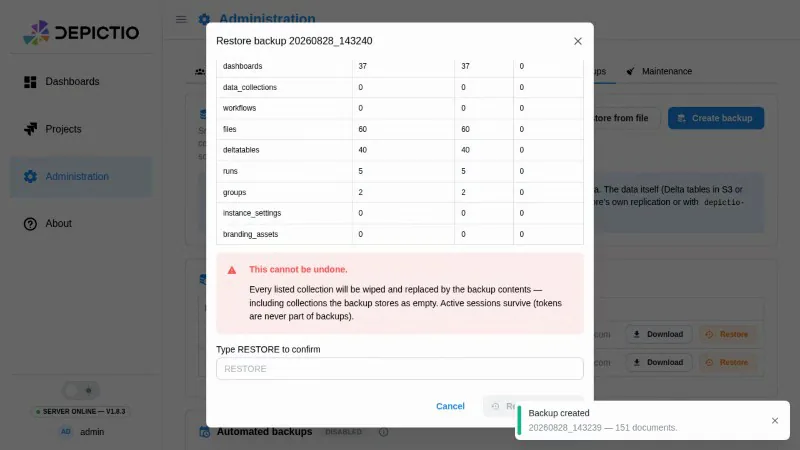
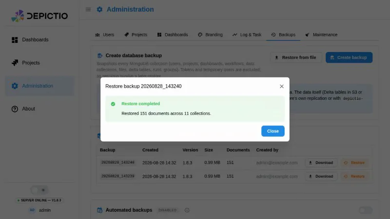

# :material-database-export: Backup & Restore

Depictio stores state in two independent places, and they are backed up by two
independent mechanisms.

<!-- prettier-ignore -->
!!! warning "Backups cover the database, not your data"
    A snapshot covers MongoDB: users, projects, dashboards, data collection
    definitions, file records, the *locations* of your Delta tables, instance
    settings and branding assets. Nothing Depictio writes to object storage is
    included: not the Delta tables, not the files ingested or exported alongside
    them, and none of it is ever restored from the admin panel. Restoring the
    database restores the pointers; whether they resolve depends on the object
    store being in a matching state. See
    [Your data: S3 and Delta Lake](#your-data-s3-and-delta-lake).

Everything on this page requires an administrator account.

---

## From the admin panel <small>(v1.9.0+)</small> { #from-the-admin-panel }

**Administration → Backups** drives the whole loop without a shell.

[](../../images/guides/backup/backups-tab.webp){target=_blank}

| Action | What it does |
|--------|--------------|
| **Create backup** | Snapshots the database server-side and adds it to the list |
| **Download** | Fetches `depictio_backup_<id>.json` for off-site storage |
| **Restore from file** | Uploads a backup taken elsewhere, up to 200 MB |
| **Restore** | Replaces the database contents, behind the gate below |

Each backup is a single JSON document named `depictio_backup_<id>.json`, written
to `DEPICTIO_BACKUP_BACKUP_DIR` (`backups/` by default) with a `.sha256` sidecar
alongside it. The **backup id is the creation timestamp**, which is what ties a
downloaded file back to a row in the list, and what retention reads a backup's
age from, since a file's mtime does not survive a volume restore or an rsync.

---

## Scheduled backups <small>(v1.9.0+)</small> { #scheduled-backups }

The **Automated backups** card holds the schedule and its retention policy.
Scheduling is **off by default**: a snapshot is the size of the whole database,
and a deployment that has not sized its backup volume should not start filling
it on upgrade.

**Anchored or rolling.** With a time of day (`HH:MM`, UTC), slots sit on a fixed
grid from there: six-hourly anchored at 03:00 runs at 03:00, 09:00, 15:00 and
21:00, and a late run never pushes the next one back. Leave it empty and the
schedule is rolling, due whenever an interval has passed.

**No restart needed.** A change saved here reaches every worker within 15
minutes, and exactly one worker takes each backup.

---

## Retention <small>(v1.9.0+)</small> { #retention }

Two modes, both pruned after every backup, scheduled or manual.

| Mode | Policy |
|------|--------|
| **Keep for a fixed time** | Delete anything older than N days. `0` keeps everything forever. |
| **Smart retention** | Grandfather-father-son: every backup for 30 days, then one per ISO week for 4 weeks, then one per calendar month for 12 months. Nothing to configure. |

Smart retention keeps 30 days of full fidelity rather than the textbook 7,
specifically so that it is a strict superset of the default fixed policy, which
is also 30 days. Switching a deployment to smart can only ever keep *more*
history than it had, never less.

<!-- prettier-ignore -->
!!! note "Retention is the only way a backup is removed"
    There is no delete action, and nothing else prunes the backup directory.

---

## Restoring

Restore is destructive: each selected collection is emptied and refilled. Three
things guard it, and only the first two can be waived.

1. **The SHA-256 sidecar is verified.** A missing sidecar (legacy backups) can
   be waived with `allow_unverified`; a *mismatch* is never bypassable.
2. **Every document is validated against the current models** before anything is
   touched, and the restore is refused if any document in a selected collection
   fails, unless `skip_validation` is set. A failed insert rolls that collection
   back to its previous contents.
3. **A typed `RESTORE` unlocks the button.** The modal shows per-collection
   counts and states plainly that this cannot be undone.

[](../../images/guides/backup/restore-gate.webp){target=_blank}

Tokens are never part of a backup, which is why the admin session you are
restoring from survives the operation.

[](../../images/guides/backup/restore-complete.webp){target=_blank}

Afterwards the list marks the snapshot this deployment's data was last restored
from, so it is always possible to tell which backup the live data came from. The
marker is written only when a restore completes without errors, and it lives
outside the collections a restore overwrites.

---

## What is covered

Eleven collections: `users`, `groups`, `projects`, `dashboards`,
`data_collections`, `workflows`, `files`, `deltatables`, `runs`,
`instance_settings` and `branding_assets`.

Deliberately excluded:

| Excluded | Why |
|----------|-----|
| `tokens` | Restoring them would be circular, and leaving them out is why an admin session survives a restore |
| Temporary users and their dashboards | Short-lived by construction |
| `jbrowse`, `multiqc`, `multiqc_prerender` | Derived, regenerated from source data |
| `task_events`, `app_logs`, `telemetry` | Operational, and self-expiring by design |
| `ingestion_runs` | Audit and lineage data with no TTL. A known gap, not a decision that it should never be backed up. |

A coverage test fails CI when a new collection is added without being
classified, so this list cannot silently drift. Backups record the Depictio
version that produced them, so a snapshot describes itself.

---

## Restoring across versions

<!-- prettier-ignore -->
!!! warning "Supported from v1.0.0 onwards"
    Restoring a backup taken by **v1.0.0 or later** into a newer Depictio is
    supported and covered by tests. Backups produced before v1.0.0 are out of
    scope: the data models changed too much for deserialization to be reliable.

Two checks guard this, so a model change cannot silently break older backups:
frozen backup fixtures are validated against the current Pydantic models on every
pull request, and a scheduled job restores a backup produced by the previous
released image using an image built from current code, comparing document counts.

---

## Your data: S3 and Delta Lake { #your-data-s3-and-delta-lake }

None of the above touches your data. There are three ways to cover it, in
descending order of preference.

**1. Your object store's own replication (recommended).** Versioning plus
replication, whatever your store calls it: AWS S3, MinIO, NetApp StorageGRID or
any other S3 implementation. Delta Lake only appends, so object versioning
composes well with it. This is the only option that scales to a real dataset,
and the only one that survives losing the Depictio deployment.

**2. The CLI, with `--include-s3-data`.**

```bash
depictio-cli backup create --include-s3-data --s3-backup-prefix backup
```

Driven by `DEPICTIO_BACKUP_S3_BACKUP_STRATEGY`:

| Strategy | Effect |
|----------|--------|
| `s3_to_s3` (default) | Copy tables into a second bucket |
| `local` | Copy tables to `DEPICTIO_BACKUP_S3_LOCAL_BACKUP_DIR` on the server, optionally gzipped |
| `both` | Both of the above |

See [Backup and Restore Configuration](../../installation/configuration.md#backup-and-restore-configuration)
for the bucket and credential settings. This flag is deliberately **not** in the
admin UI: it needs a second bucket and credentials that are deployment
configuration, and it runs synchronously inside the request.

**3. Snapshot the volume.** For a single-node MinIO deployment, a filesystem or
block-device snapshot of the MinIO data volume, taken alongside a database
backup, is a coherent pair.

### Restoring everything, data included { #restoring-everything }

Depictio restores the database. It has **no S3 restore path**: the strategies
above copy tables out, nothing copies them back. A full recovery is therefore
two operations, and the object store goes first, so that no window exists where
the database points at tables that are not there yet.

**1. Stop the orphan cleanup**, or you can lose live data between the two steps.
See the warning below.

**2. Put the object store back** to the state it had when the database snapshot
was taken. Whichever route you used to copy it out:

```bash
# from a second bucket (s3_to_s3, or your own replication)
aws s3 sync s3://depictio-backup/backup/ s3://depictio-bucket/ --delete
mc mirror --overwrite --remove backup/backup/ depictio/depictio-bucket/

# from a local copy (--include-s3-data with the local strategy)
mc mirror --overwrite --remove /var/backups/depictio/s3/ depictio/depictio-bucket/
```

With bucket versioning, roll the bucket back to the timestamp of the snapshot
instead. With a volume snapshot, restore the volume and restart the object
store.

**3. Restore the database** from **Administration → Backups**, picking the
snapshot that matches the state you just restored the bucket to.

**4. Check, then reopen.** Open a dashboard that reads a Delta table and confirm
it renders, then re-enable the cleanup task and let users back in.

<!-- prettier-ignore -->
!!! danger "A database-only restore can delete live data from S3"
    A periodic task deletes bucket prefixes that no live data collection
    references. After a restore rewinds the database, every Delta table ingested
    *after* that snapshot is an orphan by that definition, and the next cleanup
    pass deletes it permanently. Its safety check only aborts when *all*
    prefixes look orphaned, so a partial rewind passes straight through it.

    Until that interaction is guarded, treat a database restore on a deployment
    with live data as an operation that requires the object store to be rewound
    to match, or the cleanup task to be disabled first.

---

## From the CLI

The same operations, for automation and for the S3 flags the UI does not expose.
Full reference: [Backup Commands](../../depictio-cli/usage.md#backup-commands).

```bash
# Snapshot the database
depictio-cli backup create

# List what the server holds
depictio-cli backup list

# Check a backup deserializes against the current models
depictio-cli backup validate 20260315_143000

# Preview, then restore
depictio-cli backup restore 20260315_143000 --dry-run
depictio-cli backup restore 20260315_143000
```

| Flag | Applies to | Description |
|------|-----------|-------------|
| `--include-s3-data` | `create` | Also copy the Delta tables (see above) |
| `--s3-backup-prefix` | `create` | Prefix for the S3 backup folder, default `backup` |
| `--dry-run` | `create`, `restore` | Validate without writing anything |
| `--collections` | `restore` | Comma-separated list, default all |
| `--force` | `restore` | Skip the confirmation prompt |

<!-- prettier-ignore -->
!!! danger "Restore replaces existing data"
    Run `--dry-run` first on any backup you did not just create yourself.

---

## Configuration

Environment variables supply the **defaults**. Anything saved from the Backups
tab overrides them from then on, so an admin's click is never silently reverted
on the next restart.

| Variable | Default | Meaning |
|----------|---------|---------|
| `DEPICTIO_BACKUP_BACKUP_DIR` | `backups` | Where backup files are written |
| `DEPICTIO_BACKUP_AUTO_BACKUP_ENABLED` | `false` | Run scheduled backups |
| `DEPICTIO_BACKUP_AUTO_BACKUP_INTERVAL_HOURS` | `24` | Hours between scheduled backups |
| `DEPICTIO_BACKUP_AUTO_BACKUP_TIME_OF_DAY` | unset | `HH:MM` UTC anchor for the slot grid; unset means a rolling schedule |
| `DEPICTIO_BACKUP_BACKUP_FILE_RETENTION_DAYS` | `30` | Keep every backup for this long; `0` keeps forever |
| `DEPICTIO_BACKUP_BACKUP_RETENTION_WEEKLY_WEEKS` | `0` | Weekly tier length; `0` disables it |
| `DEPICTIO_BACKUP_BACKUP_RETENTION_MONTHLY_MONTHS` | `0` | Monthly tier length; `0` disables it |

With both tiers at `0`, retention is a plain age cutoff. The full list, including
the S3 strategy settings, is in the
[Environment Reference](../../installation/env-reference.md#backup-restore).

---

## See also

- [Backup Commands](../../depictio-cli/usage.md#backup-commands) for the full CLI reference
- [Backup and Restore Configuration](../../installation/configuration.md#backup-and-restore-configuration) for the S3 backup bucket
- [Project Migration](migrate.md) to move a single project between instances instead
