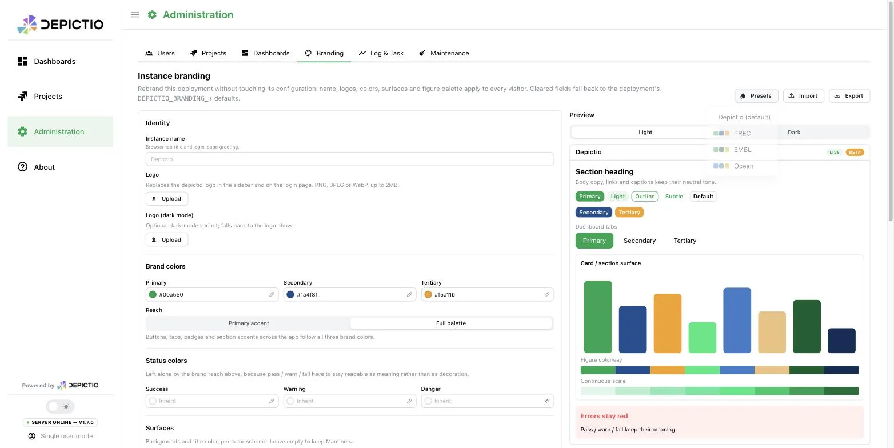
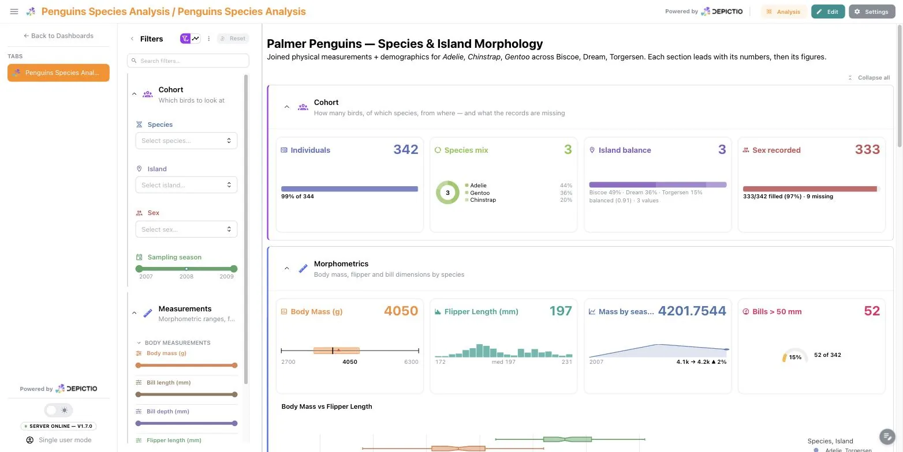

# :material-palette-outline:{ style="color: #9966CC" } Branding <small>(v1.8.0+)</small>

Depictio ships in a neutral Mantine look. A deployment can replace that with its own identity, meaning logo, name, colours, chrome surfaces, typography and figure palette, and a single dashboard can override any of it for itself.

Everything is expressed as one object, the **brand theme**, so the three places you can set it take the same fields.

## Where it can be set

```text
Mantine defaults  <-  DEPICTIO_BRANDING_*  <-  /admin overrides  <-  dashboard
```

Each layer states only what differs; anything it leaves out is inherited from the layer to its left. That is what makes a dashboard's *inherit the instance* setting real rather than a copy: change the instance logo and every dashboard that never uploaded its own follows.

| Layer | Set from | Needs a redeploy |
| --- | --- | --- |
| Deployment defaults | `DEPICTIO_BRANDING_*` environment variables. See [Environment Reference](../../installation/env-reference.md#branding) | Yes |
| Instance overrides | **Administration → Branding** at `/admin`, saved server-side | No |
| Dashboard override | The dashboard's Settings drawer, or `brand_theme:` in its YAML | No |

!!! info "Availability"
    The layered engine landed in **v1.8.0** ([#1003](https://github.com/depictio/depictio/pull/1003)). Dashboards written before it, carrying the older `logo_url` or `plot_theme` fields, fold into `brand_theme` on read and keep working.

**Administration → Branding** puts the whole theme on one page, with a live preview beside it that renders real components under the draft, in either colour scheme:

[](../../images/guides/branding/branding-admin-panel_light.webp){target=_blank}

[](../../images/guides/branding/branding-admin-panel_dark.webp){target=_blank}

The form groups the fields as **Identity**, **Brand colors**, **Status colors**, **Surfaces**, **Typography & shape** and **Figures**, in that order. They are the same fields described below, and the same ones a dashboard override offers.

## The fields

**Identity.** `app_name` (browser tab title and login greeting), `logo_url`, `logo_url_dark`, and `logo_mode`, which is `inherit` (the default), `custom` or `none`. A dashboard set to `none` shows no logo even when the instance has one.

**Brand palette.** `primary`, `secondary`, `tertiary`. Each is a hex colour or a Mantine palette name (`blue`, `teal`, `grape`, and so on).

**Status colours.** `success`, `warning`, `danger`. These sit deliberately outside the brand reach described below, because pass, warn and fail have to keep reading as meaning rather than as decoration. Set them only if your brand has its own.

**Reach** (`tint_mode`). How far the brand hues travel into the app's existing accents:

- `accent` (the default) re-tints the primary accent only. The app keeps its familiar secondary accents.
- `full` additionally gives the secondary and tertiary the app's `teal` and `orange` accent families, so buttons, tabs, badges and section accents follow all three brand colours.

`gray`, `red`, `green` and `yellow` are never remapped in either mode.

**Surfaces** (`surfaces_light`, `surfaces_dark`). Per colour scheme: `app_bg` (page background), `section_bg` (cards, panels, section accordions), `nav_bg` (header and sidebar) and `heading` (title text). Hex only, since these become raw CSS values. Left unset, Mantine's own scheme colours apply.

**Typography and shape.** `font_family`, `headings_font_family` and `default_radius` (a Mantine token, `xs` to `xl`).

!!! warning "Fonts are not fetched for you"
    A named font has to be installed on the viewer's machine or served by the deployment. Nothing is downloaded, and an unavailable font fails silently, so the admin form renders a live sample of what you typed.

**Figures** (`plots`). `template` is the Plotly template for figures whose component picks none; unset means *follow the UI colour scheme*, which is Depictio's own brand-aware `mantine_light` / `mantine_dark`. `colorway` and `sequential` are the categorical and continuous palettes.

## Derived values

`colorway`, `sequential` and the Mantine shade tuples are **derived from the brand palette** whenever you do not state them, so figures follow the brand without a second list to keep in step.

The derivation runs server-side, once, and the resolved theme is what `/utils/public-config` serves. The browser never re-derives anything, so the figures a dashboard renders and the buttons around them cannot drift apart.

Two details worth knowing:

- A hex brand colour is expanded into a full 10-shade Mantine tuple with **your colour on shade 6**, which is the shade a filled control actually paints in light mode (shade 8 in dark). Generic palette generators place the input by its lightness instead, which for a dark brand leaves every button a washed-out cousin of it.
- The categorical colorway walks the brand hues first and only then rotates hue, so the first few series in a figure are recognisably the brand.

State `colorway` or `sequential` yourself and the derivation steps aside for that field alone.

!!! note "`palettes` is output, not input"
    The resolved theme carries a `palettes` object holding the derived Mantine tuples, keyed by role. It is filled in by the server and authors never set it, in the environment, in the admin panel or in YAML.

## Presets, import and export

**Administration → Branding** ships a few starting points, namely the stock Depictio look, TREC, EMBL and Ocean, reachable from the **Presets** menu and settable at deploy time with `DEPICTIO_BRANDING_PRESET`. A preset is only a form seed: everything it fills in stays editable, and the flat environment variables override it field by field.

**Export** writes the current theme as JSON and **Import** reads one back, so a brand can be reviewed, version-controlled and moved between deployments.

[](../../images/guides/branding/branding-presets.webp){target=_blank}

## A dashboard override

From a dashboard in edit mode: **Settings → Appearance → Branding → Customise**. The same fields appear, with the instance's values shown as placeholders, and a live preview beside them renders real components under the draft. See [Using the dashboard](../guides/dashboard_usage.md#appearance) for the rest of the Appearance section.

The override applies to that dashboard's page only. The dashboard list, the admin pages and every other dashboard stay on the instance theme.

[](../../images/guides/branding/dashboard-brand-override.webp){target=_blank}

In YAML it is a `brand_theme:` block at the top level. The bundled penguins demo dashboard carries one as a worked example:

```yaml
brand_theme:
  primary: "#159090"    # Gentoo
  secondary: "#a034f0"  # Chinstrap
  tertiary: "#ff8c00"   # Adelie
  tint_mode: "full"
```

!!! warning "Uploaded logos do not travel"
    Logos uploaded through the UI are stripped on export, since the file lives on the instance that received it and would resolve to nothing elsewhere. Use `logo_url` with an absolute address for a logo that should survive a move.

## See Also

- [Environment Reference](../../installation/env-reference.md#branding) for every `DEPICTIO_BRANDING_*` variable
- [Using the dashboard](../guides/dashboard_usage.md#appearance) for the per-dashboard Appearance controls
- [Components](../../features/components.md#figure-components) for the per-figure theme and font scale
