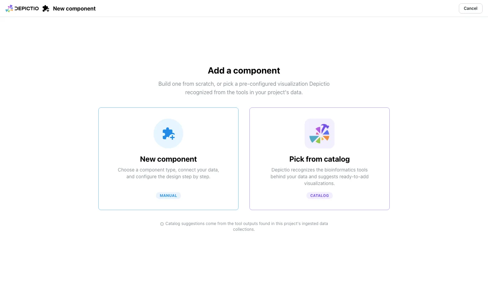
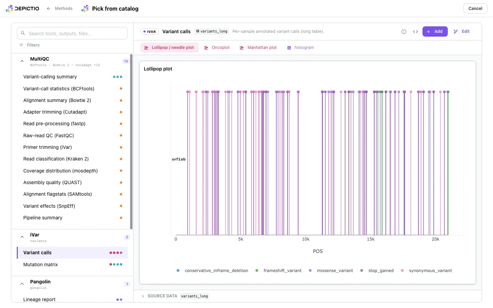
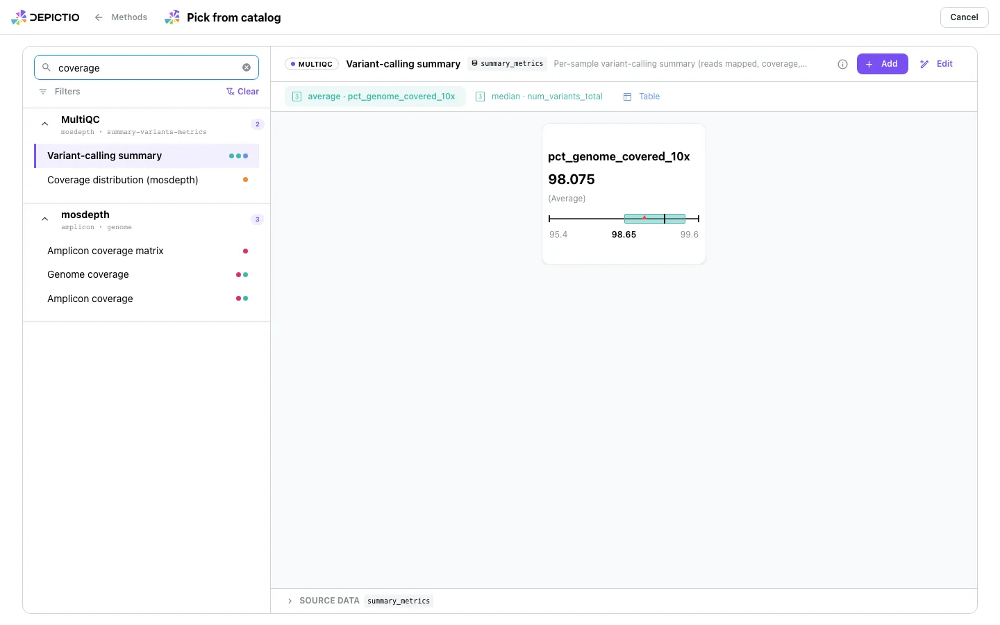
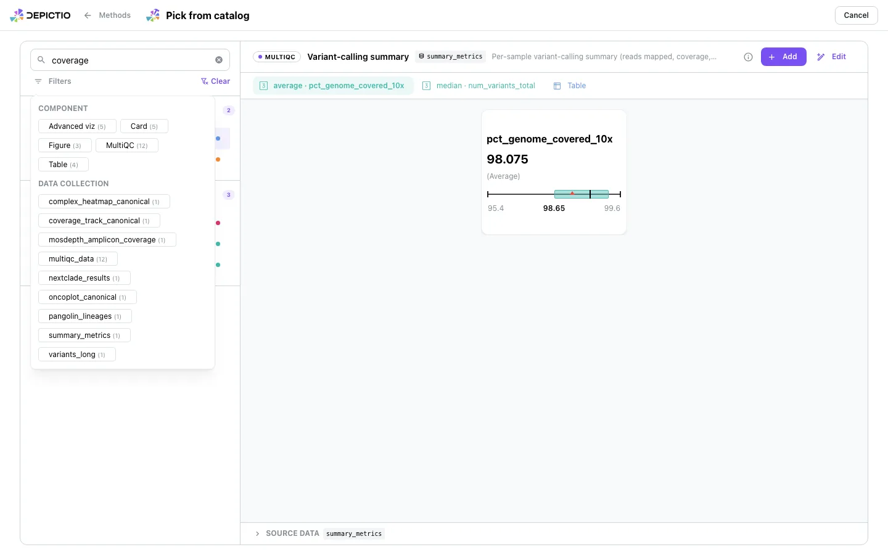
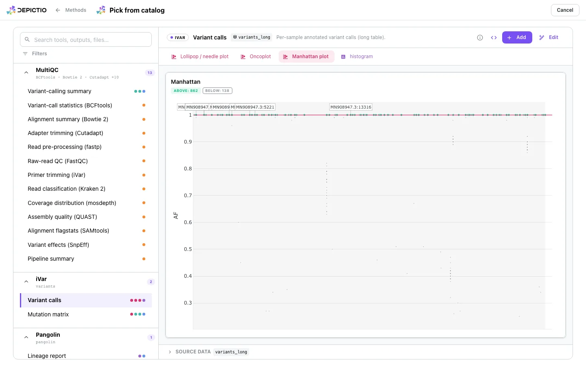

# :material-hammer-wrench: Picking a component from the catalog <small>(v1.9.0+)</small>

**Add component** opens a chooser with two routes:

- **New component** is the manual stepper: pick a type, connect it to data,
  configure it yourself. See [Dashboard Creation](dashboard_creation.md).
- **Pick from catalog** skips all of it and offers visualizations already built
  for the tool outputs Depictio found in this project.

<figure markdown="span">
  {target=_blank}
  <figcaption>The chooser, with a note that catalog suggestions come from the project's ingested data collections.</figcaption>
</figure>

---

## Where the offers come from { #matching }

Nothing is inferred from the data itself. Every entry in the
[Tools Catalog](../../catalog/index.md) declares **how to recognise the file**
and **which columns it must carry**, and Depictio compares your ingested data
collections against those declarations. A project whose outputs match no entry
simply has nothing to offer.

:material-file-search:{ .lg } **Filename**

The collection's file matches the name the entry expects, such as `*.variants.tsv`.

:material-folder-search-outline:{ .lg } **Path glob**

The collection's path matches the entry's glob, such as `**/ivar/*.tsv`. This is how a real pipeline run is recognised.

:material-cog-transfer:{ .lg } **Recipe**

The collection came from a [recipe](../projects/recipes.md) the entry declares. Derived collections carry no raw pipeline path, so neither of the other two can fire.

Any one of the three is enough to surface the tool. The entry's column schema
then decides which of its renders are offered, so a render binding a column your
file does not carry is never proposed.

<!-- prettier-ignore -->
!!! info "MultiQC is a special case"
    Every `multiqc/*` output keys the same `multiqc.parquet`, so offers are
    narrowed to the sections the ingested report actually holds, and the
    originating tool is named on each one.

---

## The browser

Offers are grouped by tool on the left, one row per recognised output, with a
coloured dot for each component type it can become. Selecting a row previews it
on the right.

The preview is the real component, rendered in an iframe at the exact grid box
it will occupy, so what you see is what lands on the dashboard.

<figure markdown="span">
  {target=_blank}
  <figcaption>iVar's variant calls, previewing as a lollipop plot.</figcaption>
</figure>

**Add** saves it straight away. **Edit** drops it into the Design step first.
Browser Back and Forward walk the picker's surfaces rather than leaving the flow.

---

## Narrowing the list

Search matches tool, output, description, file and collection at once, so
`coverage` finds mosdepth's own outputs and the MultiQC coverage section
together.

<figure markdown="span">
  {target=_blank}
  <figcaption>One search box across every field an offer carries.</figcaption>
</figure>

**Filters** adds two facets with counts, **Component** and **Data collection**,
computed against the current search rather than the whole catalog. A violet badge
on the button says how many are active.

<figure markdown="span">
  {target=_blank}
  <figcaption>Two facets, each counted against what the search already narrowed.</figcaption>
</figure>

---

## One output, several renders

Most recognised outputs support more than one visualization: iVar's variant
calls can be drawn as a lollipop plot, an oncoplot, a Manhattan plot or a
histogram. The tab strip switches between them, each render carrying its own
configuration and its own grid box.

<figure markdown="span">
  {target=_blank}
  <figcaption>The same iVar output, switched to its Manhattan render.</figcaption>
</figure>

Settings tuned inside the preview travel with the offer, on both the Add and the
Edit path.

---

## Provenance { #provenance }

A component added from the catalog says so:

- a copyable `use: <tool>/<render-id>` snippet, the same identifier you would
  write in a project YAML;
- a `catalog_source` stamp carried through later edits and YAML import;
- a violet catalog action on the tile, opening a metadata inspector with
  identity, resolved configuration, data source, catalog origin and raw JSON.

---

## See also

- [Tools Catalog](../../catalog/index.md) to browse every tool and render outside a project
- [Dashboard Creation](dashboard_creation.md) for the manual stepper
- [Contributing a Tool](../../developer/contributing-a-tool.md) to add a tool to the catalog
