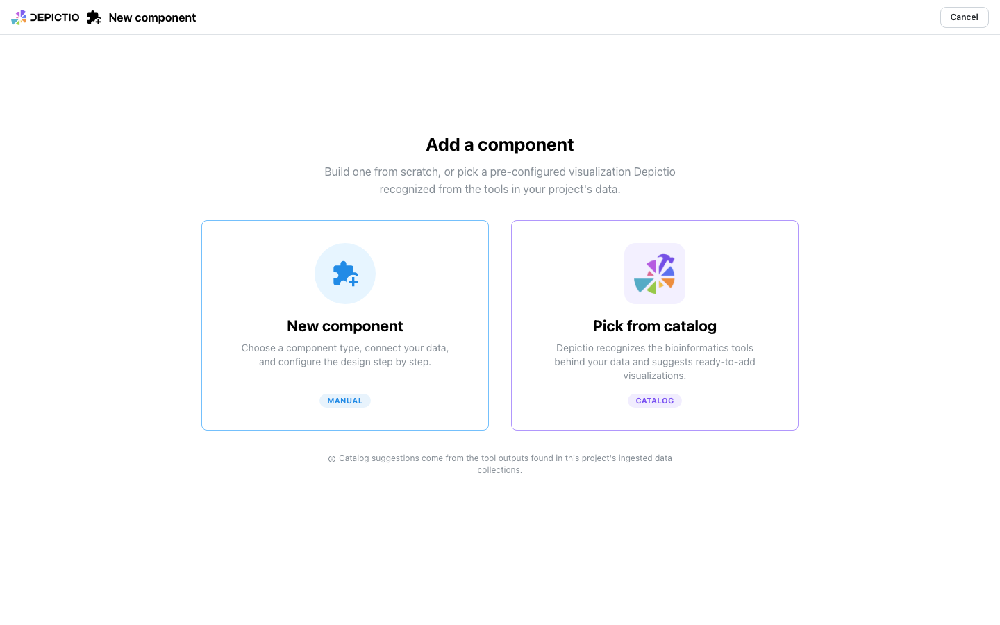
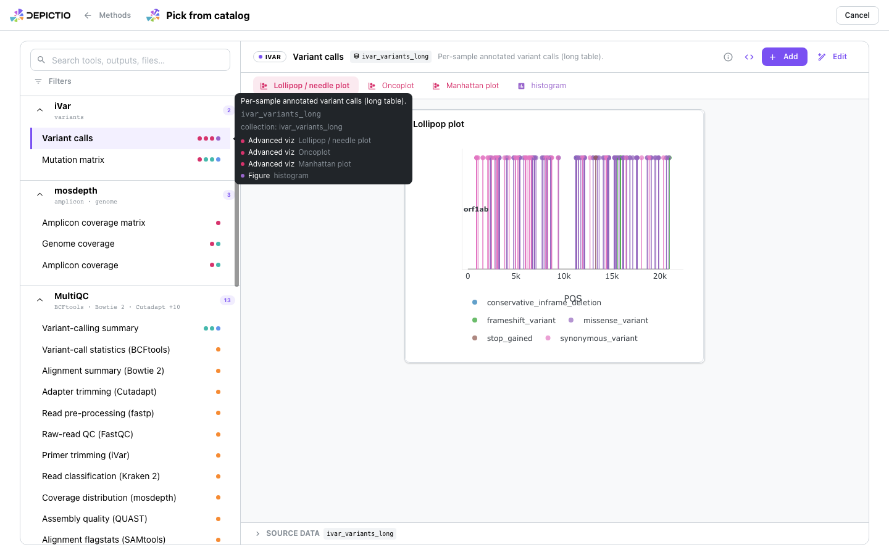
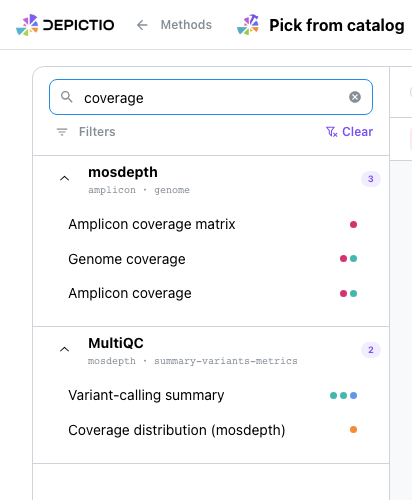
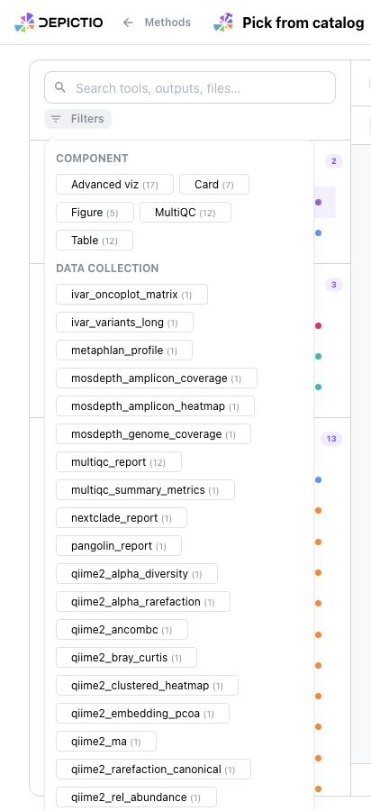
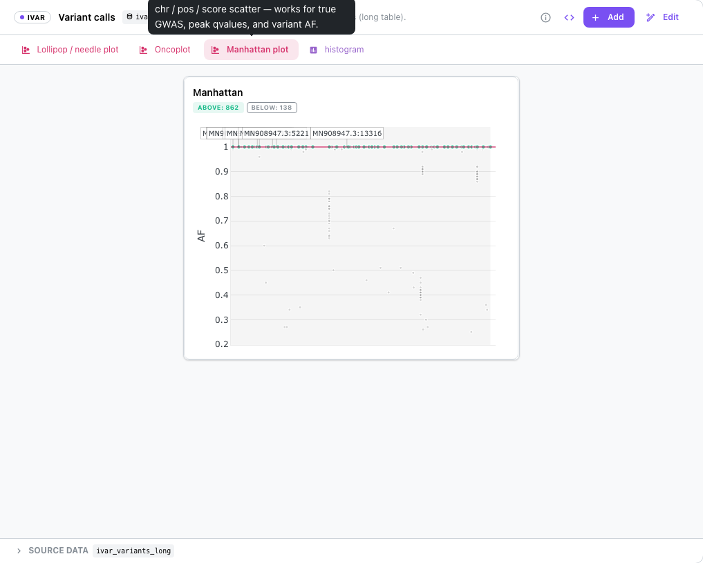

# :material-hammer-wrench: Picking a component from the catalog <small>(v1.9.0+)</small>

Adding a component starts with a choice. **New component** opens the manual
stepper, where you pick a type, connect it to data and configure it yourself.
**Pick from catalog** skips all of that: Depictio has already recognised the
bioinformatics tools behind the project's ingested data, and offers the
visualizations those tools are known to support.

Nothing is guessed. The suggestions come from the tool outputs found in the
project's data collections, so a project with no recognised output simply has
nothing to offer.

<figure markdown="span">
  
  <figcaption>The chooser, with a note that catalog suggestions come from the project's ingested data collections.</figcaption>
</figure>

---

## The browser

The browser fills the page. On the left, offers are grouped by tool: each header
names the tool, the sub-functions it covers and how many offers it has. Each row
is one recognised output, with a coloured dot per component type it can become.

On the right, the selected offer previews itself. The preview is the real
component, not a mockup: it renders in an iframe framed at the exact grid box
the component will occupy once added, so what you see is what lands on the
dashboard.

<figure markdown="span">
  
  <figcaption>iVar's variant calls, previewing as a lollipop plot. Hovering a row lists the renders it can become.</figcaption>
</figure>

**Add** saves the component straight away. **Edit** drops it into the Design step
first, so you can adjust it before it lands. Browser Back and Forward walk the
picker's surfaces rather than leaving the flow.

---

## Narrowing the list

Search matches tool, output, description, file and collection at once, so
`coverage` finds mosdepth's own outputs and the MultiQC coverage section
together.

<figure markdown="span">
  
  <figcaption>One search box across every field an offer carries.</figcaption>
</figure>

**Filters** adds two facets, each with counts: **Component**, to keep only the
offers that become a given component type, and **Data collection**, to keep only
those reading a given collection. A violet badge on the Filters button says how
many facets are active, so a hidden filter is never a mystery.

<figure markdown="span">
  
  <figcaption>Facet counts are computed against the current search, not the whole catalog.</figcaption>
</figure>

---

## One output, several renders

A recognised output usually supports more than one visualization. iVar's variant
calls, for instance, can be drawn as a lollipop plot, an oncoplot, a Manhattan
plot or a plain histogram. The tab strip switches between them and reframes the
preview at each target's own size.

<figure markdown="span">
  
  <figcaption>Each render declares its own grid box, so the preview reframes when you switch.</figcaption>
</figure>

Settings tuned inside the preview travel with the offer, on both the Add and the
Edit path.

---

## What the catalog can recognise { #matching }

An offer appears when a data collection matches a catalog entry on any of three
independent signals:

| Signal | When it applies |
|--------|-----------------|
| Filename | The collection's file matches the entry's expected name |
| Path glob | The collection's path matches the entry's glob |
| Recipe | The collection was produced by a recipe the entry declares |

The third exists because a collection produced by a
[recipe](../projects/recipes.md) carries no raw pipeline path, so neither of the
first two can fire.

MultiQC is a special case: every `multiqc/*` output keys the same
`multiqc.parquet`, so offers are narrowed to the sections the ingested report
actually holds, and the originating tool is named on each one.

---

## Provenance { #provenance }

A component added from the catalog says so.

- A copyable `use: <tool>/<render-id>` snippet, which is the same identifier you
  would write in a project YAML.
- A `catalog_source` stamp carried through later edits and through YAML import,
  so the origin survives a round trip.
- A violet catalog action on the tile, and a metadata inspector covering
  identity, resolved configuration, data source, catalog origin and the raw JSON.

---

## See also

- [Tools Catalog](../../catalog/index.md) to browse every tool and render outside a project
- [Dashboard Creation](dashboard_creation.md) for the manual stepper
- [Contributing a Tool](../../developer/contributing-a-tool.md) to add a tool to the catalog
