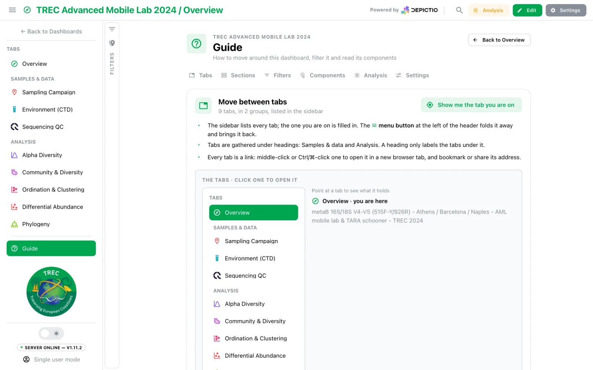

# :material-help-circle-outline: The dashboard Guide <small>(v1.14.0+)</small>

Every dashboard has a **Guide**: a short page on how to move around it, filter it and
read its components. It is opened from the **Guide** entry at the bottom of the sidebar's
tab list. It is not a walkthrough to click through once, but a page to come back to, and
it is built from the dashboard it sits on: its tabs, its sections, its filters, its
components.

[](../../images/guides/dashboard-guide/guide-tabs.webp){target=_blank}

---

## What it covers

Each part is a card with a short text, a live demo and a **Show me** button that rings
the thing it is about inside the demo.

| Part | What it shows |
|------|---------------|
| **Tabs** | The sidebar's own tab list, with its groups and the tab you are on. Pointing at a tab shows what it holds; clicking opens it |
| **Sections** | The tab's real sections, drawn by the dashboard itself: headers, folding, the numbers a folded section of cards still shows, **Collapse all** |
| **Filters** | A real card and filter from the dashboard. Picking a value changes the number without touching the dashboard's own filters |
| **Components** | For each component type the dashboard uses, one of its own components with its full action row, so every icon can be tried. *In the editor* adds the grip and ⋮ menu, whose items only describe what they would do |
| **Analysis** | Select, save as a group and compare, on the dashboard's own figure, table and card. Shown only where the header offers [Analysis](../../features/interactive-selection-filtering.md#analysis-panel) |
| **Settings** | *Your view*: the reader's own width, text size and light or dark. **Show me what they do** plays them on the demo, then puts them back |

Everything the demos do stays in the Guide: no filter, group or setting of the dashboard
changes.

---

## The address

The Guide opens as `?guide=1` on the tab it was opened from, so it can be bookmarked or
shared. The tab stays loaded underneath: **Back to …** at the top right, the browser's
Back, or a canvas **Show me** returns to it at once.

---

## For authors

The Guide is on by default for every dashboard. Two settings change it, set on the main
tab for the whole dashboard, from **Settings → Guide** in the editor or in YAML:

| Key | Default | Effect |
|-----|---------|--------|
| `show_guide` | `true` | `false` removes the Guide entry from the sidebar |
| `guide_intro` | `""` | A markdown note shown at the top of the Guide, such as where to start reading |

```yaml
title: TREC Advanced Mobile Lab 2024
guide_intro: Start with **Key figures** on the Overview, then follow the tabs in order.
```

See also [Landing tabs](../../features/dashboards.md#landing-tabs) for the authoring side of
a dashboard's first page, and [Spotlight search](spotlight-search.md) for finding one
component.
