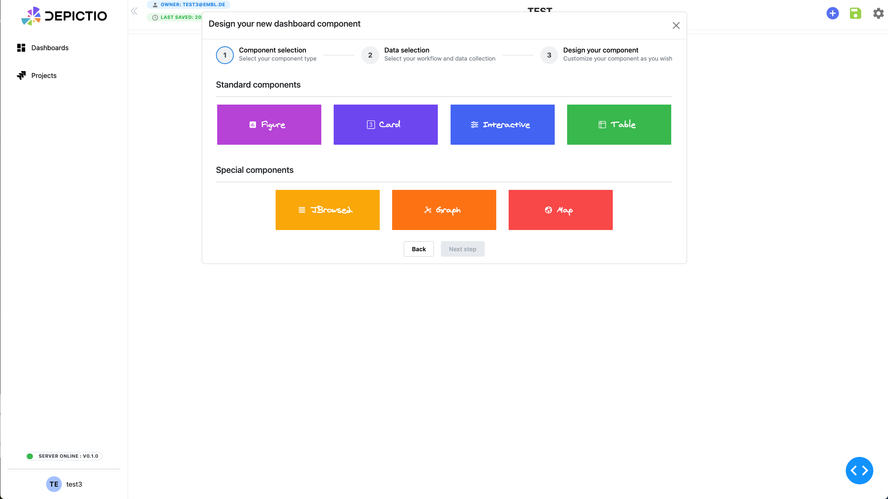
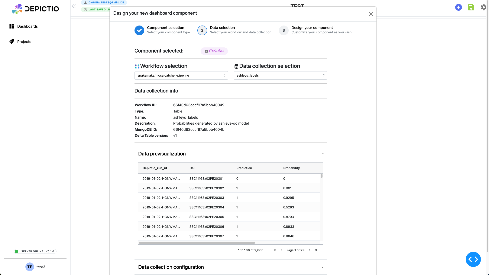

# Dashboard Creation

## Add a component to the dashboard

### Step 1: Component Selection

    

1. Begin by clicking on the **"+ New Dashboard"** button to create a new dashboard.
2. In the **"Design your new dashboard component"** modal:
   - Choose from the available components (e.g., **Figure**, **Card**, **Interactive**, **Table**, **Text**).
3. Once you’ve chosen the component, click **Next Step**.

### Step 2: Data Selection

    

1. For each selected component, choose the corresponding **workflow** and **data collection** from the dropdowns.
2. Verify the **Data Collection Info**, such as **Workflow ID**, **Table type**, **MongoDB ID**, and **Data preview**.
3. Click **Next Step** to proceed.

### Step 3: Customize Your Component

    

1. **Customise your component**:

    - For **Figure** components, you can select the type of figure (e.g., scatter plot, histogram) and customize its appearance.
    - For **Interactive** components, you can set up interactive elements like sliders or dropdowns to allow users to filter or manipulate the data dynamically.
    - For **Card** components, you can display key metrics of your data.

  All options are dependent on the type of column in your data collection. For example, if you select a `numeric` column, you can choose to between a **Slider** or a **RangeSlider** for interactive components, and metrics like **Mean**, **Median**, or **Standard Deviation** for card components. If you select a `string` column, you can choose to display the **Select/Multiselect** or a **SegmentedControl** for interactive components, and metrics like **Count** or **Unique Count** for card components.

| Data Type | Interactive Options | Card Metrics |
|-----------|---------------------|--------------|
| Numeric   | Slider, RangeSlider | Mean, Median, Standard Deviation, Variance, ...|
| String    | Select, Multiselect, SegmentedControl | Count, Unique Count, Most Frequent (mode) |

2. **Set additional parameters**:

   - For **Figure** components, you can tweak visualization settings such as colors, axis labels, and bin sizes. Settings are categorised in the following way:
     - **Core parameters**: Define key parameters such as **X-axis** and **Y-axis** and **Color**, and assign the relevant data columns from your dataset.
     - **Styling & Layout**: Adjust the layout of the figure, including titles and axis labels, colors, hover data, and more.
     - **Figure type specific options**: Access additional options specific to the figure type, such as **scatter plot** or **histogram** settings.
     - **Advanced**: For advanced users, additional settings can be configured here like facetting, animation and more.

   - For **Interactive** components, you can set adjust sliders to have a given number of marks, use a linear or logarithmic scale.

3. **Finalize Customization**:
   - Review the component preview and ensure all settings are accurate.
   - Once complete, click **Next Step** to proceed to the final stage.

<!-- prettier-ignore -->
<!-- markdownlint-disable MD046 -->
!!! note
    **Figure component** as now a mode to create figure through code as well. This allows you to write custom code or port existing one to generate the figure, providing flexibility for advanced users. You can access this mode by clicking on the **"Code"** tab in the figure design interface. Switching from UI to code mode using existing UI settings will automatically generate the code for you, which you can then modify as needed.
<!-- markdownlint-enable MD046 -->

#### Component design Examples:

##### Figure design - visualization selection

    

##### Figure design - scatter plot - UI mode

    

##### Figure design - scatter plot - code mode

    

##### Interactive design - RangeSlider example

    

##### Card design - metrics selection

    

