# <span style="color: #F68B33;">:material-view-dashboard:</span> Dashboard Creation

## <span style="color: #E53935;">:material-video:</span> Video example

<div style="max-width: 1200px; margin: 1rem auto 2rem auto;">
<div style="padding: 64.29% 0 0 0; position: relative">
  <iframe
    src="https://player.vimeo.com/video/1108747263?badge=0&amp;autopause=0&amp;player_id=0&amp;app_id=58479"
    frameborder="0"
    allow="autoplay; fullscreen; picture-in-picture; clipboard-write; encrypted-media; web-share"
    referrerpolicy="strict-origin-when-cross-origin"
    style="position: absolute; top: 0; left: 0; width: 100%; height: 100%"
    title="depictio-long-demo-1754777542047"
  ></iframe>
  </div>
  <p style="text-align: center; margin-top: 0.5rem; font-style: italic; color: #666;">🎬 <strong>Depictio UI overview:</strong> Discover how to build a dashboard with Depictio</p>
</div>
<script src="https://player.vimeo.com/api/player.js"></script>

## <span style="color: #9966CC;">:material-plus-box:</span> Add a component to the dashboard

### <span style="color: #45B8AC;">:material-numeric-1-circle:</span> Step 1: Component Selection

<div style="border: 1px solid grey; width: 602px; padding: 1px;">
    <a href="../../../images/guides/dashboard_creation/step_one.png" target="_blank">
        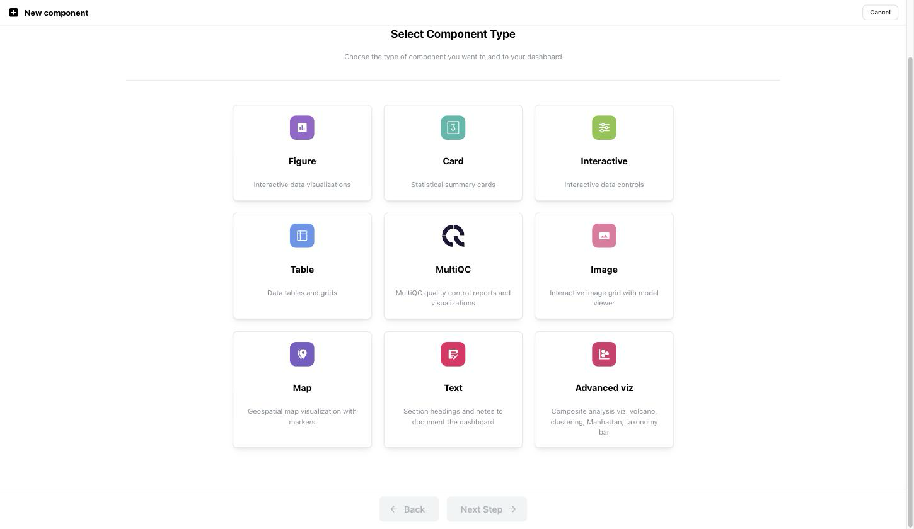
    </a>
</div>

1. Open a dashboard, click **Edit**, then **Add component**.
2. Pick a component type: **Figure**, **Card**, **Interactive**, **Table**, **MultiQC**, **Image**, **Map**, **Text** or **Advanced viz**. Clicking a card takes you straight to the next step.

### <span style="color: #6495ED;">:material-numeric-2-circle:</span> Step 2: Data Selection

<div style="border: 1px solid grey; width: 602px; padding: 1px;">
    <a href="../../../images/guides/dashboard_creation/step_two.png" target="_blank">
        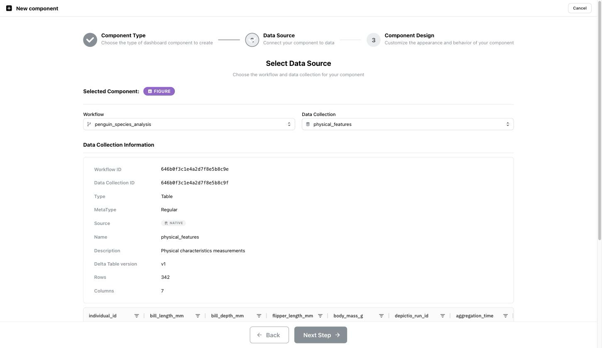
    </a>
</div>

1. Choose the **workflow** and **data collection** from the dropdowns.
2. Check **Data Collection Information** — type, row and column counts, Delta table version — and the column preview underneath.
3. Click **Next Step**.

    The first compatible data collection is pre-selected, so you only touch the dropdowns when you need another one — here `joined_penguins_complete`, the join of `physical_features` and `demographic_data`. **Text** components skip this step entirely, since they read no data collection.

### <span style="color: #F68B33;">:material-numeric-3-circle:</span> Step 3: Customize Your Component

<div style="border: 1px solid grey; width: 602px; padding: 1px;">
    <a href="../../../images/guides/dashboard_creation/design/figure_design_scatter.png" target="_blank">
        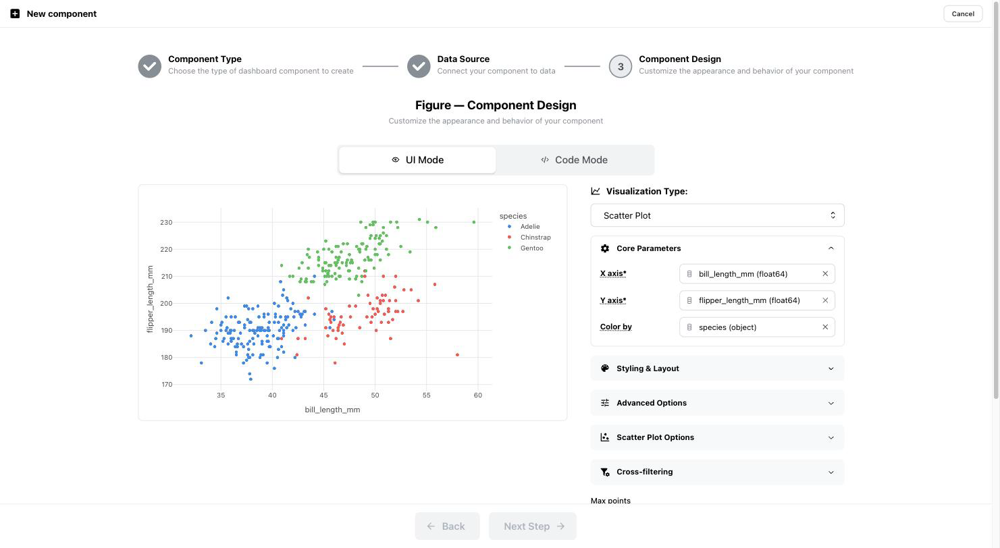
    </a>
</div>

1. **Customise your component**:

    - For **Figure** components, you can select the type of figure (e.g., scatter plot, histogram) and customize its appearance.
    - For **Interactive** components, you can set up interactive elements like sliders or dropdowns to allow users to filter or manipulate the data dynamically.
    - For **Card** components, you can display key metrics of your data.

  All options are dependent on the type of column in your data collection. For example, if you select a `numeric` column, you can choose to between a **Slider** or a **RangeSlider** for interactive components, and metrics like **Mean**, **Median**, or **Standard Deviation** for card components. If you select a `string` column, you can choose to display the **Select/Multiselect** or a **SegmentedControl** for interactive components, and metrics like **Count** or **Unique Count** for card components.

| Data Type | Interactive Options | Card Metrics |
|-----------|---------------------|--------------|
| Numeric   | Slider, RangeSlider | Mean, Median, Standard Deviation, Variance, ...|
| String    | Select, Multiselect, SegmentedControl | Count, Unique Count, Most Frequent (mode) |

2. **Set additional parameters**:

   - For **Figure** components, you can tweak visualization settings such as colors, axis labels, and bin sizes. Settings are categorised in the following way:
     - **Core parameters**: Define key parameters such as **X-axis** and **Y-axis** and **Color**, and assign the relevant data columns from your dataset.
     - **Styling & Layout**: Adjust the layout of the figure, including titles and axis labels, colors, hover data, and more.
     - **Figure type specific options**: Access additional options specific to the figure type, such as **scatter plot** or **histogram** settings.
     - **Advanced**: For advanced users, additional settings can be configured here like facetting, animation and more.

   - For **Interactive** components, you can set adjust sliders to have a given number of marks, use a linear or logarithmic scale.

3. **Finalize Customization**:
   - Review the component preview and ensure all settings are accurate.
   - Once complete, click **Next Step** to proceed to the final stage.

### <span style="color: #45B8AC;">:material-filter-check:</span> Previewing with active filters (v1.5.2+)

When the dashboard already has filters applied, the component builder previews
the **filtered** data rather than the whole data collection. Before v1.5.2 the
builder always showed the unfiltered dataset, and returning to the dashboard
reset the grid.

Take a dashboard filtered on `variety = Virginica`. The card averages only the
50 matching rows, not all 150:

<div style="border: 1px solid grey; width: 602px; padding: 1px;">
    <a href="../../../images/react/builder_filter_baseline.png" target="_blank">
        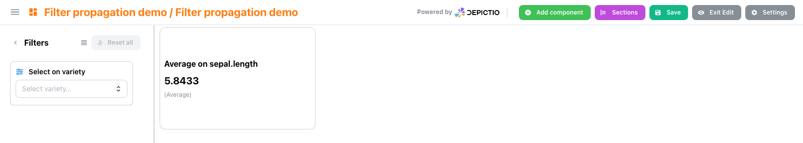
    </a>
</div>

<div style="border: 1px solid grey; width: 602px; padding: 1px;">
    <a href="../../../images/react/builder_filter_active.png" target="_blank">
        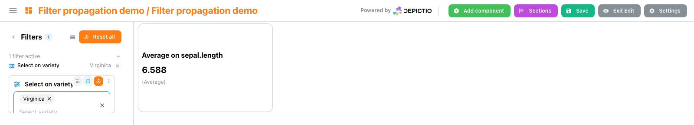
    </a>
</div>

*No filter: 5.8433 across 150 rows. Filtered on Virginica: 6.588 across 50.*

Open the builder from there and the design step carries that filter, with a
banner naming how many filters are active:

<div style="border: 1px solid grey; width: 602px; padding: 1px;">
    <a href="../../../images/react/builder_filter_preview_on.png" target="_blank">
        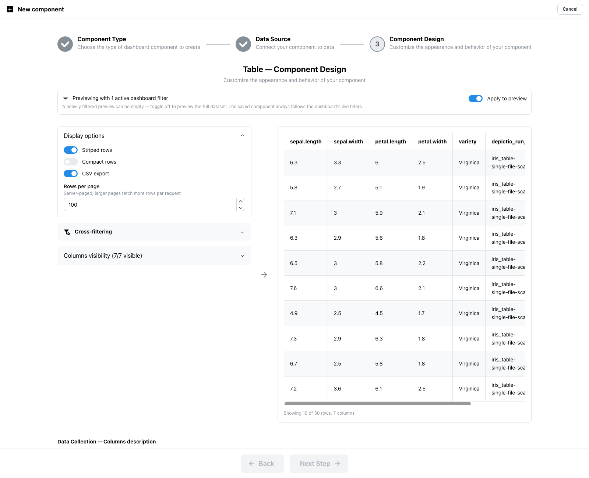
    </a>
</div>

The table reports **10 of 50 rows** — the filtered total, not the collection's
150.

**Apply to preview** is on by default. Switch it off to preview the full
dataset, which matters when a narrow filter would otherwise leave you designing
against an empty table:

<div style="border: 1px solid grey; width: 602px; padding: 1px;">
    <a href="../../../images/react/builder_filter_preview_off.png" target="_blank">
        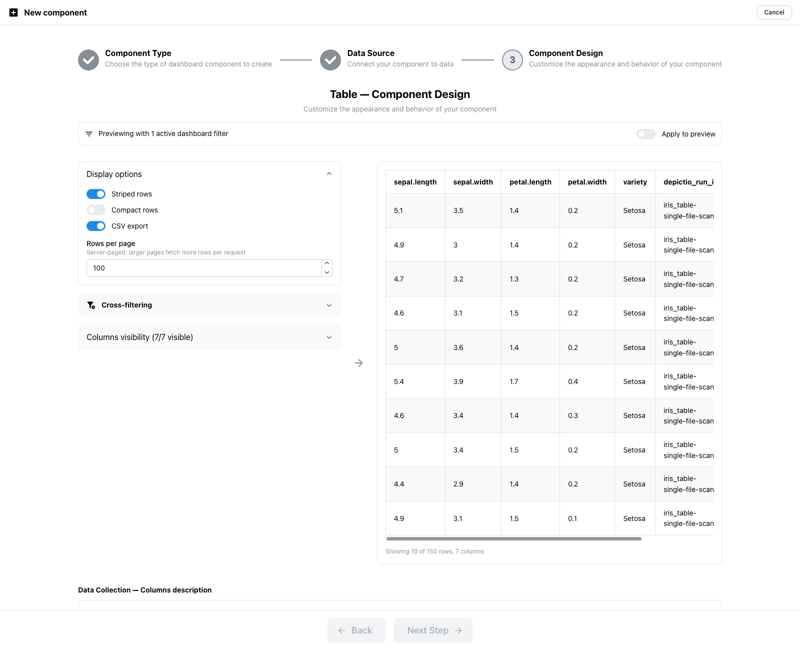
    </a>
</div>

!!! info "The toggle only affects the preview"
    Whichever way you leave it, the saved component always follows the
    dashboard's live filters. The toggle is a design-time convenience, not a
    property of the component.

Save, and the new component arrives already filtered — no flash of unfiltered
data on the way, and the filters you had set are still applied:

<div style="border: 1px solid grey; width: 602px; padding: 1px;">
    <a href="../../../images/react/builder_filter_after_save.png" target="_blank">
        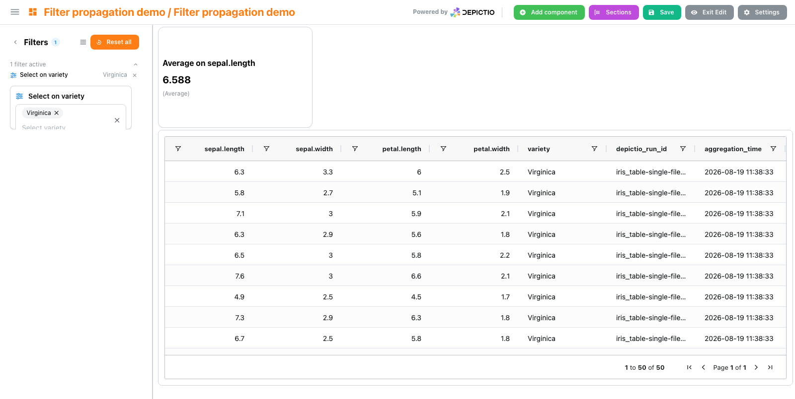
    </a>
</div>

The banner appears only when at least one filter is active, and is suppressed
for **Text** and **MultiQC** components, which have no notion of row filtering.

### <span style="color: #7A5DC7;">:material-code-braces:</span> Figure Code Mode (v0.6.0+)

The **Figure** component includes a **Code Mode** for advanced users who want to write custom Python/Plotly code to generate visualizations. This provides maximum flexibility for complex or custom figures.

#### Accessing Code Mode

1. In the Figure design interface, click the **"Code"** tab
2. Switch from **UI Mode** to **Code Mode** at any time
3. Switching from UI to Code Mode automatically generates code from your current UI settings

#### Available Variables

In Code Mode, the following variables are pre-loaded:

| Variable | Description |
|----------|-------------|
| `df` | Your data as a Polars DataFrame |
| `px` | Plotly Express for quick visualizations |
| `pd` | Pandas for data manipulation |
| `pl` | Polars for high-performance data operations |
| `go` | Plotly Graph Objects for detailed customization |

#### Code Structure

Your code must follow this structure:

```python
# Optional: Data preprocessing (single assignment)
df_modified = df.filter(pl.col("value") > 0)

# Required: Create figure using px or go
fig = px.scatter(df_modified, x="col_x", y="col_y", color="category")
```

!!! warning "Code Constraints"
    - Use `df_modified` for any data preprocessing (single line)
    - The final `fig` variable must be a Plotly Figure object
    - Only the pre-loaded libraries are available for security

#### Code Mode Features

- **Live Preview**: Click "Execute Code" to preview your figure instantly
- **Syntax Highlighting**: Python syntax highlighting with the Ace editor
- **Theme Support**: Editor theme follows the dashboard light/dark mode
- **Resizable Editor**: Drag the editor border to adjust panel size
- **Error Messages**: Clear error feedback for syntax and execution issues

#### <span style="color: #8BC34A;">:material-palette:</span> Component design Examples:

##### <span style="color: #6495ED;">:material-scatter-plot:</span> Figure design - scatter plot - UI mode

`bill_length_mm` against `flipper_length_mm`, coloured by `species`. The preview redraws on every change.

<div style="border: 1px solid grey; width: 602px; padding: 1px;">
    <a href="../../../images/guides/dashboard_creation/design/figure_design_scatter.png" target="_blank">
        
    </a>
</div>

##### <span style="color: #7A5DC7;">:material-code-braces:</span> Figure design - scatter plot - code mode

Switching to Code Mode carries the UI settings over as a `px.scatter` call, which you can then take past what the form exposes — here marginal violins and a `fig.update_layout()` override.

<div style="border: 1px solid grey; width: 602px; padding: 1px;">
    <a href="../../../images/guides/dashboard_creation/design/figure_design_code.png" target="_blank">
        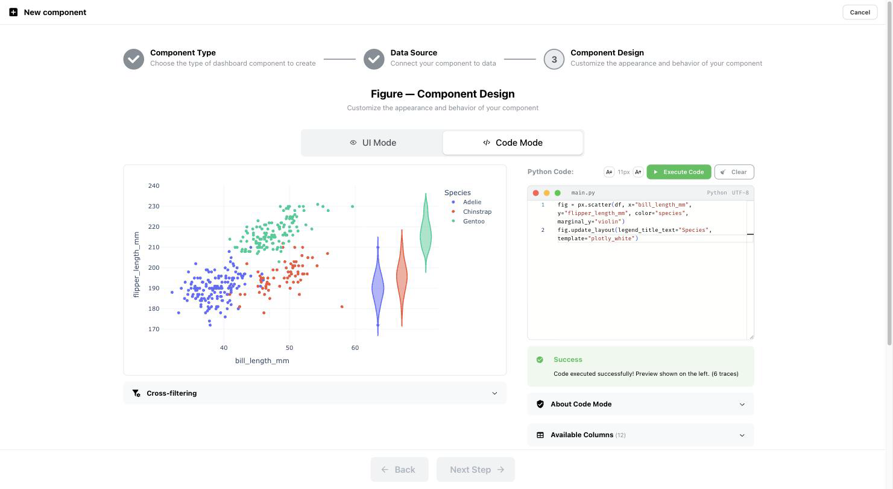
    </a>
</div>

##### <span style="color: #9966CC;">:material-tune-vertical:</span> Interactive design - RangeSlider example

<div style="border: 1px solid grey; width: 602px; padding: 1px;">
    <a href="../../../images/guides/dashboard_creation/design/interactive_design.png" target="_blank">
        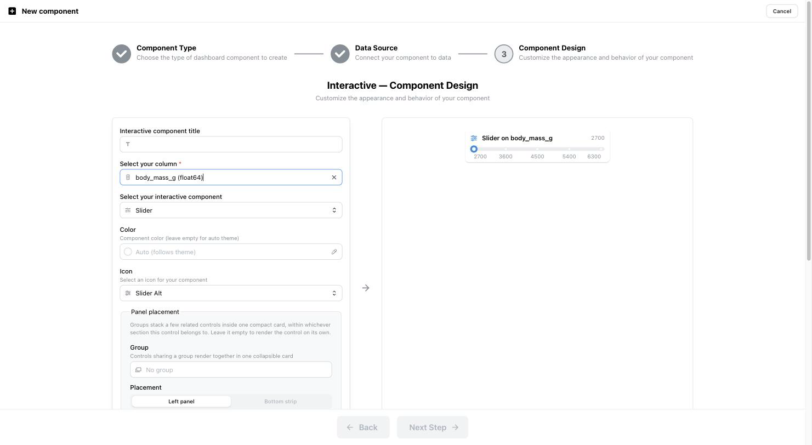
    </a>
</div>

##### <span style="color: #E6779F;">:material-card:</span> Card design - metrics selection

<div style="border: 1px solid grey; width: 602px; padding: 1px;">
    <a href="../../../images/guides/dashboard_creation/design/card_design.png" target="_blank">
        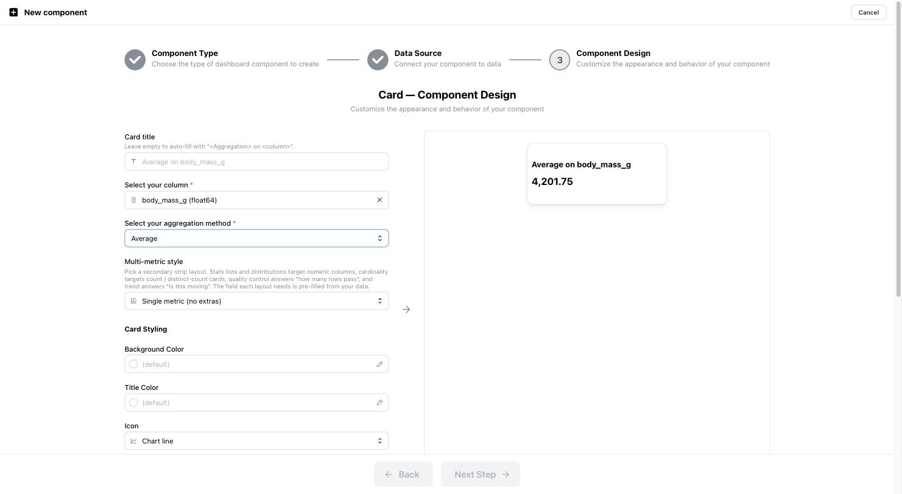
    </a>
</div>

##  MultiQC Integration (v0.5.0+)

As of version 0.5.0, Depictio includes dedicated support for MultiQC quality control reports. This integration allows you to:

- **Automatically scan and aggregate** MultiQC output reports
- **Create components** directly from MultiQC data using the MultiQC API
- **Link figures** with external metadata for enhanced analysis
- **Filter datasets** to display specific samples based on QC metrics

<div style="padding:104.43% 0 0 0;position:relative;"><iframe src="https://player.vimeo.com/video/1127490052?badge=0&amp;autopause=0&amp;player_id=0&amp;app_id=58479" frameborder="0" allow="autoplay; fullscreen; picture-in-picture; clipboard-write; encrypted-media; web-share" referrerpolicy="strict-origin-when-cross-origin" style="position:absolute;top:0;left:0;width:100%;height:100%;" title="Screen Recording 2025-10-13 at 22.23.16"></iframe></div><script src="https://player.vimeo.com/api/player.js"></script>

### <span style="color: #6495ED;">:material-plus-circle:</span> Adding MultiQC Components

1. When creating a new component, MultiQC data collections will be automatically detected if present in your project
2. Select the **MultiQC data collection** from the available options in Step 2 (Data Selection)
3. MultiQC-specific visualization options will be available based on the report content
4. You can create multiple components from different sections of your MultiQC report (General Statistics, FastQC, Cutadapt, etc.)

!!! tip "MultiQC Data Ingestion"
    To ingest MultiQC reports into Depictio, use the Depictio-CLI with your project configuration file. MultiQC reports should be specified in your YAML configuration under the appropriate workflow section.
