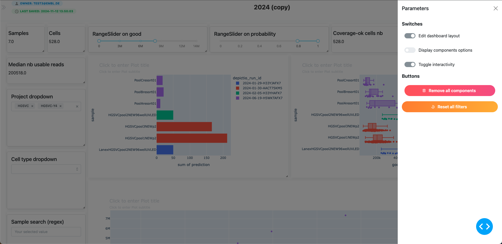
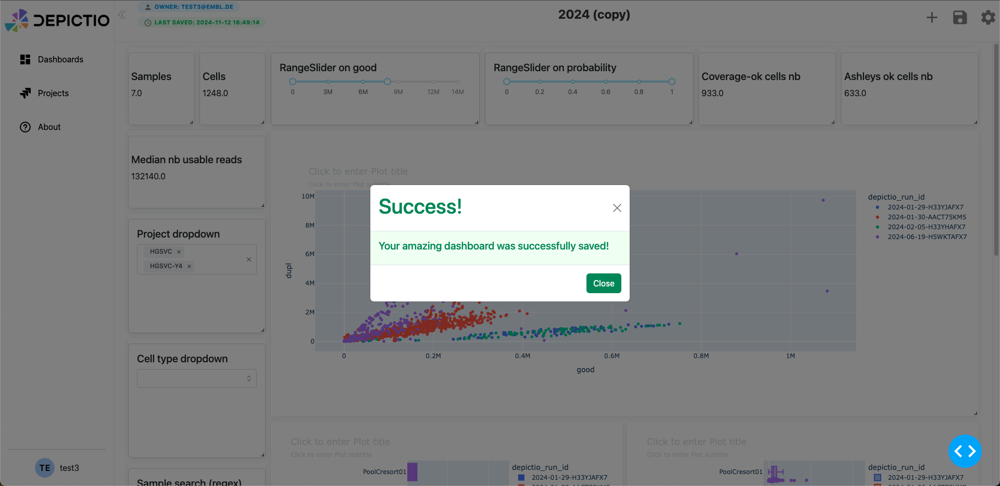
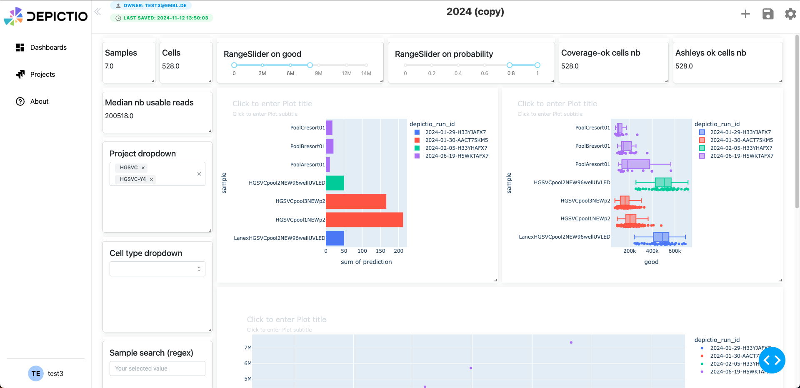

# Dashboard Creation 

## Add a component to the dashboard

### Step 1: Component Selection

    

1. Begin by clicking on the **"+ New Dashboard"** button to create a new dashboard.
2. In the **"Design your new dashboard component"** modal:
   - Choose from the available standard or special components (e.g., **Figure**, **Card**, **Interactive**, **Table**, or special components like **JBrowse**, **Graph**, **Map**).
   - For this example, select **Figure** for the scatter plot and **Histogram** for the histogram, and **Interactive** for interactive components.
3. Once you’ve chosen the component, click **Next Step**.

### Step 2: Data Selection

    

1. For each selected component, choose the corresponding **workflow** and **data collection** from the dropdowns.
2. Verify the **Data Collection Info**, such as **Workflow ID**, **Table type**, **MongoDB ID**, and **Data preview**.
3. Click **Next Step** to proceed.

### Step 3: Customize Your Component

    

1. **Choose Visualization or Interactive Type**:
   - Based on the component type selected in Step 1, choose the appropriate **visualization** or **interactive type** from the list of available options (e.g., Bar, Scatter, Histogram, RangeSlider).
   
2. **Set Data Parameters**:
   - Define key parameters such as **X-axis** and **Y-axis** (if applicable), and assign the relevant data columns from your dataset.
   - Configure additional data settings, such as filters or ranges, depending on the component's functionality.

3. **Adjust Specific Parameters**:
   - Customize visualization-specific parameters like colors, bin sizes, or axis labels to refine how the data is presented.
   - For interactive components, configure sliders, filters, or dropdown options based on the desired user interactions.

4. **Finalize Customization**:
   - Review the component preview and ensure all settings are accurate.
   - Once complete, click **Next Step** to proceed to the final stage.

Other examples:

    

    

## Right Sidebar Parameters

The right sidebar allows you to customize the appearance and behavior of the dashboard. Currently it includes the following options:
* **Edit Dashboard**: allow you to enable or disable the editing mode, which allows you to modify the size and position of the components. Interactions with the components are still enabled in this mode.
* **Toggle interactivity**: enable or disable the interactivity of the components. When disabled, the components will not respond to user interactions.

    

## Saving the Dashboard

1. Once your dashboard is ready, click the **Save** icon (green button at the top right).
2. A **modal** will appear confirming that your dashboard has been saved (e.g., "Your amazing dashboard was successfully saved!").
3. Click **Close** to dismiss the modal.
4. Your dashboard will now appear with a thumbnail under the **Recently Viewed** section on the landing page.

    

## Example Dashboard result

    

