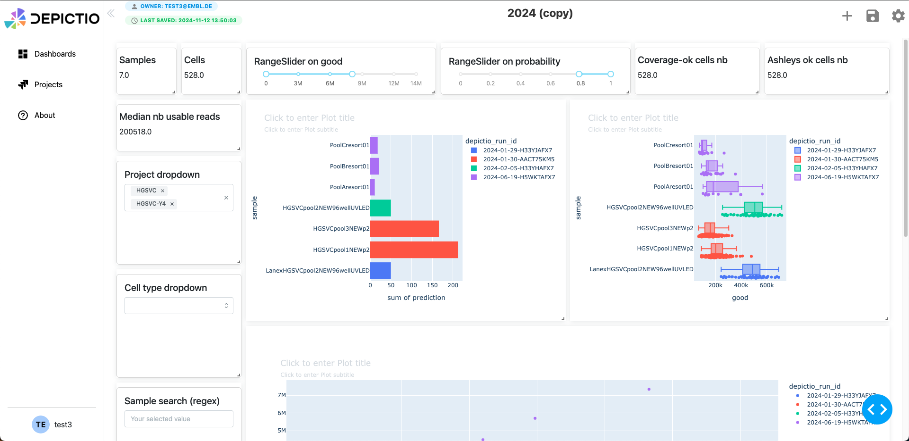

# Using the Dashboard

## Right Sidebar Parameters

    

The right sidebar allows you to customize the appearance and behavior of the dashboard. Currently it includes the following options:

#### Switches

* **Edit Dashboard layout**: allow you to enable or disable the layout editing mode, which allows you to modify the size and position of the components. Interactions with the components are still enabled in this mode.
* **Display components options**: show or hide the options of the components at the top of each component. When hidden, the options will not be displayed. See the [Component-wise options](#component-wise-options) section for more details.
* **Toggle interactivity**: enable or disable the interactivity of the components. When disabled, the components will not respond to user interactions.

#### Buttons

* **Remove all components**: remove all components from the dashboard.
* **Reset all filters**: reset all filters applied to the components.

## Component-wise options

When the **Display components options** switch is enabled, each component will display a set of options at the top of the component. These options allow you to perform the following actions:

    

- <i class="fas fa-trash"></i> Delete: Remove the component from the dashboard.
- <i class="fas fa-edit"></i> Edit: Open a modal to modify the component settings.
- <i class="fas fa-clone"></i> Clone: Create a copy of the component.
- <i class="fas fa-sync"></i> Reset filters: Clear all filters applied to the component.

## Interactivity

#### Interactive Actions

There are currently two types of interactive actions available in the dashboard:

* Through the **interactive** components (e.g., RangeSlider, MultiSelect, TextInput, etc.).
* Through the **graph** components (only Scatter plots are handled yet). 
    * **Click mode**: When you click on a point in the scatter plot, the other components will be updated according to the data point clicked. 
    * **Selection mode**: When you select a region in the scatter plot (using the ***"Box select"*** option), the other components will be updated according to the data points in the selected region.

#### Reset Filters

* **Reset all filters** You can reset all filters applied to the components by clicking the **Reset all filters** button in the right sidebar. This will clear all filters applied to the components and reset them to their default state. 
* **Reset graph filters** You can reset the filters applied to the graph components by clicking the orange <i class="fas fa-sync"></i> Reset button in the component options at the top of the box. This will clear the filters applied to the graph component and reset it to its default state.

## Saving the Dashboard

1. Once your dashboard is ready, click the **Save** icon (green button at the top right).
2. A **modal** will appear confirming that your dashboard has been saved (e.g., "Your amazing dashboard was successfully saved!").
3. Click **Close** to dismiss the modal.
4. Your dashboard will now appear with a thumbnail under the **Recently Viewed** section on the landing page.

    

## Example Dashboard result

    

