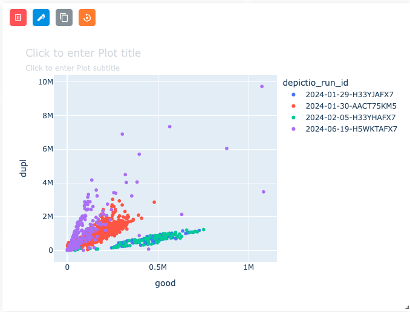
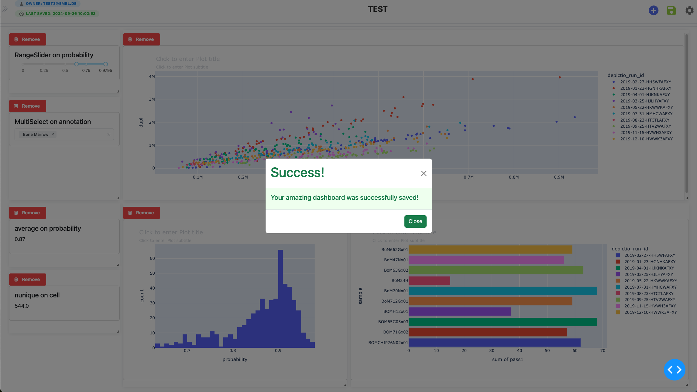

# :material-view-dashboard: Using the Dashboard

## Dashboard Modes (v0.6.0+)

Depictio dashboards operate in two distinct modes, each optimized for its specific purpose.

### :material-eye: Viewer Mode

**URL Pattern:** `/dashboard/{id}`

Viewer mode provides a **read-only** experience optimized for data exploration:

- **No editing controls** - Clean interface focused on data
- **Interactive filtering** - Use filter components to explore data
- **Data updates** - Visualizations respond to filter changes in real-time
- **Lightweight** - Faster loading with reduced callback overhead (~30 callbacks)

!!! tip "When to Use Viewer Mode"
    Use Viewer mode when exploring dashboards, presenting to stakeholders, or sharing dashboard links with colleagues who don't need editing access.

### :material-pencil: Editor Mode

**URL Pattern:** `/dashboard-edit/{id}`

Editor mode enables **full dashboard customization**:

- **Add components** - Create new figures, tables, cards, and filters
- **Edit components** - Modify existing component configurations
- **Drag and drop** - Reposition and resize components
- **Delete components** - Remove unwanted elements
- **Save changes** - Persist your layout and component settings
- **Tabs management** - Create and organize dashboard tabs

!!! info "Switching Between Modes"
    Click the **Edit** button in the dashboard header to switch from Viewer to Editor mode. Click **View** to return to read-only mode.

---

## Two-Panel Layout (v0.6.0+)

Dashboards use a two-panel layout to organize components:

| Panel | Location | Component Types |
|-------|----------|-----------------|
| **Left Panel** | ~20% width | Interactive filters (RangeSlider, MultiSelect, DatePicker) |
| **Right Panel** | ~80% width | Visualizations (Figure, Table, Card, Text) |

Components are automatically assigned to the appropriate panel based on their type when created.

---

## Right Sidebar Parameters

    

The right sidebar allows you to customize the appearance and behavior of the dashboard. Currently it includes the following options:

#### Switches

- **Edit Dashboard layout**: allow you to enable or disable the layout editing mode, which allows you to modify the size and position of the components, as well as show or hide the options of the components at the top of each component. When hidden, the options will not be displayed (except the reset button). See the [Component-wise options](#component-wise-options) section for more details. Interactions with the components are still enabled in this mode and you can still interact with the components.
- **Toggle interactivity**: enable or disable the interactivity of the components. When disabled, the components will not respond to user interactions.

#### Buttons

- **Remove all components**: remove all components from the dashboard.
- **Reset all filters**: reset all filters applied to the components.

## Component-wise options

When the **Display components options** switch is enabled, each component will display a set of options at the top of the component. These options allow you to perform the following actions:

    

- <i class="mdi mdi-dots-grid"></i> Draggable: Move and reposition components within the dashboard layout using drag handles.
- <i class="mdi mdi-trash-can-outline"></i> Delete: Remove the component from the dashboard.
- <i class="mdi mdi-pen"></i> Edit: Open a modal to modify the component settings.
- <i class="mdi mdi-content-copy"></i> Clone: Create a copy of the component.
- <i class="bx bx-reset"></i> Reset filters: Clear all filters applied to the component.
- <i class="mdi mdi-format-align-left"></i> Align: Choose text alignment (left, center, right) for text components.
- <i class="mdi mdi-information-outline"></i> Component metadata: View detailed metadata about the component, including its type, data source, and configuration settings.

---

## Table Component Features

### :material-download: Data Export (v0.6.0+)

Table components include a **data export** feature that allows you to download the displayed data:

1. Click the **Export** button (download icon) in the table component header
2. The table data will be exported as a CSV file
3. The export respects current filters and sorting applied to the table

!!! note "Export Limits"
    - Tables with < 100,000 rows: Instant export
    - Tables with 100,000 - 1,000,000 rows: Export allowed with warning
    - Tables with > 1,000,000 rows: Export blocked (use CLI for large exports)

---

## Interactivity

#### Interactive Actions

There are currently two types of interactive actions available in the dashboard:

- Through the **interactive** components (e.g., RangeSlider, MultiSelect, etc.).
- Through the **graph** components (only Scatter plots are handled yet).
  - **Click mode**: When you click on a point in the scatter plot, the other components will be updated according to the data point clicked.
  - **Selection mode**: When you select a region in the scatter plot (using the **_"Box select"_** option), the other components will be updated according to the data points in the selected region.

#### Reset Filters

- **Reset all filters** You can reset all filters applied to the components by clicking the **Reset all filters** button in the right sidebar. This will clear all filters applied to the components and reset them to their default state.
- **Reset interactive component/scatter plot filter** You can reset the filters applied to the graph components by clicking the orange <i class="bx bx-reset"></i> Reset button in the component options at the top of the box. This will clear the filters applied to the graph component and reset it to its default state.

## Saving the Dashboard

1. Once your dashboard is ready, click the **Save** icon (green button at the top right).
2. A **modal** will appear confirming that your dashboard has been saved (e.g., "Your amazing dashboard was successfully saved!").
3. Click **Close** to dismiss the modal.
4. Your dashboard will now appear with a thumbnail under the **Recently Viewed** section on the landing page.

    

## Example Dashboard result

    

