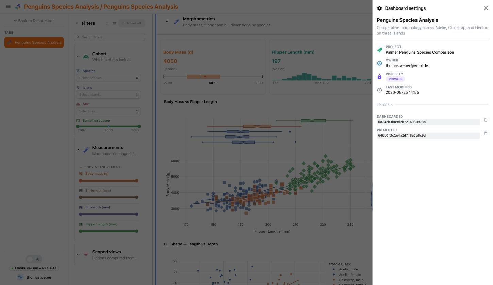
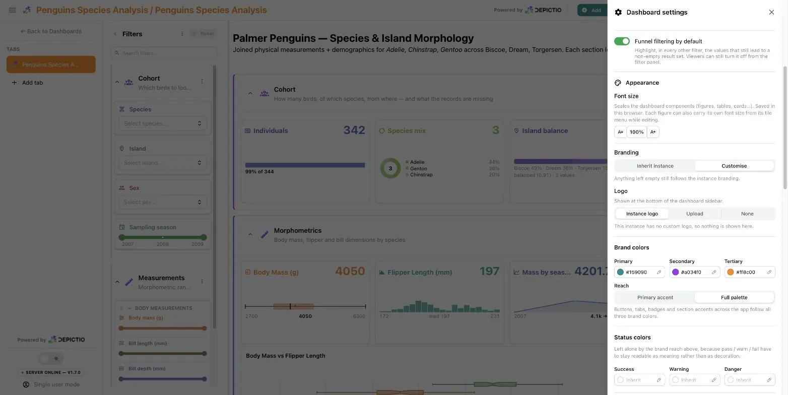
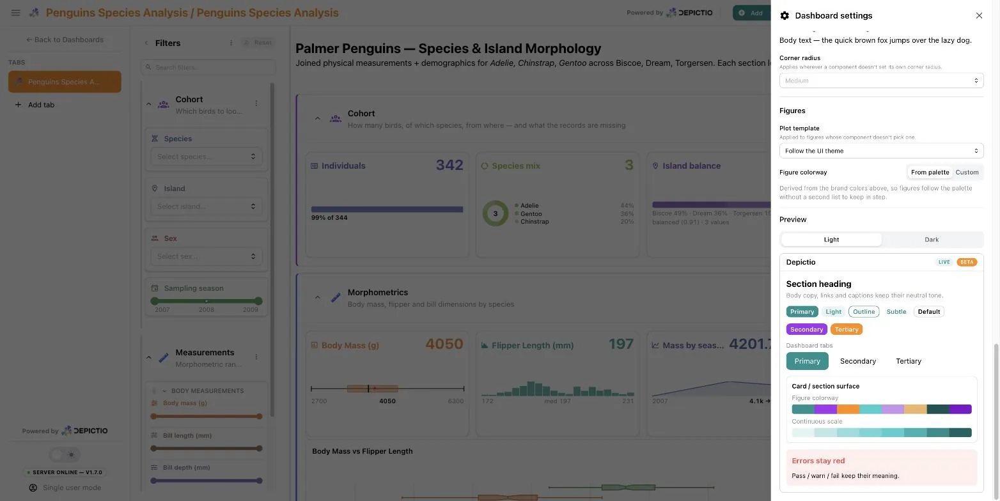
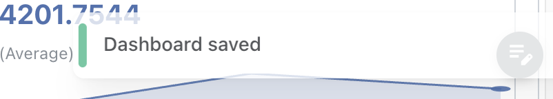

# <span style="color: #F68B33;">:material-view-dashboard:</span> Using the Dashboard

## Dashboard Modes (v0.6.0+)

Depictio dashboards operate in two distinct modes, each optimized for its specific purpose.

### <span style="color: #45B8AC;">:material-eye:</span> Viewer Mode

**URL Pattern:** `/dashboard/{id}`

Viewer mode provides a **read-only** experience optimized for data exploration:

- **No editing controls** - Clean interface focused on data
- **Interactive filtering** - Use filter components to explore data
- **Data updates** - Visualizations respond to filter changes in real-time
- **Lightweight** - Read-only rendering path, with none of the editing machinery loaded

!!! tip "When to Use Viewer Mode"
    Use Viewer mode when exploring dashboards, presenting to stakeholders, or sharing dashboard links with colleagues who don't need editing access.

### <span style="color: #9966CC;">:material-pencil:</span> Editor Mode

**URL Pattern:** `/dashboard-edit/{id}`

Editor mode enables **full dashboard customization**:

- **Add components** - Create new figures, tables, cards, and filters
- **Edit components** - Modify existing component configurations
- **Drag and drop** - Reposition and resize components
- **Delete components** - Remove unwanted elements
- **Save changes** - Persist your layout and component settings
- **Tabs management** - Create and organize dashboard tabs

!!! info "Switching Between Modes"
    Click the **Edit** button in the dashboard header to switch from Viewer to Editor mode. Click **View** to return to read-only mode.

---

## Two-Panel Layout (v0.6.0+)

Dashboards use a two-panel layout to organize components:

| Panel | Location | Component Types |
|-------|----------|-----------------|
| **Left Panel** | ~20% width | Interactive filters (RangeSlider, MultiSelect, DatePicker) |
| **Right Panel** | ~80% width | Visualizations (Figure, Table, Card, Text) |

Components are automatically assigned to the appropriate panel based on their type when created.

### Working with the filter panel (v1.4.0+)

- **Collapse it** with the control at its edge. It shrinks to a narrow rail rather than disappearing, and the rail keeps showing how many filters are active, so a filtered dashboard never looks unfiltered.
- **Resize it** by dragging its edge. The width is remembered for that dashboard, and the grid re-lays out to match.
- **Fold a section** with its header. A folded section fetches nothing until you open it, and keeps a badge with the number of active filters inside it.
- **Read what is applied** from the summary above the controls: one aligned row per filter, each with its own control's icon and colour. Click a row's clear button to drop just that filter. The whole summary folds to a single line.

Sections in the main grid work the same way, and a folded section of cards still shows its numbers in the header. See [Sections](../../features/dashboards.md#sections).

### Sections shown on every tab (v1.6.0+)

A section whose header carries a pin belongs to the whole dashboard rather than the tab you are on. In the filter panel that means the controls are the same on every tab **and keep the values you set** when you switch, which is what a filter the whole dashboard shares should do. In the grid it means the section is there on every tab, read-only unless you are on the tab that owns it, sitting either above or below that tab's own content.

Folding one folds it everywhere, so it stays out of your way as you move around. See [Sections on every tab](../../features/dashboards.md#persistent-sections).

### The map panel (v1.4.0+)

When a dashboard has a map authored as a dashboard-wide panel, it follows you across every tab rather than living in one. Use the header control to move it between floating, docked and hidden, and the panel header's menu to edit, duplicate or delete it.

- **Select on the map** by lassoing, box-selecting or clicking; every tab of the dashboard follows the selection.
- **Open the rows behind it** from the panel header or the tile chrome. The map's own columns come first, and ticking rows selects them on the map.
- Lasso, click and row-ticking all produce the same filter, so they replace one another instead of stacking.

---

## Dashboard settings drawer

**Settings**, at the top right, opens a drawer describing the dashboard: its project, owner, visibility and last-modified date, then the dashboard and project IDs, each with a copy button. Since **v1.6.0** the project name is a link to that project's page, and **View ingestion report** below it opens the [ingestion report](../../features/dashboards.md#ingestion-report-health) for any project, not just one built from a template. The same body backs the inspector's **Info** tab. Since **v1.8.0** the drawer is no longer read-only: in edit mode it also carries the [Appearance](#appearance) controls.

<div style="border: 1px solid grey; width: 602px; padding: 1px;">
    <a href="../../../images/guides/dashboard_creation/dashboard_settings.png" target="_blank">
        
    </a>
</div>

!!! note "This replaced the Parameters panel (v1.0.0)"
    The Dash UI put a *Parameters* panel here, with switches for edit mode and interactivity and buttons to remove every component or reset every filter. Only one of those survived the React rewrite: **Reset all**, now at the top of the filter panel. Editing is the **Edit** button, and there is no global interactivity switch.

### Appearance <small>(v1.8.0+)</small> { #appearance }

In viewer mode this section holds one control, **Font size**. In edit mode it holds everything about how this dashboard looks.

**Font size.** **A-** and **A+** step the content through 85%, 100%, 115% and 130%. Figures, tables and cards scale; the header, sidebar and panels keep their size. The preference is stored per browser, like the dark-mode toggle, so it follows the reader rather than the dashboard.

!!! tip "Scaling one figure rather than all of them"
    A single tile takes a `font_scale` of its own from its edit menu, between 0.7× and 2×, applied to the whole Plotly layout font. See [Components](../../features/components.md#figure-components).

**Branding.** **Inherit instance** or **Customise**. Under *Customise*, anything left empty still follows the instance branding, so an override states only what differs.

| Group | What it holds |
|-------|---------------|
| Logo | **Instance logo**, **Upload** or **None**. Shown at the bottom of the dashboard sidebar |
| Brand colors | Primary, Secondary, Tertiary, and **Reach**: *Primary accent* re-tints the primary only, *Full palette* carries all three into buttons, tabs, badges and section accents |
| Status colors | Success, Warning, Danger, left alone by the reach above so pass, warn and fail keep reading as meaning |
| Surfaces | Page background, Cards & sections, Header & sidebar and Titles, stated separately for light and for dark |
| Typography & shape | Font stack, Heading font stack and Corner radius, with a live sample rendered beneath them |
| Figures | **Plot template** for figures whose component picks none, and **Figure colorway**, either *From palette* (derived from the brand colours above) or *Custom* |

A **Preview** at the bottom renders real components under the draft, with its own Light and Dark tabs, so both schemes can be checked without switching the app over.

[](../../images/guides/branding/dashboard-appearance-branding.webp){target=_blank}

[](../../images/guides/branding/dashboard-appearance-figures.webp){target=_blank}

The override applies to this dashboard's page only, so it can wear its own identity inside a differently branded instance. The bundled penguins demo does exactly that:

[](../../images/guides/branding/dashboard-brand-override.webp){target=_blank}

!!! warning "Uploads are instance-local"
    An uploaded logo is served from the instance that received it, so it is excluded from YAML exports. A logo that has to survive a move belongs in `logo_url` as an absolute address.

Figure theming resolves in this order:

```text
component explicit  >  dashboard default  >  instance branding  >  Mantine default
```

See [Branding](../administration/branding.md) for the model behind all of this, and for the `brand_theme:` YAML equivalent.

## Component-wise options

In edit mode, hovering a component reveals three icons in its top-right corner, and resize handles on its edges and corners.

<div style="border: 1px solid grey; width: 602px; padding: 1px;">
    <a href="../../../images/guides/dashboard_creation/component_options.png" target="_blank">
        
    </a>
</div>

- <span style="color: #888888;"><i class="mdi mdi-dots-grid"></i> **Drag handle**</span>: grab it to move the component in the grid.
- <span style="color: #15aabf;"><i class="mdi mdi-information-outline"></i> **Info**</span>: the component's metadata: type, data source, configuration.
- <span style="color: #888888;"><i class="mdi mdi-dots-vertical"></i> **Menu**</span>: **Edit** reopens the builder on this component, **Duplicate** copies it, **Move to section** hands it to another section, **Delete** removes it.

---

## Table Component Features

### <span style="color: #45B8AC;">:material-download:</span> Data Export (v0.6.0+)

Table components include a **data export** feature that allows you to download the displayed data:

1. Click the **Export** button (download icon) in the table component header
2. The table data will be exported as a CSV file
3. The export respects current filters and sorting applied to the table

!!! note "Export Limits"
    - Tables with < 100,000 rows: Instant export
    - Tables with 100,000 - 1,000,000 rows: Export allowed with warning
    - Tables with > 1,000,000 rows: Export blocked (use CLI for large exports)

---

## How a Dashboard Loads (v1.3.0+)

A dashboard can hold dozens of panels, each needing its own request, so Depictio loads
them as you reach them rather than all at once.

### <span style="color: #45B8AC;">:material-progress-clock:</span> While the page opens

- **The Depictio logo animates in the centre of the page** while the dashboard itself is
  being fetched. No panels are known yet, so there is nothing to count.
- **Panels load when they scroll into view.** A panel below the fold shows a shimmering
  placeholder and costs nothing until you scroll near it, so opening a large dashboard
  stays responsive instead of waiting on every panel first.
- **A progress ring and a count** (for example `6/8`) sit beside the dashboard title, then
  disappear once everything on screen is ready. Hover it for a breakdown: how many are
  still loading, how many failed, and how many are further down the page.

!!! tip "Why the count can go backwards"
    The count covers what is **on screen**, not the whole dashboard, so it always
    completes. Scrolling brings more panels in and the count grows to include them, so a
    number that briefly drops is work which has just started, not a problem.

### <span style="color: #9966CC;">:material-database-arrow-down:</span> Reduced views and the Load-all button

Large data collections are not sent to the browser whole. Where a panel is showing a
reduced view, it says so and offers a way out:

[](../../images/react/load_all_light.webp){target=_blank}

[](../../images/react/load_all_dark.webp){target=_blank}

*Hover a panel to reveal its action cluster. **Load all** is the bottom icon, and the badge
beside the title says how much of the collection you are currently seeing.*

- **Figures** show a badge such as `9,900 / 12,011,000 pts`. Hover the panel and click the
  **Load all** icon (:material-database-arrow-down:) in the action cluster to fetch every
  point; the badge switches to `(all)` and the button toggles back to the reduced view.
  Loading everything can be slow on a very large collection.
- **Tables** page rows on demand. On tables past roughly a million rows, **sorting is
  turned off**: the chevron disappears from the column headers rather than offering a
  sort that would silently return unsorted rows.
- **Advanced visualisations** that compute their values from the rows they receive (stacked
  taxonomy, DA barplot, enrichment, oncoplot, …) are normally sent the whole collection. If
  it is too large for that, they carry an orange **estimated** badge, meaning the values on
  screen are derived from a sample rather than being exact totals. The lollipop plot shows
  the same badge whenever its rows were sampled, since its per-gene counts are an aggregate.

See [Performance & Scaling](../../features/performance.md) for the thresholds behind these
behaviours and how to change them.

---

## Interactivity

#### Interactive Actions

There are currently two types of interactive actions available in the dashboard:

- Through the **interactive** components (e.g., RangeSlider, MultiSelect, etc.).
- Through the **graph** components (only Scatter plots are handled yet).
  - **Click mode**: When you click on a point in the scatter plot, the other components will be updated according to the data point clicked.
  - **Selection mode**: When you select a region in the scatter plot (using the **_"Box select"_** option), the other components will be updated according to the data points in the selected region.

#### Reset Filters

- **Reset all filters** You can reset all filters applied to the components by clicking the **Reset all filters** button in the right sidebar. This will clear all filters applied to the components and reset them to their default state.
- **Reset interactive component/scatter plot filter** You can reset the filters applied to the graph components by clicking the orange <span style="color: #fd7e14;"><i class="bx bx-reset"></i> Reset</span> button in the component options at the top of the box. This will clear the filters applied to the graph component and reset it to its default state.
- **Clear one filter from the summary** (v1.4.0+) Each row of the filter panel's active-filter summary has its own clear button, so you can drop a single filter without touching the rest.

!!! note "Where the reset icon stays visible (v1.4.0+)"
    On figures, tables and maps the reset icon stays pinned while a selection is active, since a selection there is easy to miss. On an interactive control it appears on hover, so that it cannot sit on top of the select's chevron or the slider track.

## Saving the Dashboard

Layout and section changes persist on their own, about half a second after you stop editing. There is no unsaved state to lose if you close the tab.

**Save**, in the editor toolbar, writes immediately instead of waiting for that delay, and queues a fresh thumbnail for the dashboard card. A short notification confirms it.

<div style="border: 1px solid grey; width: 602px; padding: 1px;">
    <a href="../../../images/guides/dashboard_creation/save_notification.png" target="_blank">
        
    </a>
</div>

**Exit Edit** returns to viewer mode. The dashboard then shows up with its new thumbnail under **Recently opened** on the dashboards page.

## Example Dashboard result

<div style="border: 1px solid grey; width: 602px; padding: 1px;">
    <a href="../../../images/guides/dashboard_creation/dashboard_example.png" target="_blank">
        
    </a>
</div>
