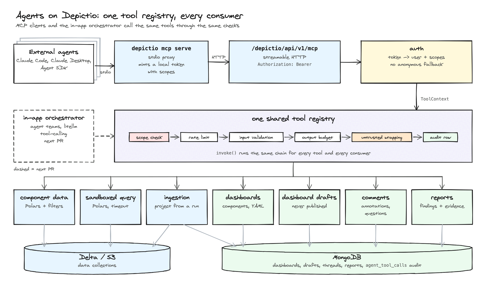

# :material-robot-outline: MCP Server (AI agents)

Depictio exposes its dashboards, components, data and comments to AI agents through the
[Model Context Protocol](https://modelcontextprotocol.io) (MCP). An agent such as Claude Code
can open a dashboard, query the data behind a component, and leave its conclusions where a
human would: **proposed** annotations and questions on the components, and analysis reports.

Agents never publish anything. Every annotation or question an agent writes lands as a
proposal with an agent badge and the evidence it rests on, and a person accepts or rejects it
in the comments drawer.

!!! info "Availability"
    The MCP server ships with [depictio#1125](https://github.com/depictio/depictio/pull/1125)
    and is **off by default**.

---

## How it works

<figure markdown="span">
  
  <figcaption>Every tool call goes through the same chain: scope check, rate limit, input validation, output budget, untrusted-text wrapping and an audit row.</figcaption>
</figure>

- The API serves MCP over streamable HTTP at `/depictio/api/v1/mcp`, authenticated with a
  Bearer token. There is no anonymous access.
- Most desktop clients speak stdio, so `depictio-cli mcp serve` runs a small local stdio server
  that forwards every request to that endpoint.
- Text written by people (comments, titles, cell values) reaches the agent wrapped as
  untrusted data, never as instructions.

---

## Enable it

### 1. Turn the server on

```bash
DEPICTIO_MCP_ENABLED=true
```

On Kubernetes, set it under `backend.env` in the Helm values. See
[MCP Server](../../installation/env-reference.md#mcp-server) in the environment reference for
the other `DEPICTIO_MCP_*` settings.

### 2. Install the CLI with the MCP extra

```bash
pip install "depictio-cli[mcp]"
```

### 3. Create a scoped token

Give the agent its own token, limited to what it needs:

```bash
depictio-cli mcp token create --name claude-code --scopes read,annotate,report \
  --write-config ~/.depictio/mcp.yaml
```

The command uses your CLI config (`~/.depictio/CLI.yaml`) to create the token. It writes a config
file (mode `0600`) that `mcp serve` can use. You can also create scoped tokens from
the **CLI Agents** page (from your profile) in the web UI.

| Scope | Lets the agent |
|-------|----------------|
| `read` | List projects and dashboards, read components, their data and comment threads, run sandboxed Polars queries. Implied by every other scope |
| `annotate` | Propose annotations and questions, reply to threads |
| `report` | Write and update analysis reports |
| `edit_dashboard` | Propose new components as a draft copy of a dashboard; the source dashboard is never changed |
| `ingest` | Create a project from a pipeline run (also needs `DEPICTIO_MCP_ENABLE_INGEST=true`) |

A scoped token cannot create tokens, review threads or publish anything, on MCP or on the
REST API. Tokens without scopes (existing tokens, the CLI's own) keep full access.

### 4. Register the server with your client

```bash
depictio-cli mcp install --config ~/.depictio/mcp.yaml
```

This prints the command for Claude Code and the entry for Claude Desktop, for example:

```bash
claude mcp add depictio -- depictio-cli mcp serve --config /home/me/.depictio/mcp.yaml
```

Use `--client claude-desktop --write` to merge the entry into Claude Desktop's config file (a
backup is written first).

!!! tip "With `depictio-cli local up`"
    `depictio-cli local up --mcp` starts a local server with MCP enabled. `mcp serve` then finds it
    on its own and uses a scoped `mcp-local` token (`read`, `annotate`, `report`) instead of the
    admin token, so `depictio-cli mcp install` needs no `--config`.

---

## Use it

Ask your agent a question about a dashboard, for example:

> Which penguin species differ most in body mass and flipper length? Mark the outliers on the
> scatter plot.

The agent typically lists the dashboards, reads the one you named, queries the data behind the
relevant components, then proposes an annotation with the query as evidence. Open the
dashboard's **Comments** drawer to review it: **Accept**, **Reject**, or reply.

| Tools | Scope |
|-------|-------|
| `list_projects`, `list_dashboards`, `get_dashboard`, `get_component`, `list_component_types` | `read` |
| `get_component_data`, `describe_data_collection`, `query_data` | `read` |
| `list_threads`, `get_thread`, `list_reports`, `get_report` | `read` |
| `create_annotation`, `ask_question`, `reply` | `annotate` |
| `create_report`, `update_report` | `report` |
| `propose_component`, `suggest_components`\*, `generate_dashboard`\* | `edit_dashboard` |
| `list_templates`, `preview_run`, `create_project_from_run`, `get_ingestion_status` | `ingest` (behind `DEPICTIO_MCP_ENABLE_INGEST`) |

\* Only when `DEPICTIO_MCP_ENABLE_LLM_TOOLS=true`; these call the server's configured LLM.

The client only sees the tools its token's scopes allow. Dashboards, components, their data,
threads and reports are also available as resources (`depictio://dashboard/{id}`,
`depictio://thread/{id}`, `depictio://report/{id}`, ...).

### Limits

- **Output:** a tool result is capped at `DEPICTIO_MCP_MAX_OUTPUT_CHARS` and flagged
  `truncated`.
- **Queries:** `query_data` runs one Polars expression in a sandbox, with a timeout and at most two
  concurrent queries per user.
- **Rate:** calls are rate-limited per token (`DEPICTIO_MCP_RATE_PER_MIN`).
- **Proposals:** an agent run can write at most 50 threads and 20 reports, and a token at most
  200 threads and 50 reports a day.
- **Audit:** every call is recorded in the `agent_tool_calls` audit collection, kept 90 days.
