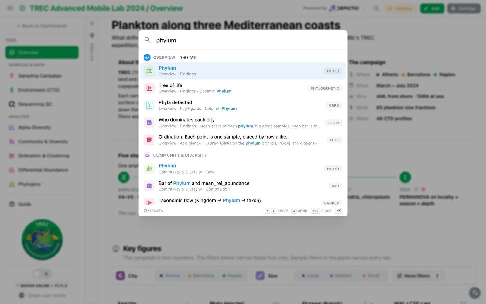
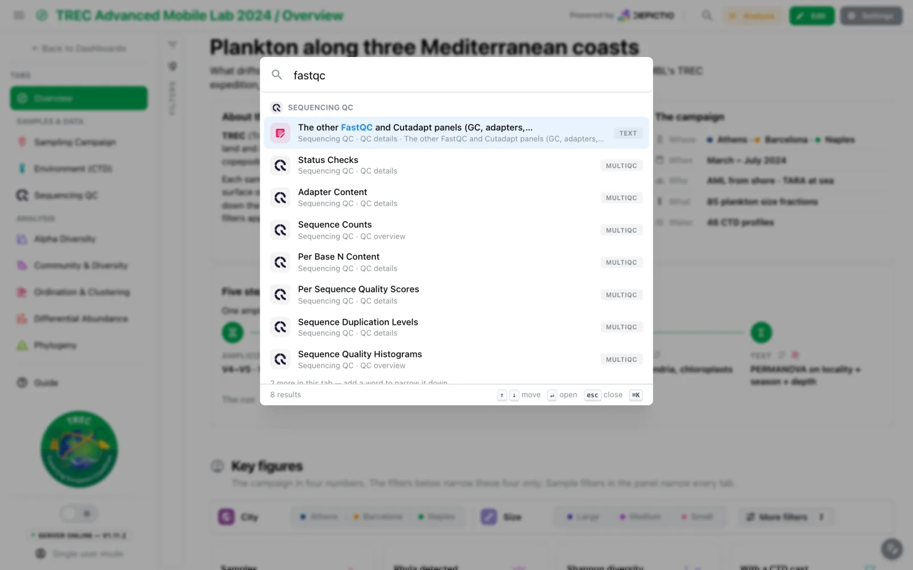

# :material-magnify: Spotlight search <small>(v1.14.0+)</small>

A dashboard with a dozen tabs of thirty components each used to mean opening tabs until
the right plot showed up. **⌘K** on a Mac, **Ctrl+K** elsewhere, or the magnifier in the
header, opens a search across every component of every tab of the dashboard. Picking a
result takes you to that component.

{target=_blank}

---

## What it searches

The search reads what the dashboard already says about itself:

- tab names, descriptions and the sidebar group they sit under;
- component titles, subtitles, captions and descriptions;
- type and chart-kind labels (*filter*, *card*, *phylogenetic*, *sankey*), and a MultiQC
  panel's module and plot;
- the columns a component binds;
- the prose of text tiles, without its markdown;
- section names.

Every word typed must be found; case and accents are ignored. A word is found where a
field starts with it, then where one of its words does, then anywhere inside it, though a
word of one or two letters only counts at the start of a word. A hit in a title ranks
above the same hit in a text body. There is no typo tolerance: a misspelt word finds
nothing rather than a list of near misses.

In the editor, the tab you are on is searched with its unsaved changes. The other tabs
are fetched the first time the search opens, and only those you can open.

---

## Results

Results are grouped by tab: the tab you are on first, marked **This tab**, then the others
in sidebar order. Tabs are results too, and an empty field lists them, as a tab switcher.
Each row shows a type icon (MultiQC panels wear the MultiQC logo), the title with the
match highlighted, a dimmed *tab · section · snippet* line and, on the right, what it is
(*Card*, *Filter*, *Sunburst*, *Tab*). **↑** and **↓** move, **Enter** opens, **Esc** or
**⌘K** / **Ctrl+K** again closes, and a middle-click or ⌘/Ctrl-click opens a result in a
new browser tab. A tab shows at most eight matches, then *N more in this tab — add a word
to narrow it down*. Reopening the search keeps the last query, selected.

{target=_blank}

---

## Where it lands

1. Whatever hides the component opens first: the [Guide](dashboard-guide.md), a folded
   section, a filter group, the collapsed filter panel, a
   [section shown on every tab](../../features/dashboards.md#persistent-sections), or the
   filter drawer on a phone.
2. The page scrolls to the component and rings it for a moment. If a tile above it grows
   meanwhile, the page scrolls once more to correct.

A result on another tab opens that tab with `?component=` in the address, which the tab
acts on and then removes. A component this tab also shows, such as one in a section
pinned from another tab, is landed on in place. Picking a tab opens it; picking the tab
you are on scrolls back to its top. In the editor, pending changes are saved before leaving the
tab; if the save fails, you stay on the tab and a notification says so.

Search works in view mode, in edit mode and on public dashboards. The shortcut is
ignored while you type in a field or in the code editor.

!!! note "Known limit"
    A filter folded under a filter bar's **More filters**, or a map panel the reader has
    hidden, is not uncovered. You get a *That component is not on screen* notice
    instead.
