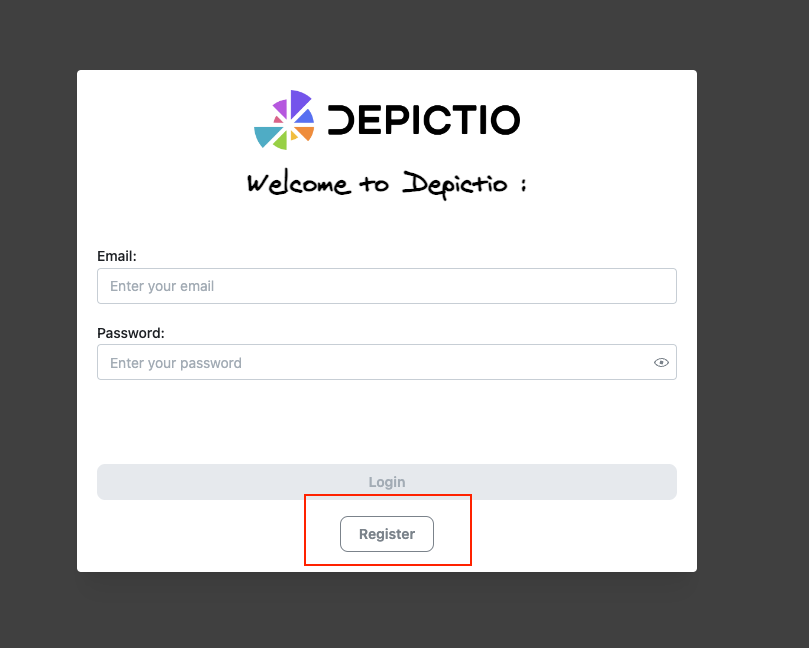
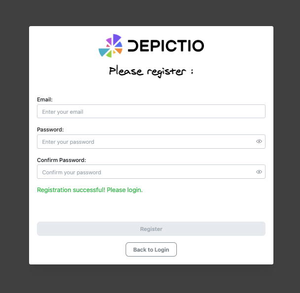
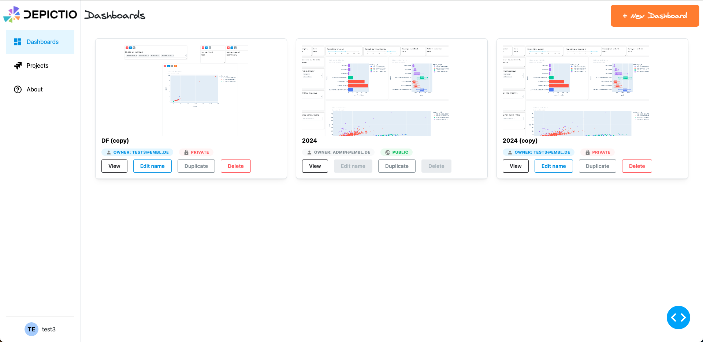
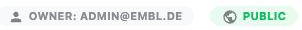
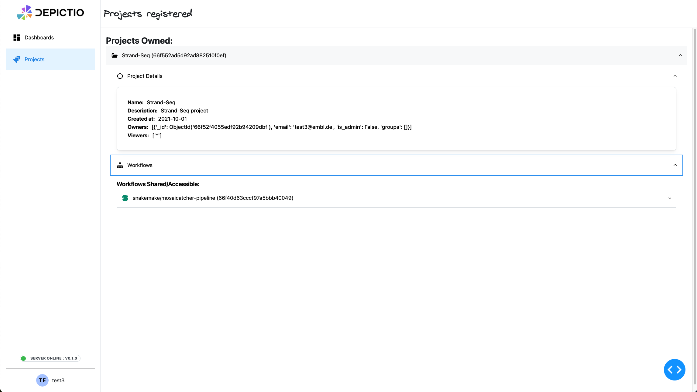
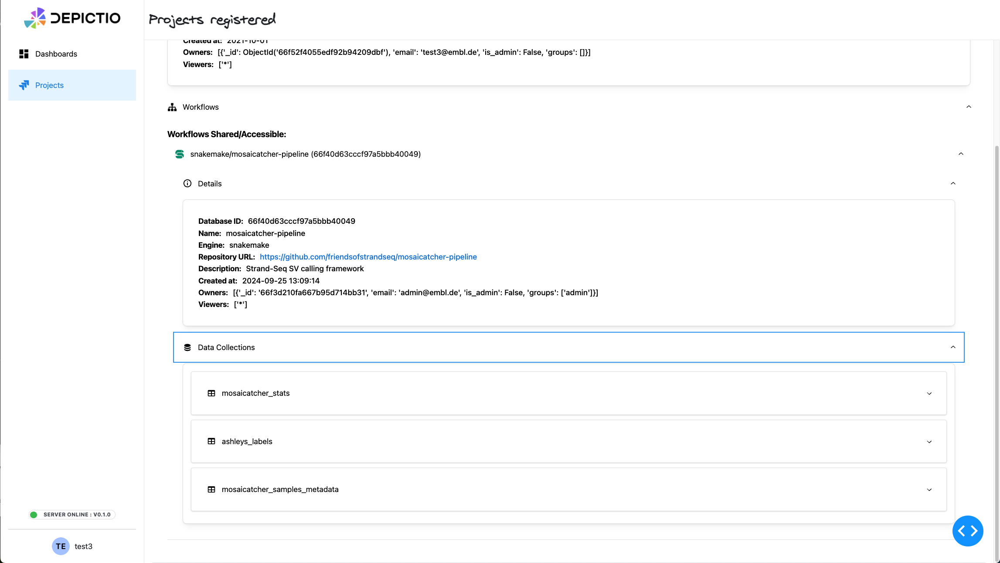
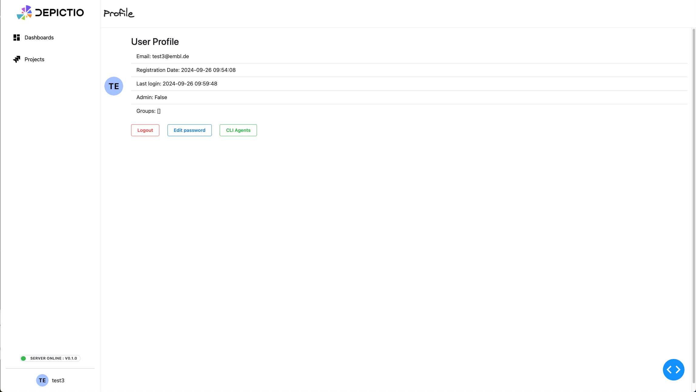
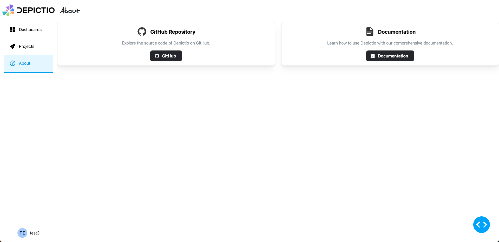
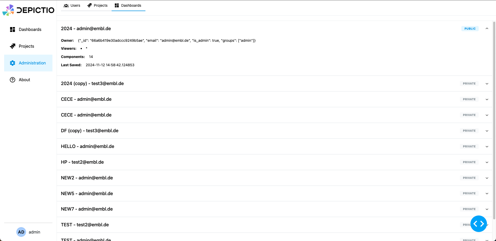

# Web UI

## Introduction

## Register and login

### Registering an Account (Sign Up)

1. **Navigate to the Registration page** by clicking the **Register** button on the login screen.

2. **Enter your email address** in the "Email" field.

3. **Create a password** and enter it in the "Password" field. You can click the eye icon to view the password as you type and **Confirm your password** by re-entering it in the "Confirm Password" field.

4. Click the **Register** button to submit your registration details.

5. After successful registration, you can return to the login page by clicking the **Back to Login** button.

### Logging In (Sign In)

1. **Open the Depictio Login page**.
2. **Enter your email address** in the "Email" field.
3. **Enter your password** in the "Password" field.
4. If you want to see the password as you type it, click the eye icon next to the password field.
5. Once both fields are filled in, click the **Login** button.
6. You will be redirected to the Depictio landing page (currently `/dashboards`).

## Landing page / Dashboards section (/dashboards)

    

### Creating a New Dashboard

1. On the **landing page**, click the orange **"+ New Dashboard"** button located in the top right corner.
2. A pop-up window will appear with a field labeled **"Dashboard Title"**.
3. **Enter a name** for your new dashboard.
4. Your dashboard will be created with the title you provided and added to the section.
5. Click the blue **"Create Dashboard"** button to create the dashboard.
6. The new dashboard will appear in the section with informations including name, owner and status (public/private).

### Functionalities

#### Viewing a Dashboard

1. Once a dashboard is created, it will appear under the section.
2. Click the **"View"** button next to the dashboard name to open and explore its content.

#### Deleting a Dashboard

1. To delete a dashboard, locate the dashboard in the section.
2. Click the red **"Delete"** button next to the dashboard name.
3. A confirmation pop-up will appear, asking **"Are you sure you want to delete this dashboard?"**.
4. Click **"Delete"** to permanently remove the dashboard, or **"Cancel"** to keep it.

#### Editing dashboard name

1. To edit the name of a dashboard, locate the dashboard in the section.
2. Click the **"Edit name"** button next to the dashboard name.
3. A pop-up window will appear with a field labeled **"New name"**.
4. **Enter a new name** for your dashboard.
5. Click the blue **"Save"** button to save the new name.

#### Duplicating a dashboard

1. To duplicate a dashboard, locate the dashboard in the section.
2. Click the **"Duplicate"** button next to the dashboard name.
3. The dashboard will be duplicated and added to the section with the suffix **"(copy)"**.

!!! note
    

    
    

    Both "public" and "private" dashboards are listed in the **Dashboards** section. Public dashboards are accessible to all users, while private dashboards are only visible to the user who created them.
    Only the user who created a private dashboard can edit, or delete it.

## Projects section (/projects)

    

- The left sidebar includes a **"Projects"** section where users can manage their projects. Click on **"Projects"** to navigate and view them.

    

You will have access recursively to the workflows related to the project and the data collections related to each of the workflows. Each entity will allow you to access the details of the entity, to see the related configuration used, as well as previsualize the data (for data collections of type `table`).

## User Information (/profile)

- At the bottom of the left sidebar, you will find:
  - **Server status**: Displays the current server version and online status.
  - **User information**: Displays your username and email (e.g., `test_user@example.com`).

    

## About section (/about)

    

The **About** section provides information about the GitHub repository and the documentation.

## Admin section (/admin)

    

    

The **Admin** section is only accessible to users with admin privileges. It allows admins to view users, projects and dashboards. The **Users** tab displays a list of all users registered in the system, while the **Dashboards** tab displays a list of all dashboards. The **Projects** tab is currently under development.
