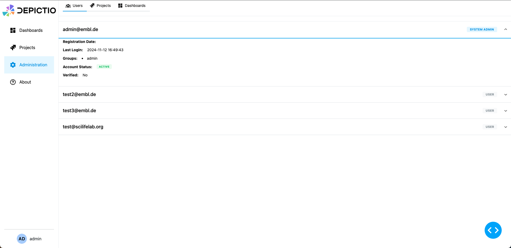

# :material-web: Web UI

## :material-account-plus: Register and login

### :material-account-plus: Registering an Account (Sign Up)

1. **Navigate to the Registration page** by clicking the **Register** button on the login screen.

    

2. **Enter your email address** in the "Email" field.

3. **Create a password** and enter it in the "Password" field. You can click the eye icon to view the password as you type and **Confirm your password** by re-entering it in the "Confirm Password" field.

4. Click the **Register** button to submit your registration details.

5. After successful registration, you can return to the login page by clicking the **Back to Login** button.

### :material-login: Logging In (Sign In)

1. **Open the Depictio Login page**.
2. **Enter your email address** in the "Email" field.
3. **Enter your password** in the "Password" field.
4. If you want to see the password as you type it, click the eye icon next to the password field.
5. Once both fields are filled in, click the **Login** button.
6. You will be redirected to the Depictio landing page (currently `/dashboards`).

### :material-google: Google OAuth Login

If you have configured Google OAuth for your Depictio instance (see [Configuration](../../../installation/configuration/#google-oauth-integration)), you can log in using your Google account. If the account does not exist, it will be created automatically.

## :material-view-dashboard: Landing page / Dashboards section (/dashboards)

    

### :material-menu: Sidebar Navigation

The left sidebar provides easy access to various sections of the application. This includes:

- :material-view-dashboard: **Dashboards**: View and manage your dashboards.
- :material-folder-multiple: **Projects**: Manage your projects and data collections.
- :material-shield-account: **Administration** (sysadmin users only): Access administrative features (only available to users with admin privileges).
- :material-information: **About**: Information about the application and its repository.
- :material-account: **Profile**: View and edit your user profile by clicking on the avatar icon in the bottom left corner.

At the bottom of the sidebar, you will find:

  - **Theme toggle**: Switch between light and dark themes.
  - **Server status**: Displays the current server version and online status.
  - **User information**: Displays your username and email (e.g., `test_user@example.com`).

### :material-plus-circle: Creating a New Dashboard

1. On the **landing page**, click the orange **"+ New Dashboard"** button located in the top right corner.
2. A pop-up window will appear with a field labeled **"Dashboard Title"**.
3. **Enter a name** for your new dashboard.
4. Your dashboard will be created with the title you provided and added to the section.
5. Click the blue **"Create Dashboard"** button to create the dashboard.
6. The new dashboard will appear in the section with informations including name, owner and status (public/private).

### :material-cog: Functionalities

#### :material-eye: Viewing a Dashboard

1. Once a dashboard is created, it will appear under the section.
2. Click the **"View"** button next to the dashboard name to open and explore its content.

#### :material-delete: Deleting a Dashboard

1. To delete a dashboard, locate the dashboard in the section.
2. Click the red **"Delete"** button next to the dashboard name.
3. A confirmation pop-up will appear, asking **"Are you sure you want to delete this dashboard?"**.
4. Click **"Delete"** to permanently remove the dashboard, or **"Cancel"** to keep it.

#### :material-pencil: Editing dashboard name

1. To edit the name of a dashboard, locate the dashboard in the section.
2. Click the **"Edit name"** button next to the dashboard name.
3. A pop-up window will appear with a field labeled **"New name"**.
4. **Enter a new name** for your dashboard.
5. Click the blue **"Save"** button to save the new name.

#### :material-content-copy: Duplicating a dashboard

1. To duplicate a dashboard, locate the dashboard in the section.
2. Click the **"Duplicate"** button next to the dashboard name.
3. The dashboard will be duplicated and added to the section with the suffix **"(copy)"**.

!!! note
    

    
    

    Both "public" and "private" dashboards are listed in the **Dashboards** section. Public dashboards are accessible to all users, while private dashboards are only visible to the user who created them.
    Only the user who created a private dashboard can edit, or delete it.

## :material-folder-multiple: Projects section (/projects)

!!! info "Complete Projects Documentation"
    **For comprehensive information about Projects in Depictio, see the dedicated [Projects Guide](../projects/guide.md).**

    The Projects Guide covers:

    - **Project Types** - Basic vs Advanced projects
    - **Creating Projects** - Step-by-step instructions
    - **Configuration** - YAML setup and examples
    - **Data Collections** - File organization and processing
    - **Permissions** - Access control and collaboration
    - **Best Practices** - Optimization and troubleshooting

    **Quick Links:**

    - :material-folder-multiple: **[Projects Guide](../projects/guide.md)** - Complete project management
    - :material-code-braces: **[YAML Examples](../projects/yaml-examples.md)** - Configuration patterns
    - :material-file-document: **[Configuration Reference](../projects/reference.md)** - Full parameter reference

### :material-information: Quick Overview

- The left sidebar includes a **"Projects"** section where users can manage their projects
- Click on **"Projects"** to navigate and view them
- Projects organize your data and provide structure for dashboards
- You can access workflows and data collections recursively within each project
- Each entity allows you to view configuration details and preview data

## :material-account: User Information (/profile)

You can access your user profile by clicking on the avatar icon in the bottom left corner of the sidebar.

    

This section allows you to:

- View your username and email address
- Edit your password
- Generate CLI Configurations for command-line access (see [CLI Usage](../get_started.md#create-a-cli-configuration))

## :material-information: About section (/about)

    

The **About** section provides information about the GitHub repository and the documentation.

## :material-shield-account: Admin section (/admin)

    

The **Admin** section is only accessible to users with admin privileges. It allows admins to view users, projects and dashboards. The **Users** tab displays a list/delete/change status (sysadmin/standard) of all users registered in the system. The **Dashboards** tab displays a list of all dashboards while the **Projects** tab lists all projects. Admins can delete any project or dashboard, regardless of ownership.
