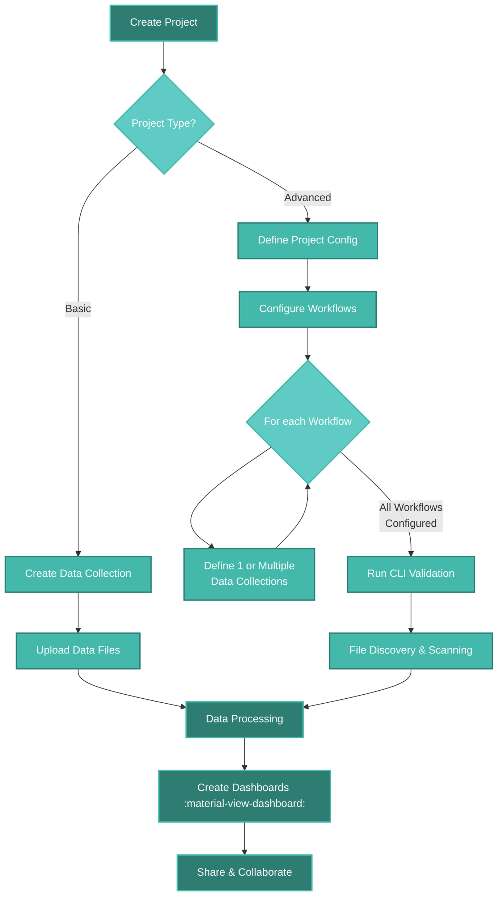

# <span style="color: #45B8AC;">:material-folder-multiple:</span> Projects in Depictio

Projects are the foundation of data organization in Depictio. They serve as containers for your data and dashboards, providing structure and access control for your analysis.

<div style="max-width: 1200px; margin: 1rem auto 2rem auto;">
  <div style="padding: 56.25% 0 0 0; position: relative">
    <iframe
      src="https://player.vimeo.com/video/1108747300?badge=0&amp;autopause=0&amp;player_id=0&amp;app_id=58479&amp;autoplay=1"
      frameborder="0"
      allow="autoplay; fullscreen; picture-in-picture; clipboard-write; encrypted-media; web-share"
      referrerpolicy="strict-origin-when-cross-origin"
      style="position: absolute; top: 0; left: 0; width: 100%; height: 100%"
      title="Managing Projects in Depictio - Overview of Basic vs Advanced Types"
    ></iframe>
  </div>
  <p style="text-align: center; margin-top: 0.5rem; font-style: italic; color: #666;">🎬 <strong>Projects Management Overview:</strong> Discover how Depictio's project types organize your data workflow</p>
</div>
<script src="https://player.vimeo.com/api/player.js"></script>

## Understanding Project Architecture

Every Depictio project contains:

- **Core Project Information** - Name, description, and metadata
- **Data Organization** - Either direct data collections (Basic) or workflow-based structure (Advanced)
- **Permission System** - Role-based access control with owners, editors, and viewers
- **<span style="color: #F68B33;">Dashboard Integration</span>** - Each <span style="color: #F68B33;">:material-view-dashboard: dashboard</span> is linked to a project, allowing for interactive data exploration
- **Storage Backend** - Automatic conversion to Delta Lake format for optimal performance

### Project Lifecycle



## **Basic** Projects

<!-- markdownlint-disable MD046 -->

!!! success "Perfect for: Direct data analysis and quick insights"

    **Use when:** You have tabular data files ready for analysis and want immediate visualization capabilities.

<!-- markdownlint-enable MD046 -->

Basic projects provide an **easy onboarding experience** - upload your data and start creating interactive dashboards within minutes.

<div style="max-width: 1200px; margin: 1rem auto 2rem auto;">
  <div style="padding: 56.25% 0 0 0; position: relative">
    <iframe
      src="https://player.vimeo.com/video/1108747290?badge=0&amp;autopause=0&amp;player_id=0&amp;app_id=58479"
      frameborder="0"
      allow="autoplay; fullscreen; picture-in-picture; clipboard-write; encrypted-media; web-share"
      referrerpolicy="strict-origin-when-cross-origin"
      style="position: absolute; top: 0; left: 0; width: 100%; height: 100%"
      title="Creating Your First Basic Project - Step by Step Walkthrough"
    ></iframe>
  </div>
  <p style="text-align: center; margin-top: 0.5rem; font-style: italic; color: #666;">🎬 <strong>Basic Project Creation:</strong> Watch how to create a basic project from scratch - upload data and start visualizing in minutes</p>
</div>
<script src="https://player.vimeo.com/api/player.js"></script>

### Core Features

- **🚀 Immediate Setup** - No configuration files needed
- **📁 Direct File Upload from WebUI** - Drag and drop your data files
- **🔄 Flexible Data Formats** - CSV, Excel, Parquet, Feather
- **⚡ Fast Processing** - Direct conversion to Delta Lake format
- **Instant Visualization** - Start creating <span style="color: #F68B33;">:material-view-dashboard: dashboards</span> immediately

### Supported File Formats

| Format      | Extension       | Best Use Case                           |
| ----------- | --------------- | --------------------------------------- |
| **CSV**     | `.csv`          | Most common, universal compatibility    |
| **TSV**     | `.tsv`          | Tab-separated, good for scientific data |
| **Excel**   | `.xlsx`, `.xls` | Business data, multiple sheets          |
| **Parquet** | `.parquet`      | Large datasets, optimal performance     |
| **Feather** | `.feather`      | Fast I/O, preserves data types          |

### Creating a Basic Project

=== "Web Interface"

    1. **Navigate to Projects** - Click "Projects" in the main navigation
    2. **Create Project** - Click the "Create Project" button
    3. **Choose Basic Type** - Select "Basic Project" from the options
    4. **Project Details** - Fill in name and description
    5. **Project data management** - Navigate to the "Data Collections" tab
    6. **Upload Data** - Add your data files to collections by creating a new collection
        - Click "Add Data Collection"
        - Drag and drop files or use the file picker
        - Supported formats: CSV, TSV, Excel, Parquet, Feather
    7. **<span style="color: #F68B33;">Start Visualizing</span>** - Create <span style="color: #F68B33;">:material-view-dashboard: dashboards</span> with your data

=== "CLI Method"

    1. **Create Configuration File** - Write a YAML file defining your project

    ```yaml
    # Create a basic project configuration file - basic_project.yaml
    name: "My Basic Project"
    project_type: "basic"
    data_collections:
      - data_collection_tag: "my_data"
        config:
          type: "Table"
          metatype: "Metadata"
          scan:
            mode: "single"
            scan_parameters:
              filename: "/path/to/data.csv"
          dc_specific_properties:
            format: "CSV"
            polars_kwargs:
              separator: ","
              has_header: true
    ```

    2. **Run CLI Command** - Use the Depictio CLI to create the project

    ```bash
    # Process the project
    depictio-cli run --project-config-path basic_project.yaml
    ```

## **Advanced** Projects

<!-- markdownlint-disable MD046 -->

!!! info "Perfect for: Bioinformatics workflows and complex data pipelines"

    **Use when:** You have automated pipelines generating data with standardized file organization and need to process multiple samples systematically.

<!-- markdownlint-enable MD046 -->

Advanced projects are designed for **core facility-like setups** where standardized workflows generate structured data across multiple samples, timepoints, or experimental conditions.

### Core Features

- **🔬 Workflow Integration** - Connect to nf-core, Nextflow, Snakemake, Galaxy pipelines
- **📊 Multi-sample Analysis** - Handle large number of samples
- **🔍 File Discovery** - Regex-based pattern matching for file organization
- **🔗 Data Joining** - Combine different data types into unified views
- **📈 Scalable Processing** - Delta Lake backend for large-scale data

### Project Structure Example

```text
study_directory/
├── depictio_project.yaml    # Configuration file
├── run_001/                 # First sample batch
│   ├── sample_A/
│   │   ├── stats/
│   │   │   └── sample_A_stats.tsv
│   │   └── analysis_results/
│   │       └── sample_A_analysis.tsv
│   └── sample_B/
│       ├── stats/
│       │   └── sample_B_stats.tsv
│       └── analysis_results/
│           └── sample_B_analysis.tsv
└── run_002/                 # Second sample batch
    ├── sample_C/
    │   ├── stats/
    │   │   └── sample_C_stats.tsv
    │   └── analysis_results/
    │       └── sample_C_analysis.tsv
    └── sample_D/
        ├── stats/
        │   └── sample_D_stats.tsv
        └── analysis_results/
            └── sample_D_analysis.tsv
```

### Configuration File Format

Advanced projects require a YAML configuration that describes data organization patterns:

```yaml
# =============================================================================
# DEPICTIO ADVANCED PROJECT CONFIGURATION
# =============================================================================

# Project identification
name: "RNA-seq Expression Study"
project_type: "advanced"
description: "Multi-sample RNA sequencing analysis"
is_public: false

# Workflow definition
workflows:
  - name: "rnaseq_pipeline"

    # Workflow engine information
    engine:
      name: "nextflow" # or "snakemake", "python"
      version: "24.10.3"

    description: "nf-core RNA-seq analysis pipeline"
    repository_url: "https://github.com/my-org/my-nf-wf-rnaseq"

    # Data organization configuration
    config:
      # Data location settings
      parent_runs_location:
        - "{DATA_LOCATION}/rnaseq-results" # Environment variable
        - "/absolute/path/to/data" # Alternative absolute path

      # Run identification pattern
      runs_regex: ".*" # Matches all directories

      # Data collections definition
      data_collections:
        # Sample statistics collection
        - data_collection_tag: "sample_stats"
          description: "Per-sample quality control statistics"

          config:
            type: "Table"
            metatype: "Aggregate" # Combine multiple files

            # File discovery settings
            scan:
              mode: "recursive"
              scan_parameters:
                regex_config:
                  pattern: "stats/.*_stats.tsv"

            # Processing configuration
            dc_specific_properties:
              format: "TSV"
              polars_kwargs:
                separator: "\t"
                has_header: true

              # Column selection for performance
              keep_columns:
                - "sample_id"
                - "total_reads"
                - "mapped_reads"
                - "quality_score"

              # Human-readable descriptions
              columns_description:
                sample_id: "Unique sample identifier"
                total_reads: "Total sequencing reads"
                mapped_reads: "Successfully aligned reads"
                quality_score: "Overall sample quality metric"

        # Analysis results collection
        - data_collection_tag: "gene_expression"
          description: "Gene expression analysis results"

          config:
            type: "Table"
            metatype: "Aggregate"

            scan:
              mode: "recursive"
              scan_parameters:
                regex_config:
                  pattern: "analysis_results/.*_analysis.tsv"

            dc_specific_properties:
              format: "TSV"
              polars_kwargs:
                separator: "\t"
                has_header: true

              keep_columns:
                - "sample_id"
                - "gene_id"
                - "expression_level"
                - "p_value"

          # Data joining configuration
          join:
            on_columns:
              - "sample_id"
            how: "inner"
            with_dc:
              - "sample_stats" # Join with statistics
```

### File Discovery Patterns

Advanced projects use two scanning modes:

#### Single File Mode

Perfect for metadata files or summary statistics generated once per project:

```yaml
scan:
  mode: "single"
  scan_parameters:
    filename: "general_metadata_project_info.csv"
```

#### Recursive Mode

Uses regex patterns to find files at any directory depth:

```yaml
scan:
  mode: "recursive"
  scan_parameters:
    regex_config:
      pattern: "star_salmon/.*/quant.sf"
```

### CLI Workflow

Process advanced projects using the CLI:

```bash
# Complete workflow execution
depictio-cli run --project-config-path ./rnaseq_project.yaml
```

The CLI executes this pipeline:

1. **✅ Server Check** - Verify connection to Depictio backend
2. **✅ S3 Storage Check** - Validate cloud storage configuration
3. **✅ Config Validation** - Ensure YAML structure is correct
4. **✅ Config Sync** - Register project with server
5. **✅ File Scan** - Discover files matching patterns
6. **✅ Data Process** - Convert files to Delta Lake format

## Project Types Comparison

Choose the right project type for your workflow:

| Feature                  | Basic Projects                         | Advanced Projects             |
| ------------------------ | -------------------------------------- | ----------------------------- |
| **Setup Complexity**     | Minimal - Web UI or CLI                | YAML config + CLI required    |
| **Data Sources**         | UI File upload or CLI-based processing | CLI-based processing          |
| **File Organization**    | Simple file management                 | Structured directory patterns |
| **Multi-sample Support** | Single datasets                        | Multi samples support         |
| **Data Processing**      | Direct conversion                      | Aggregation & joining         |
| **Learning Curve**       | Immediate                              | Moderate (YAML knowledge)     |
| **Scalability**          | Small-medium datasets                  | Large-scale studies           |

### How to Choose the Right Project Type

Choose **Basic** when:

- ✅ You have a limited number of files ready for analysis
- ✅ One-time analysis or ad-hoc exploration
- ✅ Manual data preparation is acceptable
- ✅ Quick insights are the primary goal

Choose **Advanced** when:

- ✅ Automated pipelines generate your data
- ✅ Standardized file organization exists
- ✅ You need to aggregate data across samples/runs
- ✅ Regular data updates are expected

## <span style="color: #45B8AC;">:material-lock:</span> Project Permissions

Depictio implements a comprehensive role-based permission system:

### Permission Roles

| Role       | Capabilities                                    |
| ---------- | ----------------------------------------------- |
| **Owner**  | Full control - edit, delete, manage permissions |
| **Editor** | Modify project data, create/edit dashboards     |
| **Viewer** | Read-only access to project and dashboards      |

### Public Projects

Projects can be made public by:

- Setting `is_public: true` in configuration
- Using the web interface toggle

Public projects are:

- ✅ Visible to all users
- ✅ Read-only for non-members
- ✅ Searchable in project listings
- ❌ Only editable by *owners* and *editors* 
- ❌ Not editable by *viewers* or anonymous users

## 💾 Data Storage Architecture

### Delta Lake Backend

All project data is automatically converted to [Delta Lake](https://delta.io/) format which provides following benefits:

- **ACID Transactions** - Reliable data consistency
- **Time Travel** - Version history and rollback capabilities
- **Schema Evolution** - Handle changing data structures
- **Optimized Queries** - Fast dashboard performance
- **Compression** - Efficient storage utilization

Future Depictio versions will support aforementioned features progressively, enhancing user experience and data management capabilities.

### Storage Hierarchy

```text
Project Storage Structure:
├── metadata/           # Project configuration and metadata
├── data_collections/   # Raw data collections
│   ├── collection_1/
│   │   ├── delta_table/  # Optimized Delta Lake format
│   │   └── metadata.json # Collection-specific metadata
│   └── collection_2/
├── dashboards/        # Dashboard configurations
└── permissions/       # Access control data
```

### Performance Optimizations

- **Lazy Loading** - Load data only when needed
- **Column Pruning** - Select only required columns
- **Predicate Pushdown** - Filter data at storage level
- **Caching** - Cache frequently accessed data
- **Partitioning** - Optimize queries by partition keys

## 🔧 Advanced Configuration Options

### Environment Variables

Use environment variables for flexible deployments:

```yaml
# Configuration with environment variables
parent_runs_location:
  - "{DATA_LOCATION}/study1" # Resolved at runtime
  - "{BACKUP_LOCATION}/study1" # Alternative location
```

### Polars Integration

Advanced data processing with [Polars](https://pola.rs/) DataFrames:

```yaml
dc_specific_properties:
  format: "CSV"
  polars_kwargs:
    separator: ","
    has_header: true
    skip_rows: 1
    column_types:
      sample_id: "String"
      expression: "Float64"
      p_value: "Float64"
    null_values: ["NA", "NULL", ""]
```

### Data Joining

Complex data relationships through joins:

```yaml
join:
  on_columns: ["sample_id", "timepoint"] # Multi-column joins
  how: "inner" # Join type
  with_dc: ["metadata", "quality_stats"] # Target collections
```

### Custom Workflows

Support for various workflow engines:

```yaml
engine:
  name: "nextflow" # or "snakemake", "python", "cwl", "galaxy"
  version: "24.10.3" # Version for reproducibility

catalog:
  name: "nf-core" # Workflow catalog
  url: "https://nf-co.re/rnaseq"
```

## 🚀 Best Practices

### Project Organization

1. **Naming Convention** - Use descriptive, consistent names
2. **Documentation** - Include comprehensive descriptions
3. **Version Control** - Track configuration changes
4. **Testing** - Validate configurations before deployment

### Data Management

1. **File Organization** - Maintain consistent directory structures
2. **Metadata** - Include comprehensive column descriptions
3. **Validation** - Use schema validation for data quality
4. **Backup** - Implement regular backup strategies

### Performance Optimization

1. **Column Selection** - Use `keep_columns` to reduce memory usage
2. **File Formats** - Prefer Parquet over CSV for large datasets
3. **Partitioning** - Organize data by frequently queried columns
4. **Indexing** - Create appropriate indexes for query patterns

### Collaboration

1. **Permission Management** - Set appropriate access levels
2. **Documentation** - Maintain clear project documentation
3. **Communication** - Use descriptive commit messages for changes
4. **Standardization** - Establish team conventions

## 🔍 Troubleshooting

### Common Issues

<!-- markdownlint-disable MD046 -->

=== "Configuration Errors"

    **Problem:** YAML validation fails

    **Solutions:**
    ```bash
    # Validate configuration
    depictio-cli config validate-project-config \
      --project-config-path ./config.yaml --verbose

    # Check YAML syntax
    yamllint config.yaml
    ```

=== "File Discovery Issues"

    **Problem:** Files not found during scanning

    **Solutions:**
    - Verify file paths and permissions
    - Test regex patterns with sample files
    - Check environment variable resolution
    - Use dry-run mode for testing

=== "Permission Problems"

    **Problem:** Access denied to project resources

    **Solutions:**
    - Verify user roles and permissions
    - Check project visibility settings
    - Confirm authentication status
    - Contact project owners for access

=== "Performance Issues"

    **Problem:** Slow dashboard loading

    **Solutions:**
    - Use column selection to reduce data size
    - Optimize join operations
    - Consider data partitioning
    - Review query patterns

<!-- markdownlint-enable MD046 -->

### Debugging Commands

```bash
# Verbose execution with detailed logging
depictio-cli run --project-config-path ./config.yaml \
  --verbose --verbose-level DEBUG

# Dry run to preview operations
depictio-cli run --project-config-path ./config.yaml --dry-run

# Step-by-step execution for debugging
depictio-cli config check-server-accessibility
depictio-cli config validate-project-config --project-config-path ./config.yaml
depictio-cli data scan --project-config-path ./config.yaml
```

## 📚 Additional Resources

- **[CLI Reference](../../depictio-cli/usage.md)** - Complete CLI documentation
- **[YAML Examples](yaml-examples.md)** - Comprehensive configuration examples
- **[Configuration Reference](reference.md)** - Complete YAML reference
- **[Dashboard Creation](../guides/dashboard_creation.md)** - Building interactive dashboards
- **[API Documentation](../../api/reference.md)** - Programmatic project management

---

_Projects form the foundation of data organization in Depictio. Choose the right project type for your workflow to unlock the full power of interactive data exploration and collaboration._
