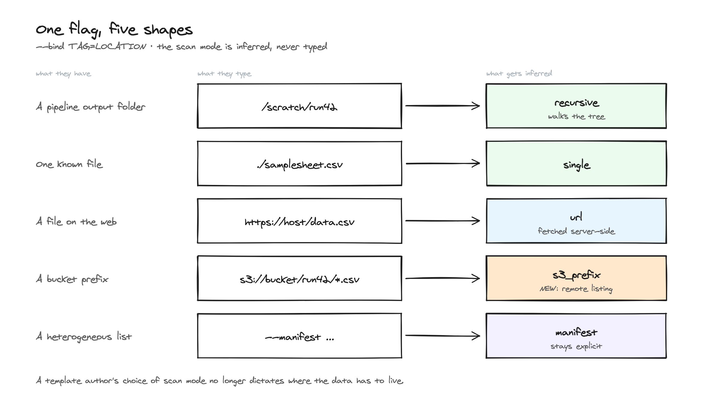
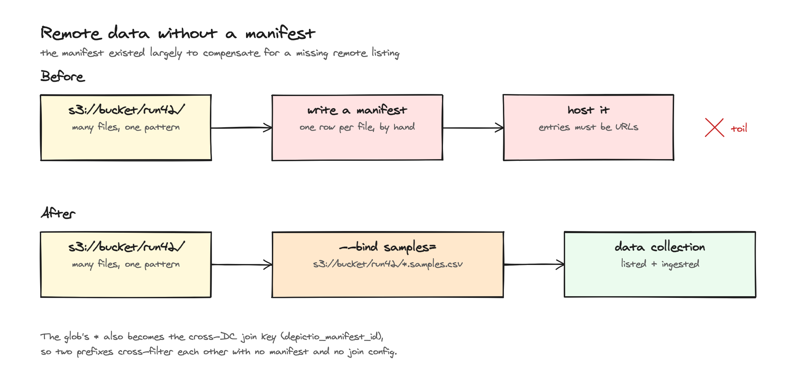
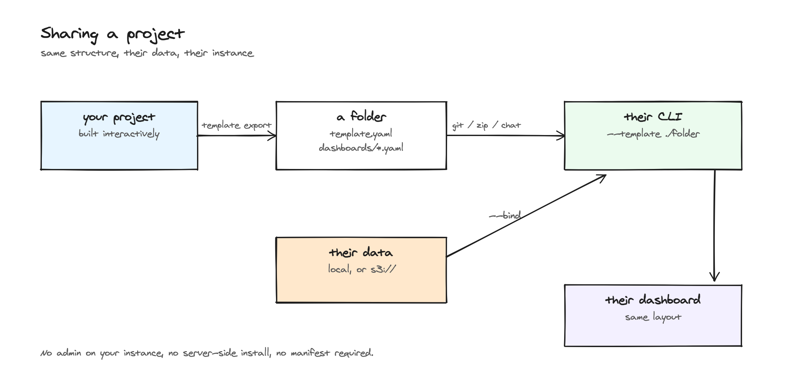

# <span style="color: #45B8AC;">:material-cloud-download-outline:</span> Remote data and manifests

A data collection does not have to live on the machine running the CLI. Three
scan modes fetch data from where it already is: one known file at a URL, every
object under an S3 prefix, or an explicit list of files called a **Data
Manifest**. The server does the fetching, so a project can also be created
from the web UI with no CLI installed at all.

Everything downstream is unchanged. Remote files are materialised to Delta
Lake on the instance's own S3 exactly like scanned local files, and
dashboards, links and joins do not know the difference.

---

## Which mode to use

| You have | Mode | How you say so |
|----------|------|----------------|
| One file on the web, or one object in a bucket | `url` | `--bind tag=https://host/data.csv`, or `scan.mode: url` |
| Many files under one bucket prefix, one naming pattern | `s3_prefix` | `--bind tag=s3://bucket/run42/*.csv`, or `scan.mode: s3_prefix` |
| A heterogeneous list: files of several types, scattered locations, no listing | `manifest` | `--manifest <url or path>` with a manifest-driven template, or `scan.mode: manifest` |

A local directory, glob or file keeps the existing `recursive` and `single`
modes. The [`--bind`](#bind-a-data-collection-to-a-location) flag picks the
mode for you from the shape of the location.

!!! note "S3 prefixes only"
    Plain HTTPS exposes no listing operation, so an `https://` prefix cannot be
    enumerated. Use `url` for one known file, or a manifest to list several
    files explicitly.

[](../../images/guides/remote-data/data_binding_matrix.png){target=_blank}

---

## Bind a data collection to a location { #bind-a-data-collection-to-a-location }

`depictio-cli run --bind TAG=LOCATION` points one data collection at where its
data actually is. It is repeatable, and the scan mode is inferred from the
location, never typed:

| Location shape | Inferred mode | Notes |
|----------------|---------------|-------|
| `/scratch/run42` (a directory) | `recursive` | keeps the pattern the template already declares for that collection |
| `/scratch/run42/*.csv` (a local glob) | `recursive` | the glob becomes the pattern |
| `./samplesheet.csv` (a local file) | `single` | |
| `https://host/data.csv`, or a bare `s3://bucket/key.csv` | `url` | |
| `s3://bucket/run42/*.csv`, or `s3://bucket/run42/` | `s3_prefix` | the glob is applied to the key relative to the prefix |

`--bind` satisfies the same requirement as `--data-root` or `--manifest`, so a
template can be run with neither. A template variable you did not supply is
stubbed during resolution on the bet that a binding replaces whatever used it;
if a placeholder survives, the run fails naming the variable rather than
sending a literal placeholder to the server.

```bash
# A template that expects a local tree, run against a bucket instead
depictio-cli run --template my-lab/rnaseq-qc/1 \
  --bind samples=s3://my-bucket/run42/*.samples.csv \
  --bind metadata=https://data.example.org/run42/metadata.tsv
```

Two rules keep this predictable:

- A tag that matches no data collection is an error, listing the tags that
  exist. A silently ignored `--bind` would leave the collection pointing at the
  template's original location.
- Local bindings inside one workflow must share a directory, because the walk
  root is a per-workflow setting.

`--bind` also works with `--project-config-path`: the YAML on disk is left
untouched and the bindings are applied in memory for that run.

Manifests stay explicit. A local `.csv` is data far more often than it is a
manifest, so `--bind` never guesses that from a filename; use `--manifest`.

### Cross-filtering without a manifest

When an `s3_prefix` binding uses a glob with a single `*`, the part the `*`
matched becomes the entity id of each file (`sample_A.samples.csv` yields
`sample_A`). That id is stored on the file record and read back as the
`depictio_manifest_id` column, so two collections bound to two prefixes
cross-filter each other with no manifest and no join configuration. Globs with
several wildcards get no id, since there is no defensible answer as to which
one is the key.

[](../../images/guides/remote-data/data_binding_no_manifest.png){target=_blank}

---

## The Data Manifest contract

A manifest is a flat index of remote files: one entry per file, keyed by an
entity or sample `id` and a `type` whose value is a **data collection tag**.
That single convention is what lets a manifest map onto a project without any
further configuration.

| Field | Required | Meaning |
|-------|----------|---------|
| `id` | yes | Canonical entity or sample id. Becomes the `depictio_manifest_id` column. |
| `type` | yes | The data collection tag this file belongs to. |
| `url` | yes | Absolute `s3://` or `https://` URL. `http://` only when the instance allows it. |
| `run` | no | Run grouping. Becomes `depictio_run_id`; `remote` when absent. |

The schema is closed. In a CSV, any other column is folded into an `extra`
field; in JSON, `extra` is the only open field. A `version` field (currently
`"1"`) gates schema evolution.

=== "CSV"

    ```csv
    id,type,url,run
    S1,counts,https://data.example.org/run42/S1.counts.parquet,run42
    S1,stats,https://data.example.org/run42/S1.stats.tsv,run42
    S2,counts,https://data.example.org/run42/S2.counts.parquet,run42
    S2,stats,https://data.example.org/run42/S2.stats.tsv,run42
    ```

=== "JSON"

    ```json
    {
      "version": "1",
      "entries": [
        {"id": "S1", "type": "counts", "url": "https://data.example.org/run42/S1.counts.parquet", "run": "run42"},
        {"id": "S1", "type": "stats",  "url": "https://data.example.org/run42/S1.stats.tsv",      "run": "run42"}
      ]
    }
    ```

    A bare JSON list of entries is accepted too.

Non-canonical column names are remapped with the `id_field`, `url_field`,
`type_field` and `run_field` scan parameters (see the
[reference](reference.md)), so an existing index does not have to be rewritten.

One entry is one file. Several entries of the same `type` are aggregated into
one data collection, exactly like several scanned files today.

### Writing a manifest from a sample table

An nf-core samplesheet is one pivot away from a manifest: both map an entity
id to its files, but a samplesheet holds one *column* per file role while a
manifest holds one *row* per file with the role in `type`.

```bash
depictio-cli manifest from-table samplesheet.csv \
  --id-col sample \
  --base-url s3://my-bucket/run42 \
  -o manifest.json
```

The id column and the file columns are auto-detected when not named
(`--id-col`, `--file-cols`), `--run-col` fills `run`, and `--base-url`
prefixes relative paths. The last one is required when the table holds local
paths, because a manifest entry must be a remote URL. Each file column becomes
one `type`, so the output tells you which data collection tags the manifest
expects.

---

## Creating a project from a manifest

=== "Web UI"

    **Projects**, then **Create project**, then the **From Manifest** tab.
    Paste the manifest URL, pick a manifest-capable template, optionally name
    the project, then step to **Preview**. The preview is a dry run: it shows
    how many entries each data collection will receive, which manifest types
    no collection consumes, which optional collections were pruned because the
    manifest has no rows of their type, and which dashboards will be imported.
    **Create** ingests the data and opens the first dashboard. See the
    [Web UI guide](../guides/web_ui.md#creating-a-project-from-a-manifest).

=== "CLI"

    ```bash
    depictio-cli run --template generic/manifest-tables/1 \
      --manifest https://data.example.org/run42/manifest.json
    ```

    `--manifest` accepts a URL or a local file path, and sets the template's
    `MANIFEST_URL` variable. It replaces `--data-root`; the two are mutually
    exclusive.

=== "API"

    ```bash
    curl -X POST "$API/depictio/api/v1/projects/from_manifest" \
      -H "Authorization: Bearer $DEPICTIO_TOKEN" \
      -H "Content-Type: application/json" \
      -d '{"manifest_url": "https://data.example.org/run42/manifest.json",
           "template_id": "generic/manifest-tables/1",
           "dry_run": true}'
    ```

    Body fields: `manifest_url`, `template_id`, optional `project_name`,
    `variables` (extra template variables) and `dry_run`. The report carries
    the project id, the per-collection ingestion results, the imported
    dashboards, `unmatched_manifest_types` and `pruned_optional_dcs`.

To attach a manifest to a project that already exists, `POST
/projects/ingest_manifest` with `project_id` and `manifest_url` maps the
manifest's `type` values onto the project's data collection tags, switches
each matched collection to manifest mode and ingests it. Its report lists the
matched collections, the manifest types no tag matched and the tags the
manifest says nothing about, which are left untouched.

---

## Refreshing manifest-backed collections

When the files behind a manifest change, or entries are added or removed,
refresh the project rather than re-creating it. The refresh re-reads the
stored manifest and re-ingests every manifest-backed collection.

```bash
# $DEPICTIO_TOKEN: user.token.access_token from your CLI config
curl -X POST "$API/depictio/api/v1/projects/refresh_manifest" \
  -H "Authorization: Bearer $DEPICTIO_TOKEN" \
  -H "Content-Type: application/json" \
  -d '{"project_id": "<project_id>", "dry_run": false, "async_run": false}'
```

Optional body fields:

- `data_collection_tag` restricts the refresh to one collection.
- `dry_run: true` reports the per-collection entry counts without touching any
  data.
- `async_run: true` fans the per-collection re-ingestion out to Celery workers
  and returns a `run_id` to poll:

```bash
curl "$API/depictio/api/v1/projects/refresh_manifest/<run_id>" \
  -H "Authorization: Bearer $DEPICTIO_TOKEN"
```

Both calls return the same report: `refreshed[]` with one row per collection
(`data_collection_tag`, `entries`, `status`, `message`) plus a top-level
`success`. Statuses are `ingested` / `failed` for a synchronous refresh and
`dispatched` / `running` / `ingested` / `failed` while polling. This is
overwrite-with-report: dropping a whole `type` from the manifest marks that
collection `failed` instead of silently emptying it.

!!! info "No refresh button yet"
    The endpoint and the CLI are the only refresh paths for now. A refresh
    action on the project page is a follow-up.

---

## Private buckets

Remote reads use the instance's own S3 credentials by default. For a bucket
those cannot read, a project owner attaches **per-project storage
credentials** in the **Storage** panel of the project page (endpoint URL,
bucket, region, access key id, secret access key), then **Test connection**.
The secret is encrypted at rest and never shown again; responses only say
whether one is stored.

These are read credentials only. Delta tables are still written to the
instance's own S3. The endpoint URL goes through the same host gating as
remote data URLs, so a private-network endpoint needs to be allowlisted by
the administrator. See [Security](../../features/security.md#remote-data-sources)
and the [environment reference](../../installation/env-reference.md#remote-data-sources).

---

## Sharing a project

A project built interactively can be frozen into a template bundle and run by
someone else, on their own instance, against their own data.

1. **Export.** From the project page, **Export as template**, or:

    ```bash
    depictio-cli template export <project_id> \
      --template-id my-lab/rnaseq-qc/1 \
      --config ~/.depictio/admin_config.yaml \
      -o ./templates
    ```

    The bundle is a directory `my-lab/rnaseq-qc/1/` holding `template.yaml`
    and `dashboards/*.yaml`. Runtime state is stripped, stored manifest URLs
    become `{MANIFEST_URL}`, a local data root becomes `{DATA_ROOT}`, and
    storage credentials are never included.

2. **Send the folder** by git, zip or chat.

3. **Run it** with the path form of `--template` and bind each data collection
   to the recipient's data:

    ```bash
    depictio-cli run --template ./templates/my-lab/rnaseq-qc/1 \
      --bind samples=s3://their-bucket/run7/*.samples.csv \
      --bind metadata=/data/run7/metadata.tsv
    ```

No admin on the source instance, no server-side install, no manifest required.
The [Templates](templates.md#export-a-project-as-a-template) page has the
full export reference.

[](../../images/guides/remote-data/data_binding_sharing.png){target=_blank}

---

## What the server checks before fetching

Every user-supplied URL the server fetches passes through one gateway: scheme
allowlist, DNS resolution with rejection of private, loopback, link-local and
reserved ranges, re-validation on every redirect hop, and a streamed download
with a size cap and a timeout. Administrators can pin the set of hosts with
`DEPICTIO_REMOTE_URL_ALLOWLIST`, which is exclusive while set. The details,
including the residual risk the gateway does not cover, are on the
[Security](../../features/security.md#remote-data-sources) page.

---

## See Also

- [YAML reference](reference.md): the `url`, `s3_prefix` and `manifest` scan parameters
- [YAML examples](yaml-examples.md): a remote and a manifest example
- [Templates](templates.md): instantiating with `--manifest` or `--bind`, exporting a project
- [CLI usage](../../depictio-cli/usage.md): `run --bind`, `manifest from-table`, `template export`
- [Data model](../../features/data-model.md#remote-files): remote `File` records and the join key
- [Contributing a template](../../developer/contributing-templates.md#manifest-driven-templates): authoring a manifest-mode template
