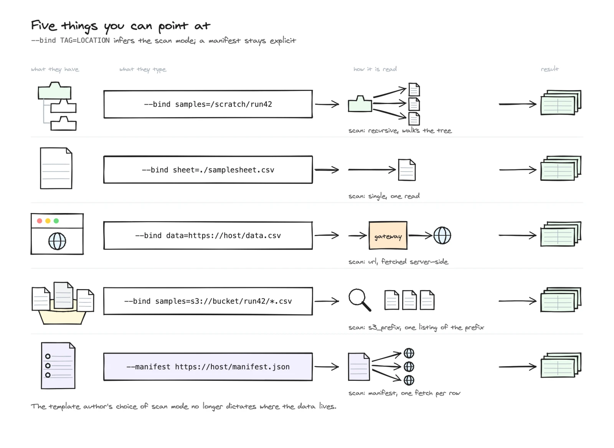
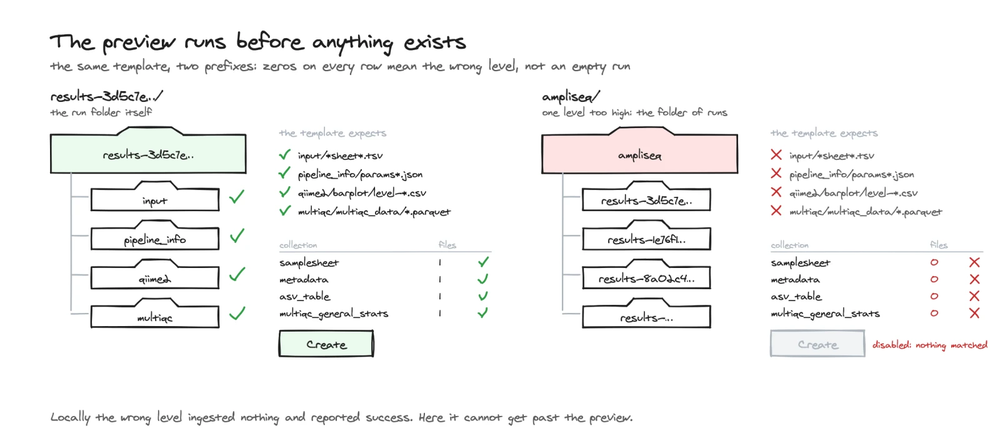
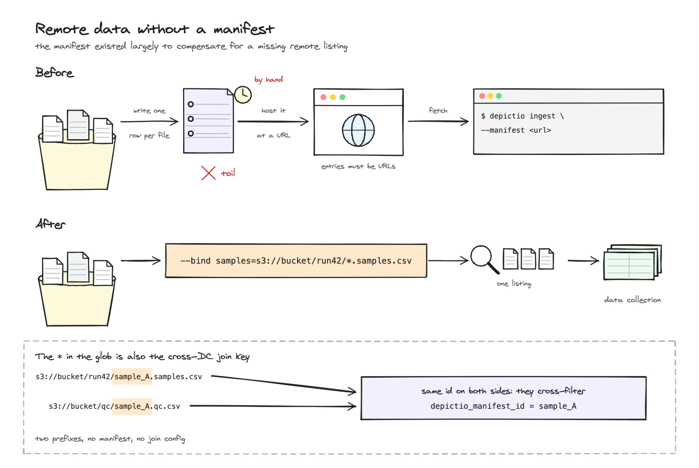
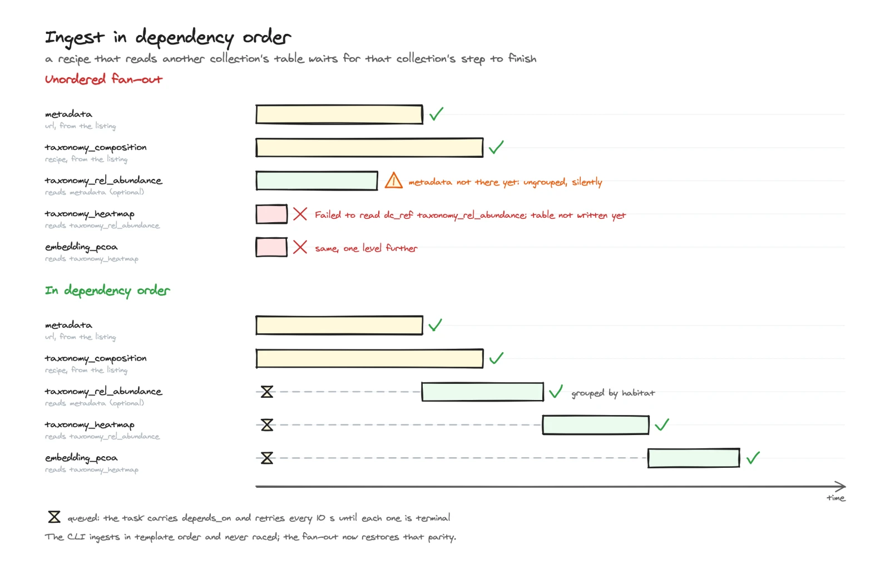
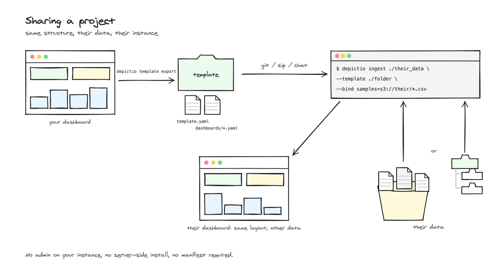

# <span style="color: #45B8AC;">:material-cloud-download-outline:</span> Remote data and manifests

A project's data does not have to be on the machine that ingests it. A whole
pipeline run can be read from an `s3://` prefix, and a single data collection
can point at one file at a URL, at every object under an S3 prefix, or at an
explicit list of files called a **data manifest**. The web UI creates a project
from a run folder or from a manifest with no CLI involved.

Everything downstream is unchanged. Remote files are materialised to Delta Lake
on the instance's own S3 exactly like local files, and dashboards, links and
joins do not know the difference.

---

## Which way to use { #which-way-to-use }

| You have | CLI | Web UI |
|----------|-----|--------|
| The results folder of a pipeline run, in a bucket | [`depictio ingest s3://bucket/run42`](#a-run-folder-on-s3) | [**From a run folder**](#from-a-run-folder) |
| The results folder of a pipeline run, on this computer | [`depictio ingest /data/run42`](../../depictio-cli/usage.md#ingest-command) | [**From a run folder**](#from-a-run-folder), on a `depictio local` server |
| One file on the web or in a bucket | [`--bind tag=https://host/data.csv`](#bind-a-data-collection-to-a-location) (scan mode `url`) | **Create Data Collection**, **Remote URL**, see the [Web UI guide](../guides/web_ui.md#project-detail-projectsid) |
| Many files under one bucket prefix, one naming pattern | [`--bind tag=s3://bucket/run42/*.csv`](#bind-a-data-collection-to-a-location) (scan mode `s3_prefix`) | |
| A list of files of several types, in scattered places | [`--manifest <url or path>`](#creating-a-project-from-a-manifest) (scan mode `manifest`) | [**From Manifest**](#creating-a-project-from-a-manifest) |

A local directory, glob or file keeps the `recursive` and `single` scan modes.
The scan modes and their parameters are in the
[YAML reference](reference.md#remote-scan-modes).

!!! note "Only S3 prefixes can be listed"
    Plain HTTPS has no listing operation, so an `https://` prefix cannot be
    enumerated. Use `url` for one known file, or a manifest to list several.

[](../../images/guides/remote-data/data_binding_matrix.webp){target=_blank}

---

## A run folder on S3 { #a-run-folder-on-s3 }

`depictio ingest` takes an `s3://` prefix as `DATA_DIR`. The listing of the
objects under the prefix stands in for the folder: every question template
resolution asks a directory (does this file exist, which files match this
pattern, which runs are under here) is answered from that one listing.

```bash
# The template is detected from the run's own records, as for a local folder
depictio ingest s3://my-bucket/ampliseq/run42

# Check what each data collection finds there first
depictio ingest s3://my-bucket/ampliseq/run42 --template nf-core/ampliseq/latest --dry-run
```

No template is modified for this. Each data collection is pointed at the prefix
as follows:

| Template declares | Under an `s3://` data root |
|-------------------|----------------------------|
| `recursive` scan | `s3_prefix` scan of the prefix, with the template's own regex (`pattern_syntax: regex`) |
| `single` scan | `url` scan of the file under the prefix |
| Recipe collection (`source: transformed`) | Its sources are read through the listing |
| `url`, `s3_prefix` or `manifest` scan | Unchanged |
| `indexed_file` collection | Not supported yet: a required one stops the run, an optional one is skipped with a warning. `--bind` it to a local folder |

- A `sequencing-runs` workflow keeps its runs: each first-level folder under
  the prefix that matches `runs_regex` becomes a run, and its files carry its
  name as `depictio_run_id`.
- A MultiQC report under the prefix is downloaded to a temporary copy, parsed,
  and removed. The reports of one data collection share one download budget,
  `DEPICTIO_REMOTE_MAX_DOWNLOAD_BYTES`; a report that does not fit is reported
  and skipped, and the others are processed.
- A template variable may point outside the prefix: a URL is read as it is,
  and on the CLI a local path such as `--var METADATA_FILE=/data/meta.tsv` is
  read from this computer.
- The listing stops at 100,000 objects. Past that, the preview warns that its
  counts are a lower bound.

Which buckets can be read, and with which credentials, is described under
[Reading S3 buckets](#reading-s3-buckets).

### Preview before ingesting { #preview-before-ingesting }

With a template and `DATA_DIR`, local or `s3://`, `--dry-run` resolves the
template against the folder and prints what each data collection finds there,
before anything is created:

| Column | Content |
|--------|---------|
| Data collection | The tag |
| Kind | `scan` (it reads files) or `recipe` (a recipe builds it) |
| Mode | The scan mode, `-` for a recipe |
| Files | Files matched, or inputs found for a recipe |
| Status | `ok`, `empty`, `missing` or `pruned` |

| Status | Meaning |
|--------|---------|
| `ok` | It will ingest |
| `empty` | Its scan matched nothing |
| `missing` | A source it needs is not there; the sources are listed under the table, relative to the data root |
| `pruned` | Dropped, because an optional source is absent |

A summary line follows, such as `20 data collection(s) will ingest, 0 empty, 3
missing sources`, with the resolved template variables above the table.

A folder one level too high or too low reads as zeros on every row, each naming
what it looked for. The [web UI](#from-a-run-folder) shows the same preview and
does not let such a project be created.

[](../../images/guides/remote-data/from_run_wrong_level.webp){target=_blank}

---

## Bind a data collection to a location { #bind-a-data-collection-to-a-location }

`depictio ingest --bind TAG=LOCATION` points one data collection at where its
data is. It is repeatable, and the scan mode is inferred from the location,
never typed:

| Location shape | Inferred mode | Notes |
|----------------|---------------|-------|
| `/scratch/run42` (a directory) | `recursive` | Keeps the pattern the template already declares for that collection |
| `/scratch/run42/*.csv` (a local glob) | `recursive` | The glob becomes the pattern |
| `./samplesheet.csv` (a local file) | `single` | |
| `https://host/data.csv`, or a bare `s3://bucket/key.csv` | `url` | |
| `s3://bucket/run42/*.csv`, or `s3://bucket/run42/` | `s3_prefix` | The glob is applied to the key relative to the prefix |

With `--template`, `--bind` stands in for `DATA_DIR` or `--manifest`, so a
template can be run with neither. A template variable you did not supply is
left unresolved on the bet that a binding replaces whatever used it; if one is
still needed, the run fails naming it.

```bash
# A template that expects a local tree, run against a bucket instead
depictio ingest --template my-lab/rnaseq-qc/1 \
  --bind samples=s3://my-bucket/run42/*.samples.csv \
  --bind metadata=https://data.example.org/run42/metadata.tsv
```

- A tag that matches no data collection is an error that lists the tags that
  exist.
- The local bindings of one workflow must share a directory, since the folder a
  workflow walks is one per workflow. For the same reason, a local binding is
  refused while another `recursive` collection of that workflow, not bound,
  walks a different folder: bind it to the same folder too.
- With `--project-config-path`, the file on disk is left untouched: the bindings
  apply to that run only.
- With `--dry-run`, the [preview](#preview-before-ingesting) shows the
  configuration with the bindings applied.

Manifests stay explicit. A local `.csv` is data far more often than it is a
manifest, so `--bind` never guesses one from a file name: use `--manifest`.

### Cross-filtering without a manifest

When an `s3_prefix` binding uses a glob with a single `*`, the part the `*`
matched becomes the entity id of each file (`sample_A.samples.csv` yields
`sample_A`). That id is read back as the `depictio_manifest_id` column, so two
collections bound to two prefixes cross-filter each other with no manifest and
no join configuration. A glob with several wildcards gives no id, since none of
them is clearly the key.

[](../../images/guides/remote-data/data_binding_no_manifest.webp){target=_blank}

---

## The data manifest contract { #the-data-manifest-contract }

A manifest is a flat index of remote files: one entry per file, keyed by an
entity or sample `id` and a `type` whose value is a **data collection tag**.
That one convention maps a manifest onto a project with no further
configuration.

| Field | Required | Meaning |
|-------|----------|---------|
| `id` | yes | Entity or sample id. Becomes the `depictio_manifest_id` column |
| `type` | yes | The tag of the data collection this file belongs to |
| `url` | yes | Absolute `s3://` or `https://` URL. `http://` only when the instance sets `DEPICTIO_REMOTE_ALLOW_HTTP` |
| `run` | no | Run grouping. Becomes `depictio_run_id`; `remote` when absent |

The schema is closed. In a CSV, any other column is folded into an `extra`
field; in JSON, `extra` is the only open field. A `version` field (`"1"`) gates
schema evolution. A file listed twice (same `id`, `type` and `url`) is refused,
since it would put its rows in the table twice.

=== "CSV"

    ```csv
    id,type,url,run
    S1,counts,https://data.example.org/run42/S1.counts.parquet,run42
    S1,stats,https://data.example.org/run42/S1.stats.tsv,run42
    S2,counts,https://data.example.org/run42/S2.counts.parquet,run42
    S2,stats,https://data.example.org/run42/S2.stats.tsv,run42
    ```

=== "JSON"

    ```json
    {
      "version": "1",
      "entries": [
        {"id": "S1", "type": "counts", "url": "https://data.example.org/run42/S1.counts.parquet", "run": "run42"},
        {"id": "S1", "type": "stats",  "url": "https://data.example.org/run42/S1.stats.tsv",      "run": "run42"}
      ]
    }
    ```

    A bare JSON list of entries is accepted too.

Spaces around CSV column names and a UTF-8 byte order mark are ignored. Other
column names are remapped with the `id_field`, `url_field`, `type_field` and
`run_field` scan parameters (see the [reference](reference.md#manifest-the-entries-of-a-data-manifest)),
so an existing index does not have to be rewritten.

One entry is one file. Several entries of the same `type` are aggregated into
one data collection, like several scanned files.

### Writing a manifest from a sample table

An nf-core samplesheet is one pivot away from a manifest: both map an entity id
to its files, but a samplesheet holds one *column* per file role, a manifest
one *row* per file with the role in `type`.

```bash
depictio manifest from-table samplesheet.csv \
  --id-col sample \
  --base-url s3://my-bucket/run42 \
  -o manifest.json
```

Each file column becomes one `type`, so the output tells you which data
collection tags the manifest expects. All options:
[`manifest from-table`](../../depictio-cli/usage.md#manifest-from-table).

---

## Creating a project in the web UI { #creating-a-project-in-the-web-ui }

**Projects**, **+ New Project**: the dialog has four tabs, **Create New**,
**Import**, **From Manifest** and **From a run folder**. The last two read the
data on the server, with the same three steps: **Source**, **Preview** (a dry
run, nothing is created) and **Create**.

### From a run folder { #from-a-run-folder }

Point at the results folder of one pipeline run; Depictio recognises the
pipeline from the run's Nextflow or Snakemake records, picks the matching
template and shows what each data collection will get before anything is
created.

| Run folder | Read when |
|------------|-----------|
| `s3://bucket/prefix` | The server may read the bucket (see [Reading S3 buckets](#reading-s3-buckets)), or its details are given under [Private bucket](#private-bucket-at-creation) |
| `/path/to/run` or `~/path/to/run` | Only on a [`depictio local`](../../installation/local.md) server, below your home folder or a folder added with [`depictio local up --data-root-allow`](../../installation/local.md#up-options), for an administrator using the web UI on that computer. At most 100,000 files |

Everything the project reads must be in the run folder: a template variable
that points elsewhere, even a URL, is refused. The CLI has no such limit.

**Source.** Type or paste the **Run folder**, or **Browse** to it. As soon as
the folder is read, a card compares the run with the template Depictio would
read it with:

| Row | **This run** | **Depictio template** |
|-----|--------------|-----------------------|
| **Pipeline** | What the run's records name | The template's pipeline |
| **Version** | The pipeline version that made the run | The version the template was written for |
| **Engine** | The workflow engine, such as Nextflow | The template's engine |

A verdict follows: **Exact match**, **Closest available version** (no template
exists for the run's version, the nearest one is used), **Different version**,
**Different pipeline** or **No matching template**. **What this template finds
here** unfolds the preview of every data collection from the card.

| Field | Content |
|-------|---------|
| **Pipeline** | Filled in from the folder, marked **Detected**. Empty: Depictio recognises it. Change it if the detection is wrong |
| **Template version** | Each version of the template, newest first, marked **Matches this run**, **Closest to this run** or **Newest** |
| **Project Name (Optional)** | Defaults to a name derived from the template |
| **Advanced: template settings (N)** | The template's variables, folded. Depictio works them out from the run folder; give one a value only to override it |

The template list holds every template that reads a data root, grouped by
source (nf-core first). A folder that cannot be read on its own, in a bucket
that is neither public nor one the server is set up to read, opens the
[**Private bucket**](#private-bucket-at-creation) section.

**Preview.** A summary card counts the collections that are ready (*3 of 23
collections ready*), then lists them in three groups:

| Group | Meaning |
|-------|---------|
| **Not found** | Found nothing in this folder. The project can still be created: they stay empty until their files exist |
| **Ready to ingest** | Found in the run folder and ingested when the project is created |
| **Optional, not found** | The template can do without them; they are skipped |

Each row shows its location relative to the run folder, what it looked for and
found (or, for a table built by a recipe, the recipe and what each of its
inputs found), and a badge: **Ready**, **Not found**, **No matching files**,
**Optional, not found** or **Left out** (a template setting turns it off for
this run). **Template settings** lists what the template resolved for this
folder.

When no data collection matched anything, the preview says **Nothing to ingest
in this folder** and the project cannot be created: a run folder set one level
too high, or too low, is the usual cause.

**Create.** **Create Project** inserts the project and imports the template's
dashboards; the data collections are ingested in the background. The **Project
created** dialog follows the ingestion collection by collection (statuses as in
[Refreshing the data](#refreshing-the-data)), with **Stay on projects** and
**Open dashboard**. Closing it only stops watching: the workers keep going, and
the project's **Ingestion** tab shows the outcome.

A collection the preview did not find is not sent to a worker. The dialog shows
it **Failed** when the template needs it, and **Skipped** when it is optional or
only reads optional collections that are absent. A collection built from
another collection's table waits for that table, checking every 10 seconds for
up to 30 minutes, and each collection has 30 minutes to ingest.

[](../../images/guides/remote-data/from_run_dependency_order.webp){target=_blank}

#### The folder browser { #the-folder-browser }

**Browse** opens **Choose the run folder**. It is offered when the server lets
the web UI read folders on this computer or list S3 locations, or once a
private bucket's details are given.

- The tree has a **This computer** group (under `depictio local`) and an **S3**
  group (the locations the server may list, and the private bucket whose
  details were given). Folders that look like runs carry a **Run folder** badge.
  **Recent** keeps the last five folders chosen per source.
- The path bar takes a typed path and suggests the folders below it.
- Selecting a folder shows **The run and its template** (the same comparison and
  preview as the Source step), **Why this is a run folder** (its
  `pipeline_info` and MultiQC records, with a preview of the run's engine,
  parameters, tools and report files), **Run folders below this one** with
  **Find run folders here**, and its **Contents**.
- **Select this folder** fills in the run folder. A folder that does not look
  like a run can still be selected.

A folder is a run folder when it holds a `pipeline_info/` folder, or a
`multiqc/` folder with MultiQC output in it or one level down. **Find run
folders here** looks through at most six levels and 5,000 folders below a local
folder, or 20,000 objects below an S3 prefix, stops at 100 run folders, and
never looks inside a run folder or a Nextflow `work/` folder. Hidden folders (a
name starting with `.`, `__pycache__`, `node_modules`, `__MACOSX`) are not
listed.

#### Private bucket { #private-bucket-at-creation }

For an `s3://` run folder, the switch **This bucket needs credentials** opens
the **Private bucket** section; it opens by itself when the server is refused
access to the bucket.

| Field | Content |
|-------|---------|
| **Endpoint** | The address of the storage service. Empty for Amazon S3 |
| **Region** | Optional: **Test connection** fills it in |
| **Access key** | Required |
| **Secret** | Required |

The details are used for that bucket only, for every read of the creation
(detection, browsing, preview), and become the new project's
[storage settings](#project-storage-settings). They are not kept anywhere else.

#### From a script { #from-a-run-folder-api }

`POST /depictio/api/v1/projects/from_run` runs the same three steps:

```bash
# $DEPICTIO_TOKEN: user.token.access_token from your CLI configuration
curl -X POST "$API/depictio/api/v1/projects/from_run" \
  -H "Authorization: Bearer $DEPICTIO_TOKEN" \
  -H "Content-Type: application/json" \
  -d '{"data_root": "s3://my-bucket/ampliseq/run42", "dry_run": true}'
```

| Field | Default | Content |
|-------|---------|---------|
| `data_root` | required | The run folder |
| `template_id` | detected | The template, such as `nf-core/ampliseq/2.16.0` |
| `project_name` | derived from the template | |
| `variables` | `{}` | Template variables, as `--var` on the CLI |
| `dry_run` | `false` | Preview only: nothing is created |
| `storage` | | A private bucket's `endpoint_url`, `region`, `access_key_id` and `secret_access_key`, for an `s3://` run folder |

The report names the template and how it was chosen
(`detected_template.match`: `exact` or `closest`), lists each data collection
as the preview does, the imported dashboards, and a `run_id`: poll
`GET /depictio/api/v1/projects/refresh_manifest/{run_id}` for the ingestion,
as for a [refresh](#refreshing-the-data). A refusal answers with `detail` and a
`code`, such as `template_not_detected`, `data_root_unsupported`,
`local_folders_off`, `local_run_too_large`, or one of the
[S3 codes](#s3-errors). A project name already taken answers 409.

### From a manifest { #creating-a-project-from-a-manifest }

=== "Web UI"

    The **From Manifest** tab:

    1. **Source**: the **Manifest URL**, a **Template** among those that read a
       manifest, **Project Name (Optional)** and the template's other variables.
    2. **Preview**: a dry run. It shows how many entries each data collection
       receives, the manifest types no collection reads, the optional
       collections left out because the manifest has no rows of their type,
       and the dashboards to import.
    3. **Create**: the server fetches and ingests the data, imports the
       dashboards and opens the first one. When a collection or a dashboard
       failed, the manifest has types no collection reads, or optional
       collections were left out, **Project created with notes** lists them
       first, with **Stay on projects** and **Open dashboard**.

=== "CLI"

    ```bash
    depictio ingest --template generic/manifest-tables/1 \
      --manifest https://data.example.org/run42/manifest.json
    ```

    `--manifest` takes an `https://` URL or a local file, and sets the
    template's `MANIFEST_URL` variable. It replaces `DATA_DIR`.

=== "API"

    ```bash
    curl -X POST "$API/depictio/api/v1/projects/from_manifest" \
      -H "Authorization: Bearer $DEPICTIO_TOKEN" \
      -H "Content-Type: application/json" \
      -d '{"manifest_url": "https://data.example.org/run42/manifest.json",
           "template_id": "generic/manifest-tables/1",
           "dry_run": true}'
    ```

    Body fields: `manifest_url`, `template_id`, optional `project_name`,
    `variables` and `dry_run`. The report carries the project id, the
    ingestion result of each collection, the imported dashboards,
    `unmatched_manifest_types` and `pruned_optional_dcs`.

The manifest is fetched through the [gateway](#what-the-server-checks-before-fetching),
up to 50 MiB, and every entry URL is checked before any file is fetched. An
`s3://` manifest is not read yet, on the CLI or the server: serve it over
`https://`.

To add a manifest to a project that exists, `POST /projects/ingest_manifest`
with `project_id` and `manifest_url` maps the manifest's `type` values onto the
project's data collection tags, switches each matched collection to manifest
mode and ingests it. Its report lists the matched collections, the manifest
types no tag matched and the tags the manifest says nothing about, which are
left untouched. `dry_run` reports the mapping only.

---

## Refreshing the data { #refreshing-the-data }

When the files behind a project change, refresh it in place rather than
creating it again. On the project page, **Project settings**, then **Data
refresh**:

- **Collections** lists the collections whose source is a manifest, a URL or a
  bucket prefix. Leave **All refreshable collections**, or pick one.
- **Refresh now** re-reads each collection from its source and rebuilds its
  table. A manifest is fetched again and the entries it lists now are used.
- The status of each collection is followed until the refresh ends, for 30
  minutes at most; closing the dialog does not stop the workers, and the
  project's **Ingestion** tab shows the outcome. **Reload project** shows the
  new data.

Project owners and editors can refresh; on a public instance, administrators
only.

What the server can read again:

| Source | Refreshed by the server |
|--------|-------------------------|
| A manifest, an `https://` or `s3://` URL, an S3 prefix | Yes |
| A recipe collection in a project made from an `s3://` run folder | Yes, with **All refreshable collections** |
| A local folder or file | No: refresh it with the CLI, [`depictio ingest … --update-config`](../../depictio-cli/usage.md#refreshing-a-project). On a `depictio local` server, the API also refreshes one below an allowed folder |
| A manifest read from a local file | No: the server fetches a manifest by URL only |

Before anything is re-ingested, a pre-flight protects the tables that exist:

- A manifest collection whose type the manifest no longer lists is reported
  failed and left as it is, instead of being emptied.
- A project made from a run folder is checked against that folder again, as at
  creation: a required collection whose source is gone fails, an optional one
  is skipped, and neither is touched.

| Status | API value | Meaning |
|--------|-----------|---------|
| **Planned** | `planned` | Dry run: would be refreshed |
| **Queued** | `dispatched` | Handed to a worker |
| **Running** | `running` | Being ingested |
| **Ingested** | `ingested` | Table rebuilt |
| **Failed** | `failed` | Not ingested; **Details** says why |
| **Skipped** | `skipped` | Optional and absent, or only reads optional collections that are absent |

The same refresh, from a script:

```bash
# $DEPICTIO_TOKEN: user.token.access_token from your CLI configuration
curl -X POST "$API/depictio/api/v1/projects/refresh_manifest" \
  -H "Authorization: Bearer $DEPICTIO_TOKEN" \
  -H "Content-Type: application/json" \
  -d '{"project_id": "<project_id>", "async_run": true}'

curl "$API/depictio/api/v1/projects/refresh_manifest/<run_id>" \
  -H "Authorization: Bearer $DEPICTIO_TOKEN"
```

| Field | Default | Content |
|-------|---------|---------|
| `project_id` | required | |
| `data_collection_tag` | every refreshable collection | One collection only |
| `dry_run` | `false` | Report what would be refreshed, with each manifest collection's entry count |
| `async_run` | `false` | Hand each collection to a worker and return a `run_id` to poll; otherwise the call returns when every collection is done |

Both calls return `refreshed`, one row per collection (`data_collection_tag`,
`entries`, `status`, `message`), and `success`. The endpoint keeps its name
from when only manifests could be refreshed.

---

## Reading S3 buckets { #reading-s3-buckets }

An `s3://` location a user gives, whether a run folder, a `url` or `s3_prefix`
scan or a manifest entry, is matched against the configuration before any
request is sent, so naming a bucket never reveals whether it exists. The server
uses the first rule that matches:

| Rule | Location | Read with |
|------|----------|-----------|
| 1 | In the bucket that holds the instance's own data | Refused |
| 2 | In the bucket of the project's [storage settings](#project-storage-settings), when they hold an access key | The project's keys |
| 3 | Listed in `DEPICTIO_REMOTE_PUBLIC_S3_BUCKETS` | No credentials, on Amazon S3 |
| 4 | Any other location, when the project has storage settings | Those settings only: their endpoint, and their keys if they hold any |
| 5 | Listed in `DEPICTIO_REMOTE_CREDENTIALED_S3_BUCKETS` | The server's own credentials: the AWS default chain (environment, IAM role, web identity) |
| 6 | Anything else | Refused |

- The instance's own S3 keys are never used for a location a user gives.
- Each list takes comma-separated `bucket` or `bucket/prefix` entries. Anyone
  on the instance can read what the credentialed list names: list only data
  every user may see. See the
  [environment reference](../../installation/env-reference.md#remote-data-sources).
- While a project is created from a private bucket, the details given under
  [Private bucket](#private-bucket-at-creation) replace rules 2 to 6: the run
  folder is read with them or not at all.
- **Browse** lists the locations of both lists, and the private bucket whose
  details were given. The instance's own bucket is never listed.

On the CLI, `depictio ingest` reads from the machine it runs on. A bucket on
`DEPICTIO_REMOTE_PUBLIC_S3_BUCKETS` in its environment is read without
credentials; any other with the S3 endpoint and keys of the CLI configuration,
or, when it holds none, with the machine's AWS default credentials. A project
ingested this way is refreshed by the server under the rules above: give it
storage settings, or have its bucket listed, before refreshing it from the web
UI.

### Errors { #s3-errors }

A refused or failed read answers with `detail` and a `code`:

| Code | HTTP | Meaning |
|------|------|---------|
| `s3_refused` | 422 | No rule allows the read. Nothing was sent |
| `s3_access_denied` | 422 | The bucket refused the credentials, or none were available |
| `s3_no_such_bucket` | 422 | No such bucket on that endpoint |
| `s3_wrong_region` | 502 | The bucket answered from another region |
| `s3_unreachable` | 502 | The storage could not be reached |
| `s3_error` | 502 | Any other S3 error |

### Project storage settings { #project-storage-settings }

On the project page, **Project settings**, then **Storage**, for project owners
only. **Configure storage** opens the form:

| Field | Content |
|-------|---------|
| **Endpoint URL** | The S3-compatible service, such as `https://s3.eu-west-1.amazonaws.com`. Required |
| **Bucket** | Required. The connection test checks it can be read |
| **Region** | `us-east-1` by default: the connection test finds the bucket's region and saves it |
| **Access key ID** | Leave both keys empty for a bucket anyone may read |
| **Secret access key** | Stored encrypted and never shown again |

- **Test connection** reads the bucket and reports, for instance,
  *Region detected: eu-west-1. It is saved on this project.*
- The saved settings show under **Connection details**, with a **Secret set**
  or **No secret** badge, **Edit** and **Remove**.
- On an edit, an empty secret keeps the stored one, as long as the access key,
  the endpoint and the bucket are unchanged.
- The instance's own bucket is refused. An endpoint on a private network must
  be on `DEPICTIO_REMOTE_URL_ALLOWLIST`.
- They are read credentials only: tables are still written to the instance's
  storage. They are deleted with the project and never exported.

API: `GET`, `PUT` and `DELETE /projects/{project_id}/storage`, and
`POST /projects/{project_id}/storage/test`. How the secret is stored is on the
[Security](../../features/security.md#per-project-storage-credentials) page.

---

## Sharing a project { #sharing-a-project }

A project built interactively can be frozen into a template bundle and run by
someone else, on their own instance, against their own data.

1. **Export.** On the project page, **Project settings**, then **Export
   template**: a **Template ID** such as `my-lab/rnaseq-qc/1`, a **Version**
   (`1.0.0`), a **Description (optional)** and a **Data root (optional)**.
   **Export** downloads the bundle as a zip. From the CLI:

    ```bash
    depictio template export <project_id> \
      --template-id my-lab/rnaseq-qc/1 \
      -o ./templates
    ```

    The bundle holds `template.yaml` and `dashboards/*.yaml`. Runtime state is
    stripped, a stored manifest URL becomes `{MANIFEST_URL}`, the data root
    becomes `{DATA_ROOT}` (by default, the folder or `s3://` prefix the project
    was made from), and storage settings are never included.

2. **Send the folder** by git, zip or chat.

3. **Run it** with the path form of `--template`, against the recipient's run
   folder or with each data collection bound to their data:

    ```bash
    depictio ingest --template ./templates/my-lab/rnaseq-qc/1 \
      --bind samples=s3://their-bucket/run7/*.samples.csv \
      --bind metadata=/data/run7/metadata.tsv
    ```

Owners and editors can export; on a public instance, administrators only. The
[Templates](templates.md#export-a-project-as-a-template) page has the full
export reference.

[](../../images/guides/remote-data/data_binding_sharing.webp){target=_blank}

---

## What the server checks before fetching { #what-the-server-checks-before-fetching }

Every user-supplied `https://` URL the server fetches passes one gateway: a
scheme allowlist, DNS resolution with rejection of private, loopback,
link-local and reserved ranges, re-validation on every redirect hop, and a
streamed download with a size cap and a timeout. Administrators can pin the
set of hosts with `DEPICTIO_REMOTE_URL_ALLOWLIST`, which is exclusive while set.
An `s3://` location follows the rules under [Reading S3 buckets](#reading-s3-buckets),
and a folder on the server's disk is read only under `depictio local`. The
details, including the residual risk the gateway does not cover, are on the
[Security](../../features/security.md#remote-data-sources) page.

---

## See Also

- [YAML reference](reference.md#remote-scan-modes): the `url`, `s3_prefix` and `manifest` scan parameters
- [YAML examples](yaml-examples.md): a remote and a manifest example
- [Templates](templates.md#instantiating-with-manifest-or-bind): `--manifest` and `--bind` with a template, exporting a project
- [CLI usage](../../depictio-cli/usage.md#ingest-command): `ingest`, [`template export`](../../depictio-cli/usage.md#template-export), [`manifest from-table`](../../depictio-cli/usage.md#manifest-from-table)
- [Python package installation](../../installation/local.md): `depictio local`, and `--data-root-allow` for run folders on this computer
- [Data model](../../features/data-model.md#remote-files): remote `File` records and the join key
- [Contributing a template](../../developer/contributing-templates.md#manifest-driven-templates): authoring a manifest-driven template
